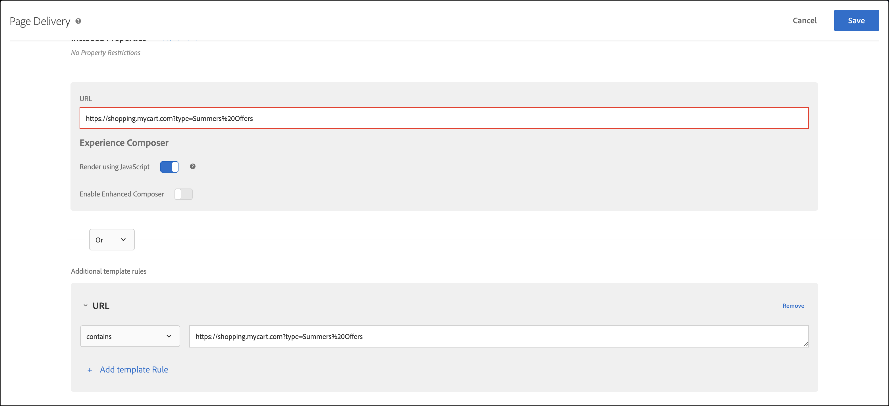

# Risolvere i problemi relativi alla distribuzione dei contenuti

Se nella pagina non viene visualizzato il contenuto previsto, puoi adottare alcune misure per eseguire il debug della distribuzione dei contenuti.

* Controlla con attenzione il codice relativo all’attività o alla campagna. Un errore di battitura o di altro tipo potrebbe causare la mancata visualizzazione del contenuto previsto.
* Utilizza mboxTrace o mboxDebug per risolvere problemi relativi alla richiesta di [!DNL Target].
* Adobe Experience Cloud Debugger è uno strumento facile da usare che fornisce molte informazioni in comune con mboxDebug, per risolvere i problemi di richiesta di [!DNL Target].

mboxDebug è particolarmente utile quando esegui la configurazione di [!DNL Target] sulla pagina per assicurarti che la richiesta di Target sia attiva e che il cookie sia impostato. Tuttavia, non fornisce il livello di dettaglio necessario durante il debug della distribuzione dei contenuti. Se l’attività non viene visualizzata nella pagina o un contenuto indesiderato viene visualizzato, esamina ed esegui il debug della pagina nel dettaglio tramite mboxTrace.

## Recuperare il token di autorizzazione per gli strumenti di debug {#section_BED130298E794D1FA229DB7C3358BA54}

Dato che in mboxTrace e mboxDebug è possibile esporre dati sulla campagna e sul profilo a soggetti esterni, è necessario un token di autorizzazione. Il token di autorizzazione può essere recuperato nell’interfaccia utente di [!DNL Target]. Il token è valido per sei ore.

Per generare un token di autenticazione, è necessario disporre di una delle seguenti autorizzazioni utente:

* Almeno il livello di autorizzazione [!UICONTROL Editor] (o [!UICONTROL Approvatore])

   Per ulteriori informazioni per i clienti [!DNL Target Standard], consulta [Specificare ruoli e autorizzazioni](/help/main/administrating-target/c-user-management/c-user-management/user-management.md#roles-permissions) in *Utenti*. Per ulteriori informazioni per i clienti [!DNL Target Premium], consulta [Configurare le autorizzazioni aziendali](/help/main/administrating-target/c-user-management/property-channel/properties-overview.md).

* Ruolo amministratore a livello di area di lavoro/profilo di prodotto

   Le aree di lavoro sono disponibili solo per i clienti [!DNL Target Premium]. Per ulteriori informazioni, consulta [Configurare le autorizzazioni aziendali](/help/main/administrating-target/c-user-management/property-channel/properties-overview.md).

* Diritti di amministrazione (autorizzazione Sysadmin) a livello di prodotto [!DNL Adobe Target]

Per recuperare il token di autorizzazione:

1. Fai clic su **[!UICONTROL Amministrazione]** > **[!UICONTROL Implementazione]**.
1. Dalla sezione Strumenti di debug, fai clic su **[!UICONTROL Genera nuovo token di autenticazione]**.

   

1. Aggiungi il token generato come parametro nell’URL per abilitare uno degli strumenti di debug avanzati.

   

## mboxTrace {#section_256FCF7C14BB435BA2C68049EF0BA99E}

mboxTrace consente di ricevere informazioni di trace collegate alle risposte di [!DNL Target]. Le informazioni di trace riflettono il risultato di una chiamata [!DNL Target] (ad esempio, una conversione o un’impression) ed eventuali dati ulteriori che possono aiutare a determinare perché sia stato ottenuto questo particolare risultato, ad esempio un insieme di rami disponibili tra i quali è stata effettuata la selezione in una campagna. Esegui il debug della distribuzione dei contenuti con queste informazioni.

Sono disponibili i seguenti parametri:

| Opzioni mboxTrace | Risultato |
|--- |--- |
| `?mboxTrace=console` | Visualizzazione nel registro della console come oggetti.<br>Per at.js, invece di aprire una nuova finestra del browser o di eseguire l’output sulla console come in mbox.js, sarà necessario controllare la richiesta di rete e guardare in Anteprima (Chrome) o Risposta (Firefox). |
| `?mboxTrace=json` | Visualizzazione nel registro della console come stringa letterale JSON |
| `?mboxTrace=window` | Visualizzazione in una finestra popup come stringa JSON |
| `?mboxTrace=disable` | Disattiva la modalità di sessione di tracciamento |

**Esempio di chiamata mboxTrace**

`https://www.mysite.com/page.html?mboxTrace=window&authorization=f543abf-0111-4061-9619-d41d665c59a6`

L’output mostra informazioni dettagliate sul contenuto. mboxTrace mostra i dettagli della campagna o attività e sul profilo. Inoltre, fornisce un’istantanea del profilo prima dell’esecuzione e una di ciò che è stato modificato dopo l’esecuzione. In aggiunta, mostra quali campagne o attività sono state valutate per ogni posizione.

Alcune delle informazioni includono ID di destinazione e di segmento associati e non associati:

* **SegmentId**: ID dei segmenti, dalla libreria di segmenti riutilizzabili o anonimi, creati per la campagna specifica.
* **TargetId**: ID delle destinazione, dalla libreria delle espressioni di destinazione o da destinazioni anonime, per tutti i segmenti della campagna.
* **Unmatched** (nessuna corrispondenza): in questa chiamata la richiesta non era qualificata per i segmenti o le destinazioni specificati.
* **Matched** (con corrispondenza): la richiesta era qualificata per i segmenti o le destinazioni specificati.

**Utilizzo di mboxTrace su le pagine di consigli**: l’aggiunta di mboxTrace come parametro di richiesta nelle pagine con i consigli sostituisce la progettazione dei consigli nella pagina con una finestra dei dettagli mboxTrace, che visualizza informazioni approfondite sui consigli, tra cui:

* Consigli restituiti e consigli richiesti
* Chiave utilizzata, e se sta generando consigli
* Consigli generati da criteri e consigli di backup
* Configurazione dei criteri
* Esclusioni e inclusioni applicate
* Regole di raccolta

Non devi includere `=console`, `=json` o `=window` nel parametro di query. Una volta completati i dettagli mboxTrace, aggiungi `=disable` e premi **[!UICONTROL Invio]** per tornare alla modalità di visualizzazione normale.

mboxTrace non influenza il normale funzionamento e aspetto del tuo sito. I visitatori vedranno la solita struttura dei consigli.

## mboxDebug {#mboxdebug}

Per utilizzare mboxDebug, aggiungi un parametro mboxDebug alla fine dell’URL. Nella tabella seguente sono incluse informazioni sui parametri URL relativi a risposte di [!DNL Target].

>[!NOTE]
>
>Alcuni parametri mboxDebug sono disponibili con o senza autenticazione.

| Parametri URL | Finalità |
|--- |--- |
| `mboxDebug=1` | Debugger<br>L’aggiunta di questo parametro a qualsiasi URL in cui sono definite delle richieste di Target determina l’apertura di una finestra a comparsa con dettagli utili al debug. Vengono inserite informazioni sui cookie, valori PCid e ID di sessione e sono visibili tutti gli URL. Fai clic su un URL con richiesta di Target per visualizzarne la risposta di [!DNL Target]. Maggiori dettagli sono disponibili in [mbox_debug.pdf](/help/main/assets/mbox_debug.pdf). |
| `mboxDisable=1` | Disattiva le mbox sulla pagina |
| `mboxOverride.browserIp=<Insert IP address>` | Testa geotargeting<br>Testa il geotargeting con questo parametro URL. Digita un indirizzo IP come valore per questo attributo e il geotargeting di Test&amp;Target valuterà tale indirizzo IP rispetto a qualsiasi geotargeting o segmentazione impostata in una campagna. |

>[!NOTE]
>
>Assicurati che il frammento URL sia dopo i parametri della stringa di query. Qualsiasi elemento dopo il primo `#` è un identificatore di frammento e causa il mancato funzionamento dei parametri di debug.

## Adobe Experience Cloud Debugger {#section_A2798ED3A431409690A4BE08A1BFCF17}

Il debugger di Adobe Experience Cloud facilita e velocizza la comprensione dell&#39;implementazione di Target. Puoi visualizzare rapidamente la configurazione della libreria, esaminare le richieste per verificare che i parametri personalizzati vengano passati correttamente, attivare la registrazione della console e disattivare tutte le richieste Target. Autenticati in Experience Cloud per utilizzare lo strumento MboxTrace ed esaminare le tue attività, i requisiti del pubblico e il profilo visitatore.

Per ulteriori informazioni, vedi i video di formazione seguenti:

Per informazioni più dettagliate, consulta [Eseguire il debug di at.js utilizzando Adobe Experience Cloud Debugger](https://experienceleague.adobe.com/docs/target-dev/developer/client-side/at-js-implementation/functions-overview/target-debugging-atjs.html){target=_blank}.

## Gli articoli più venduti non compaiono in Recommendations {#section_3920C857270A406C80BE6CBAC8221ECD}

La chiamata *`SiteCatalyst: purchase`* non può essere utilizzata per i dati del traffico dell’algoritmo di acquisto. Utilizza al suo posto la chiamata *`orderConfirmPage`*.

## Controllare la priorità dell’attività {#section_3D0DD07240F0465BAF655D0804100AED}

Le attività basate su moduli create con [!DNL Target Standard/Premium] potrebbero entrare in conflitto con le attività create nell’interfaccia utente di [!DNL Target Classic] che hanno la stessa priorità e utilizzano la stessa richiesta di [!DNL Target].

## Il codice personalizzato non produce i risultati previsti in Internet Explorer 8. {#section_FAC3651F19144D12A37A3E4F14C06945}

Target non supporta più Internet Explorer 8.

## Cookie di Target non impostato {#section_77AFEB541C0B495EB67E29A4475DF960}

Se nel sito è presente un sottodominio, ad esempio [!DNL us.domain.com], ma è necessario impostare il cookie di Target su [!DNL domain.com] (anziché [!DNL us.domain.com]), devi sovrascrivere l’impostazione `cookieDomain`. Per ulteriori informazioni, consulta [targetGlobalSettings()](https://experienceleague.adobe.com/docs/target-dev/developer/client-side/at-js-implementation/functions-overview/targetglobalsettings.html){target=_blank}.

## Il contenuto di Target viene visualizzato momentaneamente o non viene visualizzato se un elemento fa anche parte della personalizzazione di Adobe Experience Manager. {#section_9E1DABEB75AB431FB9F09887E6DD07D3}

Il contenuto di Target potrebbe essere visualizzato momentaneamente o non essere visualizzato, se un elemento DOM fa parte del targeting di personalizzazione di Adobe Experience Manager (AEM) e di un’attività di Target.

Per ovviare a questo problema, puoi disabilitare la personalizzazione AEM nelle pagine in cui Target è in esecuzione.

## Errore nella consegna di offerte di reindirizzamento e offerte remote a causa di un URL non valido. {#section_7D09043B687F43B39DAEDF17D00375AC}

Se l’offerta di reindirizzamento o l’offerta remota utilizza un URL non valido, la sua consegna potrebbe non riuscire.

Per le offerte di reindirizzamento, la risposta di [!DNL Target] può contenere `/* invalid redirect offer URL */`

Oppure

Per le offerte remote, la risposta di [!DNL Target] può contenere `/* invalid remote offer URL */`

Puoi controllare la risposta di [!DNL Target] nel browser o utilizzando mboxTrace. Per ulteriori informazioni sugli URL validi, consulta [https://tools.ietf.org/html/std66](https://tools.ietf.org/html/std66).

## [!DNL Target]Le richieste di non si attivano sul sito.

at.js non attiva le richieste di Target se utilizzi un doctype non valido. at.js richiede il doctype HTML5.

## Assicurati che le attività di [!DNL Target] gestiscano correttamente gli URL con parametri di stringa di query. {#query-strings}

[!UICONTROL URL attività] determina la pagina che qualifica i visitatori per l’attività ed esegue il rendering delle esperienze di attività per gli utenti. Quando viene richiesto durante la creazione dell’attività, la digitazione dell’URL completo non sempre assicura che il contenuto venga distribuito sulla pagina del sito, in particolare con gli URL che contengono parametri della stringa di query.

Per impostazione predefinita, il [!UICONTROL Compositore esperienza visivo] apre la pagina specificata nelle [Impostazioni del Compositore esperienza visivo](/help/main/administrating-target/visual-experience-composer-set-up.md). È anche possibile specificare una pagina diversa durante la creazione dell’attività.

Per visualizzare una pagina diversa dopo l’apertura del Compositore esperienza visivo, fai clic su **[!UICONTROL Configura (icona ingranaggio)]** > seleziona **[!UICONTROL Consegna pagina]** > quindi specifica l’URL nel campo [!UICONTROL URL attività].


Ma cosa succede se l’URL contiene parametri della stringa di query? Funzionerà e mostrerà il contenuto personalizzato? In questo scenario, indipendentemente dal pubblico di destinazione, puoi includere regole di modello oltre all’URL di base per definire i parametri di query.

Per includere regole di modello aggiuntive, è possibile utilizzare le seguenti opzioni:

### Opzione 1: replicare l’URL e mantenerlo nella regola del modello con l’opzione &quot;contiene&quot;.

Questa opzione assicura che l’URL sia idoneo per l’attività. Tuttavia esistono casi limite ad esso associati che possono influenzare i dati di reporting con record aggiuntivi per gli URL che contengono l’URL di base.

In questo caso, l’URL è `https://shopping.mycart.com?type=Summers%20Offers` e regole di modello aggiuntive “contiene” lo stesso URL, separate da un operatore OR:



### Opzione 2: limita la condizione URL &quot;contiene&quot; con solo la stringa di query.

Il caso limite discusso nell’opzione precedente viene applicato in questa opzione, ma qui l’impostazione condizionale è limitata solo alla stringa di query.

In questo caso, l’URL è `https://shopping.mycart.com?type=Summers%20Offers` e regole di modello aggiuntive “contiene” solo la stringa di query, separate da un operatore OR:


### Opzione 3: invece di eseguire il targeting dell’URL completo, sfruttane una parte specifica.

In questo caso, l’URL è `https://shopping.mycart.com?type=Summers%20Offers` e regole di modello aggiuntive specificano una [!UICONTROL Query] con [!UICONTROL tipo] > [!UICONTROL è (distinzione maiuscole/minuscole)] > type=Summers%20Offers, separati da un operatore OR:


## Esclusione delle virgolette doppie in [!DNL Target] il valore dell’attributo del profilo non funziona come previsto. {#escape}

Quando si inviano valori contenenti virgolette doppie in un [!DNL Target] profilo, è necessario eseguire un doppio escape come mostrato di seguito.

```
adobe.target.trackEvent({
    "mbox": "data-collection",
    "params":    {
        "profile.tagLine": "Escape \\\"Double Quotes\\\" like this."
    }
});
```

## Video di formazione

I video seguenti contengono ulteriori informazioni sui concetti descritti in questo articolo.

### Aggiungi estensione 

>[!VIDEO](https://video.tv.adobe.com/v/23114t2/)

### Debug di base per Adobe Target 

>[!VIDEO](https://video.tv.adobe.com/v/23115t2/)

### Mbox Trace 

>[!VIDEO](https://video.tv.adobe.com/v/23113t2/)
