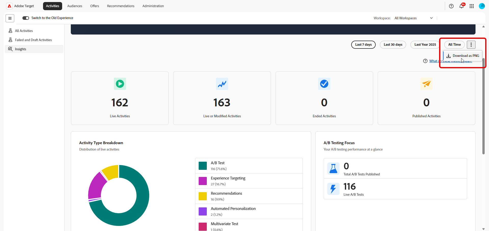

# Dashboard di Adobe Target Insights

Il [!UICONTROL dashboard di Adobe Target] offre una panoramica generale dell&#39;utilizzo di [!DNL Adobe Target] da parte dell&#39;organizzazione nel tempo. Aiuta i team a comprendere a colpo d’occhio l’adozione, il volume delle attività e l’utilizzo della sperimentazione.

Il dashboard è progettato per professionisti e stakeholder che desiderano una rapida visibilità sull&#39;utilizzo di [!DNL Target] senza dover esaminare singoli report di attività.

Quando rivedi questa dashboard, tieni presente quanto segue:

* Le metriche possono includere attività avviate prima o terminate dopo l’intervallo di tempo selezionato.
* Un’attività può essere conteggiata in più metriche a seconda del suo ciclo di vita (ad esempio, pubblicata e completata).
* La dashboard si concentra sull’utilizzo e l’adozione, non sui risultati delle prestazioni.

Per risultati dettagliati, incremento o prestazioni statistiche, consulta i [singoli rapporti di attività](../c-reports/reports.md) in [!DNL Adobe Target].

## [!UICONTROL Experimentation Accelerator]

Il banner sul tuo dashboard fornisce accesso diretto a **[!UICONTROL Experimentation Accelerator]**, un punto di ingresso leggero agli strumenti che semplificano i flussi di lavoro di sperimentazione e semplificano la configurazione degli esperimenti, l&#39;analisi e il processo decisionale.

## Selezione intervallo di tempo

Per definire l’ambito dei dati visualizzati nel dashboard, seleziona un intervallo di tempo, ad esempio l’ultima settimana, l’ultimo anno o tutto il tempo. L’intervallo di tempo selezionato si applica in modo coerente a tutte le metriche e i grafici del dashboard.

Tieni presente quanto segue durante l’interpretazione delle metriche nell’intervallo di tempo selezionato:

* Alcune metriche riflettono attività live in qualsiasi momento durante l’intervallo di tempo.

* Altri riflettono le attività create, pubblicate o completate entro l’intervallo di tempo.

* Di conseguenza, i totali nelle metriche potrebbero non corrispondere esattamente. Ad esempio, è possibile avviare e completare molte attività nello stesso intervallo di tempo.

È inoltre possibile esportare un&#39;istantanea del dashboard selezionando **[!UICONTROL Scarica come PNG]** dal menu avanzato.

## Metriche

La dashboard organizza le metriche in quattro visualizzazioni complementari, ognuna delle quali risponde a una domanda diversa sull&#39;utilizzo di [!DNL Target]: [KPI](#kpis) fornisce un riepilogo immediato dei conteggi delle attività, [Suddivisione tipo di attività](#activity-type-breakdown) mostra le funzionalità su cui si fa maggiormente affidamento, [Metriche test A/B](#ab-testing-metrics) esegue lo zoom avanti sull&#39;utilizzo della sperimentazione e [Attività nel tempo](#activities-over-time) rivela le tendenze nell&#39;intervallo di tempo selezionato.

### KPI

Le schede KPI nella parte superiore della pagina riepilogano rapidamente i conteggi delle attività chiave per l’intervallo di tempo selezionato. Ogni scheda si concentra su una diversa fase del ciclo di vita dell’attività, live, modificata, terminata o pubblicata, in modo da poter valutare rapidamente l’utilizzo complessivo e lo slancio.

La metrica **Attività live totali** descrive il numero di attività che sono state live in qualsiasi momento durante l&#39;intervallo di tempo selezionato. Un’attività viene considerata live se era in servizio attivo sul traffico, anche se è iniziata prima o terminata dopo il periodo selezionato. Utilizza questa metrica per:

* Comprendere come è stato utilizzato attivamente [!DNL Target] durante il periodo di tempo.
* Misura la scala complessiva delle tue attività di personalizzazione e test.

La metrica **Attività live o modificate** rappresenta il numero totale di attività nell&#39;organizzazione che sono state live, create o modificate nell&#39;intervallo di tempo selezionato. Utilizza questa metrica per:

* Comprendere le dimensioni complessive della libreria di attività [!DNL Target] e il numero di attività in uso.

* Monitora la crescita a lungo termine dei programmi di sperimentazione e personalizzazione.

La metrica **Attività terminate** rappresenta il numero di attività che hanno raggiunto una data di completamento o di interruzione durante l&#39;intervallo di tempo selezionato. Utilizza questa metrica per:

* Scopri quante attività sono state concluse durante il periodo di tempo.
* Monitora il volume di completamento nel tempo.

La metrica **Attività pubblicate** descrive il numero di attività pubblicate durante l&#39;intervallo di tempo selezionato. Un’attività viene considerata pubblicata quando viene pubblicata per la prima volta. Se un’attività viene resa live, interrotta e quindi riprodotta live, in questa metrica viene conteggiata solo la prima occorrenza. Utilizza questa metrica per:

* Misura quante nuove attività sono state avviate.
* Comprendere la velocità di creazione e pubblicazione delle attività.

### Raggruppamento per tipo di attività

Il grafico [!UICONTROL Tipo di attività] mostra la distribuzione delle attività live per tipo durante l&#39;intervallo di tempo selezionato, tra cui:

* [!UICONTROL Test A/B]
* [!UICONTROL Targeting esperienza]
* [!UICONTROL Funzione Consigli]
* [!UICONTROL Personalizzazione automatizzata]
* [!UICONTROL Test multivariato]

Utilizzare questo grafico per identificare le funzionalità di [!DNL Target] su cui l&#39;organizzazione si basa maggiormente e per individuare le opportunità per ampliare la combinazione di tipi di attività eseguiti.

### Metriche di test A/B

{align="center"}

In questa sezione viene evidenziato l&#39;utilizzo relativo in modo specifico alle attività **[!UICONTROL A/B Test]**.

La metrica **[!UICONTROL Totale attività test A/B in tempo reale]** mostra il numero di attività **[!UICONTROL test A/B]** in tempo reale in qualsiasi momento durante l&#39;intervallo di tempo selezionato.

**[!UICONTROL Totale test A/B pubblicati]** mostra il numero di **[!UICONTROL attività Test A/B]** pubblicate durante l&#39;intervallo di tempo selezionato.

Utilizza queste metriche per comprendere con quale frequenza viene utilizzato il test A/B e per monitorare il volume di sperimentazione e l’adozione nel tempo.

### Attività nel tempo

{align="center"}

Il grafico **[!UICONTROL Attività nel tempo]** traccia il numero di attività create, modificate e pubblicate nell&#39;intervallo di tempo selezionato, semplificando l&#39;individuazione di tendenze, picchi o periodi tranquilli nel programma di sperimentazione.

