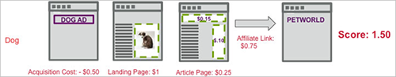

# Punteggio di acquisizione

La metrica di coinvolgimento Punteggio di acquisizione in [!DNL Adobe Target] calcola un punteggio aggregato in base al valore assegnato alle pagine visitate sul sito, dal momento in cui il visitatore vede per la prima volta la prima visualizzazione della campagna [!DNL Target] richiesta.

Nell&#39;esempio seguente viene illustrato come viene calcolato il coinvolgimento del punteggio in una campagna che verifica due esperienze, una con l&#39;immagine di un gatto e l&#39;altra con l&#39;immagine di un cane.

In questo esempio, il primo visitatore sperimenta l&#39;esperienza del gatto. Supponiamo che un [!DNL Target] La richiesta passa un punteggio di pagina in base al valore della pagina. Se l’addetto al marketing ha raccolto il coinvolgimento del conteggio delle pagine su una metrica di successo associata a `**any Target request**`, il punteggio di visita si accumula per qualsiasi richiesta vista dopo la richiesta di visualizzazione intorno all’immagine del gatto.

La prima pagina aggiunge 1 al punteggio, la seconda pagina 0,25, la terza 0,10 e la quarta 0,10 per un totale di 1,45. Questo potrebbe essere interpretato come valuta o punti. In una visita diversa, un visitatore sperimenta l&#39;esperienza del cane e anche se il visitatore vede meno pagine, il punteggio è 2,10, quindi maggiore di altre visite, perché il visitatore ha visualizzato pagine con maggiore valore.

Prendi in considerazione i costi di acquisizione e i ricavi del collegamento di affiliazione passando adbox e reindirizzamenti, come descritto nel seguente flusso di pagina. In questo esempio, entrambi [!DNL Target] Le richieste nella pagina dell’articolo superano un punteggio, che potrebbe rappresentare un CPM noto.

## Assegnazione di un punteggio di pagina

Puoi assegnare un valore a qualsiasi pagina del tuo sito in base a ciò al valore della pagina. Ad esempio, un sito di cucina potrebbe essere in grado di vendere annunci pubblicitari per più soldi sulle pagine di articoli caratteristiche rispetto alla sezione esperienza. Gli articoli caratteristici sono più importanti della sezione esperienza. Il Punteggio di pagina consente di sviluppare un “valore” complessivo di una visita, in modo che la persona che legge più articoli caratteristici ottenga più “punti” di qualcuno che sfoglia solo le esperienze.

Esistono due metodi per assegnare un punteggio a una pagina:

* In [!DNL Target] , crea un parametro denominato `mboxPageValue`.

   Esempio: `('global_mbox', 'mboxPageValue=10');`

   Il valore specificato viene aggiunto al punteggio ogni volta che la pagina con tale [!DNL Target] richiesta viene visualizzata. Se più richieste nella pagina includono valori di punteggio, il punteggio per la pagina è il totale di tutti i valori di richiesta. `mboxPageValue` è un parametro riservato utilizzato per passare i valori in una richiesta Target per acquisire un punteggio di coinvolgimento. Possono essere trasmessi valori positivi e negativi. La somma è calcolata alla fine della visita di ogni visitatore per calcolare il punteggio totale per la visita.

* Passa il parametro `?mboxPageValue=n` nell’URL della pagina.

   Esempio: `https://www.mydomain.com?mboxPageValue=5`

   Utilizzando questo metodo, il valore specificato viene aggiunto al punteggio per ogni [!DNL Target] sulla pagina. Ad esempio, se passi il parametro `?mboxPageValue=10`e sono tre [!DNL Target] richieste sulla pagina, il punteggio per la pagina è di 30.

>[!NOTE]
>
>Richieste di Target situate sopra la prima visualizzazione dell’attività [!DNL Target] La richiesta non verrà inclusa nel punteggio.

Si consiglia di assegnare valori nella [!DNL Target] richiesta. Ciò ti consente di essere preciso nei valori misurati, a seconda del contenuto di ogni richiesta.

>[!NOTE]
>
>Per semplificare la manutenzione, puoi configurare le assegnazioni di valore del punteggio di pagina del tuo sito in [!DNL at.js] con logica condizionale JavaScript. Questo elimina la necessità di aggiungere altro codice alle tue pagine. Contatta il tuo consulente dell&#39;account per l&#39;assistenza.

È possibile combinare i due metodi, ma questo potrebbe causare un punteggio più alto del previsto. Ad esempio, se assegni un valore di 10 a ciascuno dei tre [!DNL Target] richieste e nessun punteggio a una quarta richiesta, quindi passa il parametro URL `?mboxPageValue=5`, il punteggio di pagina sarà 50, 30 per le tre richieste con valori assegnati e quindi 5 per ciascuna delle quattro richieste sulla pagina.

Il contatore inizia con la prima richiesta di visualizzazione, non con la richiesta di immissione. Ad esempio, se si immette l&#39;attività nella home page che non dispone di una richiesta di visualizzazione e quindi si collega alla pagina del catalogo contenente una richiesta di visualizzazione, il contatore inizia quando si passa alla pagina del catalogo.

Inoltre puoi passare in valori negativi su alcune pagine che costano o non è opportuno che un visitatore le veda. Anche i valori negativi influiscono sul punteggio complessivo. Questa tecnica può essere utilizzata su una pagina che i visitatori raggiungono da un annuncio, in modo da sapere quanto è stato il CPC. Oppure, per esempio, può essere utilizzata per una pagina di supporto o di contatto, dalla quale sai che i visitatori potrebbero chiamare o richiedere assistenza.
