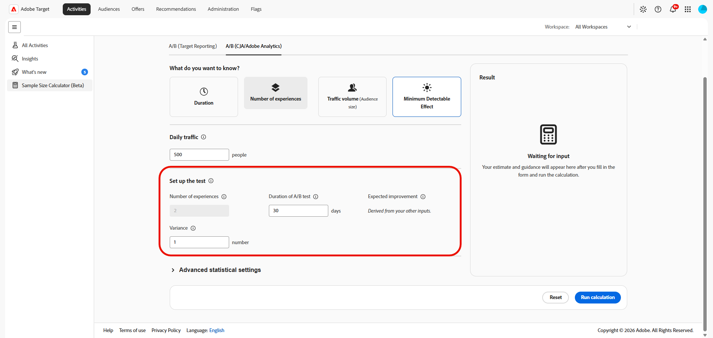

# Calcolatore delle dimensioni del campione

>[!CONTEXTUALHELP]
>id="target_sample_size_ab_daily_traffic"
>title="Traffico giornaliero"
>abstract="Indica il numero di utenti che entrano ogni giorno nell’esperimento. Se non conosci questo valore, scegli Volume di traffico qui sopra e il calcolatore lo determinerà in base agli altri input."

>[!CONTEXTUALHELP]
>id="target_sample_size_confidence_level"
>title="Livello di affidabilità"
>abstract="Il livello di certezza necessario per stabilire che un risultato non sia dovuto al caso prima di considerarlo significativo. Un livello di affidabilità del 95% significa che la probabilità di falsi positivi non supera il 5%. Con valori più alti si riducono i falsi positivi, ma sono necessari più dati."

>[!CONTEXTUALHELP]
>id="target_sample_size_statistical_power"
>title="Potenza statistica"
>abstract="Indica la probabilità di rilevare un effetto reale, se presente. Con una potenza statistica pari a 80%, c&#39;è una possibilità dell’80% di rilevare un effetto reale. Una potenza più alta riduce i falsi negativi, ma richiede più traffico o un tempo di esecuzione più lungo."

>[!CONTEXTUALHELP]
>id="target_sample_size_setup_cja"
>title="Configurare il test"
>abstract="Questi campi definiscono l’esperimento, il risultato previsto e la soglia di affidabilità per il risultato. Il campo associato al valore selezionato in precedenza viene risolto automaticamente. Completa i campi rimanenti con i valori previsti."

>[!AVAILABILITY]
>
>Con il Calcolatore dimensione campione (Beta), l&#39;utente riconosce che il Beta viene fornito &quot;così com&#39;è&quot; senza alcuna garanzia. Adobe non ha alcun obbligo di mantenere, correggere, aggiornare, modificare, modificare o supportare in altro modo Beta. Si consiglia di usare cautela e di non fare affidamento in alcun modo sul corretto funzionamento o sulle prestazioni di tale Beta e/o dei materiali di accompagnamento. Beta è considerata un&#39;informazione riservata di Adobe.  Qualsiasi &quot;Feedback&quot; (informazioni relative a Beta, compresi, a titolo esemplificativo e non esaustivo, problemi o difetti riscontrati durante l’utilizzo di Beta, suggerimenti, miglioramenti e raccomandazioni) fornito dall’Utente a Adobe viene assegnato ad Adobe, inclusi tutti i diritti, i titoli e gli interessi relativi a tale Feedback.

Il **[!UICONTROL Calcolatore dimensioni campione]** consente di stimare gli input necessari per pianificare un esperimento prima di avviarlo. La calcolatrice consente di determinare quanto traffico è necessario, quanto tempo deve essere eseguito il test, quante esperienze includere o quale effetto minimo è possibile rilevare in modo affidabile in base ai valori forniti.

Per accedere al **[!UICONTROL Calcolatore dimensioni campione]**, vai al menu **[!UICONTROL Attività]**.

## A/B (reporting di Target)

>[!CONTEXTUALHELP]
>id="target_sample_size_bonferroni"
>title="Correzione di Bonferroni"
>abstract="Regola il livello di affidabilità per tenere conto del confronto simultaneo di più offerte rispetto al controllo. Questo aspetto è rilevante solo quando il numero di offerte è superiore a due. Corrisponde alla stessa correzione utilizzata nello strumento pubblico Target Calculator di Adobe."

>[!CONTEXTUALHELP]
>id="target_sample_size_metric_type"
>title="Tipo di metrica"
>abstract="Che tipo di metrica stai misurando. Percentuale: utilizza questa opzione per i risultati binari, come clic o conversioni, in cui ciascun utente esegue o non esegue l’azione. Numero: utilizza questa opzione per metriche quali entrate o visualizzazioni di pagina, in cui il valore può variare notevolmente da utente a utente."

>[!CONTEXTUALHELP]
>id="target_sample_size_number_offers"
>title="Numero di offerte"
>abstract="Il numero di esperienze nell’esperimento, incluso il controllo. Se sono presenti più di due offerte, viene applicata automaticamente una correzione di Bonferroni (se abilitata) per mantenere un livello di affidabilità complessiva accurato per tutti i confronti."

>[!CONTEXTUALHELP]
>id="target_sample_size_lift"
>title="Incremento"
>abstract="Il miglioramento relativo rispetto alla linea di base che desideri rilevare. Inseriscilo come percentuale della linea di base. Ad esempio, un incremento del 5% su un tasso di conversione della linea di base dell’11,8% punta al 12,39%."

>[!CONTEXTUALHELP]
>id="target_sample_size_baseline_conversion_rate"
>title="Tasso di conversione linea di base"
>abstract="Il tasso di conversione corrente prima dell’inizio dell’esperimento, ovvero la media del gruppo di controllo. Questo valore è sempre obbligatorio. Per le metriche delle percentuali, inserisci una percentuale come 5 per 5%. Per le metriche di conteggio, inserisci il valore decimale non elaborato."

Stimare gli input necessari per pianificare ed eseguire un test A/B. Questi valori ti aiutano a decidere di quanto traffico hai bisogno, quanto tempo deve essere eseguito il test e quale dimensione di effetto puoi rilevare in modo realistico.

1. Accedi alla scheda **[!UICONTROL A/B (Target Reporting)]** per calcolare gli input di pianificazione per un test A/B.

1. Abilita l&#39;opzione **[!UICONTROL Applica correzione]** per modificare il livello di attendibilità in modo da confrontare più offerte con il controllo contemporaneamente.

1. Scegli il **[!UICONTROL tipo di metrica]**:

   * Tasso di conversione: utilizza questa opzione per risultati binari come clic o acquisti, in cui ogni visitatore completa o meno l’azione.
   * Ricavo per visitatore: utilizza questa funzione per le metriche in stile ricavo, in cui i valori possono variare notevolmente da visitatore a visitatore.

     

1. Specifica il **[!UICONTROL traffico giornaliero]**, il numero di utenti che entrano ogni giorno nell&#39;esperimento.

1. In **[!UICONTROL Configura il test]**, immettere i valori rimanenti:

   * **[!UICONTROL Numero di offerte]**: numero di esperienze nell&#39;esperimento, incluso il controllo. Più di due offerte applicano una correzione Bonferroni, se abilitata, per mantenere il livello di affidabilità generale.

   * **[!UICONTROL Incremento]**: miglioramento relativo rispetto alla linea di base che si desidera rilevare. Immettilo come percentuale della linea di base, ad esempio, un incremento del 5% su un target del tasso di conversione linea di base dell’11,8% del 12,39%.

     

1. Specifica il **[!UICONTROL tasso di conversione linea di base]** per l&#39;esperienza corrente prima dell&#39;inizio dell&#39;esperimento.

1. È possibile espandere **[!UICONTROL Impostazioni statistiche avanzate]** per fornire input statistici aggiuntivi quando sono disponibili per il calcolo selezionato.

   * **[!UICONTROL Livello di affidabilità]**: la probabilità che un risultato non sia dovuto al caso. Un livello del 95% consente una probabilità del 5% di un falso positivo.

   * **[!UICONTROL Potenza statistica]**: la probabilità di rilevare un effetto reale. Una potenza dell&#39;80% riduce i falsi negativi ma richiede più traffico o più tempo.

1. Selezionare **[!UICONTROL Esegui calcolo]** per generare la stima. Seleziona **[!UICONTROL Reimposta]** per cancellare gli input correnti e ricominciare.

Il pannello **[!UICONTROL Risultato]** visualizza la stima dopo aver completato i campi obbligatori ed eseguito il calcolo. Se i campi obbligatori sono incompleti, il pannello richiede di immettere i valori mancanti.

Il calcolatore fornisce una stima per la pianificazione di un esperimento. Utilizza il risultato insieme alla progettazione dell’esperimento, al traffico previsto, alle prestazioni della linea di base e ai requisiti statistici per decidere per quanto tempo eseguire l’attività.

## A/B (CJA/Adobe Analytics)

>[!CONTEXTUALHELP]
>id="target_sample_size_number_experiences"
>title="Numero di esperienze"
>abstract="Numero di varianti nell’esperimento, incluso il controllo. Un test A/B ha 2 bracci. Cinque varianti più un controllo equivalgono a 6. Un numero maggiore di bracci richiede proporzionalmente un maggiore traffico per mantenere la potenza statistica."

>[!CONTEXTUALHELP]
>id="target_sample_size_duration"
>title="Durata del test A/B"
>abstract="Numeri di giorni di esecuzione dell’esperimento. Durate più lunghe offrono all’esperimento più tempo per raccogliere i dati, consentendo di rilevare in modo affidabile effetti più piccoli. Durate più brevi richiedono effetti più grandi o un maggiore traffico giornaliero per raggiungere un risultato affidabile."

>[!CONTEXTUALHELP]
>id="target_sample_size_expected_improvement"
>title="Miglioramento previsto"
>abstract="Il miglioramento più piccolo che vale la pena rilevare, la modifica minima della metrica su cui agiresti. Si tratta dell’entità di incremento in punti percentuali, non della variazione percentuale rispetto alla linea di base. Ad esempio, se la linea di base di riferimento è 5% e consideri rilevante un incremento di 1 punto percentuale, immetti 1."

>[!CONTEXTUALHELP]
>id="target_sample_size_variance"
>title="Varianza"
>abstract="Dispersione dei valori della metrica (non la loro media). Una metrica come il tasso di clic (per lo più 0 e 1) ha una varianza bassa; una metrica come le entrate generate per utente può avere una varianza molto più elevata. In caso di dubbi, lascia il valore predefinito 1."

Stimare gli input di pianificazione per un’attività A/B che si basa sui dati di Adobe Analytics o Customer Journey Analytics. Consente di definire le dimensioni dell’esperimento, l’incremento previsto e la durata del test prima di avviare l’attività.

1. Accedere alla scheda **[!UICONTROL A/B (CJA/Adobe Analytics)]** per calcolare gli input di pianificazione per un test A/B.

1. In **[!UICONTROL Che cosa si desidera sapere?]**, selezionare il valore che si desidera venga determinato dal calcolatore:

   * **[!UICONTROL Durata]**: hai in mente un esperimento e vuoi sapere quanto tempo ci vorrebbe per essere eseguito e se vale la pena eseguirlo.
   * **[!UICONTROL Numero di esperienze]**: si dispone di una posizione per eseguire un esperimento e si desidera determinare quanti trattamenti il traffico può supportare.
   * **[!UICONTROL Volume di traffico]**: hai in mente un esperimento e vuoi sapere quanti visitatori sono necessari per raggiungere la rilevanza statistica.
   * **[!UICONTROL Effetto rilevabile minimo]**: si desidera eseguire un esperimento, ma si desidera conoscere la quantità di incremento necessaria per raggiungere la rilevanza statistica. Questo consente di valutare se l’esperimento vale la pena di essere eseguito o pianificato.

   I campi nel modulo variano a seconda del valore selezionato. La calcolatrice utilizza gli altri input per determinare il risultato selezionato.

   

1. Specifica il **[!UICONTROL traffico giornaliero]**, il numero di utenti che entrano ogni giorno nell&#39;esperimento.

1. In **[!UICONTROL Configura il test]**, immettere i valori rimanenti:

   * **[!UICONTROL Numero di esperienze]**: numero di varianti, incluso il controllo. Più varianti richiedono più traffico.

   * **[!UICONTROL Durata del test A/B]**: numero di giorni di esecuzione dell&#39;esperimento. Test più lunghi possono rilevare effetti più piccoli.

   * **[!UICONTROL Miglioramento previsto]**: miglioramento previsto dall&#39;esperimento.

   * **[!UICONTROL Varianza]**: distribuzione dei valori delle metriche. Un tasso di click-through ha in genere una varianza bassa e i ricavi per utente possono essere molto più elevati. In caso di dubbi, lascia il valore predefinito 1.

     Scopri come calcolare una **[!UICONTROL Varianza]** in [Documentazione di Analytics](https://experienceleague.adobe.com/en/docs/analytics/components/calculated-metrics/calcmetrics-reference/cm-functions#variance)

     

1. È possibile espandere **[!UICONTROL Impostazioni statistiche avanzate]** per fornire input statistici aggiuntivi quando sono disponibili per il calcolo selezionato.

   * **[!UICONTROL Livello di affidabilità]**: la probabilità che un risultato non sia dovuto al caso. Un livello del 95% consente una probabilità del 5% di un falso positivo. Livelli di affidabilità più bassi indicano che è necessario meno traffico, ma aumentano anche il rischio di un falso positivo.

   * **[!UICONTROL Potenza statistica]**: la probabilità di rilevare un effetto reale. Una potenza dell&#39;80% riduce i falsi negativi ma richiede più traffico o più tempo.

1. Selezionare **[!UICONTROL Esegui calcolo]** per generare la stima. Seleziona **[!UICONTROL Reimposta]** per cancellare gli input correnti e ricominciare.

Il pannello **[!UICONTROL Risultato]** visualizza la stima dopo aver completato i campi obbligatori ed eseguito il calcolo. Se i campi obbligatori sono incompleti, il pannello richiede di immettere i valori mancanti.

Il calcolatore fornisce una stima per la pianificazione di un esperimento. Utilizza il risultato insieme alla progettazione dell’esperimento, al traffico previsto, alle prestazioni della linea di base e ai requisiti statistici per decidere per quanto tempo eseguire l’attività.
