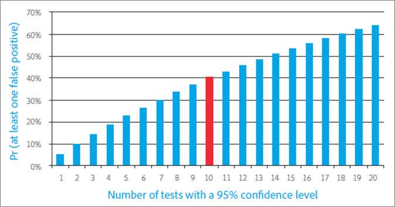

# Dieci insidie frequenti per i test A/B e come evitarle

Il test A/B in [!DNL Adobe Target] costituisce la spina dorsale della maggior parte dei programmi di ottimizzazione del marketing digitale e aiuta gli addetti al marketing a offrire esperienze ottimizzate e mirate ai loro visitatori e clienti. Questo articolo delinea dieci delle insidie più significative che possono presentarsi alle aziende durante l’esecuzione di test A/B. Illustra inoltre metodi per evitare tali insidie, in modo da ottenere un maggiore ROI attraverso le attività di testing e una maggiore fiducia nei risultati evidenziati dai test A/B.

## Insidia 1: ignorare gli effetti del livello di significatività {#section_55F5577A13C6470BA1417C2B735C6B1D}

Quanto è probabile che il test riporti una differenza significativa nel tasso di conversione tra due offerte, quando in realtà non c&#39;è? Questo è ciò che il *livello di significatività* di un test aiuta a determinare. Tali risultati fuorvianti sono spesso chiamati falsi positivi, e nel mondo delle statistiche, sono chiamati errori di Tipo I (se si rifiuta erroneamente l&#39;ipotesi nulla che è vera).

Quando si specifica il livello di significatività di un test A/B, si sta effettuando un compromesso tra la tolleranza di accettare che un&#39;esperienza sia migliore rispetto alle altre quando in realtà non lo è (errore di Tipo I o “falso positivo”) e non vedere differenza statistica tra le esperienze quando in realtà c&#39;è (errore di Tipo II o “falso negativo”). Il *livello di affidabilità* viene determinato prima dell&#39;esecuzione di un test.

Il *intervallo di affidabilità*, che viene determinato dopo il completamento di un test, è influenzato da tre fattori chiave:

* Dimensione del campione di prova
* Livello di significatività
* Deviazione standard della popolazione

Poiché l&#39;addetto al marketing ha selezionato il livello di importanza prima della progettazione del test e la deviazione standard della popolazione non può essere influenzata, l&#39;unico fattore “controllabile” è la dimensione del campione. In fase di progettazione del test è quindi importante determinare la dimensione del campione necessaria per un intervallo di affidabilità accettabile e quanto tempo occorre per raggiungere tale dimensione del campione.

Un altro termine direttamente correlato, il *livello di affidabilità*, adotta invece un approccio di tipo “bicchiere mezzo pieno”. Invece di indicare la probabilità di ottenere un falso positivo, come fa il livello di significatività, il livello di affidabilità rappresenta la probabilità che il test non commetta tale errore.

Livello di affidabilità e livello di significatività sono direttamente correlati perché:

100% - livello di affidabilità = livello di significatività

Nel test A/B, gli addetti al marketing utilizzano spesso livelli di affidabilità del 95%. Chiaramente, sulla base dell&#39;equazione di cui sopra, che corrisponde ad un livello di significatività del 5%. Sottoporre a test con un livello di affidabilità del 95% significa avere una probabilità del 5% di rilevare un incremento statisticamente significativo, anche quando in realtà non c&#39;è differenza tra le offerte.

Come illustrato nel grafico seguente, più test si eseguono, più è probabile che almeno uno di questi test generi un falso positivo. Ad esempio, se esegui 10 test con un livello di affidabilità del 95%, esiste un’incidenza del 40% circa di rilevare uno o più falsi positivi (dato che non esiste un incremento reale: Pr(almeno un falso positivo) = 1 - Pr(nessun falso positivo) = 1 - 0,95^10 = 40%).

In un’organizzazione di marketing, il 95% costituisce di solito un compromesso ragionevole tra il rischio di un falso positivo e quello di un falso negativo.

Tuttavia, due situazioni garantiscono una particolare attenzione al livello di significatività e alle sue implicazioni per i risultati dei test: la segmentazione post-test e il test di offerte multiple.

* **Segmentazione post-test:** gli addetti al marketing spesso dividono e tagliano i risultati di un test basato sui segmenti di visitatori dopo la conclusione del test A/B. I segmenti comuni includono tipo di browser, tipo di dispositivo, aree geografiche, ora del giorno e visitatori nuovi rispetto a quelli di ritorno. Questa pratica, nota come segmentazione post-test, fornisce un&#39;eccellente intuizione nei segmenti di visitatori. A loro volta, gli esperti di marketing possono utilizzare queste informazioni per creare contenuti più mirati, pertinenti e differenziati.

  Se non c&#39;è una reale differenza nel tasso di conversione, ogni volta che si sottopone a test un segmento, la probabilità di un falso positivo è uguale al livello di significatività. Come accennato, più test si eseguono, maggiore è la probabilità che si verifichi almeno un falso positivo tra questi test. In sostanza, ogni segmento di post-test rappresenta un test separato. Con un livello di significatività del 5%, in media si cade preda di un falso positivo ogni volta che si esaminano 20 segmenti post-test. Il grafico di cui sopra mostra come aumenta tale probabilità.

  Maggiore è il numero di test eseguiti, maggiore è la probabilità che si verifichi almeno un falso positivo tra tali test. In sostanza, ogni segmento post-test rappresenta un test separato, che aumenta la probabilità di un falso positivo. Questo aumento può essere ancora più significativo se i segmenti sono correlati.

  Non dovresti eseguire la segmentazione post-test? No, i segmenti post-test sono preziosi. Al contrario, per evitare questo problema cumulativo di falso positivo con la segmentazione di post-test, dopo aver identificato un segmento di post-test, è consigliabile sottoporlo ad un nuovo test. In alternativa, è possibile applicare la correzione Bonferroni, discussa di seguito.

* **Test di offerte multiple:** gli addetti al marketing spesso sottopongono a test più di due offerte (o esperienze) tra loro. Ecco perché a volte vedi soluzioni di test A/B chiamati test A/B/n, dove n è il numero di offerte che si sta sottoponendo a test contemporaneamente.

  È importante notare che *ogni* offerta sottoposta a test ha un tasso di falso positivo pari al livello di significatività, come descritto sopra. Esegui effettivamente più test quando diverse offerte sono contrapposte l&#39;una all&#39;altra all&#39;interno di un singolo ambiente di test. Ad esempio, se confronti cinque offerte in un test A/B/C/D/E, formi effettivamente quattro confronti: tra il controllo e B, tra il controllo e C, tra il controllo e D, tra il controllo ed E. Con un livello di affidabilità del 95%, rispetto a una la probabilità di un falso positivo del 5%, si ha effettivamente 18,5%.

  Per mantenere il livello di affidabilità globale al 95% ed evitare questo problema, si applica la correzione Bonferroni. Utilizzando questa correzione, puoi semplicemente dividere il livello di significatività per il numero di confronti necessari per ottenere il livello di significatività che deve essere raggiunto con un livello di affidabilità del 95%.

  Applicando la correzione Bonferroni all&#39;esempio precedente, si utilizzerebbe un livello di significatività di 5%/4 = 1,25%, che corrisponde al livello di affidabilità del 98,75% per un singolo test (100%-1,25% = 98,75%). Quando si hanno quattro test, come nell&#39;esempio precedente, questa regolazione mantiene il livello di affidabilità effettivo al 95%.

## Insidia 2: dichiarare i vincitori di test di offerta multipla senza differenza statisticamente significativa {#section_FA83977C71DB4F69B3D438AF850EF3B6}

Con il test di offerta multipla, gli addetti al marketing dichiarano spesso l&#39;offerta con il più alto elevatore come il vincitore della prova, anche se non c&#39;è differenza statisticamente significativa fra il vincitore e il secondo classificato. Questa situazione si verifica quando la differenza tra le alternative è minore della differenza tra le alternative e il controllo. La figura seguente illustra questo concetto, con le barre di errore nere che rappresentano gli intervalli di affidabilità del 95% dell&#39;incremento. Il reale incremento per ogni offerta rispetto all&#39;offerta di controllo ha il 95% di probabilità di rientrare nell&#39;intervallo di affidabilità, indicato dalle barre di errore.

Le offerte A e B presentano l’incremento più alto osservato durante il test e sarebbe improbabile che l’offerta C superi tali offerte in un test futuro, perché l’intervallo di affidabilità di C non si sovrappone agli intervalli di affidabilità di A o B. Tuttavia, anche se l’offerta A ha l’incremento più alto osservato durante il test, è possibile che l’offerta B possa ottenere prestazioni migliori in un test futuro perché gli intervalli di affidabilità si sovrappongono.

In questo caso entrambe le offerte A e B dovrebbero essere considerate i vincitori del test.

In genere non è possibile eseguire il test abbastanza a lungo da identificare le prestazioni reali relative delle alternative e spesso la differenza di prestazioni tra le alternative è troppo piccola per incidere notevolmente sul tasso di conversione. In questi casi, è possibile interpretare il risultato come un pareggio e utilizzare altre considerazioni, ad esempio la strategia o l&#39;allineamento con altri elementi della pagina, per determinare quale offerta implementare. Con più test, devi essere aperto a più di un vincitore, il che a volte apre considerevolmente le possibilità per la direzione di prendere con lo sviluppo del tuo sito web.

Se desideri identificare l’offerta con il tasso di conversione più alto, stai confrontando tutte le offerte con ogni altra offerta. Nell’esempio precedente, si dispone di n = 5 offerte, pertanto è necessario effettuare n(n-1)/2 confronti ossia 5 &#42; (5-1)/2 = 10 confronti. In questo caso, la correzione Bonferroni richiede che il livello di significatività del test sia 5%/10 = 0,5%, il che corrisponde a un livello di affidabilità del 99,5%. Tuttavia, un livello di affidabilità così elevato potrebbe richiedere l’esecuzione del test per un periodo di tempo irragionevolmente lungo.

## Insidia 3: ignorare gli effetti della potenza statistica {#section_0D517079B7D547CCAA75F80981CBE12A}

La potenza statistica è la probabilità che un test rilevi una differenza reale nel tasso di conversione tra le offerte. A causa della natura casuale o &quot;stocastica&quot; degli eventi di conversione, un test potrebbe non mostrare una differenza statisticamente significativa, anche quando esiste una reale differenza nel tasso di conversione tra due offerte alla fine. Chiamala sfortuna o caso. Il mancato rilevamento di una reale differenza nel tasso di conversione è chiamato un falso negativo o un errore di Tipo II.

Esistono due fattori chiave che determinano la potenza di un test. La prima è la dimensione del campione, cioè il numero di visitatori inclusi nel test. La seconda è l’entità della differenza nel tasso di conversione che desideri che il test rilevi. Forse è intuitivo, ma se sei interessato a rilevare solo grandi differenze di tasso di conversione, c&#39;è una probabilità più alta che il test rilevi effettivamente tali grandi differenze. Lungo queste linee, minore è la differenza da rilevare, maggiore è la dimensione del campione e, quindi, più tempo sarà necessario per ottenere la dimensione del campione richiesta.

Oggi gli addetti al marketing tendono a condurre molti test con una potenza statistica insufficiente. In altre parole, utilizzano un campione troppo ridotto. Ciò significa che hanno meno probabilità di rilevare dei positivi, anche quando esiste realmente una differenza notevole nel tasso di conversione. In realtà, se esegui continuamente test con potenza ridotta, il numero di falsi positivi può essere paragonabile o addirittura dominare il numero di veri positivi. Questo comporta spesso l&#39;introduzione di cambiamenti neutri a un sito (una perdita di tempo) o addirittura di cambiamenti che riducono i tassi di conversione.

Per evitare di condurre test con potenza statistica insufficiente, considera che uno standard tipico per un test con potenza adeguata include un livello di affidabilità del 95% e una potenza statistica dell&#39;80%. Tale test offre una probabilità del 95% di evitare un falso positivo e una probabilità dell’80% di evitare un falso negativo.

## Insidia 4: utilizzo di test a una coda {#section_8BB136D1DD6341FA9772F4C31E9AA37C}

I test a una coda richiedono una differenza più ridotta osservata nei tassi di conversione tra le offerte per chiamare un vincitore a un certo livello di significatività. Questo tipo di test sembra attraente perché i vincitori possono essere chiamati prima e più spesso rispetto a quando si utilizzano test a due code. Ma in linea con il detto “nessuno dà niente per niente”, i test a una coda hanno un costo.

In un test a una coda, si verifica se l&#39;offerta B è migliore dell&#39;offerta A. La direzione del test deve essere determinata prima dell&#39;inizio dell stesso o “a priori” come si dice in statistica. In altre parole, è necessario decidere se verificare che B sia migliore di A o A sia migliore di B *prima* di iniziare il test. Tuttavia, se esamini i risultati del test A/B e vedi che B sta facendo meglio di A e *poi* decidi di eseguire un test a una coda per verificare se tale differenza è statisticamente significativa, stai violando le ipotesi dietro il test statistico. Violare i presupposti del test significa che gli intervalli di affidabilità sono inaffidabili e il test ha un tasso più elevato di falsi positivi di quanto ci si aspetterebbe.

Potresti visualizzare un test a una coda che mette un&#39;offerta sotto processo con un giudice che ha già la sua idea. In un test a una coda, hai già deciso qual è l&#39;offerta vincente e vuoi dimostrarla, piuttosto che dare a ogni esperienza una pari possibilità di dimostrarsi come il vincitore. I test a una coda devono essere utilizzati solo nelle rare situazioni in cui si è interessati solo se un&#39;offerta è migliore rispetto agli altri e non il contrario. Per evitare il problema del test a una coda, utilizza una soluzione di test A/B che utilizza sempre test a due code, ad esempio [!DNL Adobe Target].

## Insidia 5: monitorare i test {#section_EA42F8D5967B439284D863C46706A1BA}

Gli addetti al marketings controllano frequentemente i test A/B finché il test non determina un risultato significativo. Dopotutto, perché ttoporre a test dopo aver raggiunto l&#39;importanza statistica?

Sfortunatamente, non è così semplice. Infatti il monitoraggio dei risultati influenza negativamente la rilevanza statistica del test. Aumenta notevolmente la probabilità di falsi positivi e rende inaffidabili i tuoi intervalli di affidabilità.

Potrebbe sembrare confuso. Sembra che stiamo dicendo che solo guardando i risultati a metà test, puoi fargli perdere il loro significato statistico. Non è esattamente quello che succede. Il seguente esempio spiega perché.

Supponiamo di simulare 10.000 eventi di conversione di due offerte, entrambe con tassi di conversione del 10%. Poiché i tassi di conversione sono uguali, non dovresti rilevare alcuna differenza nell’incremento di conversione quando sottoponi a test le due offerte tra loro. Con un intervallo di affidabilità del 95%, il test dà il tasso di falso positivo del 5% previsto quando viene valutato dopo che sono state raccolte tutte le 10.000 osservazioni. Quindi, se eseguiamo 100 di questi test, in media otteniamo cinque falsi positivi (in realtà, tutti i positivi sono falsi in questo esempio, perché non vi è alcuna differenza nel tasso di conversione tra le due offerte). Tuttavia, se valutiamo il test dieci volte durante il test, ogni 1.000 osservazioni, si scopre che il tasso di falso positivo salta al 16%. Il monitoraggio del test ha più che triplicato il rischio di falsi positivi. Come è possibile?

Per capire perché ciò si verifica, è necessario considerare le diverse azioni intraprese quando viene rilevato un risultato significativo e quando non viene rilevato. Quando viene rilevato un risultato statisticamente significativo, il test viene interrotto e viene dichiarato un vincitore. Tuttavia, se il risultato non è statisticamente significativo, il test continuerà. Questa situazione favorisce fortemente un esito positivo e quindi distorce l&#39;effettivo livello di significatività del test.

Per evitare questo problema, prima di avviare il test è necessario determinare un periodo di tempo adeguato per l&#39;esecuzione del test. Anche se è bene esaminare i risultati del test per assicurarsi di averlo implementato correttamente, non trarre conclusioni o arrestare il test prima che sia stato raggiunto il numero richiesto di visitatori. In altre parole, non sbirciare.

## Insidia 6: arrestare anticipatamente i test {#section_DF01A97275E44CA5859D825E0DE2F49F}

Si potrebbe essere tentati di interrompere un test se nei primi giorni del test una delle offerte ha prestazioni migliori o peggiori delle altre. Tuttavia, con un numero ridotto di osservazioni, c&#39;è un&#39;alta probabilità che un incremento positivo o negativo sia imputabile unicamente al caso, perché il tasso di conversione è calcolato dalla media di un numero basso di visitatori. Man mano che il test raccoglie più punti di dati, i tassi di conversione convergono verso i loro reali valori a lungo termine.

La figura seguente mostra cinque offerte che hanno lo stesso tasso di conversione a lungo termine. L&#39;offerta B ha avuto un tasso di conversione scarso per i primi 2.000 visitatori e ci vuole molto tempo prima che il tasso di conversione stimato corrisponda al reale tasso a lungo termine.

Questo fenomeno è noto come &quot;regressione alla media&quot; e può portare a una delusione quando un’offerta che ha dato buoni risultati nei giorni iniziali di un test non riesce a mantenere questo livello di prestazioni alla fine. Può anche portare a perdite di ricavi quando una buona offerta non viene implementata perché si è verificata una sottoprestazione nei primi giorni di un test, solo per caso.

Anche in questo caso, il modo migliore per evitare questo tipo di errori consiste nel determinare un numero adeguato di visitatori prima di avviare il test, e lasciare quindi che il test venga eseguito finché tale numero di visitatori adeguato sia stato esposto alle offerte in oggetto.

## Insidia 7: modificare l’allocazione del traffico durante il periodo di test {#allocation}

Ti consigliamo di non modificare le percentuali di allocazione del traffico durante il periodo di test, in quanto può distorcere i risultati del test fino alla normalizzazione dei dati.

Ad esempio, supponi di avere un test A/B in cui l’80% del traffico è assegnato all’Esperienza A (il controllo) e il 20% del traffico è assegnato all’Esperienza B. Durante il periodo di test, modifichi l’allocazione al 50% per ogni esperienza. Pochi giorni dopo, modifichi l’allocazione del traffico dell’Esperienza B al 100%.

In questa situazione, come vengono assegnati gli utenti alle esperienze?

Se modifichi manualmente la suddivisione dell’allocazione al 100% per l’Esperienza B, i visitatori originariamente assegnati all’Esperienza A (il controllo) rimangono nell’esperienza inizialmente assegnata (Esperienza A). La modifica dell’allocazione del traffico influenza solo i nuovi partecipanti.

Se desideri modificare le percentuali o influenzare notevolmente il flusso di visitatori in ogni esperienza, ti consigliamo di creare una nuova attività o di copiare l’attività e quindi modificare le percentuali di allocazione del traffico.

Se modifichi le percentuali di diverse esperienze durante il periodo di test, occorrono alcuni giorni perché i dati si normalizzino, soprattutto se molti acquirenti sono visitatori di ritorno.

Un altro esempio: se l’allocazione del traffico del test A/B è suddivisa 50/50 e in seguito modifichi la suddivisione in 80/20, nei primi giorni successivi alla modifica i risultati potrebbero apparire distorti. Se il tempo medio di conversione è elevato, ovvero per qualcuno sono necessarie diverse ore o anche giorni per effettuare un acquisto, queste conversioni ritardate potrebbero influenzare i report. Così, in quella prima esperienza in cui il numero è passato da 50% a 80% e il tempo medio di conversione è di due giorni, solo i visitatori che fanno parte del 50% della popolazione eseguiranno la conversione nel primo giorno del test, anche se oggi l’80% della popolazione accede all’esperienza. Questo fa risultare un brusco calo del tasso di conversione, che tuttavia si normalizza nuovamente trascorsi i due giorni necessari alla conversione per l’80% dei visitatori.

## Insidia 8: non considerare gli effetti “novità” {#section_90F0D24C40294A8F801B1A6D6DEF9003}

Se un test non viene eseguito per il tempo necessario, possono verificarsi anche altre cose inaspettate. Questa volta il problema non legato alla statistica, ma semplicemente alla normale reazione al cambiamento da parte dei visitatori. Se cambi una parte consolidata del sito web, i visitatori di ritorno potrebbero, in un primo momento, essere meno coinvolti dalla nuova offerta per via di un cambiamento al loro flusso di lavoro abituale. Ciò può causare temporaneamente una nuova offerta superiore di prestazioni meno ottimali fino a quando i visitatori di ritorno non si abituano ad essa—-un piccolo prezzo da pagare dati i guadagni a lungo termine che l&#39;offerta superiore offre.

Per determinare se le prestazioni della nuova offerta sono insoddisfacenti a causa dell’effetto &quot;novità&quot; o perché è veramente inferiore, puoi segmentare i visitatori in nuovi visitatori e visitatori di ritorno e confrontare i tassi di conversione. Se si tratta solo dell’effetto &quot;novità&quot;, la nuova offerta vince con i nuovi visitatori. Alla fine, man mano che i visitatori di ritorno si abituano alle nuove modifiche, l’offerta vince anche con loro.

L’effetto novità può anche funzionare al contrario. I visitatori spesso reagiscono positivamente a un cambiamento, solo perché introduce qualcosa di nuovo. Dopo un po&#39;, passata lla novità, il tasso di conversione scende. Questo effetto è più difficile da identificare, ma può essere rilevata da un attento monitoraggio dei cambiamenti nel tasso di conversione.

## Insidia 9: non considerare eventuali differenze nel periodo preso in esame {#section_B166731B5BEE4E578816E351ECDEA992}

Il periodo di considerazione è il periodo di tempo da quando la soluzione di test A/B presenta un&#39;offerta a un visitatore a quando il visitatore si converte. Ciò può essere importante con le offerte che influenzano sostanzialmente il periodo di considerazione, ad esempio un’offerta che implica una scadenza, come &quot;Offerta limitata nel tempo&quot;. Da acquistare entro questa domenica.&quot;

Tali offerte spingono i visitatori a convertire prima e saranno favorite se il test viene interrotto immediatamente dopo la scadenza dell&#39;offerta, perché l&#39;offerta alternativa potrebbe avere una scadenza più lunga o non averne e quindi avere un periodo di esame più lungo. L&#39;alternativa otterrebbe conversioni nel periodo dopo la fine del test, ma se si interrompe il test alla fine della scadenza, non vengono conteggiate ulteriori conversioni nel tasso di conversione del test.

La figura seguente mostra due offerte che due visitatori diversi vedono allo stesso tempo in una domenica pomeriggio. Il periodo di considerazione per l&#39;offerta a è breve e il visitatore converte più tardi nello stesso giorno. Tuttavia, l&#39;offerta B ha un periodo di esame più lungo e il visitatore che ha visto offerta B riflette sull&#39;offerta per un po&#39; e finisce per convertire il lunedì mattina. Se si interrompe il test domenica notte, la conversione associata all&#39;offerta A viene conteggiata per offrire una metrica di conversione, mentre la conversione associata all&#39;offerta B non viene conteggiata alla metrica di conversione di B. Ciò mette l&#39;offerta B in uno svantaggio significativo.

Per evitare questa insidia, lascia un certo tempo per i visitatori che sono stati esposti alle offerte di test per la conversione dopo che è stata interrotta una nuova voce nel test. Questo passaggio dà un equo confronto delle offerte.

## Insidia 10: utilizzare metriche che non riflettono le finalità aziendali {#section_F0CD6DC7993B4A6F9BEEBB31CD1D9BEE}

Gli addetti al marketing potrebbero essere tentati di utilizzare metriche di conversione ad alto traffico e a bassa varianza nella canalizzazione superiore, ad esempio il CTR (tasso di click-through), per raggiungere un numero adeguato di conversioni di test più velocemente. Tuttavia, valuta attentamente se il CTR è un proxy adeguato per l&#39;obiettivo di business che desideri raggiungere. Offerte con CTR più alto possono portare facilmente a minori ricavi. Ciò può accadere quando le offerte attirano visitatori con una minore propensione all’acquisto o quando l’offerta stessa, ad esempio, un’offerta di sconto-porta semplicemente a ricavi più bassi.

Considera l&#39;offerta di sci di seguito. Genera un CTR più elevato rispetto all’offerta di ciclismo, ma poiché i visitatori spendono in media più soldi quando seguono l’offerta di ciclismo, il ricavo atteso per il posizionamento dell’offerta di ciclismo di fronte a un determinato visitatore è più alto. Pertanto, un test A/B con il CTR come metrica sceglierebbe un’offerta che non massimizza i ricavi, che potrebbe essere l’obiettivo aziendale fondamentale.

Per evitare questo problema, monitora con attenzione le metriche aziendali per identificare l&#39;impatto commerciale delle offerte o, meglio ancora, utilizza se possibile una metrica più vicina all&#39;obiettivo aziendale.

## Conclusione: successo del test A/B riconoscendo ed evitando le insidie {#section_54D33248163A481EBD4421A786FE2B15}

Dopo aver appreso le comuni insidie dei test A/B, ci auguriamo che tu possa identificare quando e dove potresti esserne caduto vittima. Speriamo anche di averti fornito una migliore comprensione di alcuni dei concetti di statistiche e probabilità coinvolti nei test A/B che spesso si percepiscono come di dominio di persone laureate in matematica.

I passaggi riportati di seguito consentono di evitare queste insidie e concentrarsi sul raggiungimento di risultati migliori del test A/B:

* Considera con attenzione la metrica giusta per il test sulla base di obiettivi aziendali rilevanti.
* Decidi un livello di affidabilità prima dell&#39;inizio del test e attieniti a questa soglia quando valuti i risultati dopo la fine del test.
* Calcola la dimensione del campione (numero di visitatori) prima dell&#39;avvio del test.
* Attendi il raggiungimento della dimensione del campione calcolato prima di interrompere il test.
* Regolare il livello di affidabilità durante la segmentazione post-test o la valutazione di più alternative, ad esempio utilizzando la correzione Bonferroni.
