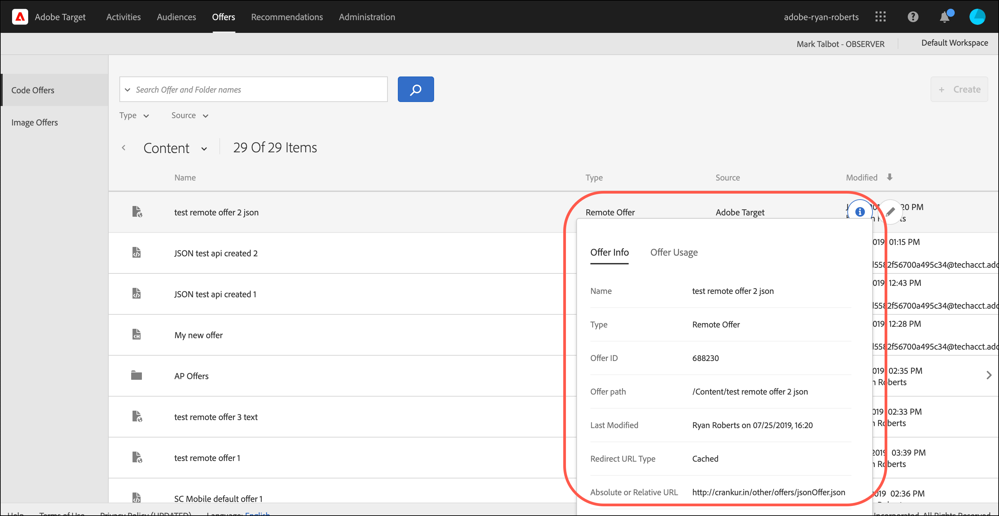

# Offerte

Utilizza il [!UICONTROL Offers] libreria in [!DNL Adobe Target] per gestire il contenuto delle offerte basate su codice e immagine.

>[!NOTE]
>
>Questo articolo contiene informazioni sugli aggiornamenti di [!DNL Target] che fa attualmente parte di un programma beta. Il [!DNL Adobe Target] team abilita spesso nuove funzioni per determinati clienti a scopo di test e feedback. Al termine del periodo di test, queste funzioni saranno abilitate per tutti i clienti in futuro [!DNL Target Standard/Premium] e annunciate nelle note sulla versione.

Fai clic su **[!UICONTROL Offers]** nella parte superiore della sezione [!DNL Target] Interfaccia utente per visualizzare [!UICONTROL Offers] libreria.

Il [!UICONTROL Offers] la libreria contiene offerte che sono state impostate tramite [!DNL Target Standard/Premium], [!DNL Target Classic], [!DNL Adobe Experience Manager] (AEM) [!DNL Adobe Mobile Services] (AMS) e API. Le offerte create in [!DNL Target Classic] o altre soluzioni sono modificabili in [!DNL Target Standard/Premium].

La libreria Offerte fornisce una panoramica di tutte le offerte di codice e immagini e consente di eseguire varie azioni:

| Elemento | Descrizione |
|--- |--- |
| Barra di navigazione a sinistra | Passa da un’inserzione all’altra [!UICONTROL Code Offers] o [!UICONTROL Image Offers]. |
| [!UICONTROL Show filters] icona
 | Fai clic su **[!UICONTROL Show filters]** icona per filtrare le offerte [!UICONTROL Type], [!UICONTROL Source], e [!UICONTROL AEM Type]
Per ulteriori informazioni, consulta [Applicare i filtri all’elenco delle offerte](#filters) di seguito. |
| Cerca campo | Utilizza il **[!UICONTROL Search in]** per trovare rapidamente un’offerta o per ridurre il numero di offerte visualizzate nel [!UICONTROL Offers] libreria. Puoi eseguire ricerche per [!UICONTROL Offer Name], [!UICONTROL AEM Paths], o [!UICONTROL AEM Tags]. |
| [!UICONTROL Create Folder] | Fai clic su Crea cartella per creare cartelle in [!UICONTROL Offer] libreria per raccogliere offerte basate su codice, offerte basate su immagini e altre cartelle per creare una struttura di sottocartelle. Per ulteriori informazioni, consulta [Creare cartelle di offerta](/help/main/c-experiences/c-manage-content/create-content-folder.md). |
| [!UICONTROL [!UICONTROL Create Offer]] | Crea un’offerta. Per ulteriori informazioni sulla creazione dei vari tipi di offerta, consulta: <ul><li>Offerta HTML</li><li>[Offerta JSON](/help/main/c-experiences/c-manage-content/create-json-offer.md)</li><li>[Offerta di reindirizzamento](/help/main/c-experiences/c-manage-content/offer-redirect.md)</li><li>[Offerta remota](/help/main/c-experiences/c-manage-content/about-remote-offers.md)</li></ul> |
| Caselle di controllo per le operazioni in blocco | Eseguire operazioni in blocco su tutte le attività o sulle attività selezionate.
Per un elenco delle azioni disponibili (a seconda delle autorizzazioni e dello stato dell’offerta), consulta [Eseguire azioni rapide](#quick-actions) di seguito. |
| [!UICONTROL Name] | Il nome di ogni offerta.
Fai clic su **[!UICONTROL Quick Info]** accanto al nome di ogni offerta per visualizzare ulteriori informazioni sull’offerta in una scheda a comparsa, tra cui l’ID offerta, il tipo, la data dell’ultima modifica apportata all’offerta, il nome dell’utente e altro ancora.
Fai clic su **[!UICONTROL More actions]** (i puntini di sospensione orizzontali) accanto al nome di ogni offerta per aprire un menu che consente di eseguire azioni rapide su un’attività. Sono disponibili le seguenti azioni (a seconda delle autorizzazioni e dello stato dell’offerta): [!UICONTROL Edit], [!UICONTROL Copy], [!UICONTROL Delete], e [!UICONTROL Move]. Per ulteriori informazioni su ciascuna azione, consulta [Eseguire azioni rapide](#quick-actions) di seguito.
Fai clic sull’intestazione della tabella per ordinare l’elenco in ordine alfabetico in ordine crescente o decrescente per nome. |
| [!UICONTROL Type] | Il tipo di offerta: Offerte HTML, [Offerte di reindirizzamento](/help/main/c-experiences/c-manage-content/offer-redirect.md), [Offerte remote](/help/main/c-experiences/c-manage-content/about-remote-offers.md), e [Offerte JSON](/help/main/c-experiences/c-manage-content/create-json-offer.md). |
| [!UICONTROL Source] | Mostra dove è stata creata l’offerta: [!DNL Adobe Target], [!DNL Adobe Target Classic], e [!DNL Adobe Experience Manager]. |

## Applicare filtri alla libreria Offerte {#filters}

Fai clic su **[!UICONTROL Show filters]** icona (  ) per filtrare le offerte per [!UICONTROL Type], [!UICONTROL Source], e [!UICONTROL AEM Type].

Il **[!UICONTROL Show filters]** consente di filtrare le offerte in base alle seguenti categorie:

* **Tipo**: Offerta HTML, [Offerta JSON](/help/main/c-experiences/c-manage-content/create-json-offer.md), [Offerta di reindirizzamento](/help/main/c-experiences/c-manage-content/offer-redirect.md), [Offerta remota](/help/main/c-experiences/c-manage-content/about-remote-offers.md).

* **Sorgente**: [!DNL Adobe Target], [!DNL Adobe Target Classic], e [!DNL Adobe Experience Manager].

* **Tipo di AEM**: [Frammenti di contenuto](/help/main/c-integrating-target-with-mac/aem/content-fragments-aem.md) e [Frammenti esperienza](/help/main/c-integrating-target-with-mac/aem/experience-fragments-aem.md). Per ulteriori informazioni sui diversi tipi di frammenti, consulta [Panoramica sui frammenti di esperienza e sui frammenti di contenuto dell’AEM](/help/main/c-integrating-target-with-mac/aem/aem-experience-and-content-fragments.md).

## Eseguire azioni rapide {#quick-actions}

Puoi eseguire le seguenti azioni rapide facendo clic sull’icona appropriata:

### Informazioni rapide

Fai clic su **[!UICONTROL Quick Info]** accanto al nome di ogni offerta per visualizzare ulteriori informazioni sull’offerta in una scheda a comparsa, tra cui l’ID offerta, il tipo, la data dell’ultima modifica apportata all’offerta, il nome dell’utente e altro ancora. Le opzioni disponibili dipendono dal tipo di offerta: Offerta HTML, [Offerta JSON](/help/main/c-experiences/c-manage-content/create-json-offer.md), [Offerta di reindirizzamento](/help/main/c-experiences/c-manage-content/offer-redirect.md), [Offerta remota](/help/main/c-experiences/c-manage-content/about-remote-offers.md).

### Altre azioni

Fai clic su **[!UICONTROL More actions]** (i puntini di sospensione orizzontali) accanto al nome di ogni offerta per aprire un menu che consente di eseguire azioni rapide su un’attività. Sono disponibili le seguenti azioni (a seconda delle autorizzazioni e dello stato dell’offerta): [!UICONTROL Edit], [!UICONTROL Copy], [!UICONTROL Delete], e [!UICONTROL Move].

* Modifica
* Copia
* Elimina
* Sposta (ad esempio, per spostare uno o più elementi in una cartella, fare clic sul pulsante **[!UICONTROL Move]** per l’elemento desiderato, fai clic sulla cartella desiderata, quindi fai clic su **[!UICONTROL Drop]**.)

A seconda delle autorizzazioni, è possibile che non vengano visualizzate le icone per tutte le opzioni. Ad esempio, un utente con [!UICONTROL Observer] autorizzazioni non dispone dei diritti per utilizzare il [!UICONTROL Copy] opzione.

Per informazioni dettagliate sulle attività eseguibili su offerte e cartelle, consulta [Utilizzare i contenuti della libreria di risorse](/help/main/c-experiences/c-manage-content/assets-working.md).

Per eseguire altre attività, passa il puntatore del mouse sull&#39;offerta o sulla cartella di immagine desiderata sul menu [!UICONTROL Image Offers] , quindi facendo clic sull&#39;icona desiderata.

Le opzioni includono:

* Seleziona
* Scarica
* View Properties (Visualizza proprietà)
* Modifica
* Annota
* Copia

Per informazioni dettagliate sulle attività eseguibili su offerte e cartelle, consulta [Utilizzare i contenuti della libreria di risorse](/help/main/c-experiences/c-manage-content/assets-working.md).

>[!NOTE]
>
>Le offerte di immagini non fanno parte del [Autorizzazioni per gli utenti Enterprise](/help/main/administrating-target/c-user-management/property-channel/property-channel.md) modello.

<!--

## Viewing offer definitions {#section_6B059DD121434E6292CAB393507D010E}

You can view offer definition details on a pop-up card in the [!UICONTROL Offers] library without opening the offer.

For example, the following offer definition card for an HTML offer is accessed by hovering over an offer on the [!UICONTROL Content] list, then clicking the information icon:

The following information is available:

* Name 
* Source 
* Type 
* Offer ID 
* Offer path 
* Last Modified

Click the [!UICONTROL Offer Usage] tab to view the activities that reference a code offer in each offer's definition pop-up card. This functionality does not apply to image offers. This way you can avoid impact to other activities while editing offers. Information includes [!UICONTROL Live Activities] and [!UICONTROL Inactive Activities].

The following offer definition card for a Redirect offer:

The following information is available:

* Name 
* Source 
* Type 
* Offer ID 
* Offer Path 
* Last Modified 
* Redirect URL 
* Include all URL parameters (On or Off) 
* Pass mbox session ID (On or Off)

The following offer definition card for a Remote offer:

The following information is available:

* Name 
* Source 
* Type 
* Offer ID 
* Offer Path 
* Last Modified 
* Redirect URL Type 
* Absolute or Relative URL

## Training video: The Content Repository 

This video includes information about managing offers.

* Connection between the [Experience Cloud Asset Library](https://experienceleague.adobe.com/docs/core-services/interface/assets/creative-cloud.html) and the Target Content Library 
* Custom HTML Offers 
* Custom HTML Offer in the Visual Experience Composer

>[!VIDEO](https://video.tv.adobe.com/v/17387)

-->
