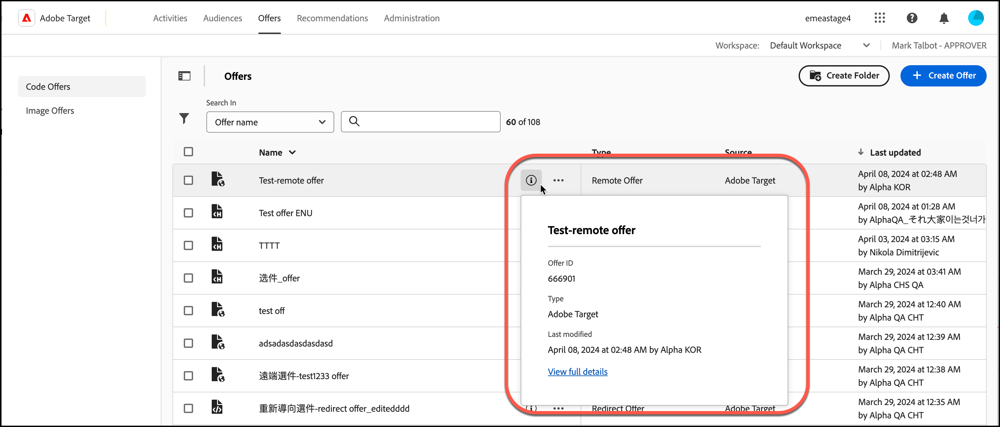

# Offerte

Utilizza il [!UICONTROL Offers] libreria in [!DNL Adobe Target] per gestire il contenuto delle offerte basate su codice e su immagine.

1. Clic **[!UICONTROL Offers]** per aprire la libreria.

   La libreria contiene le offerte che sono state impostate tramite [!DNL Target Standard/Premium], [!DNL Target Classic], [!DNL Adobe Experience Manager] (AEM), [!DNL Adobe Mobile Services] (AMS) e API. Le offerte create in [!DNL Target Classic] o altre soluzioni sono modificabili in [!DNL Target Standard/Premium].

   Il [!UICONTROL Offers] La pagina presenta due schede lungo il lato destro: [!UICONTROL Code Offers] e [!UICONTROL Image Offers] che ti consente di visualizzare le offerte per tipo.

   

1. (Facoltativo) Fai clic su **[!UICONTROL Type]** elenco a discesa per filtrare le offerte per tipo (Offerta HTML, [Frammenti esperienza](/help/main/c-experiences/c-manage-content/aem-experience-fragments.md), [Offerta di reindirizzamento](/help/main/c-experiences/c-manage-content/offer-redirect.md), [Offerta remota](/help/main/c-experiences/c-manage-content/about-remote-offers.md), [Offerte JSON](/help/main/c-experiences/c-manage-content/create-json-offer.md), e [Cartelle](/help/main/c-experiences/c-manage-content/create-content-folder.md)).

   

1. (Facoltativo) Fai clic su **[!UICONTROL Source]** per filtrare le offerte per origine (Adobe Target, Adobe Target Classic e Adobe Experience Manager).

1. (Facoltativo) Esegui altre attività passando il cursore sull’offerta o sulla cartella desiderata nella sezione [!UICONTROL Code Offers] , quindi facendo clic sull&#39;icona desiderata.

   

   Le opzioni includono:

   * Visualizza (per ulteriori informazioni, vedere [Visualizzazione delle definizioni delle offerte](#section_6B059DD121434E6292CAB393507D010E) di seguito.)
   * Modifica
   * Copia
   * Sposta (ad esempio, per spostare uno o più elementi in una cartella, fare clic sul pulsante **[!UICONTROL Move]** per l’elemento desiderato, fai clic sulla cartella desiderata, quindi fai clic su **[!UICONTROL Drop]**.)
   * Elimina

   A seconda delle autorizzazioni, è possibile che non vengano visualizzate le icone per tutte le opzioni. Ad esempio, un utente con [!UICONTROL Observer] autorizzazioni non dispone dei diritti per utilizzare il [!UICONTROL Copy] opzione.

   Per informazioni dettagliate sulle attività eseguibili su offerte e cartelle, consulta [Utilizzare i contenuti della libreria di risorse](/help/main/c-experiences/c-manage-content/assets-working.md).

1. (Facoltativo) Esegui altre attività passando il cursore sull&#39;offerta o la cartella di immagine desiderata sul [!UICONTROL Image Offers] , quindi facendo clic sull&#39;icona desiderata.

   

   Le opzioni includono:

   * Seleziona
   * Scarica
   * View Properties (Visualizza proprietà)
   * Modifica
   * Annota
   * Copia

   Per informazioni dettagliate sulle attività eseguibili su offerte e cartelle, consulta [Utilizzare i contenuti della libreria di risorse](/help/main/c-experiences/c-manage-content/assets-working.md).

   >[!NOTE]
   >
   >Le offerte di immagini non fanno parte del [Autorizzazioni per gli utenti Enterprise](/help/main/administrating-target/c-user-management/property-channel/property-channel.md) modello.

## Visualizzazione delle definizioni delle offerte {#section_6B059DD121434E6292CAB393507D010E}

Puoi visualizzare i dettagli della definizione dell’offerta su una scheda a comparsa in [!UICONTROL Offers] senza aprire l’offerta.

Ad esempio, per accedere alla scheda di definizione dell’offerta seguente per un’offerta HTML, fai clic sull’icona delle informazioni:

Sono disponibili le seguenti informazioni:

* Nome
* ID offerta
* Tipo
* Ultima modifica

Fai clic su [!UICONTROL View Full Details] per visualizzare il contenuto dell’offerta e le attività che fanno riferimento a un’offerta sotto forma di codice. In questo modo puoi evitare un impatto su altre attività mentre modifichi le offerte. Le informazioni includono [!UICONTROL Live Activities] e [!UICONTROL Inactive Activities].

Le informazioni disponibili su ogni carta variano a seconda del tipo di offerta: Offerta HTML, [Frammenti esperienza](/help/main/c-experiences/c-manage-content/aem-experience-fragments.md), [Offerta di reindirizzamento](/help/main/c-experiences/c-manage-content/offer-redirect.md), [Offerta remota](/help/main/c-experiences/c-manage-content/about-remote-offers.md), o [Offerte JSON](/help/main/c-experiences/c-manage-content/create-json-offer.md).

La funzionalità dettagli offerta non è applicabile alle offerte di immagini.

<!--

## Training video: The Content Repository 

This video includes information about managing offers.

* Connection between the [Experience Cloud Asset Library](https://experienceleague.adobe.com/docs/core-services/interface/assets/creative-cloud.html) and the Target Content Library 
* Custom HTML Offers 
* Custom HTML Offer in the [!UICONTROL Visual Experience Composer]

>[!VIDEO](https://video.tv.adobe.com/v/17387)

-->
