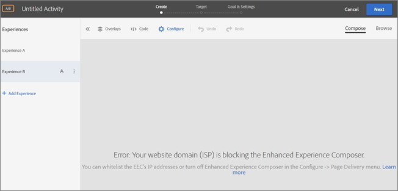

# Risoluzione dei problemi relativi a [!UICONTROL Enhanced Experience Composer]

A volte si verificano problemi di visualizzazione in [!DNL Adobe Target] [!UICONTROL Enhanced Experience Composer] (EEC) in determinate condizioni.

## Il Compositore esperienza avanzato non carica un URL di controllo qualità interno che non è accessibile su IP pubblico. {#section_D29E96911D5C401889B5EACE267F13CF}

+++Dettagli
Questo problema può essere risolto inserendo nell&#39;elenco Consentiti seguenti indirizzi IP. Questi indirizzi IP sono per il server [!DNL Adobe] utilizzato per il proxy EEC. Questi indirizzi IP sono necessari solo per la modifica delle attività. I visitatori del tuo sito non hanno bisogno di inserire nell&#39;elenco Consentiti questi indirizzi IP.

Chiedi al tuo team IT di i seguenti indirizzi IP:

### Stati Uniti (va7)

40.70.154.136/29
52.254.106.240/28
52.254.106.160/28
52.254.107.16/28
20.186.185.181
20.22.83.112
20.186.185.227
52.254.106.192/28
52.254.106.0/28
52.254.107.128/28
52.254.107.80/28
52.254.106.176/28
52.254.107.32/28
52.254.105.192/28
52.254.107.64/28
52.254.106.208/28
52.254.107.0/28
52.254.106.224/28
20.14.241.153
20.186.185.239
4.152.211.251
52.254.107.144/28
52.254.106.144/28

### EMEA (nld2)

51.138.17.16/28
51.138.17.48/28
51.138.16.128/28
51.138.17.32/28
51.138.16.240/28
51.138.17.112/28
51.138.16.160/28
51.138.16.208/28
51.138.17.80/28
51.138.17.0/28
51.138.17.96/28
51.138.16.144/28
20.31.145.248
20.126.189.248
51.138.16.224/28
51.138.16.192/28
51.138.12.94
51.138.12.11
51.138.16.176/28
51.138.12.100
51.138.17.64/28
51.138.12.160/28

### APAC (aus)

20.43.104.160/28
20.227.35.177
20.40.188.227
20.43.104.112/28
20.43.104.128/28
20.43.104.144/28
20.40.188.166
20.53.206.128
20.43.104.80/28
20.43.104.16/28
20.43.105.48/28
20.43.104.96/28
20.43.104.48/28
20.40.188.194
20.43.104.32/28
20.40.191.224/28
20.43.105.16/28
20.40.191.96/28
20.43.104.176/28
20.40.191.240/28
20.43.104.64/28
20.43.105.32/28
20.43.104.192/28
20.43.105.0/28
20.43.104.0/28

### Indirizzi IP legacy

I seguenti indirizzi IP legacy devono continuare a essere inseriti nell&#39;elenco Consentiti fino a nuovo avviso.

34.254.77.200
54.73.207.147
54.229.152.123
3.224.194.242
54.90.51.39
34.228.136.112
54.150.116.11
18.178.142.8
54.199.107.77
99.80.139.221
54.78.56.224
54.247.179.246
54.80.219.243
34.201.235.54
54.196.224.236
35.75.212.45
52.199.184.130
18.180.161.176

È possibile che in [!DNL Target] venga visualizzato il seguente messaggio di errore:

`Error: Your website domain (ISP) is blocking the [!UICONTROL Enhanced Experience Composer]. You can allowlist the [!UICONTROL Enhanced Experience Composer]'s IP addresses or turn off [!UICONTROL Enhanced Experience Composer] in [!UICONTROL Configure] > [!UICONTROL Page Delivery] menu.`

Di seguito sono riportati possibili cause per questo messaggio di errore e soluzioni per correggere la situazione:

* **Problema:** il dominio del sito Web (ISP) sta bloccando [!UICONTROL Enhanced Experience Composer].

  **Rimedio:** Inserire nell&#39;elenco Consentiti gli indirizzi IP elencati sopra.

* **Problema:** gli indirizzi IP vengono inseriti nell&#39;elenco Consentiti ma il sito Web non supporta la versione 1.2 di TLS. [!DNL Target] utilizza attualmente la configurazione predefinita di 1.2. Prima di [!DNL Target] 18.4.1 (25 aprile 2018), la configurazione predefinita supportava TLS 1.0. Per ulteriori informazioni, consulta [Modifiche alla crittografia TLS](https://experienceleague.adobe.com/docs/target-dev/developer/implementation/tls-transport-layer-security-encryption.html){target=_blank}.

  **Soluzione:** Vedi la domanda seguente ([!UICONTROL Enhanced Visual Experience Composer] non verrà caricato su pagine protette del mio sito che utilizzano TLS 1.2).

+++

## Il Compositore esperienza avanzato non viene caricato su pagine protette del mio sito che utilizzano TLS 1.0. (Solo Compositore esperienza avanzato) {#section_C5B31E3D32A844F68E5A8153BD17551F}

+++Dettagli
È possibile che venga visualizzato il messaggio di errore descritto in precedenza in &quot;Impossibile caricare [!UICONTROL Enhanced Visual Experience Composer] su pagine protette del sito&quot;. se gli indirizzi IP di cui sopra vengono inseriti nell&#39;elenco Consentiti ma il tuo sito web non supporta la versione 1.2 di TLS. [!DNL Target] utilizza attualmente la configurazione predefinita di 1.2. Prima di [!DNL Target] 18.4.1 (25 aprile 2018), la configurazione predefinita supportava TLS 1.0. Per ulteriori informazioni, consulta [Modifiche alla crittografia TLS](https://experienceleague.adobe.com/docs/target-dev/developer/implementation/tls-transport-layer-security-encryption.html){target=_blank}.

Per controllare la versione TLS sul tuo sito web con Firefox (altri browser hanno passaggi simili):

1. Apri il sito interessato in Firefox.
1. Fare clic sull&#39;icona **[!UICONTROL Show Site Information]** sulla barra degli indirizzi del browser.

   

1. Fare clic su **[!UICONTROL Show Connection Details]** > **[!UICONTROL More Information]**.

   

1. Verifica la versione di TLS alla voce Dettagli tecnici:

   

1. Se il sito Web visualizza TLS 1.0, vedere [Modifiche alla crittografia di TLS (Transport Layer Security)](https://experienceleague.adobe.com/docs/target-dev/developer/implementation/tls-transport-layer-security-encryption.html){target=_blank} per informazioni sui criteri di supporto per TLS di Target. Per risolvere la situazione (valido fino al 12 settembre 2018){target=_blank}, contatta l&#39;[Assistenza clienti](/help/main/cmp-resources-and-contact-information.md#reference_ACA3391A00EF467B87930A450050077C) per la configurazione con la versione di TLS e il dominio.

+++

## Ricevo errori di timeout o “accesso negato” durante il caricamento di siti con proxy abilitato. (Solo Compositore esperienza avanzato) {#section_60CBB9022DC449F593606C0E6252302D}

+++Dettagli
Assicurati che nel tuo ambiente gli IP proxy non siano bloccati.

+++
