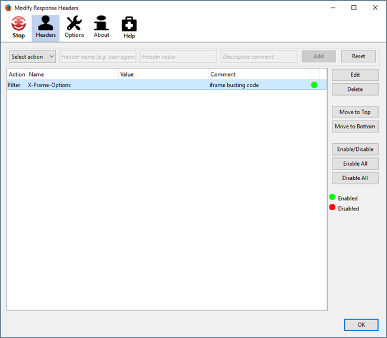

# Risoluzione dei problemi relativi al Compositore esperienza visivo

A volte si verificano problemi di visualizzazione nel [!DNL Adobe Target] [!UICONTROL Compositore esperienza visivo] (VEC) a determinate condizioni.

## Quando apro il mio sito web nel Compositore esperienza visivo, la [!DNL Target] le librerie non vengono caricate. (Solo Compositore esperienza visivo)  {#section_8A7D3F4AD2CC4C3B823EE9432B97E06F}

Target aggiunge due parametri (`mboxEdit=1` e `mboxDisable=1`) durante l&#39;apertura del sito web nel Compositore esperienza visivo.

Se il sito (specialmente le applicazioni per pagina singola) taglia i nostri parametri o li rimuove mentre navighi da una pagina all&#39;altra (senza un ricaricamento della pagina) la funzionalità di Target sono compromesse e le librerie di Target non vengono caricate. 
Per evitare questo problema, assicurati di non tagliare o rimuovere questi due parametri.

## La pagina non si apre nel Compositore esperienza avanzato, o si carica lentamente. Le attività o le esperienze si caricano lentamente nel Compositore esperienza visivo. (Solo Compositore esperienza visivo)  {#section_71E7601BE9894E3DA3A7FBBB72B6B0C1}

Diversi problemi possono influenzare le prestazioni della pagina nei compositori esperienza di Target. Alcuni problemi comuni includono:

* Sulla pagina non è oresente una mbox.
* Il sito utilizza il blocco proxy, che non consente l&#39;apertura della pagina in nessuno dei Compositori esperienza.
* Il sito non si lascia aprire in un iFrame.

Se si verificano problemi con il Compositore esperienza avanzato, prova a disattivarlo e utilizza invece il Compositore esperienza visivo.

Per disabilitare il Compositore esperienza avanzato, passa a **[!UICONTROL Amministrazione]** > **[!UICONTROL Compositore esperienza visivo]** e spegne **[!UICONTROL Abilita Compositore esperienza avanzato]** opzione .

Alcuni utenti visualizzano il seguente messaggio di errore nella console:

Se né il Compositore esperienza visivo né il Compositore esperienza avanzato funzionano, utilizza un’estensione del browser come Requestly (Chrome o Firefox) o Modify Response Headers (Firefox) che possono sovrascrivere le opzioni di intestazione X-frame per il tuo sito e consentire loro di essere caricate in iFrames, abilitando il Compositore esperienza visivo. Se non riesci a utilizzare le estensioni del browser, utilizza il Compositore basato su moduli.

>[!NOTE]
>
>Oltre alle seguenti informazioni, puoi utilizzare l’estensione del browser [Adobe Target VEC Helper](/help/main/c-experiences/c-visual-experience-composer/r-troubleshoot-composer/vec-helper-browser-extension.md) per Google Chrome.

>[!NOTE]
>
>Questi plug-in devono essere utilizzati solo nel contesto di modifica del Compositore esperienza visivo.
>
>Per l’estensione Requestly, ogni volta che è necessario rimuovere le intestazioni, bisogna eseguire una delle seguenti operazioni:
>
>* Aggiungere regole URL per l&#39;URL che si desidera aprire nel Compositore esperienza visivo in modo tale che le intestazioni vengano rimosse solo per tali URL.
>
>* Abilitare la regola quando si effettuano modifiche nel Compositore esperienza visivo e disabilitarla quando non lo si utilizza.
>
>Per l&#39;estensione Modify Response Header (Firefox), poiché non è possibile aggiungere una regola URL, è necessario effettuare le seguenti operazioni:
>
>* Abilitare la regola quando si effettuano modifiche nel Compositore esperienza visivo e disabilitarla quando non lo si utilizza.

**Per utilizzare l’estensione Requestly su Chrome o Firefox:**

1. Disattiva il Compositore esperienza avanzato.
1. Installa l&#39;estensione Requestly su Chrome o Firefox.
1. Apri l&#39;estensione e configurala:
1. Seleziona **[!UICONTROL Modifica intestazioni]**.
1. Immetti quanto segue:

   * Nome regola
   * Regole di modifica

      * Passa da **[!UICONTROL Aggiungi]** a **[!UICONTROL Rimuovi]**.
      * Passa da **[!UICONTROL Richiesta]** a **[!UICONTROL Risposta]**.
      * Immetti “X-Frame-Options” come nome dell&#39;intestazione.
      * Ripeti i passaggi precedenti e immetti “x-frame-options” come nome dell&#39;intestazione.

         >[!NOTE]
         >
         >Le intestazioni che vengono manipolate tramite Requestly sono sensibili alle maiuscole e minuscole.

      * Cambia la condizione per l&#39;URL di origine da **[!UICONTROL È uguale a]** a **[!UICONTROL Contiene]** e immetti l&#39;URL dell&#39;attività da caricare nel Compositore esperienza visivo.

      

1. Fai clic su **[!UICONTROL Salva]**.

   

   Ora dovresti essere in grado di caricare la pagina rapidamente con il Compositore esperienza visivo.

**Per utilizzare l&#39;estensione Modify Response Headers su Firefox:**

1. Installa Modify Response Headers su Firefox e riavvia il browser.
1. Dalle estensioni di Firefox, seleziona l&#39;estensione Modify Response Headers.
1. Fai clic su **[!UICONTROL Preferenze]**.
1. Seleziona **[!UICONTROL Filtro]** dal menu a discesa Azione.
1. Nel campo Nome intestazione, immetti: **[!UICONTROL X-Frame-Options]**.
1. Ripeti i passaggi 4 e 5 per aggiungere un filtro con **[!UICONTROL x-frame-options]**.
1. Fai clic su **[!UICONTROL Aggiungi]**.
1. Fai clic su **[!UICONTROL Avvia]**.

Dopo aver impostato un&#39;estensione, apri Target. Dovrebbe essere ora possibile caricare le pagine nel Compositore esperienza visivo, anche se il Compositore esperienza avanzato è disattivato.

## La pagina non viene visualizzata nel Compositore esperienza visivo (solo Compositore esperienza visivo) {#does-not-load}

* Il browser non è supportato.
* Il browser sta bloccando una pagina non sicura su un sito sicuro.

   Fai clic sull&#39;icona a sinistra dell&#39;URL nella barra degli indirizzi del browser e fai clic su **[!UICONTROL Disattiva protezione su questa pagina]**.
* Hai immesso un URL non valido.
* Non hai inserito un URL predefinito nella pagina di configurazione dell&#39;account.

   Assicurati che questa impostazione sia abilitata, quindi scarica e aggiorna at.js sul tuo sito web.

* Se provi a utilizzare il [nuovo [!UICONTROL Helper per editing video] estensione](/help/main/c-experiences/c-visual-experience-composer/r-troubleshoot-composer/visual-editing-helper-extension.md) e poi tornare alla [vecchia estensione](/help/main/c-experiences/c-visual-experience-composer/r-troubleshoot-composer/vec-helper-browser-extension.md) e [!DNL Target] non riesce a caricare il sito web, cancella tutti i dati del browser e disabilita la nuova estensione.

* Se il sito web non viene caricato nel Compositore esperienza visivo o si comporta in modo imprevisto, è possibile accettare i cookie sul sito web nel browser prima di provare a caricare il sito web in [!DNL Target].

## Il Compositore esperienza visivo sembra non funzionare quando uso la modalità Sfoglia. (Solo Compositore esperienza visivo)  {#section_FA2A18E8FD6A4274B2E395DBAA2FB407}

Durante l&#39;utilizzo della modalità Sfoglia, se accedi a un URL privo di target.js o che contiene un&#39;intestazione non compatibile con i frame, il Compositore esperienza visivo potrebbe non funzionare. A causa di problemi di sicurezza del browser, in Target non è possibile accedere all&#39;URL di destinazione.
