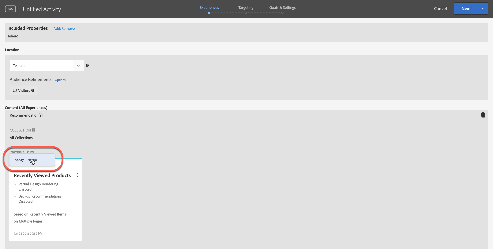

# Compositore esperienza basato su moduli

[!DNL Adobe Target] [!UICONTROL Form-Based Experience Composer] è un&#39;interfaccia non visiva per la creazione di esperienze e offerte, utile per creare le esperienze da utilizzare nelle attività [!UICONTROL A/B Test], [!UICONTROL Experience Targeting], [!UICONTROL Automated Personalization] e [!UICONTROL Recommendations] quando [!UICONTROL Visual Experience Composer] (VEC) non è disponibile o se non risulta pratico. Ad esempio, puoi utilizzare il Compositore esperienza basato su moduli per creare esperienze e offerte da distribuire tramite e-mail, chioschi e assistenti vocali.

Se stai creando un&#39;attività [!UICONTROL Recommendations], non ci sono esperienze. Scegli i test di verifica e progettazione. Se si scelgono più criteri o progettazioni, [!UICONTROL Target] genera automaticamente le esperienze.

1. Fare clic su **[!UICONTROL Create Activity]**, quindi selezionare il tipo di attività da creare.

   [!UICONTROL Form-Based Experience Composer] è disponibile per [!UICONTROL A/B Test], [!UICONTROL Experience Targeting], [!UICONTROL Automated Personalization] e [!UICONTROL Recommendations] attività.

1. Selezionare **[!UICONTROL Form]** dalla finestra di dialogo [!UICONTROL Create Activity].

1. (Condizionale) Scegli un’area di lavoro e una proprietà.

1. Fare clic su **[!UICONTROL Next]**.

   Verrà aperto [!UICONTROL Form-Based Experience Composer].

   

   Questa schermata è diversa se si sta creando un&#39;attività [!UICONTROL Recommendations]. Le attività [!UICONTROL Recommendations] non includono esperienze.

1. Assegnare un nome all&#39;attività facendo clic su &quot;[!UICONTROL Untitled Activity]&quot;.
1. Seleziona una posizione.

   Quando si fa clic su nella casella [!UICONTROL Select Location], viene visualizzato un elenco delle posizioni disponibili. Seleziona una di queste posizioni.

   È inoltre possibile immettere una posizione non elencata. Tale opzione può essere utile se la mbox non è ancora stata creata o visualizzata su una pagina. Digita il nome della posizione. Presta attenzione quando inserisci una posizione che non esiste ancora. Se l&#39;ortografia o l’uso di maiuscole/minuscole non corrisponde quando viene effettuata la chiamata mbox, l’attività non verrà consegnata. Le ubicazioni immesse manualmente vengono salvate nell&#39;elenco delle ubicazioni disponibili. La prossima volta che si tenta di selezionare una posizione immessa manualmente, questa sarà disponibile nell&#39;elenco a discesa [!UICONTROL Select Location] per tale attività.

   >[!NOTE]
   >
   >La creazione di una posizione inserita manualmente durante la creazione dell’attività non crea automaticamente una nuova posizione. Il nome della posizione viene salvato solo nel contesto dell’attività. La posizione viene creata quando si verifica una chiamata di consegna del contenuto. Successivamente alla posizione in fase di creazione, sarà disponibile per l’utilizzo in altre attività, per la creazione di tipi di pubblico, ecc. dall’elenco a discesa delle posizioni disponibili.

1. Fai clic su **[!UICONTROL Add Audience Refinements]**, scegli uno o più [tipi di pubblico](/help/main/c-target/target.md#concept_A782F8481A5041EBA75103CB26376522) per questa attività, quindi fai clic su **[!UICONTROL Done]**.

   

   In [!UICONTROL Form-based Experience Composer], i miglioramenti sono stati sostituiti con funzionalità di pubblico complete. I perfezionamenti per le attività esistenti sono stati migrati a [tipi di pubblico per sola attività](/help/main/c-target/creating-activity-only-audience.md#concept_A6BADCF530ED4AE1852E677FEBE68483).

1. Seleziona il tipo di contenuto da visualizzare in tale posizione.

   

1. Specifica il contenuto per il tipo selezionato.

   **Modifica offerta HTML:** scegli un’offerta HTML.

   **Modifica Offerte immagine:** scegli un’immagine salvata nella libreria di contenuti di Target.

   È inoltre possibile aggiungere un collegamento a un&#39;immagine (click-through, destinazione e così via.)

   1. Fare clic su [!UICONTROL Change Image Offer].
   1. Selezionare l&#39;immagine desiderata, quindi fare clic su [!UICONTROL Edit Links].
   1. Specifica l&#39;URL o la pagina desiderata sul tuo sito, quindi fai clic su [!UICONTROL Update].

   **Modifica offerta JSON:** scegli un’offerta JSON.

   **Modifica frammento esperienza:** Scegli un frammento esperienza. Per ulteriori informazioni, vedere [Frammento esperienza](/help/main/c-experiences/c-manage-content/aem-experience-fragments.md).

   **Modifica offerta di reindirizzamento:** Scegli un&#39;offerta di reindirizzamento. Per ulteriori informazioni, vedere [Creare offerte di reindirizzamento](/help/main/c-experiences/c-manage-content/offer-redirect.md).

   **Modifica offerta remota:** Scegli un&#39;offerta remota. Per ulteriori informazioni, vedere [Creare offerte remote](/help/main/c-experiences/c-manage-content/about-remote-offers.md).

   **Crea offerta HTML:**

   1. Fare clic su [!UICONTROL Offers], quindi selezionare la scheda [!UICONTROL Code Offers].
   1. Fare clic su [!UICONTROL Create] > [!UICONTROL HTML Offer].
   1. Digita un nome per l’offerta.
   1. Digita o incolla il codice HTML nella casella Codice.
   1. Fare clic su [!UICONTROL Save].

   **Crea offerta JSON:**

   1. Fare clic su [!UICONTROL Offers], quindi selezionare la scheda [!UICONTROL Code Offers].
   1. Fare clic su [!UICONTROL Create] > [!UICONTROL JSON Offer].
   1. Digita un nome per l’offerta.
   1. Digita o incolla il codice JSON nella casella Codice.
   1. Fare clic su [!UICONTROL Save].

   **Aggiungi consiglio:**

   Per un&#39;attività Consigli, l&#39;elenco a discesa Contenuto fornisce l&#39;opzione [!UICONTROL Add Recommendation]. Fare clic su **[!UICONTROL Add Recommendation]**, quindi selezionare il tipo di pagina. Quindi segui i passi consueti descritti per [creare un’attività di consigli](/help/main/c-recommendations/t-create-recs-activity/create-recs-activity.md).

   Durante la selezione dei criteri di consigli nel compositore esperienza basato su moduli, è ora disponibile un collegamento diretto alla scheda dei criteri selezionati per poter modificare in modo semplice e veloce i criteri.

   

   Dalla pagina di targeting del workflow guidato in tre fasi di Target:

   Immagine 

   **Aggiungi decisione di offerta:**

   Aggiungi un&#39;offerta creata in [!DNL Adobe Journey Optimizer] (AJO) a un&#39;attività di [!DNL Adobe Target] per presentare l&#39;offerta e l&#39;esperienza dinamica migliore ai visitatori sul tuo sito Web o sito mobile tramite Offer Decisioning. Questa opzione è disponibile solo per le attività manuali [!UICONTROL A/B Test] e [!UICONTROL Experience Targeting] (XT).

   Per ulteriori informazioni, consulta [Utilizzare le decisioni sulle offerte](/help/main/c-integrating-target-with-mac/ajo/offer-decision.md).

1. (Facoltativo, per [!UICONTROL A/B Test], [!UICONTROL Automated Personalization] e [!UICONTROL Experience Targeting] attività) Per ripetere il processo per posizioni aggiuntive, fare clic su **[!UICONTROL Add Location]** e configurare la posizione e il contenuto.
1. Fai clic su **[!UICONTROL Next]**, quindi completa i passaggi di creazione dell&#39;attività come di consueto secondo il tipo di attività.

* [Creare un test A/B](/help/main/c-activities/t-test-ab/t-test-create-ab/test-create-ab.md)
* [Creare un’attività Targeting delle esperienze](/help/main/c-activities/t-experience-target/t-xt-create/xt-create.md#task_D6B3429AC31549E1A70EDF04B3DDC765)
* [Creare un’attività Consigli](/help/main/c-recommendations/t-create-recs-activity/create-recs-activity.md#task_6874328773C64C44A73F0A130AD3F96F)

## Video di formazione: Compositore basato su moduli 

Questo video fornisce una demo del Compositore esperienza basato su moduli.

* Creare un’attività utilizzando il Compositore esperienza basato su moduli
* Quando utilizzare il Compositore esperienza basato su moduli o il Compositore esperienza visivo
* Indirizzare una posizione con i perfezionamenti

>[!VIDEO](https://video.tv.adobe.com/v/17390)
