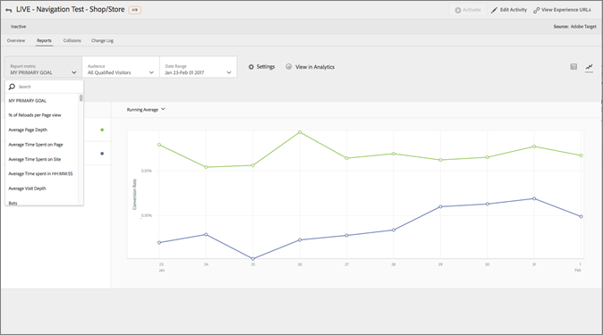

# [!DNL Adobe Analytics] come origine per la generazione di rapporti per [!DNL Adobe Target] (A4T)

[!DNL Adobe Analytics for Target] (A4T) è un’integrazione tra più soluzioni che consente di creare attività basate su [!DNL Analytics] metriche di conversione e segmenti di pubblico. L’integrazione A4T consente di utilizzare [!DNL Analytics] rapporti per esaminare i risultati. Se utilizzi [!DNL Analytics] come origine per la generazione di rapporti per un’attività, tutti i rapporti e la segmentazione per tale attività si basano su [!DNL Analytics] raccolta dati.

## Panoramica {#section_92B66069210C40DBA937790E8CC596CF}

La [!DNL Analytics for Target] integrazione tra [!DNL Analytics] e [!DNL Target] fornisce potenti strumenti di analisi e risparmio di tempo per il programma di ottimizzazione.

I tre vantaggi principali dell&#39;utilizzo [!DNL Analytics] dati in [!DNL Target] sono:

* Gli addetti al marketing possono applicare dinamicamente [!DNL Analytics] metriche di successo o segmenti di reporting a [!DNL Target] rapporti di attività in qualsiasi momento. Non è necessario specificare tutte le impostazioni prima di eseguire l’attività.
* Un’unica fonte di dati elimina la varianza che si verifica quando si raccolgono dati in due sistemi distinti.
* esistente [!DNL Analytics] l&#39;implementazione raccoglie tutti i dati richiesti. Non è necessario implementare mbox sulle pagine al solo scopo di raccogliere dati per i rapporti.

Se utilizzi [!DNL Analytics] come origine per la generazione di rapporti per un’attività, tutti i rapporti e la segmentazione per tale attività si basano su [!DNL Analytics].

Tutto [!DNL Analytics] le metriche, comprese quelle calcolate, sono disponibili in [!DNL Target] e [!UICONTROL Attività di Target] in [!DNL Analytics], con un&#39;eccezione. Metriche calcolate per [!UICONTROL Incremento e affidabilità] non sono supportati. Analogamente, qualsiasi segmento disponibile in [!DNL Analytics] può essere applicato a entrambe le soluzioni. Puoi applicare la metrica o il pubblico al rapporto in [!DNL Target] dopo l’avvio dell’attività, o anche dopo il completamento dell’attività.

Ogni metrica è inclusa, comprese eventuali metriche personalizzate o calcolate integrate [!DNL Analytics].

Dopo il periodo di classificazione, i dati sono visualizzati in questi rapporti circa un&#39;ora dopo essere stati raccolti dal sito. Tutte le metriche, i segmenti e i valori nei rapporti provengono dalla suite di rapporti selezionata quando si configura l’attività.

Considerazioni importanti per l’utilizzo di A4T:

* Per utilizzare [!DNL Analytics] come origine per la generazione di rapporti per [!DNL Target], sia tu che la tua azienda dovete avere accesso a [!DNL Analytics] e [!DNL Target]. [Contatta il rappresentante del tuo account](/help/main/cmp-resources-and-contact-information.md#concept_34A1CA16F2244D42930BB77846A5ABBB) per accedere a queste soluzioni.
* L’origine per la generazione di rapporti è impostata per ogni attività. [!DNL Target] continua a raccogliere i dati da utilizzare nel reporting e [!DNL Target] i dati sono ancora disponibili se preferisci basare un’attività sui dati raccolti da [!DNL Target].
* Utilizzare un&#39;origine per la generazione di rapporti o l&#39;altra. Non è possibile raccogliere dati per una singola attività da entrambe le origini.
* Con A4T tutte le metriche di successo disponibili per le attività sono [!DNL Analytics] metriche. Tuttavia, la metrica di obiettivo può essere basata su una chiamata mbox se utilizzi at.js. Ad esempio, puoi utilizzare le funzionalità di tracciamento dei clic predefinite di Target con A4T invece di dover implementare [!DNL Analytics] codice di tracciamento dei clic.
* Quando visualizzi il reporting di un’attività A4T nel [!DNL Target] Interfaccia utente, [!DNL Analytics] dati. Ad esempio, se utilizzi il [!UICONTROL Visitatore] metrica in [!DNL Target], utilizzi [!DNL Analytics] [!UICONTROL Visitatore] metrica, non [!DNL Target] [!UICONTROL Visitatori] , che è ora chiamato [!UICONTROL Partecipanti]. Questa differenza è particolarmente importante per le metriche del traffico di base ([!UICONTROL Visitatori], [!UICONTROL Visite], [!UICONTROL Visualizzazioni pagina]) e metriche di conversione.
* Qualsiasi esistente [!DNL Target] le attività continuano a utilizzare [!DNL Target] raccolta dati e non sono interessati dall’abilitazione di A4T.
* È consentita una sola metrica basata su mbox quando si utilizza A4T.
* Chiamata server-to-server da [!DNL Target] a [!DNL Analytics] invia informazioni sull’attività e sull’esperienza a [!DNL Analytics]. Questa integrazione non comporta chiamate server aggiuntive per [!DNL Target] o [!DNL Analytics].

   In alcune situazioni, le classificazioni da [!DNL Target] a [!DNL Analytics] errore e le attività non mostrano i dati in [!DNL Analytics]. Vedi [Risolvere i problemi relativi all’integrazione di Analytics e Target (A4T)](/help/main/c-integrating-target-with-mac/a4t/c-a4t-troubleshooting/a4t-troubleshooting.md). È inoltre possibile [contattare l’Assistenza clienti](/help/main/cmp-resources-and-contact-information.md#concept_34A1CA16F2244D42930BB77846A5ABBB) per ulteriore assistenza.

## Implementare A4T

Per informazioni sull’implementazione di A4T con at.js e la [!DNL Adobe Experience Platform Web SDK], vedi [Analytics per [!DNL Target] implementazione](/help/main/c-integrating-target-with-mac/a4t/a4timplementation.md).

## Tipi di attività supportati {#section_F487896214BF4803AF78C552EF1669AA}

Le sezioni seguenti contengono informazioni sui tipi di attività supportati quando si utilizza il [!DNL Adobe Experience Platform Web SDK] o at.js:

| Tipi di attività | Compatibile con A4T? | Note, se applicabili |
|--- |--- |--- |
| [Attività A/B con suddivisione manuale del traffico](/help/main/c-activities/t-test-ab/test-ab.md) | Sì |  |
| [Attività A/B con Allocazione automatica](/help/main/c-activities/automated-traffic-allocation/automated-traffic-allocation.md) | Sì | Vedi [Supporto A4T per attività di allocazione automatica e targeting automatico](/help/main/c-integrating-target-with-mac/a4t/a4t-at-aa.md) |
| [Attività A/B con Targeting automatico](/help/main/c-activities/auto-target/auto-target-to-optimize.md) | Sì | Vedi [Supporto A4T per attività di allocazione automatica e targeting automatico](/help/main/c-integrating-target-with-mac/a4t/a4t-at-aa.md). |
| [Targeting esperienza (XT)](/help/main/c-activities/t-experience-target/experience-target.md) | Sì |  |
| [Test multivariato (MVT)](/help/main/c-activities/c-multivariate-testing/multivariate-testing.md) | Sì | Richiede metriche obiettivo basate su mbox per ottenere il [!UICONTROL Contributo elemento] rapporto. La [!UICONTROL Contributo elemento] al momento il report non supporta [!DNL Analytics] metriche. |
| [Attività di Personalizzazione automatizzata (AP)](/help/main/c-activities/t-automated-personalization/automated-personalization.md) | No |  |
| [Attività di Consigli](/help/main/c-recommendations/recommendations.md) | Sì |  |
| [Qualsiasi attività utilizzando un’offerta di reindirizzamento](/help/main/c-integrating-target-with-mac/a4t/r-a4t-faq/a4t-faq-redirect-offers.md) | Sì |

Poiché tutti i tipi di attività non supportano ancora A4T, si consiglia di mantenere o implementare importanti mbox di conversione, ad esempio `orderConfirmPage` mbox.

## Esempi di rapporti A4T {#section_F0A43A1CB2F04E8282B909E4D7034361}

Per visualizzare i rapporti A4T in [!DNL Target], fai clic su **[!UICONTROL Attività]**, fai clic sull’attività desiderata dall’elenco che utilizza [!DNL Analytics] come origine per la generazione di rapporti, quindi fai clic sul pulsante **[!UICONTROL Rapporti]** scheda .

>[!NOTE]
>
>È possibile utilizzare [!UICONTROL Origine per i rapporti] elenco a discesa nella parte superiore della [!UICONTROL Attività] per visualizzare solo le attività che utilizzano A4T.

Puoi alternare tra [!UICONTROL Vista a tabella] e [!UICONTROL Vista grafico] del rapporto facendo clic sull’icona appropriata in alto a destra nel rapporto.

La figura seguente illustra la [!UICONTROL Vista grafico] di un rapporto A4T con l’elenco a discesa [!UICONTROL Metrica rapporto] contenente le metriche obiettivo di [!DNL Analytics] disponibili:

La figura seguente illustra la [!UICONTROL Vista grafico] di un rapporto A4T con l’elenco a discesa [!UICONTROL Pubblico] contenente i tipi di pubblico di [!DNL Analytics] disponibili:

La figura seguente illustra la [!UICONTROL Vista tabella] di un rapporto A4T:

Per visualizzare il rapporto in [!DNL Analytics] anziché in [!DNL Target], fai clic su **[!UICONTROL Visualizza in Analytics]** nella parte superiore del rapporto.

## Analytics &amp; Target: esercitazione sulle best practice per l&#39;analisi {#section_3438E6E77A464424B717A4FD333B84B2}

Apri [Analytics e Target: Best practice per l’analisi](https://spark.adobe.com/page/Lo3Spm4oBOvwF/) esercitazione, fornita da [!DNL Adobe Experience League].

## Video di formazione:

I video seguenti contengono ulteriori informazioni sui concetti discussi in questo argomento.

### Analytics for Adobe Target (A4T) (4:32) 

Questo video spiega come utilizzare [!DNL Analytics] come origine per la generazione di rapporti in [!DNL Target] per eseguire l&#39;analisi del programma di ottimizzazione.

* Cosa è A4T e perché utilizzarlo
* Come funziona A4T
* Prerequisiti necessari prima di utilizzare A4T

>[!VIDEO](https://video.tv.adobe.com/v/17384)

### Integrazione di Analytics e Adobe Target (A4T) (40:33) 

Questo video è una registrazione di “ [Office Hours](/help/main/cmp-resources-and-contact-information.md#concept_58EA30379D3B48C4848BA2A8C464A5B7)”, un’iniziativa condotta dal team di assistenza clienti Adobe.

* Configurare e convalidare il funzionamento dell&#39;integrazione
* Funzionamento dell&#39;integrazione
* Informazioni sui rapporti ideali da utilizzare in Analytics
* Risposte alle domande più frequenti su A4T

[Office hours dell&#39;integrazione di Analytics e Target (A4T)](https://helpx.adobe.com/it/customer-care-office-hours/target/analytics-target-A4T-integration.html)

>[!MORELIKETHIS]
>
>* [Analytics per [!DNL Target] implementazione](/help/main/c-integrating-target-with-mac/a4t/a4timplementation.md): Contiene informazioni sull’implementazione per at.js e l’SDK per web di Platform.
>* [Offerte di reindirizzamento - Domande frequenti su A4T](/help/main/c-integrating-target-with-mac/a4t/r-a4t-faq/a4t-faq-redirect-offers.md)
>* [Cos’è Adobe Experience Platform Web SDK](https://experienceleague.adobe.com/docs/experience-platform/edge/home.html): Contiene informazioni generali sull’SDK per web di Platform.
>* [Panoramica di Target](https://experienceleague.adobe.com/docs/experience-platform/edge/personalization/adobe-target/target-overview.html): Contiene informazioni specifiche per [!DNL Target] e [!DNL Platform Web SDK].

