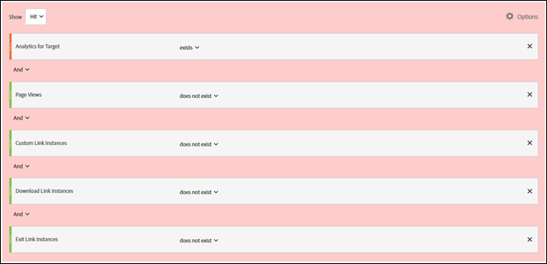

# Minimizzare i conteggi gonfiati di visite e visitatori in A4T

Informazioni che consentono di minimizzare gli effetti dei conteggi gonfiati di visite e visitatori quando si utilizza [!DNL Adobe Analytics] come origine per la generazione di rapporti [!DNL Adobe Target] (A4T).

>[!IMPORTANT]
>Il 14 novembre 2016, in Adobe Analytics sonos tate cambiate le modalità di elaborazione di alcuni dati per i clienti che utilizzano le funzioni di reporting di Analytics per Target (A4T). Queste modifiche consentono un migliore allineamento dei dati di Adobe Target con il modello dati di Adobe Analytics. Le suddette modifiche sono state apportate per tutti i clienti che utilizzano A4T. Queste modifiche rispondono specificamente a un problema notato dai clienti, relativo a un conteggio eccessivo dei visitatori quando le attività di Target sono in esecuzione.
>
>Questo cambiamento non è retroattivo. Se i rapporti cronologici mostrano conteggi gonfiati e desideri escluderli, puoi creare una suite di rapporti virtuale, come descritto di seguito.
>
>Inoltre, diverse librerie JavaScript sono state aggiornate per ridurre al minimo i conteggi gonfiati. Adobe consiglia di eseguire l’aggiornamento alle seguenti versioni della libreria (o successive):
>
>* Servizio ID visitatore di Experience Cloud: visitorAPI.js versione 2.3.0 o successiva.
>* Adobe Analytics: appMeasurement.js versione 2.1.
>* Adobe Target: at.js versione 0.9.6 o successiva (eccetto versione 1.1.0 se si utilizza il reindirizzamento con A4T).

## Cosa è cambiato? {#section_9CCF45F5D66D48EBA88F3A178B27D986}

Quando [!DNL Adobe Analytics] viene utilizzato per misurare le attività di [!DNL Target] (A4T), [!DNL Analytics] raccoglie dati aggiuntivi che non sono disponibili se non è presente alcuna attività di [!DNL Target] nella pagina. L’attività di [!DNL Target] innesca una chiamata nella parte superiore della pagina, ma solitamente [!DNL Analytics] genera le chiamate di raccolta dati nella parte inferiore della pagina. Nell’implementazione di A4T fino a oggi, Adobe ha incluso questi dati aggiuntivi ogni volta che un’attività di [!DNL Target] risultava attiva. In futuro, Adobe includerà questi dati aggiuntivi solo quando i tag di [!DNL Target] e [!DNL Analytics] vengono entrambi attivati.

## Perché Adobe ha introdotto questa modifica? {#section_92380A4BD69E4B8886692DD27540C92A}

L’accuratezza e la qualità dei dati sono motivo di orgoglio per Adobe. Quando il tag [!DNL Target] viene attivato, ma il [!DNL Analytics] no, Analytics registra i “dati parziali” (talvolta denominati “risultati non vincolati”). Questi risultati non vincolati non vengono acquisiti da [!DNL Analytics] se non si è verificata alcuna attività di [!DNL Target]. L’inclusione dei dati parziali nella reportistica di [!DNL Analytics] fornisce informazioni aggiuntive, ma genera anche risultati incoerenti per i dati precedenti relativi a periodi in cui non vi erano attività di [!DNL Target] in esecuzione. Questa situazione può causare problemi agli utenti di [!DNL Analytics] che analizzano le tendenze nel tempo. Al fine di garantire la coerenza dei dati in [!DNL Analytics], Adobe esclude tutti i dati parziali.

## Cosa contribuisce ai dati parziali? {#section_C9C906BEAA7D44DAB9D3C03932A2FEB8}

Adobe ha riscontrato alcuni clienti con tassi elevati di dati parziali in [!DNL Analytics]. Tassi elevati di dati parziali possono derivare da un’implementazione impropria, ma esistono anche cause legittime.

Le cause dei dati parziali identificate includono le seguenti:

* **ID delle suite di rapporti non allineati (implementazione):** la suite di rapporti specificata durante la configurazione dell’attività non corrisponde alla suite di rapporti nella pagina in cui viene consegnato il test. Non è possibile riconciliare i dati sui server [!DNL Analytics], quindi i dati appaiono parziali.
* **Pagine lente:** le chiamate [!DNL Target] si trovano nella parte superiore della pagina, mentre le chiamate [!DNL Analytics] si trovano solitamente nella parte inferiore. Se la pagina viene caricata lentamente, aumenta la probabilità che un visitatore lasci la pagina dopo l’attivazione della chiamata [!DNL Target], ma prima della chiamata [!DNL Analytics]. Le pagine lente possono essere particolarmente problematiche sui siti web mobili, che spesso hanno connessioni più lente.
* **Errori di pagina:** se ci sono errori JavaScript o altri scenari in cui ciascuno dei punti di contatto non si attiva (servizio Experience Cloud ID, Target e Analytics), si ottengono dei dati parziali.
* **Offerte di reindirizzamento nelle attività di [!DNL Target]:** per le offerte di reindirizzamento nelle attività che utilizzano A4T, l’implementazione deve soddisfare determinati requisiti minimi. Inoltre, è necessario conoscere alcune informazioni importanti. Per ulteriori informazioni, consulta [Offerte di reindirizzamento: domande frequenti su A4T](/help/main/c-integrating-target-with-mac/a4t/r-a4t-faq/a4t-faq-redirect-offers.md#section_FA9384C2AA9D41EDBCE263FFFD1D9B58).
* **Versioni precedenti delle librerie:** nel corso degli anni Adobe ha apportato diversi miglioramenti alle librerie JavaScript ([!DNL appMeasurement.js], `at.js` e `visitorAPI.js`) per assicurarsi che i dati vengano inviati nel modo più efficiente possibile. Per ulteriori informazioni sui requisiti di implementazione, consulta [Prima dell&#39;implementazione](/help/main/c-integrating-target-with-mac/a4t/before-implement.md#concept_046BC89C03044417A30B63CE34C22543).

## Quali sono le best practice per ridurre i dati parziali? {#section_065C38501527451C8058278054A1818D}

Rivedi i seguenti passaggi per ridurre la raccolta parziale dei dati:

| Passaggio | Attività |
| --- | --- |
|  | Assicurati che la suite di rapporti selezionata in [!DNL Target] sia la stessa di quella sulle pagine in cui viene presentata l’attività. |
|  | Assicurati che le librerie visitorAPI.js, appMeasurement.js e at.js siano su versioni compatibili con A4T. Per ulteriori informazioni sui requisiti di implementazione, consulta [Prima dell&#39;implementazione](/help/main/c-integrating-target-with-mac/a4t/before-implement.md). |
|  | Controlla che il SDID sia sempre impostato su tutte le chiamate di [!DNL Target] e [!DNL Analytics] che lasciano la pagina e controlla che corrispondano. Utilizza un analizzatore di rete o uno strumento di debug per garantire che il parametro `mboxMCSDID` nelle chiamate di [!DNL Target] corrisponda al parametro SDID nella chiamata di [!DNL Analytics]. |
|  | Verifica che le librerie di implementazione nei tuoi siti vengano caricate nell&#39;ordine corretto. Per ulteriori informazioni, vedere [Implementazione di Analytics for Target](/help/main/c-integrating-target-with-mac/a4t/a4timplementation.md). |

## Come posso vedere quanti dati parziali ci sono? {#section_89B663E2824A4805AB934153508A0F4B}

Sebbene queste informazioni non siano disponibili direttamente in [!DNL Analytics], è possibile contattare l’Assistenza clienti di Adobe per richiedere un rapporto sui dati parziali. Questo rapporto ha lo scopo di facilitare il debug.

## Come posso visualizzare le tendenze della cronologia senza dati parziali? {#section_4C9DED560FAD4428B362DDA2064897C3}

Questa modifica di elaborazione influisce sui dati solo dopo la data di rilascio (14 novembre 2016). Se desideri modificare le metriche storiche in modo che corrispondano, Adobe consiglia di creare un segmento per escludere i dati parziali.

Le informazioni seguenti relative a questo cambiamento includono istruzioni su come definire il segmento e applicarlo a una suite di rapporti virtuale in modo che questo segmento venga sempre applicato alle visualizzazioni di [!DNL Analytics].

Nella maggior parte delle situazioni, un risultato di [!DNL Target] è vincolato a un risultato di [!DNL Analytics] su ogni pagina web. Questo vincolo si verifica se c’è un SDID coerente nella chiamata di [!DNL Target] e in quella di [!DNL Analytics] e un [!DNL Experience Cloud ID] (MCID) nella chiamata di [!DNL Analytics] sulla stessa pagina. Normalmente [!DNL Target] ha anche il MCID, ma se la chiamata a [!DNL Target] si verifica prima che l’ID del visitatore venga restituito, il risultato è ancora vincolato a causa dell’SDID. Inoltre, l’utente deve rimanere sulla pagina abbastanza a lungo per generare una chiamata [!DNL Analytics] dopo che è stata attivata una chiamata [!DNL Target]. Questo scenario è ideale.

**Risultati con dati parziali:** gli utenti a volte non rimangono su una pagina abbastanza a lungo per inviare una chiamata di [!DNL Analytics], ma [!DNL Target] ha un MCID corretto. Questo scenario comporta risultati con dati parziali (risultati senza visualizzazioni di pagina di [!DNL Analytics]). Se questi utenti tornano sul tuo sito e visualizzano una pagina che contiene codice [!DNL Analytics], vengono conteggiati correttamente come visitatori ritornati. Questi risultati verrebbero persi se sulla pagina fosse presente solo il codice [!DNL Analytics]. Alcuni clienti non desiderano i dati per questi risultati perché gonfiano determinate metriche (visite) e ne riducono altre (visualizzazioni di pagina per visita, durata per visita, ecc.). Inoltre, si vedono le visite senza alcuna visualizzazione di pagina. Tuttavia, esistono anche validi motivi per mantenere questi dati.

Per ridurre al minimo i risultati con dati parziali, velocizza il caricamento della pagina, aggiorna le librerie alle versioni più recenti oppure crea una [suite di rapporti virtuale](https://experienceleague.adobe.com/docs/analytics/components/virtual-report-suites/vrs-workflow/vrs-create.html?lang=it) che escluda tali risultati. Per istruzioni dettagliate, consulta [Creazione di suite di rapporti virtuali](https://experienceleague.adobe.com/docs/analytics/components/virtual-report-suites/vrs-workflow/vrs-create.html?lang=it) in *Guida ai componenti di Analytics*.

Nell’illustrazione seguente viene mostrata la definizione di un segmento per la suite di rapporti virtuale:

Quando si crea la suite di rapporti virtuale, specificare la seguente configurazione per la definizione del segmento (come mostrato nell&#39;illustrazione precedente):

* **Mostra risultato:**
* Analytics for Target: esiste
* E
* Visualizzazioni pagine: non esiste
* E
* Istanze di collegamento personalizzato: non esiste
* E
* Istanze di collegamento di download: non esiste
* E
* Istanze di collegamento di uscita: non esiste

**Risultati orfani:** in poche situazioni, gli utenti non rimangono sulla pagina abbastanza a lungo per una chiamata Analytics e Target non riceve un MCID corretto. Questi risultati sono quelli che Adobe definisce hit “orfani”. Rappresentano i clienti che ritornano raramente e gonfiano il conteggio delle visite e dei visitatori.

Per ridurre al minimo i risultati orfani, è possibile creare una [suite di rapporti virtuale](https://experienceleague.adobe.com/docs/analytics/components/virtual-report-suites/vrs-workflow/vrs-create.html?lang=it) che escluda tali risultati, come spiegato in precedenza.

## Che cosa significa questo per i rapporti di [!DNL Target]?  {#section_AAD354C722BE46D4875507F0FCBA5E36}

Con questo cambiamento, potresti notare una diminuzione dei nuovi visitatori e delle visite ai test live perché [!DNL Adobe] non elabora i dati parziali in entrata. Le conversioni e i risultati di altre metriche [!DNL Analytics] non cambieranno.
