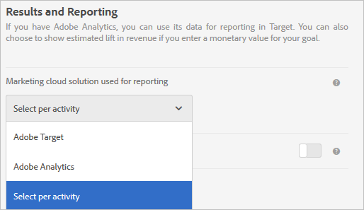

# Impostazioni delle attività - Domande frequenti su A4T

Questo argomento contiene le risposte alle domande più frequenti sulla configurazione delle attività e sull&#39;utilizzo di [!DNL Analytics] come origine per la generazione di rapporti per [!DNL Target] (A4T).

## Quali tipi di attività supportano [!DNL Analytics] come origine per la generazione di rapporti (A4T)? {#section_5E4F58CD25A5424E869E6FE0803968EF}

+++Risposta
Per un elenco completo, consulta “Tipi di attività supportati” in [Adobe Analytics come origine per la generazione di rapporti per Adobe Target (A4T)](/help/main/c-integrating-target-with-mac/a4t/a4t.md#concept_7540C8C04259434AB6EE33B09F47A1DE).

+++

## È possibile utilizzare lo stesso nome di attività per due attività da aree di lavoro separate quando si utilizza il reporting A4T?

+++Risposta

Non utilizzare lo stesso nome attività per due attività di [aree di lavoro](/help/main/administrating-target/c-user-management/property-channel/property-channel.md) separate che utilizzano la generazione di rapporti A4T.

Anche se questo è supportato quando si utilizza [!DNL Target] come origine per la generazione di rapporti, l&#39;utilizzo dello stesso nome di attività per due attività non è supportato quando si utilizza [!UICONTROL Analytics for Target] come origine per la generazione di rapporti.

+++

## Perché non posso accedere alle impostazioni avanzate durante la configurazione delle metriche obiettivo?

+++Risposta
Per le attività che utilizzano [!DNL Analytics] come origine per la generazione di rapporti (A4T), la metrica di obiettivo utilizza le impostazioni &quot;[!UICONTROL Incrementa il conteggio e mantieni l&#39;utente nell&#39;attività]&quot; e &quot;[!UICONTROL Su ogni impression]&quot;. Queste impostazioni sono *non* configurabili.

Per ulteriori informazioni, consulta &quot;Perché non posso accedere alle opzioni Impostazioni avanzate durante la configurazione delle metriche dell’obiettivo?&quot; in [Definizioni delle metriche - Domande frequenti su A4T](/help/main/c-integrating-target-with-mac/a4t/r-a4t-faq/a4t-faq-metric-definition.md).

+++

## Ho appena creato un’attività. Perché non vedo dati in arrivo? {#section_9F8092BE4225442896F926540292F221}

+++Risposta
Quando viene creata un&#39;attività, [!DNL Target] invia un file di classificazione a [!DNL Analytics]. Anche se [!DNL Analytics] sta acquisendo ed elaborando i dati, nei rapporti non viene visualizzato questo messaggio fino a quando il file di classificazione non viene aggiornato. Questo processo può richiedere da 24 a 72 ore. Se dopo 72 ore i dati non vengono visualizzati, [contatta l&#39;Assistenza clienti](/help/main/cmp-resources-and-contact-information.md#reference_ACA3391A00EF467B87930A450050077C). In alternativa, se sai di avviare un’attività, puoi crearla con qualche giorno di anticipo e le classificazioni vengono inviate quando l’attività viene salvata. e in questo modo al momento dell’avvio i dati potranno essere visualizzati nei rapporti. L&#39;elaborazione dei dati in [!DNL Analytics] richiede 45-90 minuti.

+++

## Perché non è possibile selezionare Analytics come origine per la generazione di rapporti quando si crea un&#39;attività? {#section_9F4F69C3085F4C2480AF439127EB27CD}

+++Risposta
È possibile modificare le [!UICONTROL Impostazioni report] opzioni in [!UICONTROL Amministrazione].

1. In [!DNL Target], fare clic su **[!UICONTROL Amministrazione]**.
1. Nell’elenco a discesa **[!UICONTROL Soluzione Experience Cloud utilizzata per i rapporti]**, fai clic su **[!UICONTROL Seleziona per attività]**.

L’elenco a discesa **[!UICONTROL Origine per i rapporti]** è abilitato nella schermata **[!UICONTROL Obiettivi e impostazioni]** per la creazione e la modifica delle attività.

Per utilizzare sempre [!DNL Analytics] come origine per la generazione di rapporti, selezionare **[!UICONTROL Adobe Analytics]** dall&#39;elenco a discesa in [!UICONTROL Amministrazione].

+++

## Un visitatore può passare da un’esperienza con targeting a un’esperienza controllata in visite diverse in un’attività di Targeting automatico che utilizza A4T?

+++Risposta
Quanto segue è vero supponendo che l’ID visitatore non cambi per un visitatore tra una visita e l’altra.

Se la percentuale di allocazione del traffico viene regolata a metà attività, è possibile che un visitatore possa passare da un’esperienza con targeting a un’esperienza di controllo.

Se le percentuali non vengono modificate nel corso dell’attività intermedia, il visitatore che inizialmente vede il controllo viene sempre inviato al controllo. Un visitatore inviato a esperienze con targeting viene sempre inviato a esperienze con targeting.

* Dopo essere stato nel &quot;bucket&quot; di traffico mirato, il visitatore può essere inviato a un’esperienza diversa da visita a visita se i modelli di apprendimento automatico determinano che un’esperienza diversa è rilevante per la nuova visita.
* Dopo essere stato assegnato al &quot;bucket&quot; di controllo del traffico, un visitatore vedrà sempre la stessa esperienza perché l’assegnazione dell’esperienza è basata su un hash pseudo-casuale deterministico dell’ID visitatore.

+++

## È possibile utilizzare una metrica binomiale [!DNL Analytics] con un segmento applicato come obiettivo di ottimizzazione in un&#39;attività [!UICONTROL Allocazione automatica]? {#binomial}

+++Risposta
Impossibile utilizzare una metrica [!DNL Analytics] con un segmento applicato come obiettivo di ottimizzazione in un&#39;attività [!UICONTROL Allocazione automatica]. Come soluzione alternativa puoi definire un evento personalizzato che raggiunge lo stesso obiettivo e utilizzarlo come metrica di obiettivo di ottimizzazione.

+++
