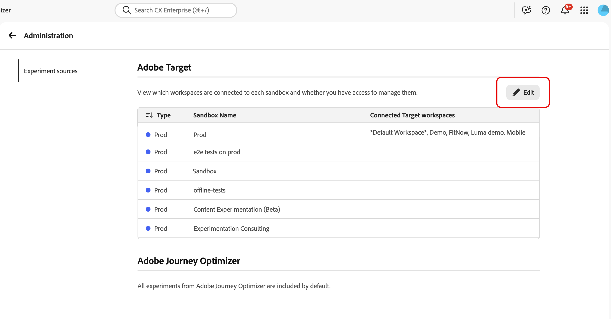

# Integrare [!DNL Target] con Experimentation Accelerator

Experimentation Accelerator consente agli amministratori di gestire come vengono organizzate e visualizzate nell&#39;applicazione le attività dell&#39;area di lavoro [!DNL Adobe Target]. Mappando ogni area di lavoro [!DNL Target] alla sandbox di Experimentation Accelerator appropriata, i team possono visualizzare gli esperimenti di [!DNL Adobe Target] e [!DNL Adobe Journey Optimizer] in un&#39;unica posizione.

➡️ [Ulteriori informazioni su Adobe Experimentation Accelerator](https://experienceleague.adobe.com/it/docs/experimentation-accelerator/using/overview)

## Prima di iniziare

Prima di impostare le assegnazioni della sandbox, verifica di disporre delle autorizzazioni necessarie. Per accedere a **[!UICONTROL Administration]** in Experimentation Accelerator, è necessario disporre dell&#39;autorizzazione **[!UICONTROL Manage configuration]**.

Gli utenti possono assegnare [!DNL Target] aree di lavoro alle sandbox solo quando sono soddisfatte entrambe le condizioni:

* L&#39;utente dispone dell&#39;autorizzazione **[!UICONTROL Manage configuration]** in Experimentation Accelerator.
* L&#39;utente è un amministratore di prodotto [!DNL Target].

## Configura assegnazione sandbox per [!DNL Target] aree di lavoro

Prima di assegnare le aree di lavoro, si noti che l&#39;area di lavoro [!DNL Target] può essere assegnata a una sola sandbox per evitare voci duplicate per lo stesso test.

Per scegliere la sandbox in cui viene visualizzata ogni area di lavoro [!DNL Target]:

1. In Experimentation Accelerator, apri **[!UICONTROL Administration]**.

   

1. Rivedi la tabella delle assegnazioni correnti da area di lavoro a sandbox di [!DNL Target].

   

1. Fare clic su **[!UICONTROL Edit]**.

   

1. Per ogni sandbox, assegna le [!DNL Target] aree di lavoro appropriate.

   

1. Fai clic su **[!UICONTROL Save]** per applicare le modifiche.

Dopo aver creato la connessione iniziale per un&#39;area di lavoro [!DNL Target], attendere fino a 30 minuti per consentire la propagazione degli aggiornamenti nel sistema.
