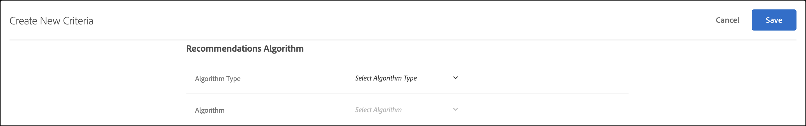

# Creare criteri

I criteri in [!UICONTROL Adobe Target] [!UICONTROL Recommendations] controllano il contenuto delle attività di [!UICONTROL Recommendations]. Crea dei criteri per visualizzare i consigli più appropriati per l’attività. Questi criteri utilizzano le azioni del visitatore per determinare quale contenuto o prodotti visualizzare.

Nelle sezioni seguenti viene illustrato come creare un nuovo criterio.

## Accedere alla schermata Crea nuovo criterio

Sono disponibili diversi modi per raggiungere la schermata [!UICONTROL Create New Criteria]. Alcune opzioni dipendono dal modo in cui si raggiunge la schermata.

* Nella schermata della libreria **[!UICONTROL Recommendations]** > **[!UICONTROL Criteria]**, fare clic su **[!UICONTROL Create Criteria]** > **[!UICONTROL Create Criteria]**. I criteri creati vengono automaticamente resi disponibili per tutte le attività di [!DNL Recommendations].
* Quando crei un&#39;attività [!DNL Recommendations] utilizzando [!UICONTROL Visual Experience Composer] (VEC), vieni immediatamente reindirizzato alla schermata [!UICONTROL Select Criteria] dopo aver selezionato un elemento nella pagina e aver fatto clic su [!UICONTROL Replace w/ Recommendations], [!UICONTROL Insert Recommendations Before] o [!UICONTROL Insert Recommendations After]. È quindi possibile selezionare un criterio disponibile oppure fare clic su **[!UICONTROL Create Criteria]**. Se si crea un nuovo criterio, è possibile salvarlo per utilizzarlo con altre attività di [!DNL Recommendations]. Per ulteriori informazioni, vedere [Creare un&#39;attività Recommendations](/help/main/c-recommendations/t-create-recs-activity/create-recs-activity.md).
* Quando modifichi un&#39;attività di [!DNL Recommendations], fai clic su una casella di [!UICONTROL Recommendations Location] nella pagina e seleziona **[!UICONTROL Change Criteria]**. Nella schermata [!UICONTROL Select Criteria], fare clic su **[!UICONTROL Create Criteria]**. Sarà possibile salvare i nuovi criteri da utilizzare per altre attività di [!DNL Recommendations].

Nei passaggi seguenti si presuppone che si acceda alla schermata [!UICONTROL Create New Criteria] utilizzando il primo metodo: la schermata della libreria **[!UICONTROL Recommendations]** > **[!UICONTROL Criteria]**.

1. Fare clic su **[!UICONTROL Recommendations]** > **[!UICONTROL Criteria]**.

1. Fare clic su **[!UICONTROL Create Criteria]** > **[!UICONTROL Create Criteria]**.

1. Configura le informazioni nelle sezioni seguenti.

## [!UICONTROL Basic Information] {#info}

1. Digitare **[!UICONTROL Criteria Name]**.

   Si tratta del nome “interno” usato per descrivere i criteri. Ad esempio, potresti voler chiamare i tuoi criteri “prodotti di margine più alto”, ma non vuoi che questo titolo venga visualizzato pubblicamente. Vedi il passo successivo per impostare il titolo visualizzato dal pubblico.

1. Digitare un **[!UICONTROL Display Title]** rivolto al pubblico da visualizzare nella pagina per i consigli che utilizzano questo criterio.

   Ad esempio, potresti voler visualizzare “Le persone che hanno visto questo, hanno visto anche” o “Prodotti simili”, quando utilizzi questo criterio per mostrare i consigli.

1. Digitare un breve **[!UICONTROL Description]** dei criteri.

   La descrizione deve consentire di identificare i criteri e può includere informazioni sullo scopo dei criteri.

1. Seleziona un settore verticale in base agli obiettivi dell’attività di Consigli.

   | Settore verticale | Obiettivo |
   |--- |--- |
   | [!UICONTROL Retail/Ecommerce] | Conversione con conseguente acquisto |
   | [!UICONTROL Lead Generation/B2B/Financial Services] | Conversione senza acquisto |
   | [!UICONTROL Media/Publishing] | Coinvolgimento |

   Altre opzioni di criteri cambiano in base al settore verticale selezionato.

1. Seleziona **[!UICONTROL Page Type]**.

   Puoi selezionare più tipi di pagina.

   Insieme, i tipi di pagina e verticali del settore consentono di categorizzare i criteri salvati, semplificandone il riutilizzo per altre attività di [!DNL Recommendations].

## [!UICONTROL Recommendations Algorithm] {#rec-algo}

1. Selezionare un **[!UICONTROL Algorithm Type]** e un **[!UICONTROL Algorithm]**:

   

   | Tipo di algoritmo | Quando utilizzare / Algoritmi disponibili |
   | --- | --- |
   | [!UICONTROL Cart-Based] | Creare consigli in base al contenuto del carrello dell’utente. <ul><li>[!UICONTROL People Who Viewed These, Also Viewed] </li><li>[!UICONTROL People Who Viewed These, Also Bought]</li><li>[!UICONTROL People Who Bought These, Also Bought]</li></ul> |
   | [!UICONTROL Popularity-Based] | Puoi formulare raccomandazioni in base alla popolarità complessiva di un elemento nel tuo sito o in base alla popolarità degli elementi nella categoria, nel brand, nel genere e così via preferiti o più visualizzati di un utente. <ul><li>[!UICONTROL Most Viewed Across the Site]</li><li>[!UICONTROL Most Viewed by Category]</li><li>[!UICONTROL Most Viewed by Item Attribute]</li><li>[!UICONTROL Top Sellers Across the Site]</li><li>[!UICONTROL Top Sellers by Category]</li><li>[!UICONTROL Top Sellers by Item Attribute]</li><li>[!UICONTROL Top by Analytics Metric]</li></ul> |
   | [!UICONTROL Item-Based] | Creare consigli in base alla ricerca di elementi simili a quelli di un elemento attualmente visualizzato dall’utente o che è stato recentemente visualizzato. <ul><li>[!UICONTROL People Who Viewed This, Viewed That]</li><li>[!UICONTROL People Who Viewed This, Bought That]</li><li>[!UICONTROL People Who Bought This, Bought That]</li><li>[!UICONTROL Items with Similar Attributes]</li></ul> |
   | [!UICONTROL User-Based] | Creare consigli in base al comportamento dell’utente. | <ul><li>[!UICONTROL Recently Viewed Items]</li><li>[!UICONTROL Recommended for You]</li></ul> |
   | [!UICONTROL Custom Criteria] | Formulare raccomandazioni in base a un file personalizzato caricato. | <ul><li>Algoritmo personalizzato</li></ul> |

   >[!NOTE]
   >
   >Se si seleziona **[!UICONTROL Items]**/ **[!UICONTROL Media with Similar Attributes]**, sarà possibile impostare [regole di somiglianza contenuto](#similarity).

1. Come richiesto, selezionare un attributo **Item** e un attributo **Profile da abbinare**, una **Chiave Recommendation**, **Chiave filtro** e/o **Metrica Analytics** per configurare l&#39;algoritmo.

Le altre opzioni di configurazione dell’algoritmo variano a seconda dell’algoritmo selezionato. Per completare la configurazione dell&#39;algoritmo, selezionare [!UICONTROL Recommendation Key], [!UICONTROL Filtering Key], [!UICONTROL Co-Occurrence Basis], [!UICONTROL Analytics Metric] e/o [!UICONTROL Item Attribute] e [!UICONTROL Profile Attribute to Match].

Per ulteriori informazioni sulla scelta di un [!UICONTROL Recommendation Key], vedere [Basare il consiglio su una chiave consiglio](/help/main/c-recommendations/c-algorithms/base-the-recommendation-on-a-recommendation-key.md).

## [!UICONTROL Data Source] {#data-source}

1. Selezionare il **[!UICONTROL Behavioral Data Source]** desiderato: [!UICONTROL Adobe Target] o [!UICONTROL Analytics].

   >[!NOTE]
   >
   >La sezione [!UICONTROL Behavioral Data Source] viene visualizzata solo se l&#39;implementazione utilizza [Analytics for Target](/help/main/c-integrating-target-with-mac/a4t/a4t.md) (A4T).

   

   Se si sceglie [!UICONTROL Analytics], selezionare la suite di rapporti desiderata.

   Se il criterio utilizza [!DNL Adobe Analytics] come origine dei dati comportamentali, una volta creato, il tempo per la disponibilità del criterio dipende dal fatto che la suite di rapporti e l&#39;intervallo di lookback selezionati siano stati utilizzati o meno per altri criteri, come spiegato di seguito:

   * **Configurazione una tantum della suite di rapporti**: la prima volta che una suite di rapporti viene utilizzata con una specifica finestra di lookback dei dati, [!DNL Target Recommendations] può richiedere da due a sette giorni per scaricare completamente i dati comportamentali della suite di rapporti selezionata da [!DNL Analytics]. Questo intervallo di tempo dipende dal caricamento del sistema [!DNL Analytics].
   * **Criteri nuovi o modificati che utilizzano una suite di rapporti già disponibile**: se crei un nuovo criterio o ne modifichi uno esistente e la suite di rapporti selezionata è già utilizzata per [!DNL Target Recommendations] con un intervallo di dati uguale o inferiore a quello selezionato, i dati diventano subito disponibili e non è richiesta alcuna configurazione una tantum. In questo caso, oppure se le impostazioni di un algoritmo vengono modificate senza che si modifichi la suite di rapporti o l’intervallo di dati selezionato, l’algoritmo viene eseguito o rieseguito entro 12 ore.
   * **Viene eseguito un algoritmo continuo**: i dati scorrono da [!DNL Analytics] a [!DNL Target Recommendations] su base giornaliera. Ad esempio, per il consiglio [!UICONTROL Viewed Affinity], quando un utente visualizza un prodotto, a [!DNL Analytics] viene passata una chiamata di tracciamento per la visualizzazione del prodotto quasi in tempo reale. I dati [!DNL Analytics] vengono inviati a [!DNL Target] all’inizio del giorno successivo e [!DNL Target] esegue l’algoritmo in meno di 12 ore.

   Per ulteriori informazioni, vedere [Utilizzare Adobe Analytics con Target Recommendations](/help/main/c-recommendations/c-algorithms/use-adobe-analytics-with-recommendations.md).

1. Imposta **[!UICONTROL Lookback Window]** per determinare l&#39;intervallo di tempo dei dati cronologici disponibili sul comportamento dell&#39;utente da utilizzare per determinare quali consigli visualizzare. Questa opzione è disponibile per tutti gli algoritmi ad eccezione di [!UICONTROL Items with Similar Attributes] e [!UICONTROL Custom Algorithms].

   

   Se il sito genera molto traffico e i comportamenti si modificano spesso, scegli una finestra dati più breve. Una finestra più breve consente a [!DNL Recommendations] di essere più reattivo alle modifiche all’interno del mercato e della tua attività. Ad esempio, una finestra più breve implica che [!DNL Recommendations] rileverà le modifiche nel comportamento dei visitatori quando questi iniziano lo shopping stagionale, ad esempio quello natalizio o per il rientro a scuola, raccomandando gli articoli appropriati.

   In presenza di un volume limitato di dati, o se il comportamento dei visitatori non si modifica di frequente, puoi selezionare una finestra più ampia. Tuttavia, per molti siti, una finestra più breve genera consigli di qualità superiore.

   Gli intervalli di dati disponibili sono:

   | Opzione finestra di lookback | Frequenza aggiornata (visualizzata al passaggio del mouse) | Algoritmi supportati |
   | --- | --- | --- |
   | Sei ore | L’algoritmo viene eseguito ogni 3-6 ore | [!UICONTROL Popularity-Based] algoritmi quando il [!UICONTROL Behavioral Data Source] selezionato è [!DNL Adobe Target] |
   | Un giorno | L’algoritmo viene eseguito ogni 12-24 ore | [!UICONTROL Popularity-Based] algoritmi |
   | Due giorni | L’algoritmo viene eseguito ogni 12-24 ore | <ul><li>[!UICONTROL Popularity-Based] algoritmi</li><li>[!UICONTROL Item-Based] algoritmi</li><li>[!UICONTROL User-Based] algoritmi</li><li>[!UICONTROL Cart-Based] algoritmi</li></ul> |
   | Una settimana | L’algoritmo viene eseguito ogni 24-48 ore | <ul><li>[!UICONTROL Popularity-Based] algoritmi</li><li>[!UICONTROL Item-Based] algoritmi</li><li>[!UICONTROL User-Based] algoritmi</li><li>[!UICONTROL Cart-Based] algoritmi</li></ul> |
   | Due settimane | L’algoritmo viene eseguito ogni 24-48 ore | <ul><li>[!UICONTROL Popularity-Based] algoritmi</li><li>[!UICONTROL Item-Based] algoritmi</li><li>Tutti gli algoritmi [!UICONTROL User-Based]</li><li>[!UICONTROL Cart-Based] algoritmi</li></ul> |
   | Un mese (30 giorni) | L’algoritmo viene eseguito ogni 24-48 ore | <ul><li>[!UICONTROL Popularity-Based] algoritmi</li><li>[!UICONTROL Item-Based] algoritmi</li><li>[!UICONTROL User-Based] algoritmi</li><li>[!UICONTROL Cart-Based] algoritmi</li></ul> |
   | Due mesi (61 giorni) | L’algoritmo viene eseguito ogni 24-48 ore | <ul><li>[!UICONTROL Popularity-Based] algoritmi</li><li>[!UICONTROL Item-Based] algoritmi</li><li>[!UICONTROL User-Based] algoritmi</li><li>[!UICONTROL Cart-Based] algoritmi</li></ul> |

## [!UICONTROL Backup Content] {#content}

Le regole di [!UICONTROL Backup Content] determinano ciò che accade se il numero di elementi consigliati non riempie la [progettazione dei consigli](/help/main/c-recommendations/c-design-overview/design-overview.md). È possibile che il criterio [!DNL Recommendations] restituisca un numero di consigli inferiore a quello richiesto dalla progettazione. Ad esempio, se la progettazione dispone di slot per quattro elementi, ma in base ai criteri ne vengono consigliati solo due, puoi lasciare vuoti gli slot rimanenti, utilizzare i consigli di backup per riempire gli slot aggiuntivi oppure scegliere di non visualizzare alcun consiglio.

1. (Facoltativo) Far scorrere l&#39;interruttore **[!UICONTROL Partial Design Rendering]** in posizione &quot;on&quot;.

   Il maggior numero possibile di slot verrà riempito, ma il modello di progettazione potrebbe includere uno spazio vuoto per gli slot rimanenti. Se questa opzione è disabilitata e il contenuto non è sufficiente per riempire tutti gli slot disponibili, i consigli non vengono trasmessi e viene visualizzato il contenuto predefinito.

   Abilita questa opzione se desideri che i consigli vengano forniti con slot vuoti. Utilizza i consigli di backup se desideri che gli slot di consigli siano compilati con contenuto basato sui criteri con slot vuoti riempiti con contenuto simile o popolare dal sito, come spiegato nel passaggio successivo.

1. (Facoltativo) Far scorrere l&#39;interruttore **[!UICONTROL Show Backup Content]** in posizione &quot;on&quot;.

   Riempi gli eventuali slot vuoti rimanenti nella progettazione con una selezione casuale dei prodotti più visualizzati dall&#39;intero sito.

   L’utilizzo dei consigli di backup assicura che la progettazione dei consigli riempia tutti gli slot disponibili. Supponiamo di avere un design 4 x 1, come illustrato di seguito:

   

   Supponiamo che il criterio determini solo due articoli da consigliare. Se si abilita l&#39;opzione [!UICONTROL Partial Design Rendering], i primi due slot vengono riempiti, ma i due slot rimanenti rimangono vuoti. Tuttavia, se si abilita l&#39;opzione [!UICONTROL Show Backup Recommendations], i primi due slot vengono riempiti in base ai criteri specificati e gli altri due vengono riempiti in base ai suggerimenti di backup.

   La matrice seguente mostra il risultato che si osserverà quando si utilizzano le opzioni [!UICONTROL Partial Design Rendering] e [!UICONTROL Backup Content]:

   | Rendering parziale della progettazione | Contenuto di backup | Risultato |
   |--- |--- |--- |
   | Disabilitato | Disabilitato | Se vengono restituiti meno consigli rispetto alle richieste di progettazione, la progettazione dei consigli viene sostituita dal contenuto predefinito e non vengono visualizzate indicazioni. |
   | Abilitato | Disabilitato | La progettazione viene sottoposta a rendering, ma può includere spazio vuoto se vengono restituite meno consigli rispetto al numero richiesto dalla progettazione. |
   | Abilitato | Abilitato | I consigli di backup riempiranno le “posizioni” disponibili della progettazione, eseguendone il rendering completo. Se l&#39;applicazione di regole di inclusione ai consigli di backup limita il numero di quelle qualificate al punto che la progettazione non può essere riempita, la progettazione viene parzialmente sottoposta a rendering. Se i criteri non restituiscono alcun consiglio e le regole di inclusione limitano i consigli di backup a zero, la progettazione viene sostituita con il contenuto predefinito. |
   | Disabilitato | Abilitato | I consigli di backup riempiranno le “posizioni” disponibili della progettazione, eseguendone il rendering completo. Se l&#39;applicazione di regole di inclusione limita il numero di consigli di backup qualificate al punto che la progettazione non può essere riempita, la progettazione viene sostituita dal contenuto predefinito e non vengono visualizzati consigli. |

   Per ulteriori informazioni, vedere [Utilizzare un consiglio di backup](/help/main/c-recommendations/c-algorithms/backup-recs.md).

1. (Condizionale) Se hai selezionato **[!UICONTROL Show Backup Content]** nel passaggio precedente, puoi abilitare **[!UICONTROL Apply inclusion rules to backup recommendations]**.

   Le regole di inclusione determinano quali elementi sono inclusi nei consigli. Le opzioni disponibili dipendono dal tuo settore verticale.

   Per ulteriori dettagli, vedere [Specificare le regole di inclusione](#inclusion) di seguito.

## Somiglianza del contenuto {#similarity}

Utilizza le regole [!UICONTROL Content Similarity] per creare consigli in base agli attributi dell&#39;elemento o dei file multimediali.

>[!NOTE]
>
>Se hai selezionato **[!UICONTROL Item-Based]**/ **[!UICONTROL Media with Similar Attributes]** come [!UICONTROL Algorithm Type] e [!UICONTROL Algorithm], puoi impostare le regole di somiglianza del contenuto.

Le regole di somiglianza del contenuto confrontano le parole chiave dell&#39;attributo dell&#39;elemento e formulano consigli basati su quante parole chiave hanno in comune diversi elementi. I consigli basati sulla somiglianza del contenuto non richiedono dati precedenti per fornire risultati significativi.

L&#39;utilizzo di somiglianze di contenuto per generare consigli è particolarmente efficace per i nuovi elementi, che è improbabile vengano visualizzati nei consigli utilizzando *Persone che hanno visualizzato questo, anche visualizzato* e altra logica basata sul comportamento passato. È inoltre possibile utilizzare la somiglianza del contenuto per generare consigli utili per i nuovi visitatori, che non hanno effettuato acquisti in precedenza o non possiedono altri dati storici.

Quando selezioni **[!UICONTROL Item-Based]**/ **[!UICONTROL Media with Similar Attributes]**, puoi creare regole per aumentare o diminuire l&#39;importanza degli attributi di elementi specifici nella determinazione dei consigli. Per gli articoli quali i libri, si potrebbe voler aumentare l&#39;importanza di attributi come *genere*, *autore*, *serie*, e così via, per consigliare libri simili.

Poiché la somiglianza del contenuto utilizza parole chiave per confrontare elementi, alcuni attributi, ad esempio *messaggio* o *descrizione*, possono introdurre “rumore” nel confronto. È possibile creare regole per ignorare questi attributi.

Per impostazione predefinita, tutti gli attributi sono impostati su *Riferimento*. Non è necessario creare una regola a meno che non si desideri modificare questa impostazione.

>[!NOTE]
>
>L’algoritmo di somiglianza dei contenuti potrebbe utilizzare il campionamento casuale nel calcolo della somiglianza tra gli elementi. Di conseguenza, le valutazioni della similarità tra gli elementi potrebbero variare tra le esecuzioni dell’algoritmo.

## Regole di inclusione {#inclusion}

Varie opzioni consentono di limitare gli articoli visualizzati nei consigli. Puoi utilizzare le regole di inclusione durante la creazione di criteri o promozioni.

Le regole di inclusione sono facoltative. Tuttavia, l&#39;impostazione di questi dettagli consente un maggiore controllo sugli elementi visualizzati nei consigli. Ogni dettaglio configurato restringe ulteriormente i criteri di visualizzazione.

Ad esempio, è possibile scegliere di visualizzare solo le scarpe da donna con una disponibilità di oltre 50 pezzi e un prezzo tra 25 $ e 45 $. È anche possibile ponderare ogni attributo in modo che la probabilità di comparire sia maggiore per gli elementi più importanti per la tua attività.

Per fornire un altro esempio, puoi scegliere di mostrare le posizioni di lavoro disponibili ai visitatori che accedono al sito soltanto da determinate città e che possiedono i titoli universitari richiesti.

Le opzioni di regola di inclusione variano secondo il settore verticale. Per impostazione predefinita, le regole di inclusione vengono applicate ai consigli di backup.

>[!IMPORTANT]
>
>È consigliabile utilizzare le regole di inclusione con cautela. Questi criteri sono utili se, ad esempio, all&#39;interno dell&#39;organizzazione sono utilizzate regole che richiedano di evitare la visualizzazione di un marchio quando ne viene visualizzato un altro. Tuttavia, questa funzione comporta un costo opportunità. Potresti perdere una percentuale di incremento limitando la visualizzazione di alcuni elementi che verrebbero visualizzati normalmente in base ai criteri dell&#39;attività.

Le regole di inclusione sono unite con l&#39;operatore “AND” (E). Gli articoli verranno inclusi in un consiglio solo se vengono soddisfatte tutte le regole.

Per creare una semplice regola di inclusione, come accennato in precedenza, per visualizzare solo le scarpe da donna con una disponibilità di oltre 50 pezzi e un prezzo tra 25 $ e 45 $, attieniti alla seguente procedura:

1. (Condizionale) Far scorrere l&#39;interruttore **[!UICONTROL Allow recently purchased items to be recommended?]** in posizione &quot;on&quot;.

   Questa impostazione è basata su `productPurchasedId`. Il comportamento predefinito è quello di sconsigliare gli articoli acquistati in precedenza. Nella maggior parte dei casi non si desidera promuovere articoli che un cliente ha recentemente acquistato. È utile se si vendono oggetti che le persone solitamente acquistano una sola volta, ad esempio nel caso di un kayak. Se vendi oggetti che le persone tornano ad acquistare di nuovo su base ripetuta, come shampoo o altri oggetti personali, devi abilitare questa opzione.

1. Imposta la fascia di prezzo per i prodotti da consigliare.
1. Imposta la quantità di disponibilità minima i prodotti da consigliare.
1. Configura il consiglio perché mostri gli articoli solo quando sono soddisfatti determinati criteri.

   Puoi specificare che gli articoli siano inclusi solo quando uno degli attributi nell&#39;elenco viene soddisfatto o non corrisponde a uno o più condizioni specificate.

   I valutatori disponibili dipendono dal valore scelto nel primo elenco a discesa. È possibile elencare più elementi. Questi elementi sono valutati con l&#39;operatore “OR”.

   Più regole sono collegate tra loro mediante l&#39;operatore “AND” (E).

   >[!NOTE]
   >
   >Questa opzione limita gli elementi visualizzati nel consiglio. Non interessa le pagine in cui viene visualizzato il consiglio. Per limitare le posizioni di visualizzazione per il consiglio, seleziona le pagine in Compositore esperienza.

Per ulteriori informazioni, vedere [Utilizzare regole di inclusione dinamiche e statiche](/help/main/c-recommendations/c-algorithms/use-dynamic-and-static-inclusion-rules.md).

## Ponderazione degli attributi {#weighting}

Puoi aggiungere più regole per &quot;indirizzare&quot; l’algoritmo in base a informazioni o metadati importanti sul catalogo dei contenuti, in modo che sia più probabile visualizzare alcuni elementi.

Ad esempio, puoi applicare una ponderazione più elevata agli articoli in offerta in modo che vengano visualizzati più spesso nel consiglio. Gli articoli non in offerta non vengono esclusi del tutto, ma sono visualizzati con minore frequenza. È possibile applicare più attributi di ponderazione allo stesso algoritmo, e sottoporli a test con traffico suddiviso nel consiglio.

1. Scegli un valore.

   Il valore determina il tipo di elemento che è più probabile visualizzare, in base a uno dei diversi criteri disponibili.

1. Scegli un valutatore.

1. Inserisci la parola chiave per completare gli attributi della regola.

   Ad esempio, la regola completa potrebbe essere &quot;La categoria contiene scarpe di sottostringa&quot;.

1. Selezionare il peso da assegnare alla regola.

   Le opzioni variano da 0 a 100 con incrementi di 25.

1. Se desiderato, aggiungi ulteriori regole.

Al termine, fare clic su **[!UICONTROL Create]**.

Se si sta creando una nuova attività [!UICONTROL Recommendations] o ne si sta modificando una esistente, la casella di controllo **[!UICONTROL Save criteria for later]** è selezionata per impostazione predefinita. Se non desideri utilizzare i criteri in altre attività, deseleziona la casella di controllo prima di salvarla.
