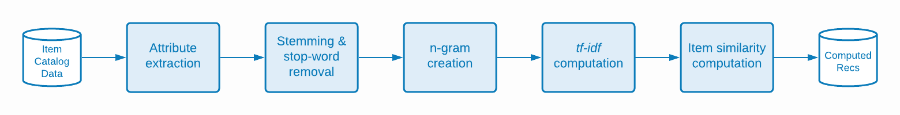

# La scienza alla base degli algoritmi di Recommendations di Target

Descrizione dettagliata degli algoritmi utilizzati in [!DNL Adobe Target Recommendations], inclusi i dettagli logici e matematici dell&#39;apprendimento dei modelli e del processo di modellazione.

L&#39;apprendimento del modello è il processo di generazione dei consigli da parte degli algoritmi di apprendimento [!DNL Adobe Target]. Model serving è il modo in cui [!DNL Target] fornisce consigli ai visitatori del tuo sito (noto anche come distribuzione di contenuti).

[!DNL Target] include i seguenti tipi di algoritmi in [!DNL Recommendations]:

* **Algoritmi basati su elementi**: includono gli algoritmi che seguono la logica &quot;Chi ha visualizzato/acquistato questo elemento ha anche visualizzato/acquistato questi elementi&quot;. Questi algoritmi sono raggruppati sotto il termine generale filtro collaborativo elemento-elemento e gli algoritmi [!UICONTROL Items with Similar Attributes].

* **Algoritmi basati sull&#39;utente**: includere gli algoritmi [!UICONTROL Recently Viewed] e [!UICONTROL Recommended for You].

* **Algoritmi basati sulla popolarità**: includono gli algoritmi che restituiscono gli articoli più visualizzati o acquistati in tutto il sito Web oppure più visualizzati o acquistati per categoria o attributo di articolo.

* **Algoritmi basati sul carrello**: include consigli basati su più elementi con la logica &quot;persone che hanno visualizzato/acquistato questi elementi, hanno anche visualizzato/acquistato tali elementi&quot;.

* **Criteri personalizzati**: include consigli basati su file personalizzati caricati in [!DNL Target].

>[!NOTE]
>
>Per informazioni più generali su ciascun tipo di algoritmo e sui singoli algoritmi, vedere [Basare il consiglio su una chiave di consiglio](/help/main/c-recommendations/c-algorithms/base-the-recommendation-on-a-recommendation-key.md).

Molti degli algoritmi elencati sopra sono basati sulla presenza di una o più chiavi. Queste chiavi vengono utilizzate per recuperare elementi simili al momento della consegna del contenuto (quando vengono creati i consigli). Le chiavi specificate dal cliente possono includere l’articolo corrente che un utente sta visualizzando, l’ultimo articolo visualizzato o acquistato, l’articolo più visualizzato, la categoria corrente o la categoria preferita per quel visitatore. Altri algoritmi, come i consigli basati su carrello o su utente, utilizzano chiavi implicite (che il cliente non può configurare). Per ulteriori informazioni, vedere *Chiavi consiglio*, in [Basare il consiglio su una chiave consiglio](/help/main/c-recommendations/c-algorithms/base-the-recommendation-on-a-recommendation-key.md#keys). Tieni presente, tuttavia, che queste chiavi sono rilevanti solo al momento della distribuzione del modello (consegna dei contenuti). Queste chiavi non influiscono sulla logica dei tempi di apprendimento &quot;offline&quot; o del modello.

Le sezioni seguenti raggruppano gli algoritmi in modo leggermente diverso rispetto ai tipi di algoritmo descritti in precedenza. Il seguente raggruppamento si basa sulla somiglianza della logica di apprendimento del modello.

## Filtro collaborativo elemento-elemento

Gli algoritmi includono:

* [!UICONTROL People Who Viewed This, Viewed That]
* [!UICONTROL People Who Viewed This, Bought That]
* [!UICONTROL People Who Bought This, Bought That]

Gli algoritmi per la generazione di consigli con filtro collaborativo elemento-elemento si basano sull’idea che si debbano utilizzare i modelli comportamentali di molti utenti (quindi collaborativi) per fornire consigli utili per un dato elemento (ad esempio, filtrare il catalogo di possibili elementi da consigliare). Anche se esistono molti algoritmi diversi che rientrano nell&#39;ombrello generale del [filtro collaborativo](https://en.wikipedia.org/wiki/Collaborative_filtering), questi algoritmi utilizzano universalmente origini di dati comportamentali come input. In [!DNL Target Recommendations], questi input sono le visualizzazioni e gli acquisti univoci di elementi da parte degli utenti.

Per l’algoritmo &quot;chi ha visualizzato/acquistato questo articolo ha anche visualizzato/acquistato questi articoli&quot;, l’obiettivo è calcolare una somiglianza s(A,B) tra tutte le coppie di articoli. Per un dato articolo A, i consigli principali sono quindi ordinati in base alle somiglianze (A,B).

Un esempio di tale somiglianza è la co-occorrenza tra gli articoli: un conteggio semplice del numero di utenti che hanno acquistato entrambi gli articoli. Anche se intuitiva, tale metrica è ingenua in quanto tende a consigliare articoli popolari. Ad esempio, se in un retailer alimentare la maggior parte delle persone acquista il pane, il pane avrà un&#39;elevata co-occorrenza con tutti gli articoli, ma non è necessariamente una buona raccomandazione. [!DNL Target] utilizza invece una metrica di somiglianza più sofisticata nota come log likelihood ratio (LLR). Questa quantità è grande quando la probabilità che due articoli, A e B, si verifichino contemporaneamente è molto diversa dalla probabilità che non si verifichino contemporaneamente. Per maggiore concretezza, considera un caso dell&#39;algoritmo [!UICONTROL People Who Viewed This, Bought That]. La somiglianza LLR è grande quando la probabilità che B sia stato acquistato è *non* indipendentemente dal fatto che qualcuno abbia visualizzato A.

Ad esempio, se

l&#39;elemento B non deve essere consigliato con l&#39;elemento A. I dettagli completi di questo calcolo di somiglianza delle proporzioni di probabilità del registro sono forniti [in questo PDF](/help/main/c-recommendations/c-algorithms/assets/log-likelihood-ratios-recommendation-algorithms.pdf).

Il flusso logico dell’implementazione effettiva dell’algoritmo è mostrato nel diagramma schematico seguente:

Di seguito sono riportati i dettagli di questi passaggi:

* **Dati di input**: dati comportamentali, sotto forma di visualizzazioni e acquisti di visitatori raccolti quando [implementi Target](https://experienceleague.adobe.com/docs/target-dev/developer/recommendations.html){target=_blank} o da [Adobe Analytics](/help/main/c-recommendations/c-algorithms/use-adobe-analytics-with-recommendations.md){target=_blank}.

* **Apprendimento del modello**:

   * **Pulizia e campionamento dei dati**: per gli algoritmi con un lookback di N giorni, i dati comportamentali vengono prima filtrati per includere solo tali N giorni di dati. Le regole di raccolta e le esclusioni globali vengono quindi applicate per rimuovere tutti gli elementi che non devono essere consigliati. Infine, per i visitatori che hanno interagito con più di 1.000 elementi, i dati di utilizzo sono stati campionati in soli 1.000 elementi.
   * **Calcolo della somiglianza tra elementi**: questo è il passaggio di calcolo principale: calcolo della somiglianza del rapporto di probabilità del registro tra tutte le coppie di elementi candidati e classificazione delle coppie di elementi in base a questo punteggio di somiglianza.
   * **Filtro non in linea**: verranno infine applicati eventuali altri filtri dinamici applicabili (ad esempio, esclusioni di categorie dinamiche). Dopo questo passaggio, i consigli precalcolati vengono memorizzati nella cache a livello globale per essere disponibili per il servizio.

* **Server modelli**: il contenuto dei consigli viene distribuito dalla [!DNL Target]rete &quot;Edge&quot; globale di [&#128279;](/help/main/c-intro/how-target-works.md#concept_0AE2ED8E9DE64288A8B30FCBF1040934). Quando vengono effettuate richieste mbox a [!DNL Target] e viene determinato che il contenuto dei consigli deve essere recapitato alla pagina, la richiesta della [chiave elemento](/help/main/c-recommendations/c-algorithms/base-the-recommendation-on-a-recommendation-key.md#keys) appropriata per l&#39;algoritmo dei consigli viene analizzata dalla richiesta o cercata dal profilo utente, e quindi utilizzata per recuperare i consigli calcolati nei passaggi precedenti. Ulteriori filtri dinamici vengono applicati in questo momento, prima che venga eseguito il rendering della [progettazione](/help/main/c-recommendations/c-design-overview/create-design.md) appropriata.

## Somiglianza dei contenuti

Algoritmo incluso:

* [!UICONTROL Items with Similar Attributes]

In questo tipo di algoritmo, due elementi sono considerati correlati se i loro nomi e le descrizioni testuali sono semanticamente simili. A differenza della maggior parte degli algoritmi di consigli in cui devono essere utilizzate origini di dati comportamentali, gli algoritmi di somiglianza dei contenuti utilizzano metadati dei cataloghi di prodotti per derivare la somiglianza tra gli elementi. [!DNL Target] è quindi in grado di gestire i consigli in scenari cosiddetti &quot;cold-start&quot;, in cui non sono stati raccolti dati comportamentali (ad esempio, all&#39;inizio di un&#39;attività [!DNL Target]).

Sebbene gli aspetti relativi alla distribuzione dei modelli e dei contenuti degli algoritmi di somiglianza dei contenuti di [!DNL Target] siano identici ad altri algoritmi basati su elementi, i passaggi di formazione dei modelli sono notevolmente diversi e implicano una serie di passaggi di elaborazione e pre-elaborazione del linguaggio naturale, come illustrato nel diagramma seguente. Il nucleo del calcolo della somiglianza è l&#39;uso della somiglianza coseno dei vettori tf-idf modificati che rappresentano ogni elemento del catalogo.

Di seguito sono riportati i dettagli di questi passaggi:

* **Dati di input**: come descritto in precedenza, questo algoritmo si basa esclusivamente sui dati del catalogo (acquisiti in [!DNL Target] tramite un [Feed catalogo, l&#39;API delle entità o dagli aggiornamenti nella pagina](https://experienceleague.adobe.com/docs/target-dev/developer/recommendations.html){target=_blank}.

* **Apprendimento del modello**:

   * **Estrazione attributo**: dopo l&#39;applicazione di normali filtri statici, regole di catalogo ed esclusioni globali, questo algoritmo estrae i campi testuali pertinenti dallo schema di entità. [!DNL Target] utilizza automaticamente i campi nome, messaggio e categoria dagli attributi di entità e tenta di estrarre qualsiasi campo stringa dagli [attributi di entità](/help/main/c-recommendations/c-products/entity-attributes.md) personalizzati. Questo processo viene eseguito assicurandosi che la maggior parte dei valori per quel campo non sia analizzabile come numero, data o booleano.
   * **Rimozione stemming e stop-word**: per una corrispondenza più precisa della somiglianza del testo, è prudente rimuovere le parole &quot;stop&quot; molto comuni che non alterano in modo significativo il significato di un elemento (ad esempio, &quot;was&quot;, &quot;is&quot;, &quot;and&quot; e così via). Allo stesso modo, il termine stemming si riferisce al processo di riduzione delle parole con suffissi diversi alla loro parola principale, che ha un significato identico (ad esempio, &quot;connect&quot;, &quot;connect&quot; e &quot;connection&quot; hanno tutti la stessa parola principale: &quot;connect&quot;). [!DNL Target] utilizza lo stemmer Snowball. [!DNL Target] esegue prima il rilevamento automatico della lingua e può interrompere la rimozione delle parole per un massimo di 50 lingue e la creazione di stemming per 18 lingue.
   * Creazione di **n grammi**: dopo i passaggi precedenti, ogni parola viene considerata come un token. Il processo di combinazione di sequenze contigue di token in un singolo token è definito creazione di n grammi. Gli algoritmi di [!DNL Target] considerano fino a 2 grammi.
   * **calcolo tf-idf**: il passaggio successivo prevede la creazione di vettori tf-idf per riflettere l&#39;importanza relativa dei token nella descrizione dell&#39;elemento. Per ogni token/termine t in un elemento i, in un catalogo D con D| elementi, il termine frequenza TF(t, i) viene calcolato per primo (il numero di volte in cui il termine appare nell&#39;elemento i), nonché la frequenza del documento DF(t, D). In sostanza, il numero di elementi in cui esiste il token. La misura tf-idf è quindi

     

     [!DNL Target] utilizza l&#39;implementazione della funzionalità *tf-idf* di Apache Spark, che esegue l&#39;hash di ogni token su uno spazio di 218 token. In questo passaggio, il potenziamento degli attributi specificati dal cliente e il seppellimento vengono applicati anche regolando le frequenze dei termini in ciascun vettore in base alle impostazioni specificate nei [criteri](/help/main/c-recommendations/c-algorithms/create-new-algorithm.md#similarity).

   * **Calcolo per somiglianza elemento**: il calcolo per la somiglianza dell&#39;elemento finale viene eseguito utilizzando una somiglianza approssimativa con il coseno. Per due elementi, *A* e *B*, con vettori tA e tB, la somiglianza coseno è definita come:

     

     Per evitare una complessità significativa nel calcolo delle somiglianze tra tutti gli elementi N x N, il vettore *tf-idf* viene troncato in modo da contenere solo le 500 voci più grandi e quindi calcola le somiglianze coseno tra gli elementi utilizzando questa rappresentazione vettoriale troncata. Questo approccio si dimostra più robusto per i calcoli di somiglianza vettoriale sparsa, rispetto ad altre tecniche approssimate più vicine (ANN), come l&#39;hashing sensibile alla località.

   * **Model serving**: questo processo è identico alle tecniche di filtro collaborativo elemento-elemento descritte nella sezione precedente.

## Consigli multichiave

Gli algoritmi includono:

* Consigli basati su carrello
* [!UICONTROL Recommended For You]

Le aggiunte più recenti alla suite di algoritmi di consigli [!DNL Target] sono [!UICONTROL Recommended For You] e una serie di algoritmi di consigli basati sul carrello. Entrambi i tipi di algoritmi utilizzano tecniche di filtro collaborativo per formare singoli consigli basati su elementi. Al momento del server, vengono quindi utilizzati più elementi nella cronologia di navigazione dell&#39;utente (per [!UICONTROL Recommended For You]) o nel carrello corrente dell&#39;utente (per i consigli basati su carrello) per recuperare questi consigli basati su elementi, che vengono quindi uniti per formare l&#39;elenco finale dei consigli. Tieni presente che esistono molti aromi di algoritmi di consigli personalizzati. La scelta di un algoritmo multi-chiave significa che i consigli sono immediatamente disponibili dopo che un visitatore ha una cronologia di navigazione e che possono essere aggiornati per rispondere al comportamento del visitatore più recente.

Questi algoritmi si basano sulle tecniche di filtraggio collaborativo fondamentale descritte nella sezione Consigli basati su elementi, ma incorporano anche la regolazione hyperparameter per determinare la metrica di somiglianza ottimale tra gli elementi. L’algoritmo esegue una suddivisione cronologica dei dati comportamentali per ogni utente e forma modelli di consigli sui dati precedenti durante il tentativo di prevedere gli elementi che un utente visualizzerà o acquisterà in un secondo momento. Viene quindi scelta la metrica di somiglianza che produce la [precisione media ottimale]&#x200B;(https://en.wikipedia.org/wiki/Evaluation_measures_(information_retrieval)).

La logica dei passaggi di apprendimento del modello e del punteggio è illustrata nel diagramma seguente:

Di seguito sono riportati i dettagli di questi passaggi:

* **Dati di input**: identico ai metodi di filtro collaborativo elemento-elemento. Gli algoritmi [!UICONTROL Both Recommended For You] e basati su carrello utilizzano dati comportamentali, sotto forma di visualizzazioni e acquisti di utenti raccolti quando [implementi Target](https://experienceleague.adobe.com/docs/target-dev/developer/recommendations.html){target=_blank} o da [Adobe Analytics](/help/main/c-recommendations/c-algorithms/use-adobe-analytics-with-recommendations.md){target=_blank}.

* **Apprendimento del modello**:

   * **Pulizia e campionamento dei dati**: anche in questo caso è lo stesso dei metodi di filtro collaborativo, in cui l&#39;intervallo di lookback viene applicato per filtrare i dati comportamentali in un intervallo di date appropriato, seguito dall&#39;applicazione di regole di catalogo ed esclusioni globali. I visitatori che hanno interagito con più di 1.000 elementi vengono considerati solo i 1.000 utilizzi più recenti.
   * **Divisione test del treno**: esegui una suddivisione cronologica degli utilizzi per ogni utente, allocando il primo 80% dei suoi utilizzi ai dati di addestramento, con il restante 20% allocato ai dati di test.
   * **Apprendimento del modello per la somiglianza degli elementi**: il calcolo della somiglianza degli elementi principali differisce per [!UICONTROL Recommended For You] e gli algoritmi basati su carrello nel modo in cui vengono costruiti i vettori degli elementi candidati. Per [!UICONTROL Recommended For You], i vettori articolo hanno dimensioni NUser, dove ogni voce rappresenta la somma delle valutazioni implicite per l&#39;utente dell&#39;articolo. Agli acquisti di un articolo viene assegnato un peso pari al doppio delle visualizzazioni dell&#39;articolo. Per i consigli basati su carrello, i vettori di elementi dispongono di voci binarie; se il comportamento all’interno della sessione deve essere considerato solo, esiste una nuova voce per ogni sessione. In caso contrario, esiste una voce in questo vettore elemento per ogni visitatore.

  Il passaggio di apprendimento calcola diversi tipi di somiglianze vettoriali: somiglianza LLR ([discussa qui](/help/main/c-recommendations/c-algorithms/assets/log-likelihood-ratios-recommendation-algorithms.pdf)), somiglianza coseno (definita in precedenza) e somiglianza L2 normalizzata, definita come:

  

   * **Valutazione modello similarità elemento**: la valutazione del modello viene eseguita prendendo i consigli generati nel passaggio precedente e facendo previsioni sul set di dati del test. La fase di punteggio online viene imitata ordinando in modo cronologico gli utilizzi degli articoli di ogni utente nel set di dati di test, quindi eseguendo 100 consigli per sottoinsiemi di articoli ordinati nel tentativo di prevedere visualizzazioni e acquisti successivi. Per valutare la qualità di questi consigli, viene utilizzata una metrica di recupero delle informazioni, la [precisione media]&#x200B;(https://en.wikipedia.org/wiki/Evaluation_measures_(information_retrieval)). Questa metrica prende in considerazione l’ordine dei consigli e favorisce gli elementi pertinenti più in alto nell’elenco dei consigli, che è una proprietà importante per i sistemi di classificazione.
   * **Selezione modello**: dopo la valutazione offline, viene selezionato il modello con la precisione media più elevata e vengono calcolati tutti i singoli suggerimenti elemento-elemento.
   * **Filtro offline**: la fase finale dell&#39;apprendimento del modello è l&#39;applicazione di eventuali filtri dinamici applicabili. Dopo questo passaggio, i consigli precalcolati vengono memorizzati nella cache a livello globale per essere disponibili per il servizio.

* **Server modelli**: a differenza degli algoritmi precedenti in cui i consigli di server richiedono la specifica di una singola chiave per il recupero, seguita dall&#39;applicazione di regole di business, gli algoritmi [!UICONTROL Recommended for You] e basati su carrello utilizzano un processo di runtime più complesso.

   * **Recupero e unione di più chiavi**: per i consigli basati su carrello, fino a dieci elementi passati nel carrello vengono considerati chiavi per il recupero e i consigli di ciascuno vengono ponderati allo stesso modo. Per [!UICONTROL Recommended for You], fino agli ultimi cinque articoli visualizzati e gli ultimi cinque articoli acquistati univoci sono considerati chiavi per il recupero. I consigli derivanti dagli articoli acquistati vengono ponderati il doppio dei consigli derivanti dagli articoli visualizzati. Quando si uniscono i consigli, se un elemento viene visualizzato in più elenchi di consigli singoli, vengono aggiunti i punteggi di somiglianza ponderati. L’elenco finale dei consigli in questa fase è quindi l’elenco unito dei consigli riponderati, ordinati in ordine decrescente.
   * **Filtro**: vengono quindi applicate le regole di filtro, ad esempio la rimozione degli elementi visualizzati e/o acquistati in precedenza, e altre regole aziendali dinamiche.

Questi processi sono illustrati nell’immagine seguente, dove un visitatore ha visualizzato l’articolo A e ha acquistato l’articolo B. I singoli consigli vengono recuperati con i punteggi di somiglianza offline riportati sotto l’etichetta di ciascun articolo. Dopo il recupero, i consigli vengono uniti con la somma dei punteggi di somiglianza ponderati. Infine, in uno scenario in cui il cliente ha specificato che gli articoli visualizzati e acquistati in precedenza devono essere esclusi dal filtro, il passaggio di filtro rimuove gli articoli A e B dall’elenco dei consigli.

## Basato sulla popolarità

Gli algoritmi includono:

* [!UICONTROL Most Viewed Across the Site]
* [!UICONTROL Most Viewed by Category]
* [!UICONTROL Most Viewed by Item Attribute]
* [!UICONTROL Top Sellers Across the Site]
* [!UICONTROL Top Sellers by Category]
* [!UICONTROL Top Sellers by Item Attribute]

[!DNL Target] fornisce algoritmi basati sulla popolarità sia per gli elementi più visualizzati che per quelli più venduti in un sito Web o suddivisi per un attributo o una categoria di elementi. Gli algoritmi basati sulla popolarità classificano gli elementi in base al numero di sessioni in cui l’elemento è stato visualizzato o acquistato in un determinato intervallo di tempo.

Tutti questi algoritmi combinano dati comportamentali aggregati in cui il numero totale di sessioni in cui gli elementi sono stati visualizzati e acquistati viene registrato sia con risoluzione oraria che giornaliera. I singoli algoritmi individuano quindi gli articoli più visualizzati o acquistati per l’intervallo di lookback configurato dal cliente.

Le singole sfumature dell’algoritmo sono le seguenti:

* [!UICONTROL Most Viewed Across the Site] e [!UICONTROL Top Sellers Across the Site] classificano gli elementi in base ai conteggi aggregati delle sessioni in cui tali elementi sono stati rispettivamente visualizzati o acquistati. L’output è un singolo elenco (senza chiave) di elementi consigliati.
* Più visualizzati/Articoli più venduti per categoria/attributo articolo sono consigli in cui gli articoli vengono ordinati in base ai conteggi aggregati delle sessioni in cui tali articoli sono stati visualizzati o acquistati, ma raggruppati per categoria articolo o attributo articolo specifico. Gli output sono elenchi di articoli consigliati, in base ai valori delle categorie o ai valori degli attributi degli articoli.

## Visualizzato di recente

L’algoritmo per consigli &quot;visualizzato di recente&quot; consente la personalizzazione dei consigli nella sessione. Questo algoritmo non richiede alcun &quot;apprendimento del modello&quot; offline. Al contrario, [!DNL Target] utilizza il [Profilo visitatore](/help/main/c-target/c-visitor-profile/visitor-profile.md) univoco per mantenere in esecuzione un elenco di elementi che sono stati visualizzati in una determinata sessione e che possono far emergere questi elementi nelle attività di consigli. Questo consente di aggiornare in tempo reale i consigli e la personalizzazione della pagina successiva.

## Criteri personalizzati

I criteri personalizzati consentono ai clienti di [caricare i propri consigli in [!DNL Target]](/help/main/c-recommendations/c-algorithms/recommendations-csv.md), offrendo una flessibilità importante e consentendo funzionalità personalizzate. I criteri personalizzati sostituiscono la parte &quot;formazione offline&quot; di [!UICONTROL Item-Based] consigli, ma si comportano in modo simile agli algoritmi di consigli basati su elementi durante la fase di distribuzione dei contenuti online, in quanto viene utilizzata un&#39;unica chiave per recuperare i consigli e vengono quindi applicati regole/filtri aziendali.
