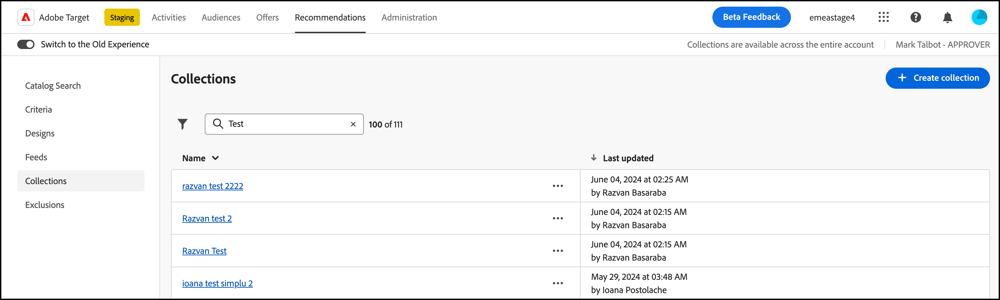

# Raccolte

Una raccolta è un insieme di prodotti o elementi che sono idonei per essere proposti come consigli. Una raccolta viene definita specificando le condizioni che devono essere soddisfatte dagli elementi affinché ne facciano parte.

Solitamente, una raccolta è un insieme di elementi simili o correlati, come una raccolta di prodotti singoli. Tuttavia, puoi raggruppare qualsiasi elemento in una categoria adatta alla tua attività, ad esempio prodotti in una determinata fascia di prezzo o colore o articoli che potrebbero essere interessanti in una particolare area geografica.

Utilizza le raccolte per organizzare i prodotti in raggruppamenti logici. Ad esempio, se alcuni elementi sono disponibili in un’area ma non in un’altra, puoi creare una raccolta che escluda gli elementi non disponibili nell’area del visitatore. Puoi inoltre utilizzare le raccolte per organizzare gli elementi stagionali o qualsiasi altro parametro organizzativo applicabile al tuo business.

[Raccomandazioni per il backup](/help/main/c-recommendations/c-algorithms/backup-recs.md) generati per ogni criterio all&#39;interno del consiglio utilizza anche questa raccolta, in modo che solo gli elementi della raccolta siano inclusi nel consiglio di backup. Le raccolte consentono di garantire la visualizzazione dei soli prodotti che ha senso mostrare in una determinata posizione.

Le raccolte vengono ricreate o aggiornate a ogni esecuzione di ciascun criterio.

Puoi raggruppare gli elementi in cataloghi e quindi creare consigli separati per ogni raccolta.

I criteri di inclusione consentono di eseguire operazioni simili su una raccolta, ma devono essere impostati ogni volta che si crea una attività. Le raccolte consentono di creare un insieme di elementi una sola volta e di utilizzarlo ogni volta che è opportuno senza doverlo impostare nuovamente.

Durante la creazione o la modifica di un [!DNL Recommendations] attività, il nome della raccolta viene visualizzato accanto al [!UICONTROL Criteria] sul diagramma dell’attività.

>[!NOTE]
>
>Le raccolte non vengono applicate quando si utilizza [!UICONTROL Recently Viewed Items] chiave di consiglio.

## Creazione di una raccolta {#task_1256DFF6842141FCAADD9E1428EF7F08}

Crea una raccolta per organizzare i prodotti o i contenuti da mostrare nei consigli.

1. Clic **[!UICONTROL Recommendations]** > **[!UICONTROL Collections]** per visualizzare l’elenco delle raccolte esistenti.

   

   Il [!UICONTROL Collections] In questa pagina viene visualizzato un elenco delle raccolte esistenti. Per creare nuove raccolte, fai clic su [!UICONTROL Create Collection] pulsante. Puoi anche modificare, copiare ed eliminare raccolte esistenti facendo clic sull’icona dei puntini di sospensione accanto alla raccolta desiderata e quindi facendo clic sull’opzione desiderata.

   Il &quot;Numero di elementi&quot; segnalato per ogni raccolta sul [!UICONTROL Collections] vista a elenco è il numero di prodotti che corrispondono alle regole per tale raccolta all’interno del Recommendations predefinito configurato [gruppo host](/help/main/administrating-target/hosts.md) (ambiente). Consulta [Impostazioni](https://experienceleague.adobe.com/docs/target-dev/developer/recommendations.html){target=_blank} per modificare il gruppo host predefinito.

1. Clic **[!UICONTROL Create Collection]**.

   

1. Digita un **[!UICONTROL Name]** per la raccolta.

   È inoltre possibile immettere un valore facoltativo **[!UICONTROL Description]**.

1. (Condizionale) Scegli un [ambiente](/help/main/administrating-target/environments.md) dal **[!UICONTROL Environment]** durante la creazione (o l’aggiornamento) di una raccolta per visualizzare in anteprima il contenuto della raccolta in tale ambiente. Per impostazione predefinita, sono visualizzati i risultati del gruppo di host predefinito.

1. Imposta le regole utilizzate per compilare la raccolta.

   Ad esempio, la raccolta potrebbe essere basata su un ID o categoria di prodotto, un margine, o qualsiasi altro parametro nell’elenco.

   È possibile aggiungere regole per utilizzare più parametri con cui definire una raccolta. Più regole sono unite con un operatore AND. Tutte le regole specificate devono essere soddisfatte perché la raccolta venga applicata.

1. Clic **[!UICONTROL Create]**.

## Creare una raccolta utilizzando [!UICONTROL Advanced Search]

Puoi anche creare le raccolte utilizzando [!UICONTROL Advanced Search] il [Ricerca nel catalogo](/help/main/c-recommendations/c-products/catalog-search.md#save-as) page ([!UICONTROL Recommendations] > [!UICONTROL Catalog Search] > [!UICONTROL Advanced Search]).

Dopo aver creato una ricerca utilizzando &quot;id > contiene&quot;, ad esempio, puoi fare clic su [!UICONTROL Save As] > [!UICONTROL Collection].

>[!IMPORTANT]
>
>Il [!UICONTROL Advanced Search] La funzionalità non distingue tra maiuscole e minuscole, tuttavia, i prodotti restituiti al momento della consegna si basano sulla ricerca con distinzione tra maiuscole e minuscole. Questa mancata corrispondenza potrebbe creare confusione. Assicurati di considerare la distinzione tra maiuscole e minuscole quando crei raccolte in base ai risultati utilizzando [!UICONTROL Advanced Search] funzionalità. Ad esempio, se esegui una ricerca per “Vacanza”, i risultati della ricerca iniziale contengono “Vacanza” e “vacanza”. Se poi crei un catalogo con l’intento di restituire i prodotti contenenti “vacanza”, verranno restituiti solo i prodotti contenenti “vacanza”. ma non quelli contenenti “Vacanza”.

## Modificare, copiare o eliminare una raccolta

Fai clic su **puntini di sospensione** accanto alla raccolta desiderata nell’elenco, quindi fai clic sull’icona appropriata: modifica, copia o elimina.

Puoi copiare una raccolta esistente per crearne una duplicata da modificare. Questo consente di creare una raccolta simile con meno sforzo.

Tieni presente che le raccolte sono disponibili a livello dell’intero account. Prima di eliminare una raccolta, tienilo in considerazione. Non è possibile recuperare le raccolte eliminate.

## Utilizzare una raccolta in un [!DNL Recommendations] attività

1. Crea una raccolta utilizzando uno dei metodi indicati sopra.

1. Clic **[!UICONTROL Activities]** e [crea un nuovo Recommendations](/help/main/c-recommendations/t-create-recs-activity/create-recs-activity.md) o modificare un&#39;attività esistente.

1. Dopo aver selezionato un criterio e una progettazione, [!UICONTROL Options] viene visualizzata la pagina in cui si seleziona la raccolta desiderata.

   

1. (Condizionale) Per modificare un’impostazione di raccolta esistente, nella **[!UICONTROL Experiences]** pagina (passaggio 2 del flusso di lavoro guidato in tre parti), fai clic sul percorso in cui hai inserito i consigli, quindi fai clic su **[!UICONTROL Change Collection]**, quindi seleziona la raccolta desiderata.

   

## Video di formazione: Creare raccolte ed esclusioni in Recommendations (7:05) 

Questo video contiene le seguenti informazioni:

* Creare una raccolta
* Creare un’esclusione

>[!VIDEO](https://video.tv.adobe.com/v/27689)