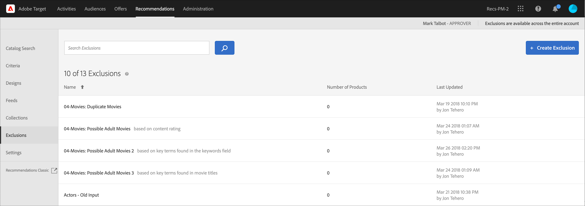

# Esclusioni

Crea un&#39;esclusione in [!DNL Adobe Target Recommendations] per impedire che prodotti o contenuti vengano consigliati ai visitatori. Un’esclusione è un sottoinsieme di prodotti o contenuti che non devono essere consigliati ai visitatori.

Le esclusioni sono disponibili a livello dell&#39;intero account. A differenza delle raccolte, in cui si specifica una raccolta specifica per ogni esperienza durante la creazione di un&#39;attività [!UICONTROL Recommendations], le esclusioni si applicano a tutte le attività dell&#39;account. Non è possibile assegnare un gruppo di esclusione durante la creazione dell’attività.

Alcuni esempi di utilizzo delle esclusioni includono:

* Prodotti che sono stati sospesi
* Il catalogo Autunno/Inverno è ora l&#39;unico catalogo che dovrebbe essere presente online. Tutti gli articoli del catalogo estivo non sono più disponibili per l&#39;acquisto.
* Articoli che potrebbero essere inappropriati da consigliare sulla maggior parte delle pagine/schermate (prodotti per adulti, film NC-17, ecc.)
* Prodotti con campi di metadati incompleti (miniatura, prezzo o altri metadati importanti mancanti)
* Prodotti che non dovrebbero mai essere consigliati (forse nel sistema esiste una SKU per qualcosa, ma non è un articolo acquistabile, o forse è una SKU falsa per il team di QA simulare un acquisto senza effettivamente ordinare qualcosa, ecc.)

>[!IMPORTANT]
>
>Le regole di esclusione vengono applicate a livello globale a tutti gli ambienti.
>
>Le regole di esclusione statica e dinamica sono funzioni molto efficaci che possono esserti utili nelle iniziative di marketing. Per informazioni dettagliate, esempi e scenari di utilizzo, consulta [Utilizzare regole di inclusione dinamiche e statiche](/help/main/c-recommendations/c-algorithms/use-dynamic-and-static-inclusion-rules.md#concept_4CB5C0FA705D4E449BD0B37B3D987F9F).

## Creare un’esclusione

1. Fai clic su **[!UICONTROL Recommendations]** > **[!UICONTROL Exclusions]** per visualizzare l&#39;elenco delle esclusioni esistenti.

   

   Il &quot;Numero di elementi&quot; segnalato per ogni esclusione nella visualizzazione elenco [!UICONTROL Exclusions] è il numero di prodotti che corrispondono alle regole per tale esclusione all&#39;interno del gruppo predefinito di consigli [host](/help/main/administrating-target/hosts.md) (ambiente) configurato. Consulta [Impostazioni](https://experienceleague.adobe.com/docs/target-dev/developer/recommendations.html){target=_blank} per modificare il gruppo host predefinito.

1. Fare clic su **[!UICONTROL Create Exclusion]**.

1. (Facoltativo) Scegli un ambiente dal filtro **[!UICONTROL Environment]** durante la creazione (o l&#39;aggiornamento) di un&#39;esclusione per visualizzare in anteprima i contenuti dell&#39;esclusione in tale ambiente. Per impostazione predefinita, sono visualizzati i risultati del gruppo di host predefinito.

   

1. Digitare un&#39;esclusione **[!UICONTROL Name]** e immettere una descrizione facoltativa.

1. Utilizza il generatore di regole per creare le esclusioni.

   Seleziona un parametro nell’elenco delle regole, seleziona un operatore, quindi immetti uno o più valori per identificare i prodotti. Separa i valori con le virgole.

1. Fare clic su **[!UICONTROL Save]**.

## Creare un’esclusione utilizzando Ricerca avanzata

Puoi anche creare esclusioni utilizzando [!UICONTROL Advanced Search] nella pagina [Ricerca nel catalogo](/help/main/c-recommendations/c-products/catalog-search.md#save-as) ( [!UICONTROL Recommendations] > [!UICONTROL Catalog Search] > [!UICONTROL Advanced Search]).

Dopo aver creato una ricerca utilizzando &quot;id > contiene&quot;, ad esempio, è possibile fare clic su [!UICONTROL Save As] > [!UICONTROL Exclusion].

>[!IMPORTANT]
>
>La funzionalità [!UICONTROL Advanced Search] non distingue tra maiuscole e minuscole. Tuttavia, i prodotti restituiti al momento della consegna si basano sulla ricerca con distinzione tra maiuscole e minuscole. Questa mancata corrispondenza potrebbe creare confusione. Assicurati di considerare la distinzione tra maiuscole e minuscole quando crei esclusioni in base ai risultati utilizzando la funzionalità Ricerca avanzata. Ad esempio, se esegui una ricerca per “Vacanza”, i risultati della ricerca iniziale contengono “Vacanza” e “vacanza”. Se poi crei un’esclusione con l’intento di escludere i prodotti contenenti “vacanza”, verranno esclusi solo i prodotti contenenti “vacanza”. ma non quelli contenenti “Vacanza”.

## Modificare, copiare o eliminare un’esclusione

Passa il cursore del mouse sull’esclusione desiderata nell’elenco, quindi fai clic sull’icona appropriata: modifica, copia o elimina.

Puoi copiare un’esclusione esistente per creare un’esclusione duplicata che puoi quindi modificare. Questo consente di creare un’esclusione simile con meno sforzo.

Tieni presente che le esclusioni sono disponibili in tutto l’account. Prima di eliminare un’esclusione, tieni presente quanto segue. Non è possibile recuperare le esclusioni eliminate.

## Video di formazione: Crea raccolte ed esclusioni in Recommendations (7:05) 

Questo video contiene le seguenti informazioni:

* Creare una raccolta
* Creare un’esclusione

>[!VIDEO](https://video.tv.adobe.com/v/27689)
