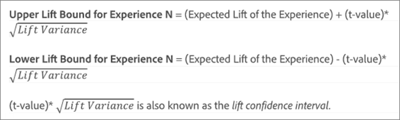
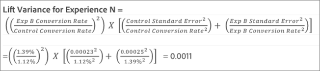

# Incremento medio, limiti di incremento e intervallo di affidabilità

I report includono diversi punti dati e rappresentazioni di visualizzazione che consentono di comprendere i limiti di incremento e il livello di affidabilità associati all&#39;attività [!DNL Adobe Target] per determinare in modo più accurato un vincitore.

>[!NOTE]
>
>Questa funzionalità è disponibile solo quando si visualizzano i report nella visualizzazione [!UICONTROL Table]. Questa funzionalità non è disponibile per le attività che utilizzano [Analytics come origine per la generazione di rapporti (A4T)](/help/main/c-integrating-target-with-mac/a4t/a4t.md#concept_7540C8C04259434AB6EE33B09F47A1DE).

## Interpretare i dati {#section_62C0D7E76F3D49A7B3C371C82AEF27D5}

Nella figura seguente sono illustrate le informazioni di [!UICONTROL Lift Bounds and Confidence Level]:

Le informazioni sull&#39;incremento e sull&#39;affidabilità nell&#39;interfaccia utente di reporting di [!DNL Target] includono:

### Incremento

Il numero elevato e la freccia riflettono il valore atteso dell’incremento. Questo numero è il punto medio nell’intervallo dei limiti di incremento. La freccia di incremento atteso è grigia fino a quando l’affidabilità non supera il 95%. Superata questa soglia, la freccia diventa rossa o verde, rispettivamente per un incremento negativo o positivo.

### Limiti di incremento

Intervallo di affidabilità dell’incremento del 95%. Viene visualizzato come un intervallo, sotto all’incremento medio. Consulta [Esempio di calcolo](#example) di seguito per un esempio di come vengono calcolati questi limiti di incremento.

### Grafico boxplot

Il grafico boxplot nell&#39;interfaccia [!DNL Target] rappresenta il valore previsto e l&#39;intervallo di affidabilità del 95% della metrica di successo in questione. Immaginalo come una modalità grafica per visualizzare le informazioni sull’incremento e i suoi limiti.

[!DNL Target] consente di interpretare le informazioni sull&#39;affidabilità in diversi modi, ad esempio tramite il colore. Nel grafico, la sovrapposizione tra l’intervallo di affidabilità di un’esperienza specifica e l’intervallo di affidabilità del controllo è indicata in grigio. L’intervallo di affidabilità di un’esperienza specifica superiore o inferiore rispetto a quello del controllo viene invece indicato rispettivamente in verde o rosso.

La lunghezza della barra box plot rappresenta in modo immediato la grandezza dell’intervallo di affidabilità. A seconda dei dati che vengono raccolti nell’attività, la barra si sposta e cambia. L’intervallo di affidabilità è derivato dalla varianza e dalla dimensione del campione (numero di visitatori). Minore è la varianza e maggiore è la dimensione del campione, più ridotto sarà l’intervallo di affidabilità.

### Affidabilità

L&#39;affidabilità di un&#39;esperienza o di un&#39;offerta visualizzata è una probabilità (espressa in percentuale) di ottenere un risultato _meno estremo_ rispetto a quello effettivamente osservato, _se l&#39;ipotesi nulla è vera_, ovvero se non vi è alcuna differenza nei tassi di conversione tra tale esperienza o offerta e l&#39;esperienza/offerta di controllo. In termini di valori p, l&#39;affidabilità visualizzata è `1 - p-value`. In termini più semplici, un’affidabilità maggiore indica che i dati sono meno coerenti con l’ipotesi che l’offerta/esperienza di controllo e quella di non controllo abbiano tassi di conversione uguali.

## Comprendere come viene determinato l’intervallo di affidabilità per l’incremento {#pdf}

Scarica [Intervallo di affidabilità per il file PDF Lift](/help/main/assets/confidence_interval_lift.pdf) per ulteriori informazioni.

## Come vengono calcolati i limiti di incremento? {#section_1D360781D972483693680BE0F07AEAD1}

I limiti di incremento rappresentano gli intervalli di affidabilità al 95% dell’incremento per l’esperienza o l’offerta specifica rispetto all’esperienza o all’offerta di controllo. In altre parole, significa che l’incremento reale ha circa il 95% di probabilità di essere compreso tra questi limiti.

I limiti di incremento vengono calcolati con la seguente formula:

Vi sono dei calcoli aggiuntivi per ottenere l’input per i limiti di incremento:

* **t-value:** Il dato statistico critico per il livello di affidabilità al 95% è 1,96. Ulteriori informazioni su [t-values](https://en.wikipedia.org/wiki/T-statistic).
* **Varianza dell’incremento:** l’errore standard della metrica di successo dell’esperienza N e l’errore standard della metrica di successo dell’esperienza di controllo sono necessari per determinare la varianza dell’incremento, la quale è calcolata con la seguente formula (illustrata per un caso in cui la metrica di successo è la conversione).

  

* **Errore standard per tasso di conversione/metrica di successo:** l’errore standard viene calcolato nello stesso modo per l’esperienza N e per il controllo, con la seguente formula (illustrata per un caso in cui la metrica di successo è la conversione). Ulteriori informazioni su [Errore standard](https://en.wikipedia.org/wiki/Standard_error).

  

  >[!NOTE]
  >
  >L’errore standard per le attività con metriche di successo sul ricavo si basa sulla varianza dei ricavi del campione.

## Esempio di calcolo {#example}

Consideriamo un’attività di esempio con due esperienze e i seguenti risultati:

| Esperienza | Visitatori | Conversioni | Tasso di conversione |
|--- |--- |--- |--- |
| Esperienza A (controllo) | 219, 328 | 2.466 | 1,12% |
| Esperienza B | 218, 362 | 3.040 | 1,39% |

Basandoci sulle formule, possiamo calcolare gli input necessari per i limiti di incremento.

**Errore standard per l’esperienza A (controllo)**

**Errore standard per l’esperienza B**

**Varianza di incremento per l’esperienza B**

**Limiti di incremento per l’esperienza B**

Incremento atteso per l’esperienza B:

Pertanto, i limiti di incremento per l’esperienza B saranno:

>[!NOTE]
>
>Potrebbero esserci lievi varianze tra i calcoli manuali svolti utilizzando le formule di cui sopra e i numeri visualizzati nel rapporto. La differenza può essere attribuita al fatto che i numeri delle visualizzazioni di pagina utilizzati nei calcoli manuali sono arrotondati. L&#39;incremento mostrato nel report [!DNL Target] si basa sui numeri esatti ottenuti dal coinvolgimento totale e dal conteggio del coinvolgimento. I numeri di coinvolgimento possono essere ottenuti tramite l&#39;API di rapporto sulle prestazioni.

## In quali casi i limiti di incremento non vengono visualizzati? {#section_C5622E1E94684DAD937249B51A9E42CC}

In alcuni casi, [!DNL Target] non visualizza i limiti di incremento:

* Per qualsiasi attività, quando il numero totale di visite o visitatori è inferiore a 30.
* Per le attività [!UICONTROL Auto-Allocate], non vengono visualizzati limiti di incremento finché un&#39;esperienza non raggiunge il 60% di affidabilità.
