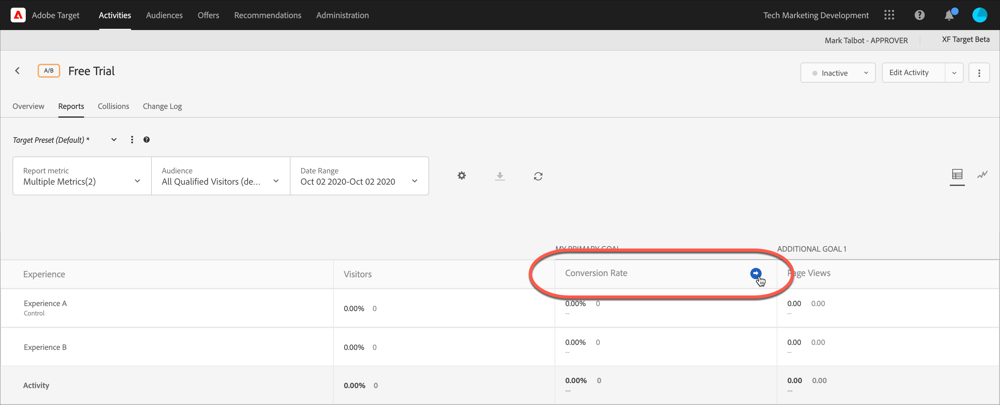

# Visualizzare più metriche in un rapporto

Puoi selezionare più metriche da visualizzare in un [!DNL Adobe Target] rapporto.

Tieni presente le informazioni seguenti quando lavori con più metriche nei rapporti:

* La possibilità di visualizzare più metriche è disponibile per [Test A/B](/help/main/c-activities/t-test-ab/test-ab.md), [Allocazione automatica](/help/main/c-activities/automated-traffic-allocation/automated-traffic-allocation.md), [Targeting automatico](/help/main/c-activities/auto-target/auto-target-to-optimize.md), e [Targeting esperienza](/help/main/c-activities/t-experience-target/experience-target.md) (XT) solo attività.
* Non puoi aggiungere più di 20 metriche a un rapporto per un’attività che utilizza [Analytics for Target](/help/main/c-integrating-target-with-mac/a4t/a4t.md) (A4T). Puoi aggiungere ai rapporti tutte le metriche disponibili nell’attività per le attività che eseguono *non* utilizza A4T.
* Non puoi utilizzare l&#39;opzione Scarica per scaricare i rapporti in formato CSV se sono state selezionate più metriche. Devi selezionare una sola metrica per attivare l’opzione [!UICONTROL Scarica].
* Non puoi visualizzare più metriche per le attività create prima del mese di luglio 2015 [!DNL Target] (30 luglio 2015).

**Per selezionare più metriche da visualizzare nel rapporto:**

1. Per visualizzare un rapporto, fai clic su **[!UICONTROL Attività]**, scegli l’attività desiderata dall’elenco, quindi fai clic sulla scheda **[!UICONTROL Rapporti]**.
1. Fai clic sull&#39;elenco a discesa **[!UICONTROL Metrica rapporto]** per visualizzare gli elenchi [!UICONTROL Metriche visualizzate] e [!UICONTROL Metriche nascoste].

   

   Puoi utilizzare la [!UICONTROL casella di ricerca] per trovare rapidamente le metriche disponibili da aggiungere all&#39;elenco [!UICONTROL Metriche visualizzate].

   È possibile selezionare più metriche sia dalla modalità [!UICONTROL Vista tabella] sia dalla modalità [!UICONTROL Vista grafico] del rapporto.

1. Posiziona il puntatore del mouse sulla metrica desiderata nell&#39;elenco [!UICONTROL Metriche nascoste], quindi fai clic su **[!UICONTROL Seleziona]** per spostarle nell&#39;elenco [!UICONTROL Metriche visualizzate].

   Oppure

   Trascina le metriche desiderate dall&#39;elenco [!UICONTROL Metriche nascoste] all&#39;elenco [!UICONTROL Metriche visualizzate].

   Nell&#39;elenco [!UICONTROL Metriche visualizzate] deve essere presente almeno una metrica.

   È possibile ridisporre le metriche trascinandole nell&#39;ordine desiderato nell&#39;elenco [!UICONTROL Metriche visualizzate]. L&#39;ordine selezionato verrà riportato nel [!UICONTROL Vista tabella] e [!UICONTROL Vista grafico]. Per rimuovere una metrica dall&#39;elenco [!UICONTROL Metriche visualizzate], posiziona il puntatore del mouse sulla metrica, quindi fai clic sull&#39;icona **X**.

1. Al termine, fai clic su **[!UICONTROL Salva]**.
1. (Condizionale) Quando visualizzi il rapporto in [!UICONTROL Vista tabella], posiziona il puntatore del mouse sull’intestazione di colonna di una metrica per visualizzare una freccia blu. Fai clic sulla freccia per espandere la tabella e visualizzare i parametri di [!UICONTROL Incremento] e [!UICONTROL Affidabilità] per tale metrica.

   

   È possibile espandere solo una metrica/colonna alla volta. Fai nuovamente clic sulla freccia per comprimere le colonne.

1. (Condizionale) Quando visualizzi il rapporto nella Vista grafico, puoi selezionare le singole metriche da visualizzare dall’elenco a discesa:

   
