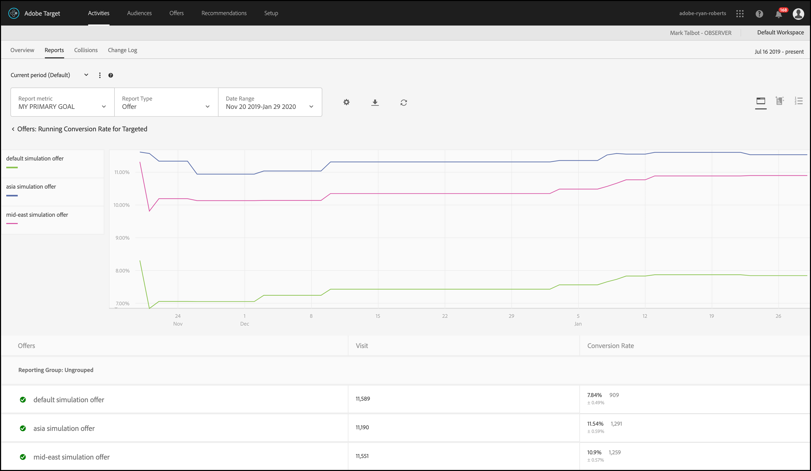

#  Rapporti di riepilogo per Personalizzazione automatizzata

Per gli utenti di [!UICONTROL Automated Personalization] attività [!DNL Adobe Target].

>[!NOTE]
>
>La [!UICONTROL personalizzazione automatizzata] è disponibile come parte della soluzione [!DNL Target Premium]. Non è disponibile in [!DNL Target Standard] senza una licenza [Target Premium](/help/main/c-intro/intro.md#premium).

1. Fai clic su **[!UICONTROL Attività]**, fai clic sull’attività di [!UICONTROL Personalizzazione automatica] desiderata dall’elenco, quindi fai clic sulla scheda **[!UICONTROL Rapporti]**.

   Se hai numerose attività, puoi filtrare l’elenco selezionando [!UICONTROL Personalizzazione automatizzata] dall’elenco a discesa [!UICONTROL Tipo].

1. (Facoltativo) Fai clic sull&#39;icona **[!UICONTROL Scarica]** per scaricare il riepilogo (ad esempio, il confronto tra il Controllo e il Traffico mirato) con suddivisione in base a tutte le metriche di successo disponibili.

La funzione [!UICONTROL Personalizzazione automatizzata] fornisce i seguenti rapporti:

* Livello attività
* Livello di offerta
* Segmenti automatizzati
* Attributi importanti

## Report Activity Level (Livello di attività) {#section_6F72FC5C790B4492B3DCECBFFA971337}

Il rapporto a [!UICONTROL livello di attività] consente di confrontare le prestazioni di aggregazione dell&#39;utilizzo di un algoritmo di [!UICONTROL Personalizzazione automatizzata] per il contenuto fornito in modo casuale (controllo).

Si applicano comunque le regole standard di interpretazione dei risultati per il test A/B, tra cui incremento, affidabilità, trend, durata e così via. Per ulteriori informazioni sull’interpretazione dei risultati, vedi [Calcoli statistici nei test A/Bn](/help/main/c-reports/statistical-methodology/statistical-calculations.md).

## Report Offer Level (Livello di offerta) {#section_CAA6409879E349C6906E2BE8156D87A1}

Il rapporto a [!UICONTROL livello di offerta] per l’esperienza Foresta casuale confronta le prestazioni di ogni offerta applicata dall’algoritmo alla stessa offerta fornita casualmente (controllo). Pertanto, non devi confrontare le offerte tra loro in questa visualizzazione.

Fai clic sull’algoritmo dell’esperienza (Foresta casuale o controllo) per visualizzare il [!UICONTROL Livello di offerta] rapporto.

Le offerte possono essere visualizzate all’interno di gruppi di rapporti, che possono essere compressi e espansi. Seleziona [!UICONTROL Gruppo di rapporti] nell’elenco a discesa per visualizzare le informazioni aggregate da gruppi di rapporti, anziché da offerte.

>[!NOTE]
>
>L’icona dell’orologio indica che il modello dell’algoritmo è ancora in corso. L’icona del segno di spunta indica che l’algoritmo di base è stato stabilito.

## Segmenti automatizzati

Fai clic sul pulsante [!UICONTROL Segmenti automatizzati] icona. Questo rapporto mostra come i diversi visitatori rispondono in modo diverso alle offerte/esperienze nell&#39;attività di AP/AT. Questo rapporto mostra come i diversi segmenti automatizzati definiti dai modelli di personalizzazione di Target rispondono alle offerte/esperienze dell&#39;attività.

Per ulteriori informazioni, consulta [Rapporto Segmenti automatizzati](/help/main/c-reports/c-personalization-insights-reports/automated-segments-report.md).

## Attributi importanti

Fai clic sul pulsante [!UICONTROL Attributi importanti] icona. Questo rapporto mostra come, nelle diverse attività, i diversi attributi siano più (o meno) importanti per il modo in cui il modello decide di effettuare la personalizzazione. Questo rapporto mostra gli attributi principali che hanno influenzato il modello e la loro importanza relativa.

Per ulteriori informazioni, consulta [Rapporto Attributi importanti](/help/main/c-reports/c-personalization-insights-reports/important-attributes-report.md).

## Domande frequenti 

### Perché esistono differenze nei dati tra i rapporti a livello di attività e a livello di offerta?

**[!UICONTROL Livello attività] rapporto**: Visite registrate nella [!UICONTROL Livello attività] il rapporto acquisisce il numero di visite alle esperienze di controllo rispetto a traffico &quot;mirato&quot;. Il traffico mirato include una combinazione di traffico di esplorazione e traffico personalizzato.

**Rapporto a livello di offerta**: Impressioni registrate sul [!UICONTROL Livello di offerta] il rapporto acquisisce il numero di impression per ogni offerta. Pertanto, in un’attività con più di una posizione, il numero totale di visite registrate nella [!UICONTROL Livello di offerta] il rapporto tra tutti i gruppi di reporting è uguale al multiplo del numero di visite registrate per il traffico di controllo o mirato nel [!UICONTROL Livello attività] il rapporto moltiplica il numero totale di posizioni nell’attività. Le impression di contenuto predefinito che si verificano nelle posizioni in cui il contenuto predefinito era un’opzione disponibile vengono registrate nel gruppo di offerte &quot;Contenuto predefinito&quot;. Le impression di offerte che non sono state assegnate a un gruppo di rapporti vengono registrate nel gruppo di offerte &quot;Non raggruppate&quot;.

>[!NOTE]
>
>Il numero di impression registrate nel [!UICONTROL Livello di offerta] il rapporto potrebbe non essere un numero intero esatto multiplo del numero di visite registrate nel [!UICONTROL Livello attività] rapporto. Ciò è dovuto a discrepanze minori che si verificano nell&#39;acquisizione del traffico di dati di reporting su Internet (il tasso di discrepanza tipico è inferiore al 5%). Pertanto, il numero di impression non sarà un multiplo esatto quando il numero di posizioni disponibili nell’attività cambia dopo l’attivazione dell’attività.
