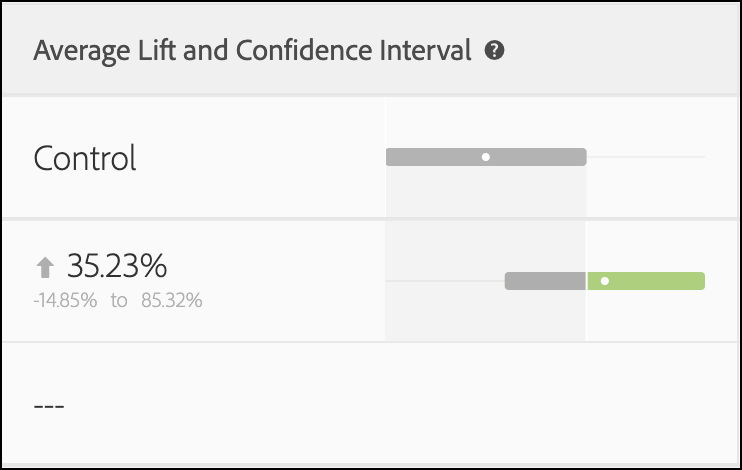

# Calcoli statistici nei test A/Bn

Questo articolo documenta i calcoli statistici dettagliati utilizzati nei test A/Bn manuali in [!DNL Adobe Target]. Le definizioni sono fornite per [!UICONTROL Tasso di conversione], [!UICONTROL Intervallo di affidabilità del tasso di conversione], [!UICONTROL Incremento], [!UICONTROL Intervallo di affidabilità per l’incremento], e [!UICONTROL Affidabilità].

>[!NOTE]
>
>Le informazioni contenute in questo articolo sostituiscono il file pdf dei *Calcoli di Adobe Target per test A/B* precedentemente disponibile per il download su questo sito.

![Report di destinazione che mostra [!UICONTROL Tasso di conversione], [!UICONTROL Incremento medio e intervallo di affidabilità], e [!UICONTROL Affidabilità] di un’attività Test A/B.](/help/main/c-reports/statistical-methodology/img/target_report.png)

## Prestazioni medie

Nella sezione seguente vengono illustrati i calcoli utilizzati nell&#39;illustrazione precedente.

### Campagne RPV (tasso di conversione e ricavo per visitatore)

L’illustrazione seguente mostra [!UICONTROL Tasso di conversione], [!UICONTROL Intervallo di affidabilità del tasso di conversione]e il numero di [!UICONTROL Conversioni] in un [!DNL Target] rapporto. Ad esempio, la prima riga mostra che per l’esperienza A: [!UICONTROL Tasso di conversione] è 25,81% con un [!UICONTROL Intervallo di affidabilità] di ±7,7% e 32 conversioni. Dato che l’esperienza è stata vista da 124 visitatori, questo equivale a 32/124 = 25,81%.

<p style="text-align:center;"></p>

Il tasso di conversione o **media**, *μ<sub></sub>*, per ogni esperienza ** in un esperimento è definito come un rapporto tra la somma della metrica e il numero di unità assegnate a quella metrica, *N<sub></sub>*:

<p style="text-align:center;"></p>

Qui,

* *Y<sub>i</sub>* è il valore della metrica per ogni unità *i*, che è stato assegnato a una determinata esperienza **.

* Somma in unità *i* dipende dalla scelta della metodologia di conteggio.

   * Se *[!UICONTROL Visitor]* viene utilizzata come metodologia di conteggio; ogni unità è un visitatore univoco, definito come partecipante univoco all’attività per tutta la durata dell’attività.
   * Se *[!UICONTROL Visite]* è utilizzato come metodologia di conteggio; ogni unità è una visita unica, definita come partecipante univoco a un’esperienza durante un [!DNL Target] sessione (con un `sessionId`). Quando `sessionId` Se il visitatore raggiunge il passaggio di conversione, viene conteggiata una nuova visita.
   * Se *[!UICONTROL Impression attività]* viene utilizzato come metodologia di conteggio; ogni unità è un’impression univoca definita come ogni volta che un visitatore carica una pagina dell’attività.

## [!UICONTROL Intervallo di confidenza della media]/[!UICONTROL Tasso di conversione]

L’intervallo di confidenza del tasso di conversione è intuitivamente definito come un intervallo di possibili tassi di conversione coerente con i dati sottostanti.

Durante l’esecuzione di esperimenti, il tasso di conversione per una determinata esperienza è un valore *stima* del tasso di conversione &quot;true&quot;. Per quantificare l&#39;incertezza nella stima: [!DNL Target] utilizza un intervallo di affidabilità. [!DNL Target] segnala sempre un intervallo di affidabilità del 95%, il che significa che alla fine il 95% degli intervalli di affidabilità calcolati include l’effettivo tasso di conversione dell’esperienza.

Un intervallo di confidenza del 95% del tasso di conversione *μ<sub></sub>* è definito come l’intervallo di valori:

<p style="text-align:center;"></p>

Dove l’errore standard per la media è definito come

<p style="text-align:center;"></p>

Se si utilizza una stima imparziale della deviazione standard del campione:

<p style="text-align:center;"></p>

Quando la campagna è basata su un tasso di conversione (ad esempio, la metrica di conversione è binaria), l’errore standard si riduce a:

<p style="text-align:center;"></p>

## Incremento

L’illustrazione seguente mostra [!UICONTROL Incremento] e [!UICONTROL Intervallo di affidabilità dell’incremento] in un [!DNL Target] Rapporto. Il numero rappresenta la media dell&#39;intervallo dei limiti di incremento e la freccia indica se l&#39;incremento è positivo o negativo. La freccia viene visualizzata in grigio fino a quando l’affidabilità non supera il 95%. Una volta superata la soglia di affidabilità, la freccia diventa verde o rossa in base a un incremento positivo o negativo.

<p style="text-align:center;"></p>

L’incremento tra un’esperienza  ** e l’esperienza di controllo *<sub>0</sub>* è il delta relativo nei tassi di conversione, definito come

<p style="text-align:center;"></p>

Laddove i singoli tassi di conversione sono definiti sopra. Più semplicemente,

```
Lift(Experience N) = (Performance_Experience_N - Performance_Control)/ Performance_Control
```

Se il tasso di conversione dell’esperienza di controllo *<sub>0</sub>* è 0, non c&#39;è ascensore.

## [!DNL Confidence Interval of Lift]

Il grafico boxplot in [!UICONTROL Incremento medio e intervallo di affidabilità] rappresenta il valore medio e il 95% [!UICONTROL Intervallo di affidabilità dell’incremento]. Il grafico a caselle è grigio quando vi è una sovrapposizione tra l’intervallo di affidabilità di una determinata esperienza non di controllo e l’intervallo di affidabilità dell’esperienza di controllo. Il grafico a caselle è verde o rosso quando l’intervallo di affidabilità dell’esperienza fornita è superiore o inferiore all’intervallo di affidabilità dell’esperienza di controllo.

Errore standard dell’incremento tra un’esperienza  ** e l’esperienza di controllo  *<sub>0</sub>* è definito come:

<p style="text-align:center;"></p>

Quindi l’intervallo di affidabilità del 95% dell’incremento è:

<p style="text-align:center;"></p>

Questo calcolo utilizza il metodo &quot;Delta&quot; ed è descritto [più dettagliatamente in questo documento](/help/main/assets/confidence_interval_lift.pdf)

## [!UICONTROL Affidabilità]

L’ultima colonna mostra l’affidabilità in una [!DNL Target] rapporto. L’affidabilità di un’esperienza è una probabilità (espressa in percentuale) di ottenere un risultato meno estremo di quello osservato, data l’ipotesi nulla è vera. In termini di valori p, l’affidabilità visualizzata è *1 - valore p*. Intuitivamente, una maggiore affidabilità significa che è meno probabile che l’esperienza di controllo e quella di non controllo abbiano tassi di conversione uguali.

In entrata [!DNL Target], a due code **Test t di Welch** viene eseguita tra l’esperienza di prova e l’esperienza di controllo per verificare se i mezzi di prova e le esperienze di controllo sono gli stessi. Perché di solito non sappiamo se le dimensioni del campione e le varianze di due gruppi sono le stesse prima di eseguire l’esperimento, e [!DNL Target] Inoltre, consente di avere percentuali di traffico non uguali inviate a ogni esperienza, non si presume che la varianza per ogni esperienza sia uguale. Pertanto, il test t di Welch viene scelto al posto del test t di Student.

Per eseguire il test t di Welch, iniziamo prima a calcolare la statistica t e i gradi di libertà, quindi eseguiamo un test t a due code per generare il valore p. Infine, calcoliamo l’affidabilità in base al valore p.

Il *t*-statistico: differenza tra le medie di due variabili casuali indipendenti, ** e *<sub>0</sub>*, diviso per l’errore standard della differenza:

<p style="text-align:center;"></p>

Dove *μ<sub>v</sub>* e *μ<sub>v0</sub>* sono i mezzi per **  e *<sub>0</sub>* rispettivamente, e l&#39;errore standard della differenza tra *μ<sub>v</sub>* e *μ<sub>v0</sub>* sono somministrati da:

<p style="text-align:center;"></p>

Dove *<sup>2</sup><sub>v</sub>* e *<sup>2</sup><sub>v<sub>0</sub></sub>* sono le varianze di due esperienze **  e *<sub>0</sub>* rispettivamente e *N<sub>v</sub>* e *N<sub>v<sub>0</sub></sub>* sono le dimensioni del campione per ** e *<sub>0</sub>* rispettivamente.

Per il test t di Welch, il grado di libertà è calcolato come segue:

<p style="text-align:center;"></p>

E il grado di libertà per **  e *<sub>0</sub>* sono definiti come:

<p style="text-align:center;"></p>

<p style="text-align:center;"></p>

Quindi il valore p può essere calcolato dall’area nelle code del *t*-distribuzione:

<p style="text-align:center;"></p>

Infine, l’affidabilità riportata in [!DNL Target] è definito come:

<p style="text-align:center;"></p>

## Esecuzione dei calcoli offline

Il [rapporto CSV scaricato](/help/main/c-reports/c-report-settings/downloading-data-in-csv-file.md) include solo dati non elaborati; non include metriche calcolate come ricavi per visitatore, incremento o affidabilità, utilizzate per i test A/B.

Per calcolare queste quantità statistiche, scarica la [!DNL Target] [Completa il calcolatore di affidabilità](/help/main/assets/complete_confidence_calculator.xlsx) File Excel per immettere il valore dell’attività.
