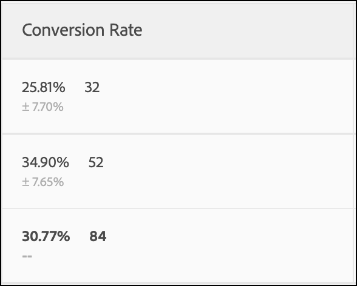
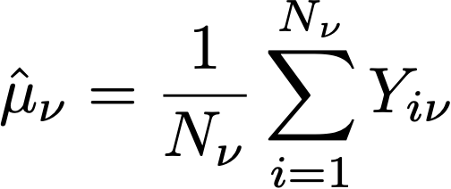
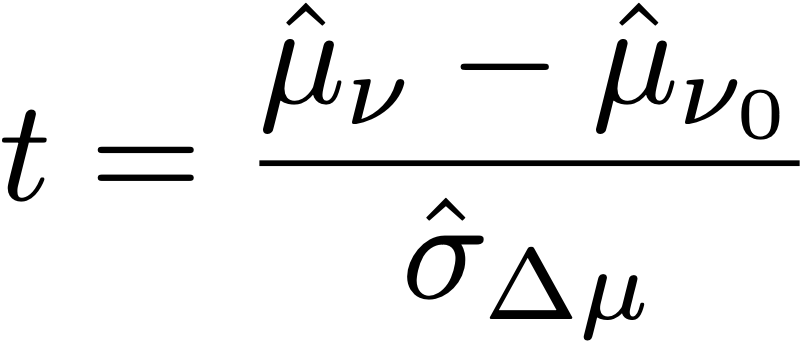

# Calcoli statistici nei test A/Bn

Questo articolo documenta i calcoli statistici dettagliati utilizzati nei test A/Bn manuali in [!DNL Adobe Target]. Le definizioni vengono fornite per [!UICONTROL Tasso di conversione], [!UICONTROL Intervallo di affidabilità del tasso di conversione], [!UICONTROL Incremento], [!UICONTROL Intervallo di affidabilità per Incremento] e [!UICONTROL Affidabilità].

>[!NOTE]
>
>Le informazioni contenute in questo articolo sostituiscono il file pdf *Calcoli di Adobe Target per test A/B* precedentemente disponibile per il download su questo sito.

![Report di destinazione che mostra il [!UICONTROL Tasso di conversione], [!UICONTROL Incremento medio e intervallo di affidabilità] e [!UICONTROL Affidabilità] di un&#39;attività Test A/B.](/help/main/c-reports/statistical-methodology/img/target_report.png)

## Prestazioni medie

Nella sezione seguente vengono illustrati i calcoli utilizzati nell&#39;illustrazione precedente.

### Campagne RPV (tasso di conversione e ricavo per visitatore)

La figura seguente mostra [!UICONTROL Tasso di conversione], [!UICONTROL Intervallo di affidabilità del tasso di conversione] e il numero di [!UICONTROL Conversioni] in un report [!DNL Target]. Ad esempio, la prima riga mostra che per l&#39;Esperienza A: il [!UICONTROL Tasso di conversione] è 25,81% con un [!UICONTROL Intervallo di affidabilità] di ±7,7% e sono state registrate 32 conversioni. Dato che l’esperienza è stata vista da 124 visitatori, questo equivale a 32/124 = 25,81%.

<p style="text-align:center;"></p>

Il tasso di conversione o **media**, *μ<sub></sub>*, per ogni esperienza ** in un esperimento è definito come un rapporto tra la somma della metrica e il numero di unità assegnate a tale metrica, *N<sub></sub>*:

<p style="text-align:center;"></p>

Qui,

* *Y<sub>i</sub>* è il valore della metrica per ogni unità *i*, assegnata a una determinata esperienza **.

* La somma delle unità *i* dipende dalla scelta della metodologia di conteggio.

   * Se si utilizza *[!UICONTROL Visitatori]* come metodologia di conteggio, ogni unità è un visitatore univoco definito come partecipante univoco all&#39;attività per tutta la durata dell&#39;attività.
   * Se si utilizza *[!UICONTROL Visite]* come metodologia di conteggio, ogni unità è una visita univoca definita come partecipante univoco a un&#39;esperienza durante una sessione di [!DNL Target] (con un `sessionId` univoco). Quando `sessionId` cambia o il visitatore raggiunge il passaggio di conversione, viene conteggiata una nuova visita.
   * Se si utilizza *[!UICONTROL Impression attività]* come metodologia di conteggio, ogni unità è un&#39;impression univoca definita come ogni volta che un visitatore carica una pagina dell&#39;attività.

## [!UICONTROL Intervallo di affidabilità della media]/[!UICONTROL Tasso di conversione]

L’intervallo di confidenza del tasso di conversione è intuitivamente definito come un intervallo di possibili tassi di conversione coerente con i dati sottostanti.

Quando si eseguono esperimenti, il tasso di conversione per una determinata esperienza è una *stima* del tasso di conversione &quot;true&quot;. Per quantificare l&#39;incertezza in questa stima, [!DNL Target] utilizza un intervallo di affidabilità. [!DNL Target] riporta sempre un intervallo di affidabilità del 95%, il che significa che alla fine il 95% degli intervalli di affidabilità calcolati include il tasso di conversione effettivo dell&#39;esperienza.

Viene inoltre riportato un numero di &quot;affidabilità&quot; accanto all’esperienza attualmente leader o vincente. Questa cifra viene segnalata solo finché l&#39;[!UICONTROL affidabilità] dell&#39;esperienza principale non raggiunge almeno il 60%. Se nell’attività sono presenti due esperienze, questo numero rappresenta il livello di affidabilità con cui le prestazioni dell’esperienza sono migliori rispetto all’altra esperienza. Se nell’attività sono presenti più di due esperienze, questo numero rappresenta il livello di affidabilità con cui le prestazioni dell’esperienza sono migliori rispetto all’esperienza di &quot;controllo&quot; definita. Se l’esperienza &quot;Controllo&quot; sta vincendo, non viene segnalato alcun valore &quot;Affidabilità&quot;.

Un intervallo di affidabilità del 95% del tasso di conversione *μ<sub></sub>* è definito come l&#39;intervallo di valori:

<p style="text-align:center;"></p>

Dove l’errore standard per la media è definito come

<p style="text-align:center;"></p>

Se si utilizza una stima imparziale della deviazione standard del campione:

<p style="text-align:center;"></p>

Quando la campagna è basata su un tasso di conversione (ad esempio, la metrica di conversione è binaria), l’errore standard si riduce a:

<p style="text-align:center;"></p>

## Incremento

La figura seguente mostra [!UICONTROL Incremento] e [!UICONTROL Intervallo di affidabilità dell&#39;Incremento] in un report [!DNL Target]. Il numero rappresenta la media dell&#39;intervallo dei limiti di incremento e la freccia indica se l&#39;incremento è positivo o negativo. La freccia viene visualizzata in grigio fino a quando l’affidabilità non supera il 95%. Una volta superata la soglia di affidabilità, la freccia diventa verde o rossa in base a un incremento positivo o negativo.

<p style="text-align:center;"></p>

L&#39;incremento tra un&#39;esperienza ** e l&#39;esperienza di controllo *<sub>0</sub>* è il &quot;delta&quot; relativo nei tassi di conversione, definito come

<p style="text-align:center;"></p>

Laddove i singoli tassi di conversione sono definiti sopra. Più semplicemente,

```
Lift(Experience N) = (Performance_Experience_N - Performance_Control)/ Performance_Control
```

Se il tasso di conversione dell&#39;esperienza di controllo *<sub>0</sub>* è 0, non vi è alcun incremento.

## [!DNL Confidence Interval of Lift]

Il grafico boxplot nella colonna [!UICONTROL Incremento medio e intervallo di affidabilità] rappresenta il valore medio e l&#39;intervallo di affidabilità del 95% [!UICONTROL Incremento]. Il grafico a caselle è grigio quando vi è una sovrapposizione tra l’intervallo di affidabilità di una determinata esperienza non di controllo e l’intervallo di affidabilità dell’esperienza di controllo. Il grafico a caselle è verde o rosso quando l’intervallo di affidabilità dell’esperienza fornita è superiore o inferiore all’intervallo di affidabilità dell’esperienza di controllo.

L&#39;errore standard dell&#39;incremento tra un&#39;esperienza ** e l&#39;esperienza di controllo *<sub>0</sub>* è definito come:

<p style="text-align:center;"></p>

Quindi l’intervallo di affidabilità del 95% dell’incremento è:

<p style="text-align:center;"></p>

Questo calcolo utilizza il metodo &quot;Delta&quot; ed è descritto [più dettagliatamente in questo documento](/help/main/assets/confidence_interval_lift.pdf)

## [!UICONTROL Affidabilità]

L&#39;ultima colonna mostra l&#39;affidabilità in un report [!DNL Target]. L’affidabilità di un’esperienza è una probabilità (espressa in percentuale) di ottenere un risultato estremo quanto quello osservato, data l’ipotesi nulla è vera. In termini di valori p, l&#39;affidabilità visualizzata è *1 - valore p*. Intuitivamente, una maggiore affidabilità significa che è meno probabile che l’esperienza di controllo e quella di non controllo abbiano tassi di conversione uguali.

In [!DNL Target] viene eseguito un test t **Welch** a due code tra l&#39;esperienza di test e l&#39;esperienza di controllo per verificare se i mezzi delle esperienze di test e di controllo sono gli stessi. Poiché di solito non sappiamo se le dimensioni del campione e le varianze di due gruppi sono uguali prima di eseguire l&#39;esperimento e [!DNL Target] consente anche di avere percentuali di traffico diverse inviate a ogni esperienza, non si presume che la varianza per ogni esperienza sia uguale. Pertanto, il test t di Welch viene scelto al posto del test t di Student.

Per eseguire il test t di Welch, iniziamo prima a calcolare la statistica t e i gradi di libertà, quindi eseguiamo un test t a due code per generare il valore p. Infine, calcoliamo l’affidabilità in base al valore p.

La statistica *t* è definita come la differenza tra le medie di due variabili casuali indipendenti, ** e *<sub>0</sub>*, divisa per l&#39;errore standard della differenza:

<p style="text-align:center;"></p>

Dove *μ<sub>v</sub>* e *μ<sub>v0</sub>* sono le medie rispettivamente di *μ* e *<sub>0</sub>* e l&#39;errore standard della differenza tra *μ<sub>v</sub>* e *μ<sub>v0</sub>* è dato da:

<p style="text-align:center;"></p>

Dove *<sup>2</sup><sub>v</sub>* e *Prodotti finiti<sup>2</sup><sub>v<sub>0</sub></sub>* sono le varianze di due esperienze ** e *0</sub>* rispettivamente e *N<sub>v</sub>* e *N<sub>v<sub>0</sub></sub>* sono le dimensioni campione rispettivamente di ** e *24}0</sub>*.<sub><sub>

Per il test t di Welch, il grado di libertà è calcolato come segue:

<p style="text-align:center;"></p>

E il grado di libertà per ** e *<sub>0</sub>* è definito come:

<p style="text-align:center;"></p>

<p style="text-align:center;"></p>

Quindi il valore p può essere calcolato dall&#39;area nelle code della distribuzione *t*:

<p style="text-align:center;"></p>

Infine, l&#39;attendibilità segnalata in [!DNL Target] è definita come:

<p style="text-align:center;"></p>

## Esecuzione dei calcoli offline

Il [rapporto CSV scaricato](/help/main/c-reports/c-report-settings/downloading-data-in-csv-file.md) include solo dati non elaborati; non include metriche calcolate come ricavi per visitatore, incremento o affidabilità, utilizzate per i test A/B.

Per calcolare queste quantità statistiche, scarica il file Excel del [!DNL Target] [calcolatore di affidabilità completo](/help/main/assets/complete_confidence_calculator.xlsx) per immettere il valore dell&#39;attività.
