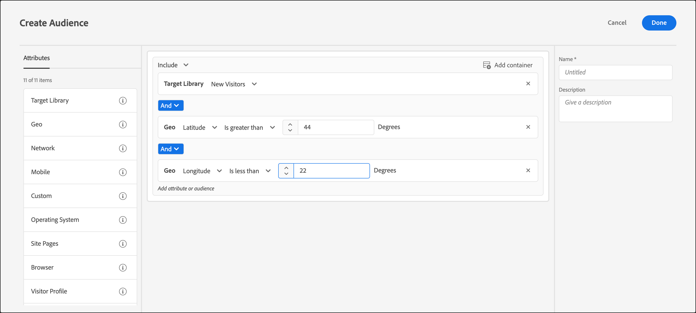

# Geo

Utilizzare i tipi di pubblico in [!DNL Adobe Target] per eseguire il targeting degli utenti in base alla loro posizione geografica.

I parametri di geolocalizzazione consentono di eseguire il targeting di attività ed esperienze in base alla posizione geografica dei visitatori. Puoi includere o escludere i visitatori in base al relativo paese, Stato/provincia, città, codice postale, latitudine, longitudine, DMA o gestore di telefonia mobile. Questi dati vengono inviati con ogni [!DNL Target] e si basa sull’indirizzo IP del visitatore. Seleziona questi parametri come qualsiasi altro valore di targeting.

## Creare un pubblico con geotargeting {#section_49CBFFAAC8694C4AAD3DE4B2DB7B05DE}

1. Nell’interfaccia di [!DNL Target] fai clic su **[!UICONTROL Pubblico]** > **[!UICONTROL Crea pubblico]**.
1. Assegna un nome al pubblico e aggiungi una descrizione facoltativa.
1. Trascinamento della selezione **[!UICONTROL Geo]** nel riquadro audience builder (generatore di pubblico).

1. Fai clic su **[!UICONTROL Seleziona]**, quindi scegli una delle seguenti opzioni:

   * [!UICONTROL Paese/Area geografica]
   * [!UICONTROL Stato]
   * [!UICONTROL Città]
   * [!UICONTROL Codice postale]
   * [!UICONTROL Longitudine]
   * [!UICONTROL Latitudine]
   * [!UICONTROL DMA]
   * [!UICONTROL Gestore di telefonia mobile]

   Le informazioni geografiche di un visitatore sono determinate dall&#39;indirizzo IP di origine di un [!DNL Target] richiesta di posizione (richiesta mbox). La risoluzione IP-to-geo viene eseguita per la prima chiamata di una nuova sessione. Ciò significa che, se l’indirizzo IP di un visitatore cambia a metà sessione di una visita, le informazioni geografiche si basano ancora sull’indirizzo IP della prima chiamata.

   Per [!UICONTROL Operatore di telefonia mobile], [!DNL Target] utilizza i dati di registrazione dell’indirizzo IP (chi possiede il blocco di indirizzi IP) per determinare il gestore di telefonia mobile appropriato utilizzando [Codici nazionali mobili (MCC) e codici di rete mobile MNC](https://www.mcc-mnc.com).

1. Specifica un operatore e il valore appropriato.
1. (Facoltativo) Imposta regole aggiuntive per il pubblico.
1. Fai clic su **[!UICONTROL Fine]**.

L’illustrazione seguente mostra un pubblico che include gli utenti che accedono all’attività da una latitudine maggiore di 44° e una longitudine inferiore a 22°.

## Precisione {#section_D63D5FFCB49C42F9933AFD0BD7C79DF1}

La precisione del geotargeting dipende da diversi fattori. Le connessioni Wi-Fi sono più accurate delle reti cellulari. Quando un visitatore utilizza una connessione dati cellulare, la precisione della ricerca geografica può essere influenzata dalla posizione, dalla relazione dati del provider con [DeviceAtlas](https://deviceatlas.com/device-data/user-agent-tester)e altri fattori. Le connessioni di rete basate su stazioni cellulari possono essere meno precise delle connessioni cablate o Wi-Fi. Inoltre, l&#39;indirizzo IP di un visitatore potrebbe essere mappato sulla posizione ISP del visitatore, che potrebbe non essere la stessa posizione effettiva del visitatore. Alcuni problemi di geolocalizzazione mobile possono essere risolti utilizzando il [API di geolocalizzazione](https://developer.mozilla.org/en-US/docs/Web/API/Geolocation_API).

Nella seguente tabella viene mostrata la precisione delle informazioni geografiche basate su IP da [DigitalEnvoy](https://www.digitalelement.com/solutions/) per connessioni internet cablate o Wi-Fi. DigitalEnvoy fornisce i dati più precisi del settore. La precisione globale è superiore al 99,9% a livello di paese e fino al 97% a livello di città. Le informazioni di precisione non si applicano alle reti basate su stazioni cellulari.

| Paese | Stato | Città | Area geografica |
|--- |--- |--- |--- |
| Stati Uniti | 99,99% | 96% | 94% |
| Canada | 99,99% | 96% | 94% |
| Europa | 99,99% |  |  |
| Regno Unito | 99,99% |  | 87% |
| Germania | 99,99% | 95% | 93% |
| Scandinavia | 99% | Circa 90-93% | Circa 84-86% |
| Spagna | 99,99% | Circa 90% | Circa 95-99% |
| Asia | 99% | Circa 94-96% | Circa 90-93% |
| Giappone | 99,99% | Circa 94-96% | Circa 90-93% |
| Australia | 99,99% | 94% | 91% |

## Utilizzare il geotargeting negli script di profilo {#section_92C93138542C4A94997E3F4BE3F5DA28}

Puoi utilizzare le informazioni geografiche per gli script di profilo.

Ad esempio, utilizza:

* `profile.geolocation.country`
* `profile.geolocation.state`
* `profile.geolocation.city`
* `profile.geolocation.zip`
* `profile.geolocation.dma`
* `profile.geolocation.domainName`
* `profile.geolocation.ispName`
* `profile.geolocation.connectionSpeed`
* `profile.geolocation.mobileCarrier`

Pertanto, è possibile scrivere un&#39;espressione di targeting denominata “Proveniente da America del Nord” con il codice seguente:

`return profile.geolocation.country == 'united states' || profile.geolocation.country == 'canada' || profile.geolocation.country == 'mexico';`

## Utilizzare i valori di geotargeting come token {#section_E7F7FDF62C3B4934A6565D04B24655F6}

È possibile utilizzare `profile.geolocation` direttamente come token in offerte, plug-in e così via.

Ad esempio, utilizza:

* `${profile.geolocation.country}`
* `${profile.geolocation.state}`
* `${profile.geolocation.city}`
* `${profile.geolocation.zip}`
* `${profile.geolocation.dma}`
* `${profile.geolocation.domainName}`
* `${profile.geolocation.ispName}`
* `${profile.geolocation.connectionSpeed}`
* `${profile.geolocation.mobileCarrier}`
* `${profile.geolocation.latitude}`
* `${profile.geolocation.longitude}`

## Domande frequenti sul geotargeting {#section_DD308A53AF0F48FA8C81423580561FE7}

Le seguenti domande vengono spesso poste in merito al geotargeting:

### Come posso specificare latitudine e longitudine?

+++Visualizza dettagli
* Il valore di latitudine e longitudine deve essere un valore numerico espresso in gradi.
* Il valore di latitudine e longitudine può avere una precisione massima di cinque posizioni decimali.
* Il valore della latitudine deve essere compreso tra -90 e 90.
* Il valore della longitudine deve essere compreso tra -180 e 180.

+++

### Come funziona il geotargeting per i dispositivi mobili?

+++Visualizza dettagli La maggior parte degli utenti di dispositivi mobili accede al contenuto tramite WiFi, il che significa [!DNL Target]Il geotargeting basato su IP è preciso quanto quello su un desktop. Le connessioni basate su stazioni cellulari possono essere meno precise in quanto l&#39;indirizzo IP del visitatore si basa sulla stazione dalla quale viene prelevato il segnale. Alcuni problemi di geolocalizzazione mobile possono essere risolti utilizzando il [API di geolocalizzazione](https://developer.mozilla.org/en-US/docs/Web/API/Geolocation_API).

+++

### Come vengono gestiti i visitatori provenienti da AOL nella funzione Geo?

+++Visualizza dettagli A causa del modo in cui AOL proxy il traffico, [!DNL Target] possono essere indirizzati solo a livello nazionale. Ad esempio, una campagna destinata alla Francia ha come target con successo gli utenti AOL in Francia. Tuttavia, una campagna destinata a Parigi non è indirizzata correttamente agli utenti AOL a Parigi. Se l&#39;intento è quello di eseguire il targeting specifico degli utenti di AOL, puoi impostare il campo regione su “AOL”. Invero, puoi eseguire il targeting degli utenti di AOL degli Stati Uniti specificando due condizioni di targeting: corrispondenza esatta di paese con “Stati Uniti” e corrispondenza esatta di regione con “AOL”.

+++

### Qual è la granularità della posizione fornita dal geotargeting?

+++Visualizza dettagli
* Paese: globale
* Stato/provincia/regione: globale
* Città: globale
* Codice postale: Stati Uniti, Germania, Canada
* DMA/ITV (Regno Unito): Stati Uniti, Regno Unito
* Gestore di telefonia mobile: globale

+++

### Come posso testare le mie attività simulando di essere un utente proveniente da una posizione diversa?

+++Visualizza dettagli
* **at.js 1.*x***: Puoi sovrascrivere l’indirizzo IP con un indirizzo IP di una posizione diversa e utilizzare la `mboxOverride.browserIp url` parametro . Ad esempio, se la tua azienda è nel Regno Unito ma la campagna globale è indirizzata ai visitatori di Auckland, Nuova Zelanda, utilizza questo stile di URL presupponendo che `60.234.0.39` è un indirizzo IP in Auckland:

   `https://www.mycompany.com?mboxOverride.browserIp=60.234.0.39`

   Elimina i cookie prima di eseguire il test dell’attività.

   >[!NOTE]
   >
   >`mboxOverride.browserIp` è supportato in at.js 1.*x*. Questa funzionalità non è supportata in at.js 2.*x*.

* **Equivalente in at.js 2.*x***: Per sovrascrivere l’indirizzo IP con at.js 2.*x*, installa un&#39;estensione/plug-in del browser (ad esempio X-Forwarded-For Header per Chrome o Firefox). Questa estensione ti consente di trasmettere l’intestazione x-inoltrata-for nelle richieste di pagina.

+++

### Come vengono mappati territori come Porto Rico e Hong Kong nella struttura di geotargeting?

+++Visualizza i dettagli Puerto Rico, Hong Kong e altri territori sono trattati come valori separati &quot;Country&quot;.

+++

### Does [!DNL Target] acquisisci (e archivia) informazioni come il codice postale quando l’attività è oggetto di targeting con le funzionalità di targeting di geolocalizzazione?

+++Vedere i dettagli No, [!DNL Target] utilizza i dati geografici solo durante la sessione, quindi i dati vengono scartati.

+++

## Video di formazione: Creazione di tipi di pubblico 

Questo video contiene informazioni sull&#39;utilizzo delle categorie di pubblico.

* Creazione di un pubblico
* Definizione delle categorie di pubblico

>[!VIDEO](https://video.tv.adobe.com/v/17392)
