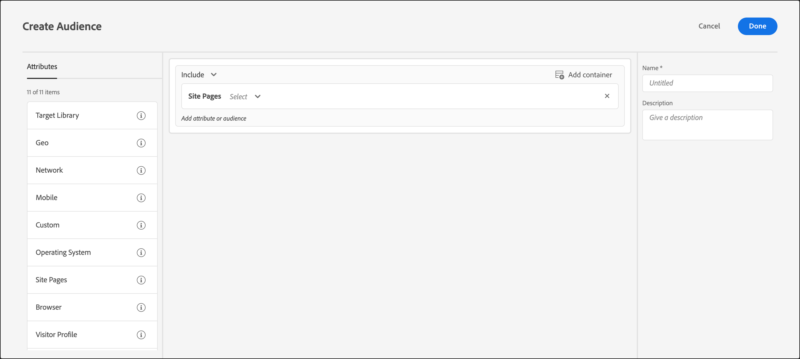

# Pagine del sito

Puoi rivolgerti ai visitatori utilizzando [!DNL Adobe Target] che accedono a una pagina specifica del sito.

1. Nell’interfaccia di [!DNL Target] fai clic su **[!UICONTROL Pubblico]** > **[!UICONTROL Crea pubblico]**.
1. Assegna un nome al pubblico e aggiungi una descrizione facoltativa.
1. Trascinamento della selezione **[!UICONTROL Pagine del sito]** nel riquadro audience builder (generatore di pubblico).

   

1. Fai clic sul pulsante **[!UICONTROL Seleziona]** dall’elenco a discesa, seleziona una delle opzioni seguenti, quindi configura la regola come desiderato.

   Le opzioni disponibili e i valutatori negli elenchi a discesa successivi nella regola variano a seconda dell’opzione scelta. L’illustrazione seguente mostra le opzioni disponibili se scegli [!UICONTROL Pagina corrente]:

   

   Le seguenti opzioni sono disponibili nell’elenco a discesa iniziale quando si sceglie [!UICONTROL Seleziona].

   * **[!UICONTROL Pagina corrente]:** La pagina che l’utente sta visualizzando.

      Se scegli questa opzione, nel secondo elenco a discesa sono disponibili le seguenti opzioni:

      * [!UICONTROL URL] (Per ulteriori informazioni su come [!DNL Target] valuta gli URL, vedi [Domande frequenti su destinazioni e pubblico](/help/main/c-target/c-troubleshooting-targets-and-audiences/troubleshooting-targets-and-audiences.md).)
      * [!UICONTROL Dominio]
      * [!UICONTROL Query]
      * [!UICONTROL Sottodominio]
      * [!UICONTROL Dominio di primo livello]
      * [!UICONTROL Percorso]
      * [!UICONTROL Frammento hash (#)]
   * **[!UICONTROL Pagina precedente]:** La pagina visualizzata dall’utente prima di fare clic sulla pagina corrente. Affinché la pagina possa essere tracciata, l’utente deve fare clic sulla pagina precedente alla pagina corrente. La pagina precedente non viene tracciata se l’utente digita un nuovo URL nel browser. Il contenuto effettivo di questa pagina dipende dalla progettazione del sito. Ad esempio, se nella pagina corrente sono visualizzate informazioni su un prodotto specifico, la pagina precedente potrebbe essere una pagina di categoria in cui il visitatore seleziona l’elemento specifico. Ad esempio, una pagina che mostra diverse telecamere di un determinato tipo, o potrebbe essere la home page che porta alla pagina finale.

      Se scegli questa opzione, nel secondo elenco a discesa sono disponibili le seguenti opzioni:

      * [!UICONTROL URL] (Per ulteriori informazioni su come Target valuta gli URL, consulta [Domande frequenti su destinazioni e pubblico](/help/main/c-target/c-troubleshooting-targets-and-audiences/troubleshooting-targets-and-audiences.md).)
      * [!UICONTROL Dominio]
      * [!UICONTROL Query]
      * [!UICONTROL Sottodominio]
      * [!UICONTROL Dominio di primo livello]
      * [!UICONTROL Percorso]
   * **[!UICONTROL Pagina di destinazione]:** La pagina di destinazione è la prima pagina che il visitatore vede quando accede al sito. Ad esempio, se il visitatore fa clic su un collegamento su Google che porta a una pagina di categoria, la pagina di categoria è la pagina di destinazione. Se il collegamento rimanda alla pagina principale, quest’ultima corrisponde alla pagina di destinazione. La pagina di destinazione viene memorizzata per la sessione del visitatore. Puoi eseguire un targeting più approfondito nel sito in base alla pagina di destinazione del visitatore nella sessione.

      Se scegli questa opzione, nel secondo elenco a discesa sono disponibili le seguenti opzioni:

      * [!UICONTROL URL] (Per ulteriori informazioni su come Target valuta gli URL, consulta [Domande frequenti su destinazioni e pubblico](/help/main/c-target/c-troubleshooting-targets-and-audiences/troubleshooting-targets-and-audiences.md).)
      * [!UICONTROL Dominio]
      * [!UICONTROL Query]
      * [!UICONTROL Sottodominio]
      * [!UICONTROL Dominio di primo livello]
      * [!UICONTROL Percorso]
      * [!UICONTROL Frammento hash (#)]

      >[!NOTE]
      >
      >L’oggetto `landing.url` viene reimpostato in caso di modifica del sottodominio o di sostituzione diretta dell’URL.

   * **[!UICONTROL Intestazione HTTP]:** Questa opzione valuta le informazioni nell’intestazione HTTP della [!DNL Target] richiesta. Ad esempio, se l’intestazione HTTP contiene informazioni sulla lingua, puoi creare una regola che contiene la variabile `Accept-Language: es` condizione per eseguire il targeting dei visitatori che accedono alla pagina in spagnolo.

      Se scegli questa opzione, nel secondo elenco a discesa sono disponibili le seguenti opzioni:

      * [!UICONTROL Accetta]
      * [!UICONTROL Accept-Charset]
      * [!UICONTROL Accept-Encoding]
      * [!UICONTROL Accept-Language]
      * [!UICONTROL Autorizzazione]
      * [!UICONTROL Controllo cache]
      * [!UICONTROL Connessione]
      * [!UICONTROL Lunghezza del contenuto]
      * [!UICONTROL Content-MDS]
      * [!UICONTROL Content-Type]
      * [!UICONTROL Date]
      * [!UICONTROL Attesa]
      * [!UICONTROL Da]
      * [!UICONTROL Host]
      * [!UICONTROL If-Match]
      * [!UICONTROL If-Modified-Since]
      * [!UICONTROL If-None-Match]
      * [!UICONTROL If-Range]
      * [!UICONTROL If-Unmodified-Since]
      * [!UICONTROL Max-Forwards]
      * [!UICONTROL Praga]
      * [!UICONTROL Autorizzazione proxy]
      * [!UICONTROL Intervallo]
      * [!UICONTROL Referrer]
      * [!UICONTROL TE]
      * [!UICONTROL Aggiornamento]
      * [!UICONTROL Agente utente]
      * [!UICONTROL Via]
      * [!UICONTROL Attenzione]

   Se hai scelto [!UICONTROL Pagina corrente], [!UICONTROL Pagina precedente]oppure [!UICONTROL Pagina di destinazione], [!UICONTROL Dominio] e [!UICONTROL Query] sono disponibili le opzioni . Quando scegli queste opzioni, considera quanto segue:

   * **Dominio:** il dominio completo della pagina. Nella specificazione di un dominio, è consigliabile utilizzare “contiene”, Ad esempio, &quot;Dominio uguale a facebook.com&quot; non accetta `m.facebook.com` o `www.facebook.com`. &quot;Dominio contiene facebook.com&quot; accetta qualsiasi variante di facebook.com.
   * **Query:** il contenuto dell’URL dopo il primo punto interrogativo (?).

      `foo.html?e0a72cb2a2c7`

1. (Facoltativo) Imposta regole aggiuntive per il pubblico.
1. Fai clic su **[!UICONTROL Fine]**.

Puoi anche creare un pubblico per le pagine del sito utilizzando un “parametro di query definito dall’utente” o una “intestazione definita dall’utente”.

Utilizza:

* Parametro query se la regola selezionata dall&#39;utente è [!UICONTROL Pagina corrente], [!UICONTROL Pagina di destinazione]oppure [!UICONTROL Pagina precedente]
* Intestazione se la regola selezionata dall’utente è un’intestazione HTTP

## Risoluzione dei problemi relativi al {#ts}

* Affinché il pubblico della pagina di destinazione funzioni correttamente, le richieste devono avere `mboxReferrer` set di parametri (per l’API di consegna il `context.address.referringUrl` che la libreria JavaScript at.js preleva dalla pagina utilizzando il `document.referrer` attributo. Questo `HTMLDocument` attribute restituisce l’URI della pagina da cui l’utente ha navigato. Il valore di questo attributo è una stringa vuota quando l&#39;utente passa direttamente alla pagina (non tramite un collegamento, ma, ad esempio, tramite un segnalibro).

   Se questo comportamento non soddisfa le tue esigenze, considera l&#39;esecuzione di una delle seguenti azioni:

   * Pass [Parametri mbox](https://developer.adobe.com/target/implement/client-side/atjs/global-mbox/pass-parameters-to-global-mbox/) a [!DNL Target] da utilizzare a scopo di targeting.
   * Utilizza un [Attività Test A/B](/help/main/c-activities/t-test-ab/test-ab.md) anziché un’attività della pagina di destinazione. Le attività di test A/B non cambiano le esperienze per lo stesso visitatore.
   * Utilizza un [profilo visitatore](/help/main/c-target/c-audiences/c-target-rules/visitor-profile.md) invece.

* Quando si utilizzano i valutatori &quot;inizia/termina con&quot; su stringhe contenenti virgole, queste stringhe vengono valutate come una matrice di valori in cui viene valutato ogni valore separato da virgole. Ad esempio, se disponi del valore per un’intestazione: `Accept-Language: en,zh;q=0.9,en-IN;q=0.8,zh-CN;q=0.7` è idoneo per condizioni quali:
   * inizia con zh,
   * inizia con en,
   * termina con 0,7,
   * termina con 0,8.

## Video di formazione: Creazione di tipi di pubblico

Questo video contiene informazioni sull&#39;utilizzo delle categorie di pubblico.

* Creazione di un pubblico
* Definizione delle categorie di pubblico

>[!VIDEO](https://video.tv.adobe.com/v/17392)
