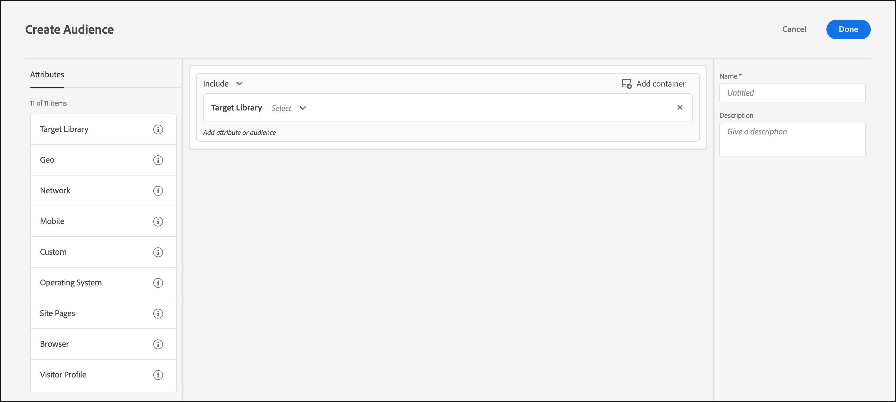

# Libreria di Target

Utilizza [!DNL Adobe Target] per eseguire il targeting degli utenti in base a regole di targeting predefinite.

I tipi di pubblico predefiniti nella categoria [!UICONTROL Libreria di Target] sono tipi di pubblico legacy e sono presenti in altre categorie. Per ulteriori informazioni e best practice, consulta [Domande frequenti su destinazioni e pubblico](/help/main/c-target/c-troubleshooting-targets-and-audiences/troubleshooting-targets-and-audiences.md#concept_C4EE4B8F4840430CBD798D579A8F208D).

1. Nell&#39;interfaccia [!DNL Target], fare clic su **[!UICONTROL Tipi di pubblico]** > **[!UICONTROL Crea pubblico]**.
1. Assegna un nome al pubblico e aggiungi una descrizione facoltativa.
1. Trascina e rilascia **[!UICONTROL Libreria di Target]** nel riquadro generatore di pubblico.

   

1. Fai clic su **[!UICONTROL Seleziona]**, quindi seleziona una regola di targeting predefinita.

   Le regole di targeting predefinite includono [!UICONTROL Sistema operativo Windows], [!UICONTROL Dispositivo tablet], [!UICONTROL Browser Safari], [!UICONTROL Visitatori di ritorno], [!UICONTROL Con riferimento da Google] e altro ancora.

   Il pubblico predefinito &quot;[!UICONTROL Dispositivo tablet]&quot; è già idoneo quando l&#39;agente utente contiene una delle seguenti stringhe (alcune delle quali sono numeri di modello di dispositivi). Non devi creare regole personalizzate di targeting per questi dispositivi.

   Kindle, Silk, iPad, Sony Tablet, TF101, GT-P1000, GT-P1000R, GT-P1000M, SGH-T849, SHW-M180S, GT-I9000T, BNTV250 e Tablet PC.

1. (Facoltativo) Imposta regole aggiuntive per il pubblico.
1. Fai clic su **[!UICONTROL Fine]**.

## Video di formazione: Creazione di tipi di pubblico

Questo video contiene informazioni sull&#39;utilizzo delle categorie di pubblico.

* Creazione di un pubblico
* Definizione delle categorie di pubblico

>[!VIDEO](https://video.tv.adobe.com/v/17392)
