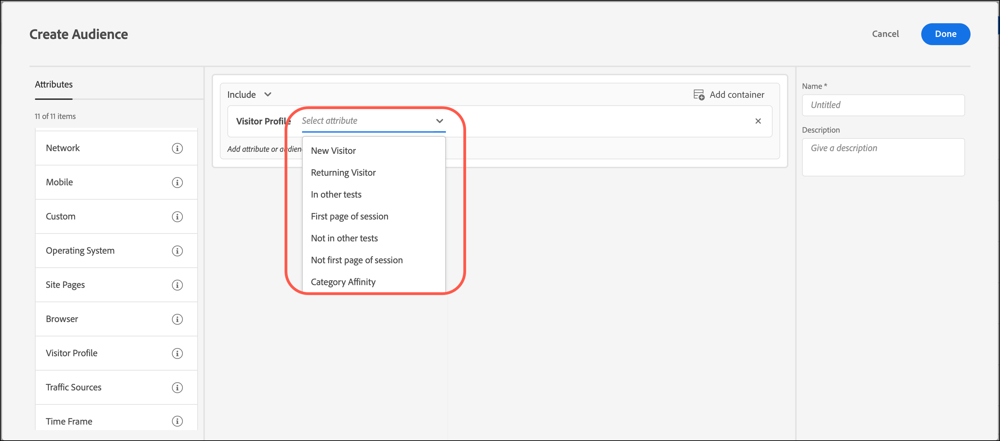

# Profilo visitatore

Crea tipi di pubblico in [!DNL Adobe Target] per eseguire il targeting dei visitatori che soddisfano parametri di profilo specifici.

1. Nell&#39;interfaccia [!DNL Target], fare clic su **[!UICONTROL Audiences]** > **[!UICONTROL Create Audience]**.
1. Assegna un nome al pubblico e aggiungi una descrizione facoltativa.
1. Trascina **[!UICONTROL Visitor Profile]** nel riquadro Generatore di pubblico.

1. Fare clic su **[!UICONTROL Select]**, quindi selezionare una delle opzioni seguenti:

   

   I parametri del profilo del visitatore vengono trasmessi tramite mbox (profilo). Puoi eseguire il targeting dei visitatori nuovi o di ritorno, o includere tutti gli utenti.

   * [!UICONTROL New Visitor]
   * [!UICONTROL Returning Visitor]
   * [!UICONTROL In Other Tests]
   * [!UICONTROL Not In Other Tests]
   * [!UICONTROL First Page of Session]
   * [!UICONTROL Not First Page of Session]
   * [!UICONTROL Category Affinity]

   Un profilo visitatore viene creato nella memoria Edge locale per ogni chiamata mbox con nuovo `mboxPC`. Dopo 30 minuti di inattività, il profilo viene salvato nel database [!DNL Target] ed è accessibile da altri server Edge.

   Quando un visitatore del sito accede a metà sessione e ottiene un `3rdpartyId`, tutti gli attributi di profilo precedentemente caricati associati a `3rdPartyId` sono immediatamente disponibili.

   Puoi eseguire il targeting di parametri di profilo personalizzati e parametri `user.`. Scegli il parametro che desideri utilizzare per eseguire il targeting dell’attività. Se il parametro desiderato non viene visualizzato, significa che non è stato attivato da una mbox.

1. (Facoltativo) Imposta regole aggiuntive per il pubblico.
1. Fare clic su **[!UICONTROL Done]**.

## Video di formazione: Creazione di tipi di pubblico 

Questo video contiene informazioni sull&#39;utilizzo delle categorie di pubblico.

* Creazione di un pubblico
* Definizione delle categorie di pubblico

>[!VIDEO](https://video.tv.adobe.com/v/17392)
