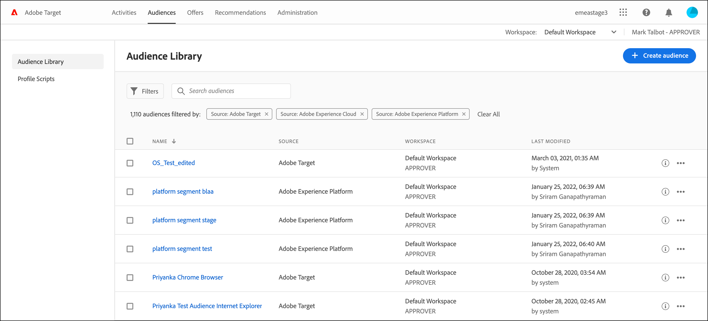

# Crea tipi di pubblico in [!DNL Target]

Creare tipi di pubblico personalizzati e salvarli nella libreria [!DNL Adobe Target] di [!UICONTROL Audiences] per utilizzarli nelle attività. Puoi anche copiare un pubblico esistente da modificare per crearne uno simile e combinare più tipi di pubblico.

## Panoramica sul pubblico

I tipi di pubblico sono definiti da regole che determinano chi è incluso o escluso da un&#39;attività di [!DNL Target]. Una definizione di pubblico può includere più regole e ogni regola può includere più parametri. Le definizioni di pubblico complesse utilizzano gli operatori booleani AND e OR (E/O) per combinare regole e parametri per poter controllare in modo dettagliato quali visitatori del sito vengono conteggiati come partecipanti all&#39;attività.

Quando si combinano regole o parametri con AND, qualsiasi potenziale membro del pubblico deve soddisfare *tutte* le condizioni definite per essere incluso come partecipante. Ad esempio, se si definisce una regola del sistema operativo e una regola del browser, solo i visitatori che utilizzano il sistema operativo definito *e* il browser definito sono inclusi nell&#39;attività.

Quando si combinano regole o parametri con OR, qualsiasi membro potenziale del pubblico deve soddisfare solo una singola condizione definita per essere incluso come partecipante. Ad esempio, se si definiscono più regole mobili connesse da OR, i visitatori che soddisfano *uno* dei criteri definiti sono inclusi nell&#39;attività.

È possibile combinare entrambi gli operatori booleani per creare regole complesse. Tuttavia, gli operatori allo stesso livello di regola devono corrispondere. L&#39;interfaccia utente applica automaticamente l&#39;operatore corretto.

Ad esempio, la regola seguente è destinata ai visitatori che utilizzano [!DNL Chrome] *o* [!DNL Firefox] in un computer [!DNL Windows]:

>[!NOTE]
>
>Fai attenzione a evitare la creazione di regole che escludano tutti i potenziali membri del pubblico. Ad esempio, non è possibile che qualcuno visiti una pagina utilizzando [!DNL Chrome] *e* [!DNL Firefox] contemporaneamente.

## Creare un tipo di pubblico

1. Fare clic su **[!UICONTROL Audiences]** nella barra dei menu superiore.

   

1. Dall&#39;elenco [!UICONTROL Audiences], fare clic su **[!UICONTROL Create Audience]**.

   Oppure

   Per copiare un pubblico esistente, dall&#39;elenco [!UICONTROL Audiences], fare clic sull&#39;icona **[!UICONTROL More Actions]** (  ) per il pubblico da copiare, quindi fare clic su **[!UICONTROL Duplicate]**. Ora puoi modificare il pubblico per crearne uno simile.

1. Digita un nome descrittivo e univoco per il pubblico e una descrizione facoltativa.

   I nomi del pubblico non possono iniziare con i seguenti caratteri:

   `=  +  -  !  @`

   I nomi del pubblico non possono contenere nessuna delle seguenti sequenze di caratteri:

   `;=  ;+  ;-  ;@  ,=  ,+  ,-  ,@  ["  "]  ['  ]'`

1. Trascina e rilascia gli attributi desiderati dall&#39;elenco **[!UICONTROL Attributes]** a sinistra al riquadro generatore di pubblico.

   

   Ogni tipo di regola ha i propri parametri. Consulta [Categorie di pubblico](/help/main/c-target/c-audiences/c-target-rules/target-rules.md#concept_E3A77E42F1644503A829B5107B20880D) per ulteriori informazioni sulla configurazione di ogni tipo di regola per i tipi di pubblico.

1. Definisci i parametri della regola.

   Ad esempio, il pubblico seguente include i visitatori dello Utah che utilizzano il sistema operativo [!DNL Macintosh].

   

1. (Condizionale) Continua ad aggiungere e definire gli attributi desiderati.

   Per creare un altro contenitore, fare clic su **[!UICONTROL Add container]** o trascinare un altro attributo nel riquadro Audience Builder. È quindi possibile regolare l’operatore (AND o OR) utilizzando l’elenco a discesa.

1. Fare clic su **[!UICONTROL Done]**.

   Il pubblico appena creato viene visualizzato nell&#39;elenco dopo alcuni secondi di ritardo dovuti all&#39;elaborazione. Se il pubblico non viene visualizzato immediatamente nell&#39;elenco, prova a cercarlo o ad aggiornare l&#39;elenco.

## Video di formazione: Creazione di tipi di pubblico 

Questo video include informazioni su come creare i tipi di pubblico.

* Creazione di un pubblico
* Definizione delle categorie di pubblico

>[!VIDEO](https://video.tv.adobe.com/v/17392)
