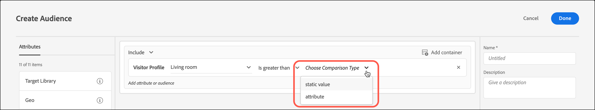

# Creare un pubblico per il confronto degli attributi di profilo

Definisci un pubblico in [!DNL Adobe Target] per confrontare due attributi di profilo per la [Libreria tipi di pubblico](/help/main/c-target/c-audiences/audiences.md) o in un [pubblico per sola attività](/help/main/c-target/creating-activity-only-audience.md). L’uso degli operatori, quali maggiore di, minore o uguale a, definisce un pubblico per confrontare in modo dinamico i valori di due attributi di profilo diversi.

>[!NOTE]
>
>Questa funzionalità è disponibile solo per la categoria [[!UICONTROL Visitor Profile]](/help/main/c-target/c-audiences/c-target-rules/visitor-profile.md#concept_E972690B9A4C4372A34229FA37EDA38E).

## Panoramica {#section_303CBC78194D49A2A004945D425441E1}

I tipi di pubblico sono definiti da regole che determinano chi è incluso o escluso da un&#39;attività di [!DNL Target]. Una definizione di pubblico può includere più regole e ogni regola può includere più parametri. Se una delle regole incluse utilizza la categoria [!UICONTROL Visitor Profile], puoi definire una regola in base al valore specifico di un attributo del profilo visitatore o confrontare il valore di tale attributo con un altro attributo del profilo visitatore.

Ad esempio, supponiamo che tu lavori per una società di mobili e abbia caricato due punteggi di tendenza del cliente in [!DNL Target]:

* Probabilità di acquisto di mobili per la sala da pranzo nei prossimi 90 giorni
* Probabilità di acquisto di mobili per il soggiorno nei prossimi 90 giorni

Puoi creare un pubblico la cui propensione ad acquistare mobili per la sala da pranzo è maggiore della propensione ad acquistarne per il soggiorno. [!DNL Target] confronta quindi dinamicamente i punteggi di propensione per la sala da pranzo e il soggiorno per un visitatore specifico per determinare se quel visitatore è idoneo per questo pubblico.

Per ulteriori informazioni, consulta [Metodi per ottenere dati in Target](https://experienceleague.adobe.com/docs/target-dev/developer/implementation/methods/methods-to-get-data-into-target.html?lang=it){target=_blank}.

## Creare un pubblico per il confronto degli attributi di profilo {#section_7A62FD47D5C74C3EBC3417ACDBB85013}

1. Fare clic su **[!UICONTROL Audiences]** > **[!UICONTROL Create Audience]**.
1. Assegna un nome al pubblico e aggiungi una descrizione facoltativa.
1. Trascina **[!UICONTROL Visitor Profile]** nel riquadro Generatore di pubblico.
1. Dall&#39;elenco a discesa **[!UICONTROL Visitor Profile]**, scegliere un attributo:

   

1. Scegli il tuo valutatore:

   

1. Dall&#39;elenco a discesa **[!UICONTROL Choose Comparison Type]**, scegliere **[!UICONTROL Attribute]**.

   Il tipo di confronto &quot;valore statico&quot; consente di confrontare l’attributo del profilo del visitatore con valori specifici.

   

   >[!NOTE]
   >
   >Se utilizzi una delle categorie di profilo visitatore predefinite (ad esempio, Nuovo visitatore o Visitatore di ritorno), puoi scegliere solo l’opzione valore statico. Le opzioni di confronto dinamiche non sono disponibili per le categorie predefinite. Gli altri esempi in cui le opzioni di confronto dinamiche non sono disponibili includono “Prima pagina di sessione”, “Non in altri test”, “Diverso dalla prima pagina di sessione” e “Affinità categoria”.

1. Scegli l&#39;attributo da confrontare con l&#39;attributo iniziale.

   

1. Fare clic su **[!UICONTROL Done]**.

## Video di formazione  {#section_3BB8DBF3418F4520B3E274B6F40AF8F3}

Per ulteriori informazioni e uno scenario in cui potresti utilizzare questa funzione, guarda il seguente video:

>[!VIDEO](https://video.tv.adobe.com/v/329907?captions=ita)
