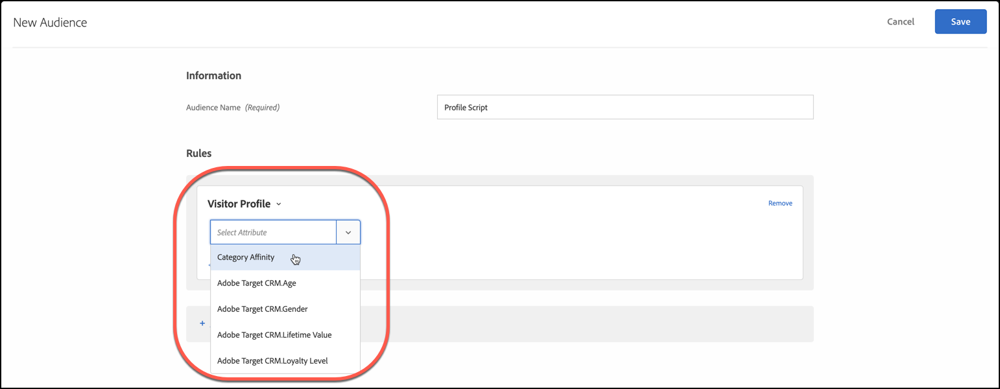

# Affinità tra categorie

La funzione di affinità tra categorie in [!DNL Adobe Target] acquisisce automaticamente le categorie sul sito visitate da un utente e quindi calcola l’affinità dell’utente per ogni categoria in modo che possa essere indirizzata e segmentata. L’affinità tra categorie aiuta a garantire che il contenuto sia indirizzato ai visitatori che hanno più probabilità di agire in base a tali informazioni.

## Passaggio di informazioni sull’affinità tra categorie in [!DNL Target] {#section_B0C8E46EEBAC4549AD90352A47787D04}

Ogni volta che un utente visita il tuo sito, i parametri di profilo specifici per tale visitatore vengono registrati nel database di [!DNL Target]. Questi dati sono associati al cookie dell’utente. Un parametro utile è `user.categoryId`, un parametro mbox assegnato a una pagina di prodotto. Quando il visitatore continua a navigare, o torna per un’altra sessione, è possibile registrare le categorie di prodotti che l’utente visualizza. È inoltre possibile registrare le informazioni di categoria trasmettendole con il parametro mbox `user.categoryId` in qualsiasi mbox (compresa una mbox nidificata), come il parametro URL `user.categoryId` oppure come parametri di pagina con una mbox globale. [!DNL Target] Per ulteriori dettagli, rivolgiti al rappresentante del tuo account.

Per includere un elemento in più categorie, separa le categorie con una virgola. Ad esempio:

* `user.categoryId=clothing,shoes,nike,running,nike clothing,nike shoes,nike running shoes`

In base alla frequenza e recency delle visite alle categorie di prodotti, viene registrata l’eventuale affinità di categoria per un utente. L’affinità di categoria può essere utilizzata per indirizzare le tue attività a specifici tipi di visitatori.

È possibile utilizzare `user.categoryAffinities[]` in uno script di profilo per restituire una matrice delle affinità che un visitatore ha popolato. Per ulteriori informazioni, consulta [user.categoryAffinities in Oggetti e metodi negli attributi del profilo](/help/main/c-target/c-visitor-profile/profile-parameters.md#objects).

>[!IMPORTANT]
>
>La `user.categoryId` l’attributo utilizzato per l’algoritmo di affinità tra categorie è diverso da `entity.categoryId` attributo utilizzato per [!DNL Adobe Target Recommendations]consigli su prodotti e contenuti. `user.categoryId` è richiesto per tenere traccia della categoria preferita di un utente. `entity.categoryId` è richiesto per basare i consigli sulla categoria della pagina corrente o dell’elemento corrente. Passa entrambi i valori a [!DNL Target] se desideri utilizzare entrambe le funzionalità.

## Business case per affinità tra categorie {#section_D6FF913E88E6486B8FBCE117CA8B253B}

L’attività di un visitatore in una sessione, ad esempio la categoria che visualizza più spesso, può essere utilizzata per il targeting nelle visite successive. Ogni pagina di categoria che un utente visualizza durante una sessione viene acquisita e la sua categoria “preferita” è calcolata sulla base di un modello di recency e frequenza. Poi, ogni volta che il visitatore torna alla home page, l’area delle immagini protagonista può essere utilizzata per mostrare i contenuti relativi alla categoria preferita dell’utente.

## Esempio di utilizzo dell’affinità tra categorie {#section_A4AC0CA550924CB4875F4F4047554C18}

Supponiamo di vendere strumenti musicali online e di indirizzare le promozioni sui bassi ai visitatori che hanno già espresso interesse per le chitarre. Utilizzando l’affinità di categoria, è possibile creare offerte che vengono visualizzate solo ai visitatori con questa affinità di categoria.

## Algoritmo di affinità tra categorie {#section_8B86C7FF50294208866ABF16F07D5EB9}

L’algoritmo di affinità tra categorie funziona come segue:

* Dieci punti per la prima categoria visualizzata
* Cinque punti per ogni categoria selezionata dopo la prima
* Quando si fa clic su una nuova categoria, viene sottratto 1 da tutte le categorie precedentemente selezionate
* Se è già stato fatto clic su una categoria (visualizzata), facendo nuovamente clic su di essa non si sottrae 1 da tutte le altre categorie
* Se fai clic su una sesta categoria, la categoria con il punteggio inferiore tra le prime cinque categorie viene eliminata dal calcolo
* Alla fine della sessione, tutti i valori vengono divisi per 2

### Esempio: algoritmo di affinità tra categorie

Ad esempio, visualizzando la categoria `mens-clothing`, quindi `accessories`, quindi `jewelry`, quindi `accessories` di nuovo nei risultati di sessione in affinità di:

* `accessories`: 9 (+5 – 1 + 5)

* `mens-clothing`: 8 (+10 – 1 – 1)

* `jewelry`: 5 (+5)

Quando la sessione termina e l’utente ritorna al sito in un secondo tempo, i punteggi vengono dimezzati:

* `accessories`: 4,5 (9/2)

* `mens-clothing`: 4 (8/2)

* `jewelry`: 2,5 (5/2)

Supponendo che l’utente visualizzi quindi, nell’ordine `jewelry`, `accessories`, `beauty`, `shoes` e `womens-clothing`:

* `accessories`: 6,5 (4,5 + 5 – 1 – 1 – 1)

* `womens-clothing`: 5 (+5)

* `jewelry`: 4,5 (2,5 + 5 – 1 – 1 – 1)

* `shoes`: 4 (+5 – 1)

* `beauty`: 3 (+5 – 1 – 1)

* `mens-clothing` viene rilasciato dopo il clic finale sulla categoria `womens-clothing` con punteggio inferiore, con un punteggio pari a 1 (4 – 1 – 1 – 1)

Quando la sessione termina e l’utente ritorna al sito in un secondo tempo, i punteggi vengono dimezzati:

* `accessories`: 3,3 (6,5/2)

* `womens-clothing`: 2,5 (5/2)

* `jewelry`: 2,3 (4,5/2)

* `shoes`: 2 (4/2)

* `beauty`: 1,5 (3/2)

## Utilizzare Affinità tra categorie per il targeting {#concept_5750C9E6C97A40F8B062A5C16F2B5FFC}

Le sezioni seguenti contengono informazioni utili per utilizzare un pubblico con affinità tra categorie per il targeting in un’attività.

### Creare un pubblico da utilizzare per Affinità tra categorie {#section_A27C600BBA664FE7A74F8FE076B78F40}

1. Da **[!UICONTROL Tipi di pubblico]** elenco, fai clic su **[!UICONTROL Crea pubblico]**.

   Oppure

   Per copiare un pubblico esistente, porta il cursore del mouse sul pubblico desiderato nellʼelenco Tipi di pubblico, quindi fai clic sullʼicona Copia. Ora puoi modificare il pubblico per crearne uno simile.

1. Inserisci un nome descrittivo per il pubblico.
1. Fai clic su **[!UICONTROL + Aggiungi regola]** > **[!UICONTROL Profilo visitatore]**.
1. Nellʼelenco a discesa **[!UICONTROL Profilo visitatore]**, seleziona **[!UICONTROL Affinità tra categorie]**.

   

1. Seleziona la categoria desiderata:

   

   Le categorie includono:

   * Categoria preferita
   * Prima categoria
   * Seconda categoria
   * Terza categoria
   * Quarta categoria
   * Quinta categoria

   Le opzioni &quot;Categoria preferita&quot; e &quot;Prima categoria&quot; sono equivalenti.

1. Scegli il valutatore:

   * Contiene (senza distinzione maiuscole/minuscole)
   * Non contiene (senza distinzione maiuscole/minuscole)
   * È uguale a

1. Specifica ogni nuovo valore in una riga separata (ad esempio “Scarpe”).
1. Fai clic su **[!UICONTROL Salva]**.

### Utilizzare il pubblico con Affinità tra categorie in unʼattività {#section_91526B942D1B4AEBB8FCDF4EBFF931CF}

Puoi utilizzare i tipi di pubblico con affinità tra categorie in qualsiasi attività. Durante il flusso di lavoro guidato in tre passaggi, nella sezione [!UICONTROL Target] scegli il pubblico desiderato.
