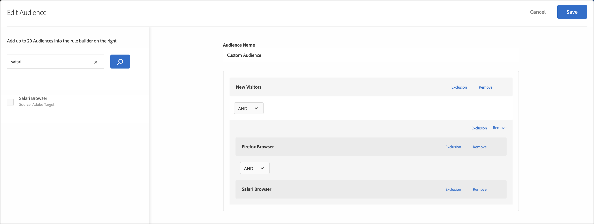
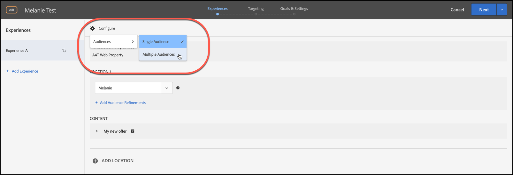

# Combinare più tipi di pubblico

Combina al volo più tipi di pubblico (tra cui [!DNL Adobe Experience Cloud], [!DNL Adobe Experience Platform] e [!DNL Target]) per creare un pubblico ad hoc. Puoi anche creare regole di esclusione ed escludere un determinato pubblico da una regola.

>[!NOTE]
>
>L&#39;origine [!DNL Adobe Experience Platform] è disponibile per tutti i clienti [!DNL Target] che utilizzano [Adobe Experience Platform Web SDK](https://experienceleague.adobe.com/docs/target-dev/developer/client-side/aep-web-sdk.html?lang=en){target=_blank}. I tipi di pubblico disponibili da [!DNL Adobe Experience Platform] possono essere utilizzati così come sono o combinati con i tipi di pubblico esistenti, come spiegato in questo argomento.
>
>Per ulteriori informazioni, vedere [Utilizzare i tipi di pubblico di Adobe Experience Platform](/help/main/c-target/c-audiences/audiences.md#aep).

Supponi di avere un pubblico “Nuovi visitatori” e un pubblico “Utenti Chrome”. Per un&#39;attività specifica, è possibile combinare questi gruppi di pubblico esistenti per indirizzare nuovi visitatori che utilizzano browser Chrome. Invece di creare un terzo pubblico e memorizzarlo nella libreria [!UICONTROL Audiences], è possibile combinare questi due tipi di pubblico durante la creazione di attività o durante la modifica di un&#39;attività esistente.

Un altro esempio è la possibilità di eseguire il targeting per tutti i clienti fidelizzati. Ad esempio, puoi includere un pubblico [!DNL Audience Manager] specifico per lo stato di fedeltà e combinarlo con un pubblico [!DNL Target] composto da persone iscritte al tuo programma fedeltà nella sessione corrente. Combinare questi due tipi di pubblico è più facile che creare un terzo pubblico permanente.

Puoi combinare fino a 20 tipi di pubblico utilizzando gli operatori AND e OR.

È possibile creare e utilizzare il pubblico combinato in varie posizioni in tutta l’interfaccia utente di [!DNL Target].

## Creare un pubblico combinato durante la creazione di un’attività {#section_2F1CE9434CC04174B4BA2BFC89B85D77}

Puoi creare un pubblico combinato specifico nella pagina [!UICONTROL Target] dell&#39;attività durante il flusso di lavoro guidato in tre passaggi.

1. Durante la creazione di un&#39;[attività](/help/main/c-activities/activities.md#concept_D317A95A1AB54674BA7AB65C7985BA03), nella pagina **[!UICONTROL Targeting]** fare clic sui tre puntini di sospensione verticali e quindi su **[!UICONTROL Replace Audience]**.

   

1. Nella pagina **[!UICONTROL Choose Audience]**, seleziona le caselle di controllo accanto ai tipi di pubblico desiderati che desideri utilizzare come blocchi predefiniti per il pubblico combinato.

   Utilizzare la casella [!UICONTROL Search Audiences] per limitare la ricerca del pubblico desiderato.

   

1. Fare clic su **[!UICONTROL Combine Multiple Audiences]** nell&#39;angolo superiore destro.

   

1. (Condizionale) Modifica il nuovo pubblico combinato come desiderato.

   La finestra di dialogo [!UICONTROL Edit Audience] consente di trascinare e rilasciare blocchi predefiniti di pubblico aggiuntivi dal lato sinistro al nuovo pubblico combinato. Puoi anche aggiungere regole di esclusione ed escludere tipi di pubblico.

   1. Utilizza la funzionalità di trascinamento della selezione per aggiungere tipi di pubblico all’interno di una sezione esistente come blocco predefinito di livello 2.

      Ad esempio, riprendendo l’esempio precedente, supponiamo che ora desideri includere nel pubblico combinato anche gli utenti di Safari. Cerca e trascina il pubblico “Browser Safari” nella casella “Browser Firefox” a destra, come nell’esempio seguente:

      

      Osserva che l’operatore tra i due tipi di pubblico definiti dal browser è “AND” (E). Seleziona l&#39;elenco a discesa [!UICONTROL And] e cambialo in &quot;OR&quot; (O) per creare un nuovo pubblico combinato per i nuovi visitatori che utilizzano Firefox o Safari. Fai attenzione a evitare la creazione di regole che escludano tutti i potenziali membri del pubblico. Ad esempio, non è possibile che qualcuno visiti una pagina utilizzando contemporaneamente i browser Firefox e Safari.

      >[!NOTE]
      >
      >L’operatore (AND oppure OR) deve rimanere lo stesso quando combini gruppi di pubblico. Non puoi combinare operatori diversi.

   1. Per aggiungere un&#39;esclusione a una regola, fare clic su **[!UICONTROL Exclude]**.

      

      Trascina e rilascia un pubblico.

      Ad esempio, per escludere i visitatori dagli Stati Uniti dai nuovi visitatori, puoi trascinare nella casella il pubblico Mercato: Stati Uniti.

      Questo pubblico combinato include tutti i nuovi visitatori del tuo sito (esclusi quelli di San Francisco) che utilizzano Safari o Firefox.

   1. Per escludere un pubblico da una regola, fare clic su **[!UICONTROL Exclusion]** > **[!UICONTROL Exclude this Audience.]**.

      Ad esempio, puoi creare un pubblico combinato che includa tutti i nuovi visitatori del sito, esclusi quelli che utilizzano Firefox. Escludere i visitatori con Firefox è più facile e veloce che creare un pubblico combinato che includa in modo esplicito più browser (Safari, Chrome e Internet Explorer), ma non includa Firefox.

1. Fornire un nome descrittivo per il pubblico combinato, quindi fare clic su **[!UICONTROL Done]**.

## Creare un pubblico combinato da utilizzare nel targeting metrico {#section_A42E795AFCBD4575809C5942039910F0}

Puoi creare un pubblico combinato specifico nella pagina [!UICONTROL Goals & Settings] dell&#39;attività da utilizzare nel targeting metrico. Ad esempio, per creare un targeting basato sulla conversione utilizzando un pubblico combinato:

1. Durante la modifica o la creazione di una [attività](/help/main/c-activities/activities.md#concept_D317A95A1AB54674BA7AB65C7985BA03), nella pagina **[!UICONTROL Goals & Settings]**, seleziona **[!UICONTROL Conversion]** per la metrica di successo, quindi seleziona **[!UICONTROL Viewed an Mbox]** come azione.
1. Selezionare la mbox desiderata nel campo **[!UICONTROL Search mbox]**.

   

1. Fare clic sull&#39;icona, quindi fare clic su **[!UICONTROL Add Audience Targeting]**.
1. Fare clic sul collegamento **[!UICONTROL Add Audience/Targeting Condition]** per visualizzare la finestra di dialogo [!UICONTROL Choose Audience].

   

1. Procedi con il [Passaggio 2](/help/main/c-target/combining-multiple-audiences.md#section_2F1CE9434CC04174B4BA2BFC89B85D77) in “Creare un pubblico combinato durante la creazione di un’attività” per creare il pubblico combinato.

## Creare un pubblico combinato da utilizzare nel reporting {#section_4682D342EFBB43C38E54B99B3A1E14CD}

Puoi creare un pubblico combinato specifico nella pagina [!UICONTROL Goals & Settings] dell&#39;attività da utilizzare nel reporting.

1. Durante la modifica o la creazione di un&#39;[attività](/help/main/c-activities/activities.md#concept_D317A95A1AB54674BA7AB65C7985BA03), nella pagina **[!UICONTROL Goals & Settings]** fare clic sull&#39;icona **[!UICONTROL Add Audience]** in [!UICONTROL Audiences for Reporting] per visualizzare la pagina [!UICONTROL Choose Audience].

   

1. Procedi con il [Passaggio 2](/help/main/c-target/combining-multiple-audiences.md#section_2F1CE9434CC04174B4BA2BFC89B85D77) in “Creare un pubblico combinato durante la creazione di un’attività” per creare il pubblico combinato.

## Creare un pubblico combinato durante la modifica di un’attività {#section_364A12CE96E04B61B7C18113AA586C2C}

Puoi creare un pubblico combinato specifico durante la modifica di un&#39;attività esistente.

1. Dalla pagina [!UICONTROL Activities], passa il cursore del mouse sull&#39;attività desiderata, quindi fai clic sull&#39;icona **[!UICONTROL Edit]**.

   Oppure

   Fare clic sull&#39;attività desiderata per aprirla, quindi fare clic su **[!UICONTROL Edit Activity]**.

1. Fare clic su **[!UICONTROL Configure]** > **[!UICONTROL Audiences]** > **[!UICONTROL Multiple Audiences]**.

   

1. Fai clic sull&#39;icona altre opzioni (tre puntini di sospensione verticali) accanto al pubblico corrente dell&#39;attività, quindi fai clic su **[!UICONTROL Change Audience]**.

   

1. Procedi con il [Passaggio 2](/help/main/c-target/combining-multiple-audiences.md#section_2F1CE9434CC04174B4BA2BFC89B85D77) in “Creare un pubblico combinato durante la creazione di un’attività” per creare il pubblico combinato.
