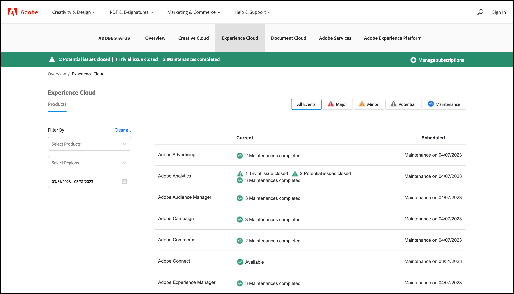

# Aggiornamenti dello stato del sistema e notifiche proattive

Utilizza la pagina [!UICONTROL Stato del sistema di Adobe] e le notifiche proattive per essere sempre al corrente dello stato dei prodotti [!DNL Adobe] e delle soluzioni [!DNL Adobe Experience Cloud]. Le notifiche proattive ti avvisano in caso di interruzioni o interventi di manutenzione.

## Aggiornamenti dello stato del sistema

Utilizza la [!UICONTROL Stato del sistema di Adobe] per visualizzare lo stato di [!DNL Target] e altri [!DNL Adobe] prodotti e [!DNL Adobe Experience Cloud] soluzioni. Questa pagina è utile per determinare se eventuali problemi riscontrati sono dovuti a un aggiornamento del sistema o a un intervento di manutenzione ordinaria.

>[!NOTE]
>
>Una notifica interna al prodotto compare sempre durante il rilascio mensile di [!DNL Target], ma talvolta si verificano aggiornamenti minori e vengono elencati in questa pagina.

1. Accedere al [[!UICONTROL Stato del sistema]](https://status.adobe.com/it){target=_blank}.

1. Per visualizzare lo stato delle soluzioni [!DNL Experience Cloud], tra cui [!DNL Target], fai clic sulla scheda [!UICONTROL Experience Cloud].

   

   La parte superiore della pagina contiene informazioni sugli eventi di manutenzione in corso e include un collegamento per gestire gli abbonamenti per gli aggiornamenti per le singole soluzioni.

   Nell&#39;illustrazione precedente, [!DNL Adobe Advertising], [!DNL Adobe Analytics]e [!DNL Adobe Audience Manager] e altre soluzioni hanno recentemente completato gli aggiornamenti di manutenzione. Tutti gli altri prodotti e soluzioni funzionavano normalmente. È sempre buona prassi controllare questa pagina se si verificano problemi durante l&#39;utilizzo di [!DNL Target].

1. (Facoltativo) Filtrare l’elenco per prodotti, aree geografiche o intervalli di date. Fai clic sul pulsante [!UICONTROL Maggiore], [!UICONTROL Minore], [!UICONTROL Potenziale]oppure [!UICONTROL Manutenzione] collegamenti per filtrare ulteriormente i risultati.

## Notifiche proattive

Le notifiche proattive sono avvisi e-mail, inviati ai clienti registrati, relativi ai seguenti eventi aperti con i servizi inclusi nel profilo del cliente, tra cui [!DNL Target]:

* Avvisi a livello di soluzione (non isola servizi specifici all’interno della soluzione)
* CSO (interruzioni) di Gravità 1 e Gravità 2
* CMR (interventi di manutenzione)

>[!NOTE]
>
>Devi registrarti per ricevere gli avvisi. Contatta il tuo [!DNL Adobe] Customer Success Manager (CSM) o [!DNL Adobe] Account Executive (AE) per avviare il processo di registrazione.

Le seguenti illustrazioni sono esempi di notifiche proattive con avvisi via e-mail:

