# Note sulla versione per le versioni precedenti{#release-notes-for-previous-releases}

Note sulla versione delle versioni precedenti di Target, incluse le note sulla versione per Target Standard/Premium, la piattaforma Target e la libreria Javascript di Target (at.js). Le note sulla versione vengono ordinate in ordine decrescente per mese e anno di rilascio.

>[!NOTE]
>
>Consulta [Note sulla versione di Target (corrente)](../r-release-notes/release-notes.md#reference_8FE40B43A5A34DDF8F26A53D55EE036A) per informazioni sulle versioni di Target del mese corrente (piattaforma e Target Standard/Premium).

## Note sulla versione - 2020

### at.js 2.3.2 (24 luglio 2020)

Questa versione di at.js è una versione di manutenzione e include le seguenti correzioni:

* È stato corretto un bug a causa del quale uno script o un codice aggiungeva proprietà predefinite alla finestra o al documento.

### Target Standard/Premium 20.7.1 (27 luglio 2020)

Questa versione include le seguenti modifiche:

#### [!UICONTROL Aggiornamento interfaccia utente della sezione Amministrazione]

Stiamo gradualmente riscrivendo l&#39;intera [!DNL Target] interfaccia utente utilizzando un nuovo stack tecnologico per offrire prestazioni migliori, ridurre il tempo di manutenzione necessario per rilasciare nuove funzioni e migliorare l&#39;esperienza dell&#39;utente nel prodotto. La prima sezione aggiornata è la sezione [!UICONTROL Configurazione] , che è stata rinominata [!UICONTROL Amministrazione].

Durante questo aggiornamento, sarà possibile eseguire facilmente molte azioni utilizzando le pagine della sezione [!UICONTROL Amministrazione] , ad esempio:

* Scaricate l&#39;ultimo file at.js dalla scheda [!UICONTROL Implementazione] (**[!UICONTROL Amministrazione]** > **[!UICONTROL Implementazione]**).
* Personalizza le impostazioni at.js ed è possibile rivedere facilmente le modifiche (**[!UICONTROL Amministrazione]** > **[!UICONTROL Implementazione]**).
* Modificare le impostazioni di reporting avanzate, ad esempio la valuta e il fuso orario predefiniti, gli IP da escludere dai rapporti, ecc. (**[!UICONTROL Amministrazione]** > **[!UICONTROL Rapporti]**)
* Indirizzi IP offuscati dei visitatori per motivi di privacy (**[!UICONTROL Amministrazione]** > **[!UICONTROL Implementazione]**)
* Visualizzate l’elenco esistente di utenti per area di lavoro e i relativi ruoli prima di gestirli in Adobe Admin Console (**[!UICONTROL Amministrazione]** > **[!UICONTROL Utenti]**).
* Cerca e filtra tutte le tabelle nella sezione [!UICONTROL Amministrazione] .

Per ulteriori informazioni, consulta [Amministrazione di Target Overview (Panoramica](/help/administrating-target/administrating-target.md)di Target).

#### Miglioramenti, correzioni e modifiche

Questa versione contiene i seguenti miglioramenti, correzioni e modifiche:

* È stato risolto un problema che impediva il mantenimento delle preferenze del sito dopo l&#39;aggiornamento. (TGT-37239)
* È stato risolto un problema che impediva il corretto funzionamento di [!UICONTROL Inserisci dopo] > [!UICONTROL Immagine] con immagini SVG (Scalable Vector Graphics). (TGT-37242)
* È stato risolto un problema per gli utenti con il ruolo [!UICONTROL Editore] che impediva l&#39;eliminazione delle bozze di attività. (TGT-37358)
* È stato risolto un problema che impediva agli utenti di modificare un&#39;attività quando si selezionava [!UICONTROL Tutte le aree di lavoro] personali. (TGT-37276)

### Target Standard/Premium 20.5.1 (17 giugno 2020)

| Funzionalità/Miglioramento | Descrizione |
| --- | --- |
| Analytics for Target (A4T) supporto per le attività di allocazione [!UICONTROL automatica] | [!UICONTROL Le attività di allocazione] automatica ora supportano [Analytics per Target](/help/c-integrating-target-with-mac/a4t/a4t.md).<br>Questa integrazione consente di utilizzare la funzionalità di allocazione [!UICONTROL automatica] dei bandi con più armi per indirizzare il traffico verso esperienze vincenti, utilizzando al contempo una metrica di obiettivo Adobe Analytics  e/o funzionalità di reporting e analisi [!UICONTROL Adobe Analytics] .<br>Se avete già [implementato A4T](/help/c-integrating-target-with-mac/a4t/a4timplementation.md) per l’utilizzo con le attività Test A/B e Targeting delle esperienze, siete tutti impostati!<br>Per ulteriori informazioni, consultate Supporto di [Analytics per Target (A4T) per le attività](/help/c-integrating-target-with-mac/a4t/campaign-creation.md#a4t-aa) di allocazione automatica nella creazione *di* attività. |
| Token di risposta per il metodo di allocazione del traffico per le attività di Auto-Target e  Automated Personalization | Sono stati aggiunti due token [di](/help/administrating-target/response-tokens.md) risposta alle attività di [!UICONTROL Auto-Target] e [!UICONTROL Automated Personalization] per consentire di determinare se un visitatore ha ricevuto un&#39;esperienza particolare a seguito dell&#39;assegnazione a &quot;control&quot; o a &quot;targeting&quot; del traffico.<ul><li>`experience.trafficAllocationId` restituisce 0 se un visitatore ha ricevuto un&#39;esperienza dal traffico &quot;controllato&quot; e 1 se ha ricevuto un&#39;esperienza dalla distribuzione del traffico &quot;con targeting&quot;.</li><li>`experience.trafficAllocationType` restituisce &quot;control&quot; o &quot;targeting&quot;.</li></ul>Per ulteriori informazioni sul controllo rispetto al traffico di destinazione, vedete [Selezionare il controllo per l&#39;attività](/help/c-activities/t-automated-personalization/experience-as-control.md)Automated Personalization o Auto-Target . |
| [!UICONTROL Ruolo Editore] | Questo nuovo ruolo è simile al ruolo [!UICONTROL Osservatore] corrente (può visualizzare le attività, ma non può crearle o modificarle). Tuttavia, il ruolo [!UICONTROL Editore] dispone dell&#39;autorizzazione aggiuntiva per attivare le attività.<br>Per ulteriori informazioni, vedi: <ul><li>**Utenti** di Target Standard: [Specifica ruoli e autorizzazioni](/help/administrating-target/c-user-management/c-user-management/user-management.md#roles-permissions) in *Utenti*.</li><li>**Utenti** Target Premium: [Passaggio 6: Specificate ruoli e autorizzazioni](/help/administrating-target/c-user-management/property-channel/properties-overview.md#section_8C425E43E5DD4111BBFC734A2B7ABC80) in *Configura autorizzazioni* enterprise.</li></ul> |
| Supporto A4T nel 25 [!DNL Analysis Workspace]<br>giugno 2020 | [!UICONTROL Analytics per Target] (A4T) ora è supportato in [!DNL Analysis Workspace]. Il pannello  Analytics for Target (A4T) consente di analizzare [!DNL Adobe Target] le attività e le esperienze in [!DNL Analysis Workspace].<br>Per ulteriori informazioni, consulta [Report in Analytics](/help/c-integrating-target-with-mac/a4t/reporting.md) in Reporting *A4T e pannello* [Analytics for Target (A4T) nella Guida](https://docs.adobe.com/content/help/en/analytics/analyze/analysis-workspace/panels/a4t-panel.html) agli strumenti di ** Analytics. |

**Miglioramenti, correzioni e modifiche**

* È stato risolto un problema che causava la memorizzazione della metrica &quot;visitatori&quot; nella definizione dell&#39;attività invece di &quot;VisitatoriUnivoci&quot;. (TGT-37098)
* È stato risolto un problema nell&#39; [!DNL Target] interfaccia utente a causa del quale la barra di scorrimento verticale non funzionava correttamente nella pagina [!UICONTROL Audiences] . (TGT-36968)

### versioni at.js 1.8.2 e at.js 2.3.1 (15 giugno 2020)

Nelle librerie [!DNL Target] at.js sono stati apportati i seguenti miglioramenti e correzioni:

| Funzionalità/Miglioramento | Descrizione |
| --- | --- |
| Payload JSON di at.js 1.8.2 | Questa versione di at.js è una versione di manutenzione e include le seguenti correzioni:<ul><li>È stato risolto un problema che si verificava quando si utilizzavano CNAME e edge override, in at.js 1.*x* potrebbe creare in modo non corretto il dominio del server, causando il fallimento della [!DNL Target] richiesta. (TNT-35064)</li></ul>For more information, see [at.js version details](/help/c-implementing-target/c-implementing-target-for-client-side-web/target-atjs-versions.md). |
| Payload JSON di at.js 2.3.1 | Questa release di at.js è una versione di manutenzione e include i miglioramenti e le correzioni seguenti:<ul><li>L’impostazione `deviceIdLifetime` è stata sostituita tramite [targetGlobalSettings](/help/c-implementing-target/c-implementing-target-for-client-side-web/targetgobalsettings.md). (TNT-36349)</li><li>È stato risolto un problema che si verificava quando si utilizzavano CNAME e edge override, in at.js 2.*x* potrebbe creare in modo non corretto il dominio del server, causando il fallimento della [!DNL Target] richiesta. (TNT-35065)</li><li>È stato risolto un problema che si verificava durante l’utilizzo dell’ [!DNL Target] estensione v2 e dell’ [!DNL Launch][!DNL Adobe Analytics] estensione, [!DNL Launch] causava il ritardo della [!DNL Target] chiamata [!DNL Analytics] `sendBeacon` . (TNT-36407, TNT-35990, TNT-36000)</li></ul>For more information, see [at.js version details](/help/c-implementing-target/c-implementing-target-for-client-side-web/target-atjs-versions.md). |

### Modifiche all&#39;API v2 di stato batch profilo (14 maggio 2020)

Con la release del 20 maggio, lo stato del batch di profili restituirà solo i dati di errore a livello di riga in corso (i dati di successo non verranno restituiti). Gli ID profilo non riusciti verranno restituiti dall&#39;API in futuro.

Le risposte API precedenti e nuove sono le seguenti:

`ProfileBatchStatus Api
http://<<edge>>/m2/<<client>>/profile/batchStatus?batchId=<batchid>`

**Attualmente la risposta è la seguente:**

```
<response>
 
    <batchId>samplebatch-1585929692655-59449976</batchId>
 
    <status>complete</status>
 
    <batchSize>164</batchSize>
 
    <profile>
 
        <id>1514187733806-729395</id>
 
        <status>success</status>
 
    </profile>
 
    <profile>
 
        <id>1573612762055-214017</id>
 
        <status>success</status>
 
    </profile>
 
    <profile>
 
        <id>some profile id</id>
 
        <status>failed</status>
 
    </profile>
 
</response>
```

**Dopo il 4 maggio, la risposta sarà:**

```
<response>
 
    <batchId>samplebatch-1585929692655-59449976</batchId>
 
    <status>complete</status>
 
    <batchSize>164</batchSize>
 
    <profile>
 
        <id>some profile id</id>
 
        <status>failed</status>
 
    </profile>
 
</response>
```

### Target Standard/Premium 20.4.1 (6 maggio 2020)

Questa versione contiene i seguenti miglioramenti, correzioni e modifiche:

* È stato risolto un problema che classificava erroneamente un tipo di dispositivo e browser per un&#39;audience. (TGT-36266)
* È stato risolto un problema che impediva la visualizzazione dei dati del rapporto quando visualizzati su schermi con una larghezza inferiore a 963 pixel. (TGT-36549)
* È stato risolto un problema che impediva il corretto rendering dei rapporti Personalizzazione automatica. (TGT-36619)
* È stato risolto un problema che consentiva la selezione di metriche incompatibili nelle attività di allocazione automatica e di destinazione automatica che utilizzano Analytics per Target (A4t). (TGT-36646)
* È stato risolto un problema che impediva la corretta visualizzazione di alcune opzioni in Visual Experience Composer (VEC). (TGT-36571)
* È stato risolto un problema nell&#39;interfaccia di Target a causa del quale altre anteprime di offerte Recommendations visualizzavano il contenuto modificato dopo che un utente aveva sostituito il contenuto in un&#39;unica esperienza. (TGT-36053 e TGT-36894)
* È stato risolto un problema che impediva ad alcuni utenti di eliminare elementi da un catalogo Recommendations. (TGT-36455)
* È stato risolto un problema che impediva agli utenti di salvare i criteri Recommendations in un&#39;attività con più pagine. (TGT-36249)
* È stato risolto un problema che causava la scomparsa dei pulsanti di scelta dell&#39;origine dati comportamentale durante la modifica dei criteri per una seconda volta consecutiva. (TGT-36796)
* È stato risolto un problema di visualizzazione a causa del quale un algoritmo di Recommendations visualizzava &quot;Recupero dei risultati&quot; per un periodo prolungato. (TGT-36550 e TGT-36551)
* Sono state aggiornate molte stringhe di interfaccia utente localizzate in diverse lingue.

### Target at.js (25 marzo 2020)

Sono disponibili le seguenti nuove versioni delle librerie JavaScript di Target at.js:

* at.js versione 2.3.0
* at.js versione 1.8.1

For more information, see [at.js version details](/help/c-implementing-target/c-implementing-target-for-client-side-web/target-atjs-versions.md).

### Target Standard/Premium 20.2.1 (23 marzo 2020)

Questa versione contiene i seguenti miglioramenti, correzioni e modifiche:

* È stato risolto un problema che impediva ai clienti di selezionare una raccolta durante la ricerca di un catalogo. (TGT-36230)
* È stato corretto un problema in seguito al quale un criterio creato tramite API, ma a cui non si fa riferimento da un&#39;attività creata nell&#39;interfaccia utente di Target, poteva essere eliminato erroneamente dall&#39;interfaccia utente. (TGT-35917)
* Miglioramenti della sicurezza implementati nell&#39;informativa sulla sicurezza dei contenuti (CSP). (TGT-36190)
* È stato risolto un problema che causava la visualizzazione di &quot;NaN%&quot; durante lo scorrimento della barra della percentuale di ponderazione attributo verso l&#39;estrema sinistra. (TGT-36211)
* Sono stati risolti i problemi di localizzazione per consentire la corretta visualizzazione del testo dell&#39;interfaccia in diverse lingue.
* Abbiamo standardizzato l&#39;elenco delle metriche disponibili  attività Adobe Analytics per Target (A4T) eliminando  metriche Adobe Analytics non supportate nella versione corrente  API Adobe Analytics. Questo ci consentirà di estendere il supporto A4T nelle release future  Adobe Target.

   Sono state apportate le seguenti modifiche:

   * &quot;Tempo medio trascorso sulla pagina&quot; è stato sostituito da &quot;Tempo medio trascorso sul sito&quot;. Tutte le attività che utilizzano questa metrica nella metrica Obiettivo principale avranno &quot;Tempo medio trascorso sul sito&quot; (nota: misurati in minuti anziché in secondi) selezionati come Metrica obiettivo principale al successivo modifica dell&#39;attività.
   * &quot;Visitatori&quot; è stato sostituito da &quot;Visitatori unici&quot;. Per tutte le attività che utilizzano questa metrica come Metrica obiettivo principale, alla successiva modifica dell&#39;attività verrà selezionato &quot;Visitatori unici&quot; come Metrica obiettivo principale.

* Le metriche seguenti sono state eliminate e non possono più essere selezionate come Metrica obiettivo principale quando si crea una nuova attività A4T.

   | Metriche obsolete | Metriche di sostituzione suggerite |
   |--- |--- |
   | Visitatori giornalieri, Visitatori orari, Visitatori mensili, Visitatori trimestrali, Visitatori settimanali, Visitatori annuali | Visitatori univoci |
   | Profondità media delle visite | n/d Non suggerito come metrica di obiettivo principale |
   | Bot | n/d Non suggerito come metrica di obiettivo principale |
   | Frequenza arresti anomali per dispositivi mobili, Durata media sessione per dispositivi mobili, Classifica media app store, Frequenza arresti anomali delle prestazioni delle app mobili, Valutazione media app store per dispositivi mobili | n/d Non suggerito come metrica di obiettivo principale |

### Navigazione Adobe Experience Cloud (22 febbraio 2019)

* Quando effettuate l’accesso al [!DNL Adobe Experience Cloud]pannello, viene visualizzata la nuova navigazione dell’intestazione. È molto simile alla navigazione precedente con la barra nera nella parte superiore, ma offre i seguenti miglioramenti:

   * Passaggio più semplice tra organizzazioni [!DNL Identity Management System] (IMS) o a una soluzione diversa.
   * Aiuto utente migliorato: I risultati della ricerca includono i risultati della documentazione del [!DNL Target] prodotto, forum della community e altri contenuti video, che consentono di accedere più facilmente a più contenuti per trarre il massimo vantaggio [!DNL Target]. È stato inoltre aggiunto un meccanismo di feedback nel menu [!UICONTROL Aiuto] , che semplifica la segnalazione dei problemi o la condivisione delle idee.

   * Miglioramento della funzionalità NPS (Net Promoter Score) per il feedback, in modo che il modale del sondaggio non disturbi il flusso di lavoro.
   * Flusso di accesso migliorato. Precedentemente, tutti [!DNL Target] i clienti accedevano alla pagina di destinazione di Target dopo aver fatto clic sull’ [!DNL Target] icona nell’intestazione. Questa pagina ha quindi permesso ai clienti di procedere con [!DNL Target Standard/Premium], [!DNL Search&Promote], o [!DNL Recommendations Classic], come mostrato di seguito:

      

      Abbiamo eliminato questa pagina di destinazione per tutti i nostri clienti. Ora è sempre possibile accedere direttamente alla pagina Elenco  attività facendo clic sull’ [!DNL Target] icona nella nuova barra di navigazione dell’intestazione.

      Se si utilizza [!DNL Recommendations Classic], è possibile accedere direttamente alla soluzione oppure passare dal collegamento breve creato nella scheda [!UICONTROL Recommendations] , come illustrato di seguito:

      

      Se utilizzate [!DNL Search&Promote], dovete accedere direttamente all’URL [dell’](https://center.atomz.com/center/?ims=1) Search&amp;Promote (https://center.atomz.com/center/?ims=1). Il percorso per raggiungere [!DNL Search&Promote] dall&#39;interno di [!DNL Adobe Target] è stato rimosso completamente.

   * Le notifiche per non [!DNL Target] sono attualmente disponibili nel menu a discesa [!UICONTROL Notifiche] dell&#39;intestazione.
   >[!NOTE]
   >
   >Durante il rollout della nuova barra di navigazione, noterete anche alcune modifiche agli URL. Tutti i precedenti collegamenti con segnalibro continuano a funzionare, ma vi invitiamo a contrassegnare nuovi collegamenti per un&#39;apertura più rapida.

### Target Standard/Premium 20.1.1 (4 febbraio 2020)

Target Standard/Premium 20.1.1 è una versione di manutenzione che include miglioramenti e miglioramenti back-end. Sono state inoltre introdotte le seguenti correzioni:

* È stato risolto un problema che causava la visualizzazione del campo del server di tracciamento Adobe Analytics  vuoto nella pagina Goals and Settings (Obiettivi e impostazioni) per le attività  Adobe esistente per Target (A4T). (TGT-35960)
* Risolto un problema nell&#39;interfaccia utente che impediva la visualizzazione della selezione nel secondo elenco a discesa durante la creazione di un&#39;audience per l&#39;affinità di categoria. (TGT-36098)

## Note sulla versione - 2019 {#releases-2019}

### Target Java SDK versione 1.1.0 (16 dicembre 2019)

* È stato aggiunto il supporto per la configurazione proxy a causa di un contributo open source fornito da @hisham-hassan.

Per ulteriori informazioni, vedi Note sulla [versione - Target Java SDK](/help/c-implementing-target/c-api-and-sdk-overview/releases-target-java-sdk.md).

### Target Java SDK versione 1.0.1 (11 novembre 2019)

Il seguente problema è stato risolto nella versione 1.0.1:

* Invia un ID dati supplementare in una richiesta Target anche quando non è presente alcun cookie API del visitatore.

Per ulteriori informazioni, vedi Note sulla [versione - Target Java SDK](/help/c-implementing-target/c-api-and-sdk-overview/releases-target-java-sdk.md).

### Piattaforma Target (31 ottobre 2019)

| Funzionalità/Miglioramento | Descrizione |
| --- | --- |
| SDK Java | L’SDK [!DNL Target] Java consente di implementare il lato [!DNL Target] server. Questo SDK Java consente di integrarsi facilmente [!DNL Target] con altre [!DNL Adobe Experience Cloud] soluzioni, come il [!DNL Adobe Experience Cloud Identity Service], [!DNL Adobe Analytics]e [!DNL Adobe Audience Manager].<br>Java SDK introduce procedure ottimali e rimuove le complessità durante l&#39;integrazione con [!DNL Target] tramite l&#39;API di distribuzione, in modo che i team di progettazione possano concentrarsi sulla logica aziendale. Di seguito sono riportate alcune importanti funzioni introdotte nell’ultima versione:<ul><li>Supporto per preacquisizione e notifiche che consentono di ottimizzare le prestazioni tramite caching.</li><li>Supporto per l’ottimizzazione delle prestazioni in caso di integrazione ibrida tra [!DNL Target] le pagine Web e lato server. Stiamo introducendo un&#39;impostazione chiamata `serverState` che viene popolata da esperienze recuperate tramite il lato server, in modo che at.js 2.2 non effettuerà più una chiamata server aggiuntiva per recuperare le esperienze. Questo approccio ottimizza le prestazioni di caricamento delle pagine.</li><li>Supporto per il recupero di attività create VEC tramite Java SDK, reso possibile dalla nuova API di consegna.</li><li>Aperto in modo che i vostri sviluppatori possano contribuire all&#39;SDK [Java di](https://github.com/adobe/target-java-sdk)Target.</li></ul>Per ulteriori informazioni, vedi Note sulla [versione - Target Java SDK](/help/c-implementing-target/c-api-and-sdk-overview/releases-target-java-sdk.md).<br>Per saperne di più sull’SDK Java di Target, consulta  Adobe Tech Blog - Ottimizzazione lato [server con la nuova SDK](https://medium.com/adobetech/server-side-optimization-with-the-new-target-java-sdk-421dc418a3f2)Java di Target. |

### Target Standard/Premium 19.10.2 (31 ottobre 2019)

| Funzionalità/Miglioramento | Descrizione |
| --- | --- |
|  Premium con più valori | A volte si desidera utilizzare un campo con più valori. Prendi in considerazione gli esempi seguenti:<ul><li>Potete offrire i filmati agli utenti. Un dato film ha più attori.</li><li>Vende biglietti per concerti. Un dato utente ha più bande preferite.</li><li>Vende vestiti. Una camicia è disponibile in diverse dimensioni.</li></ul>Per gestire le raccomandazioni in questi scenari, potete trasmettere dati con più valori a Target Recommendations e utilizzare operatori speciali con più valori.<br>Per ulteriori informazioni, consultate [Operazioni con gli attributi](/help/c-recommendations/c-algorithms/work-with-multi-value-attributes.md)multivalore. |

### Target Standard/Premium 19.10.1 (22 ottobre 2019)

| Funzionalità/Miglioramento | Descrizione |
| --- | --- |
|  Premium basato su Recommendations<br>(24 ottobre 2019) | Raccomanda gli elementi in base alla cronologia di navigazione, visualizzazione e acquisto di ogni visitatore. Tali elementi sono generalmente denominati &quot;Consigliati per l&#39;utente.&quot;<br>Questo criterio consente di fornire contenuti ed esperienze personalizzati sia ai visitatori nuovi che di ritorno. L&#39;elenco delle raccomandazioni è ponderato per l&#39;attività più recente del visitatore, viene aggiornato in sessione e diventa più personalizzato man mano che il visitatore naviga nel sito.<br>Per ulteriori informazioni, vedere &quot;Recommendations basato su utente&quot; in [Criteri/algoritmi](/help/c-recommendations/c-algorithms/algorithms.md#criteria-algorithms). |

**Navigazione Adobe Experience Cloud**

* Quando effettuate l’accesso al [!DNL Adobe Experience Cloud]pannello, viene visualizzata la nuova navigazione dell’intestazione. È molto simile alla navigazione precedente con la barra nera nella parte superiore, ma offre i seguenti miglioramenti:

   * Passaggio più semplice tra organizzazioni [!DNL Identity Management System] (IMS) o a una soluzione diversa.
   * Aiuto utente migliorato: I risultati della ricerca includono i risultati della documentazione del [!DNL Target] prodotto, forum della community e altri contenuti video, che consentono di accedere più facilmente a più contenuti per trarre il massimo vantaggio [!DNL Target]. È stato inoltre aggiunto un meccanismo di feedback nel menu [!UICONTROL Aiuto] , che semplifica la segnalazione dei problemi o la condivisione delle idee.

   * Miglioramento della funzionalità NPS (Net Promoter Score) per il feedback, in modo che il modale del sondaggio non disturbi il flusso di lavoro.
   * Flusso di accesso migliorato. Precedentemente, tutti [!DNL Target] i clienti accedevano alla pagina di destinazione di Target dopo aver fatto clic sull’ [!DNL Target] icona nell’intestazione. Questa pagina ha quindi permesso ai clienti di procedere con [!DNL Target Standard/Premium], [!DNL Search&Promote], o [!DNL Recommendations Classic], come mostrato di seguito:

      

      Abbiamo eliminato questa pagina di destinazione per tutti i nostri clienti. Ora è sempre possibile accedere direttamente alla pagina Elenco  attività facendo clic sull’ [!DNL Target] icona nella nuova barra di navigazione dell’intestazione.

      Se si utilizza [!DNL Recommendations Classic], è possibile accedere direttamente alla soluzione oppure passare dal collegamento breve creato nella scheda [!UICONTROL Recommendations] , come illustrato di seguito:

      

      Se utilizzate [!DNL Search&Promote], dovete accedere direttamente all’URL [dell’](https://center.atomz.com/center/?ims=1) Search&amp;Promote (https://center.atomz.com/center/?ims=1). Il percorso per raggiungere [!DNL Search&Promote] dall&#39;interno di [!DNL Adobe Target] è stato rimosso completamente.

   * Le notifiche per non [!DNL Target] sono attualmente disponibili nel menu a discesa [!UICONTROL Notifiche] dell&#39;intestazione.
   >[!NOTE]
   >
   >Queste funzioni non verranno implementate simultaneamente, né verranno distribuite insieme a tutti i clienti. Nel corso delle prossime settimane, presenteremo queste funzionalità a partire dalla release [!DNL Target Standard/Premium] 19.10.1 (22 ottobre 2019).
   >
   >Durante il rollout della nuova barra di navigazione, noterete anche alcune modifiche agli URL. Tutti i precedenti collegamenti con segnalibro continuano a funzionare, ma vi invitiamo a contrassegnare nuovi collegamenti per un&#39;apertura più rapida.

### at.js versioni 2.2 e 1.8 (10 ottobre 2019)

| Funzionalità/Miglioramento | Descrizione |
| --- | --- |
| at.js versione 2.2<br><br>andat.js versione 1.8 | Queste versioni di at.js forniscono:<ul><li>Sono state migliorate le prestazioni quando si utilizzano  servizio ID Experience Cloud (ECID) v4.4 e at.js 2.2 o at.js 1.8 sulle pagine Web.</li><li>In precedenza, l&#39;ECID effettuava due chiamate di blocco prima che at.js potesse recuperare le esperienze. È stato ridotto a una singola chiamata, il che migliora notevolmente le prestazioni.</li></ul> Per trarre vantaggio da questi miglioramenti in termini di prestazioni, l&#39;aggiornamento a at.js 2.2 o at.js 1.8 insieme alla libreria ECID v4.4.<br>at.js 2.2 fornisce:<ul><li>**serverState**: Un&#39;impostazione disponibile in at.js v2.2+ che può essere utilizzata per ottimizzare le prestazioni della pagina quando viene implementata un&#39;integrazione ibrida di Target. L&#39;integrazione ibrida significa che stai utilizzando sia at.js v2.2+ sul lato client che l&#39;API di consegna o un SDK Target sul lato server per distribuire esperienze. `serverState` consente a at.js v2.2+ di applicare esperienze direttamente dal contenuto recuperato sul lato server e restituito al client come parte della pagina che viene servita.<br>Per ulteriori informazioni, vedi &quot;serverState&quot; in [targetGlobalSettings](/help/c-implementing-target/c-implementing-target-for-client-side-web/targetgobalsettings.md#server-state).</li></ul> |

### Piattaforma Target (9 ottobre 2019)

| Funzionalità/Miglioramento | Descrizione |
| --- | --- |
| Node.js SDK versione 1.0 | L’SDK Node.js di Target consente di distribuire Target lato server.<br>Questo SDK Node.js consente di integrare facilmente Target con altre soluzioni  Experienci Cloud, come Adobe Experience Cloud Identity Service,  Adobe Analytics e Adobe Audience Manager.<br>L’SDK Node.js introduce procedure ottimali e rimuove le complessità durante l’integrazione con  Adobe Target tramite la nostra API di distribuzione, in modo che i team tecnici possano concentrarsi sulla logica aziendale. Di seguito sono riportate alcune importanti funzioni introdotte nell’ultima versione:<ul><li>Supporto per preacquisizione e notifiche che consentono di ottimizzare le prestazioni tramite caching.</li><li>Supporto per l&#39;ottimizzazione delle prestazioni in caso di integrazione ibrida di Target sia sulle pagine Web che sul lato server. Stiamo introducendo un&#39;impostazione denominata `serverState` che verrà compilata dalle esperienze recuperate tramite il lato server, in modo che at.js 2.2 non effettuerà più una chiamata server aggiuntiva per recuperare le esperienze. Questo approccio ottimizza le prestazioni di caricamento delle pagine.</li><li> Supporto per il recupero di attività create VEC tramite Node.js SDK, reso possibile dalla nuova API di consegna.</li><li>Apri in origine in modo che i tuoi sviluppatori possano contribuire all’SDK Node.js.</li></ul><br>Per ulteriori informazioni, consulta Note sulla [versione - SDK](/help/c-implementing-target/c-api-and-sdk-overview/releases-nodejs.md)Target Node.js. |
| API di consegna | In produzione è disponibile un endpoint API di distribuzione completamente nuovo (/v1/delivery). Le funzioni principali sono:<ul><li>Un endpoint per recuperare le esperienze per una o più mbox.</li><li>Recuperate le attività create VEC tramite l&#39;API.</li><li>Supporto per un oggetto completamente nuovo, denominato Views (Visualizzazioni), utilizzato per le applicazioni SPA (Single Page Applications) e per le applicazioni mobili.</li></ul><br>Per ulteriori informazioni, consultate Note sulla [versione - API](/help/c-implementing-target/c-api-and-sdk-overview/releases-server-side.md)lato server di Target. |

### Target Standard/Premium 19.9.2 (30 settembre 2019)

Questa versione di manutenzione include i seguenti miglioramenti:

* Diverse correzioni di sicurezza, compreso l’aggiornamento di sicurezza dell’editor Rich Text (RTE) nel Compositore esperienza visivo. (TGT-35383)
* Le offerte Recommendations possono ora essere aggiunte a elementi diversi da DIV (ad es. P, UL, H1), oltre a DIV, nelle attività Test A/B e Targeting delle esperienze. (TGT-34333)
* Le notifiche dell&#39;evento (l&#39;icona a forma di campana nell&#39;interfaccia utente di Target) non sono più disponibili. Presto sarà disponibile un nuovo look per le notifiche.

### Target Standard/Premium 19.9.1 (10 settembre 2019)

| Funzionalità/Miglioramento | Descrizione |
| --- | --- |
|  Premium | Con la release di settembre 2019 di Target, le Autorizzazioni Enterprise forniscono ai clienti i seguenti controlli di accesso:<UL><li>Possibilità di scegliere le aree di lavoro a cui applicare l’integrazione.</li><li>Possibilità di applicare un ruolo all’integrazione Adobe I/O: Approvatore, Editor o Osservatore.</li></ul>Per istruzioni dettagliate e ulteriori informazioni, consulta [Consentire alle integrazioni Adobe I/O di accedere alle aree di lavoro e assegnare ruoli](/help/administrating-target/c-user-management/property-channel/configure-adobe-io-integration.md). |

### Target Standard/Premium 19.7.1 (24 luglio 2019) {#tgt-19-7-1}

Questa versione include le seguenti nuove funzionalità e miglioramenti:

(I codici tra parentesi sono per uso interno di Adobe.)

| Funzionalità/Miglioramento | Descrizione |
| --- | --- |
| <br>Consigli in attività di Test A/B e Targeting delle esperienze | Lo stato di un’offerta (algoritmo) di tipo Consigli viene visualizzato nella pagina Panoramica per le attività Test A/B e Targeting delle esperienze che contengono offerte di tipo Consigli. Gli stati includono: Risultati pronti, Risultati non pronti ed Errore di feed. (TGT-33649)<br>Consulta [Consigli come offerta](/help/c-recommendations/recommendations-as-an-offer.md#status). |
| Supporto per il tracciamento tra domini diversi per at.js 2.0+ tramite la libreria Experience Cloud ID (ECID) | In precedenza, il tracciamento tra domini diversi non era supportato in at.js 2.*x*. Con questa versione, i clienti che usano at.js 2.0 o versioni successive possono utilizzare il tracciamento tra domini diversi tramite la libreria ECID. Per il corretto funzionamento del tracciamento tra domini diversi, la libreria ECID deve essere installata sulla pagina insieme at.js 2.0 o versione successiva. [libreria ID Experience Cloud 4.3.0+](https://docs.adobe.com/content/help/en/id-service/using/release-notes/release-notes.html) deve essere utilizzata.<br>Consulta [Supporto del tracciamento tra più domini in at.js 2.x](/help/c-implementing-target/c-implementing-target-for-client-side-web/upgrading-from-atjs-1x-to-atjs-20.md#cross-domain). |
| Supporto di Target per Apple ITP 2.1 e ITP 2.2 tramite la libreria Experience Cloud ID (ECID) 4.3 | I clienti di Target ora possono mitigare Apple ITP 2.1 e ITP 2.2 sfruttando il programma di certificazione CNAME di Adobe.<br>Con questa release, Target introduce un&#39;integrazione perfetta con la libreria ECID 4.3, che utilizza un cookie lato server per attenuare l&#39;impatto di ITP 2.1 e ITP 2.2. Si consiglia vivamente ai clienti di Target di distribuire la libreria [ECID 4.3+](https://docs.adobe.com/content/help/en/id-service/using/release-notes/release-notes.html) insieme alla libreria JavaScript di Target per attenuare eventuali release ITP future. La libreria ECID continuerà a essere migliorata per offrire una soluzione solida per i criteri dei cookie in continua evoluzione introdotti dai browser.<br>Consulta [Apple Intelligent Tracking Prevention (ITP) 2.x](/help/c-implementing-target/c-considerations-before-you-implement-target/c-privacy/apple-itp-2x.md). |

**Miglioramenti, correzioni e modifiche**

* È stato risolto un problema che impediva la cancellazione dei valori di esclusione nelle attività Consigli durante l’aggiunta di valori duplicati. (TGT-34996)
* Ora puoi rimuovere una progettazione in un’attività Consigli dalla pagina Targeting (passaggio 2 del flusso di lavoro guidato in tre parti). Per poter rimuovere una progettazione, devono essere selezionate più di una progettazione. (TGT-35118)
* È stato risolto un problema a causa del quale, per alcuni clienti, le schede dei criteri personalizzate non venivano caricate correttamente nell’interfaccia utente di Target o non potevano essere modificate. (TGT-35170)

### at.js versione 2.1.1 (24 luglio 2019)

Questa release di at.js è una versione di manutenzione e include i miglioramenti e le correzioni seguenti:

(I codici tra parentesi sono per uso interno di Adobe.)

* È stato risolto un problema a causa del quale venivano attivati più beacon quando si utilizzava la metrica Tracciamento dei clic nella pagina Obiettivi e impostazioni nel Compositore esperienza visivo. (TNT-32812)
* È stato corretto un problema a causa del quale `triggerView()` non poteva eseguire il rendering delle offerte più di una volta. (TNT-32780)
* È stato corretto un problema relativo a `triggerView()` per fare sì che la richiesta contenga informazioni Experience Cloud ID (ECID). (TNT-32776)
* È stato risolto un problema a causa del quale la notifica `triggerView()` non veniva attivata nonostante l’assenza di visualizzazioni salvate. (TNT-32614)
* È stato risolto un problema che provocava un errore a causa dell’utilizzo di decodeURIcomponent e si verificavano problemi se l’URL conteneva un parametro di stringa query non valido. (TNT-32710)
* Il flag beacon ora è impostato su “true” nel contesto di richieste di consegna inviate tramite l’API `Navigator.sendBeacon()`. (TNT-32683)
* È stato risolto un problema che, per alcuni clienti, impediva la visualizzazione delle offerte Consigli sui siti web. I clienti potevano vedere i contenuti delle offerte nella chiamata API per la consegna, ma l’offerta non veniva applicata al sito web. (TNT-32680)
* È stato risolto un problema di funzionamento imprevisto del tracciamento dei clic tra più esperienze. (TNT-32644)
* È stato risolto un problema che impediva ad at.js di applicare la seconda metrica dopo un errore nel rendering della prima metrica. (TNT-32628)
* È stato risolto un problema nel passare `mboxThirdPartyId` utilizzando la funzione `targetPageParams`, a causa del quale il payload della richiesta non veniva incluso nei parametri della query o nel payload della richiesta. (TNT-32613)
* È stato risolto un problema a causa del quale, nei browser basati su Chromium (incluso Google Chrome), venivano bloccate le risposte alle notifiche di visualizzazione o clic. (TNT-32290)

Per informazioni su questa versione e sulle versioni precedenti di at.js, consulta [Dettagli della versione di at.js](/help/c-implementing-target/c-implementing-target-for-client-side-web/target-atjs-versions.md).

### Target Standard/Premium 19.6.1 (26 giugno 2019) {#tgt-19-6-1-historical}

Questa versione include le seguenti nuove funzionalità e miglioramenti:

(I codici tra parentesi sono per uso interno di Adobe.)

| Funzionalità/Miglioramento | Descrizione |
| --- | --- |
| Compositore esperienza visivo | **Nuove opzioni del menu del compositore esperienza visivo**: quando fai clic su un elemento di pagina nel Compositore esperienza visivo, un menu mostra le opzioni disponibili per tale tipo di elemento.<ul><li>Ora puoi utilizzare l’opzione [!UICONTROL Stili > Sfondo] per cambiare l’immagine e il colore di sfondo per l’elemento selezionato. (TGT-15001)</li></ul>Consulta *Stili* in [Opzioni del Compositore esperienza visivo](/help/c-experiences/c-visual-experience-composer/viztarget-options.md#styles).<br>**Miglioramenti apportati al tracciamento dei clic**: è stata migliorata la procedura per configurare il tracciamento nel Compositore esperienza visivo e Compositore esperienza visivo per applicazione a pagina singola.<ul><li>Quando selezioni gli elementi da usare nel tracciamento dei clic, i nomi di tutti gli elementi disponibili vengono visualizzati nel pannello Modifiche a destra, rendendo più facile e veloce la selezione degli elementi desiderati.</li><li>Nella pagina [!UICONTROL Obiettivi e impostazioni] del flusso di lavoro guidato in tre parti per le attività viene visualizzato il numero di elementi selezionati per il tracciamento dei clic. Se passi il cursore sopra questo numero vengono visualizzati i nomi di tutti gli elementi selezionati. (TGT-33878)</li></ul>Consulta [Tracciamento dei clic](/help/c-activities/r-success-metrics/click-tracking.md). |
| Compositore esperienza visivo per app a pagina singola (SPA VEC) | **Flusso di lavoro guidato**: un nuovo flusso di lavoro guidato consente di comprendere in che modo configurare le impostazioni delle regole di consegna pagina per eseguire correttamente un’attività per l’app a pagina singola. (TGT-33718)<br> Consulta [Compositore esperienza visivo per app a pagina singola](/help/c-experiences/spa-visual-experience-composer.md#page-delivery-settings).<br>**Modifiche apportate alla funzione Clona**: ora puoi definire una modifica utilizzando il Compositore esperienza visivo per app a pagina singola e quindi clonarla per utilizzarla in altre viste nell’app a pagina singola. (TGT-33882)<br>Consulta [Compositore esperienza visivo per app a pagina singola](/help/c-experiences/spa-visual-experience-composer.md). |
|  Personalizzazione automatizzata e Targeting automatico | **Specificare come controllo un’esperienza specifica**: è possibile selezionare un’esperienza da utilizzare come controllo durante la creazione di un’attività Personalizzazione automatizzata e Targeting automatico. Questa funzione ti permette di indirizzare tutto il traffico di controllo a una specifica esperienza, in base alla percentuale di allocazione del traffico configurata nell’attività. Puoi quindi valutare i rapporti sulle prestazioni del traffico personalizzato rispetto al traffico verso l’esperienza di controllo. L’opzione di controllo corrente (esperienza distribuita in modo casuale) continuerà a essere disponibile. (TGT-32801, TGT-26572 e TGT-26571)<br>Consulta [Selezionare il controllo per un’attività di Personalizzazione automatizzata o Targeting automatico](/help/c-activities/t-automated-personalization/experience-as-control.md). Tieni presente che per questa funzione è presente un [problema noto corrente](/help/r-release-notes/known-issues-resolved-issues.md).<br>**Rapporti Approfondimenti personalizzazione**: la denominazione intuitiva degli attributi quando un visitatore visualizza contenuti specifici in una posizione specifica fornisce informazioni più significative. (TGT-33421 e TGT-34957)<br>Consulta [Raccolta di dati per gli algoritmi di personalizzazione Target](/help/c-activities/t-automated-personalization/ap-data.md). |
|  Recommendations | È possibile utilizzare l’opzione Consiglia articoli acquistati in precedenza durante la creazione della logica Articoli visualizzati di recente. (TGT-34030)<br>Per ulteriori informazioni, consulta [Articoli visualizzati di recente](/help/c-recommendations/c-algorithms/create-new-algorithm.md#previously-purchased) in “Creare criteri”. |
| Criteri per cookie SameSite di Google Chrome | Google ha recentemente annunciato che, a partire da Chrome 76, il cui rilascio è previsto per il 30 luglio 2019, gli sviluppatori devono specificare esplicitamente quali cookie possono funzionare tra siti web diversi e quali cookie possono tracciare gli utenti.<br>Nel settore si fanno grandi progressi nella creazione di un web più sicuro per i consumatori, e Target conferma il suo impegno costante nel distribuire esperienze personalizzate rispettando e superando le aspettative dei visitatori sulla privacy.<br>Consulta [Criteri per cookie SameSite di Google Chrome](/help/c-implementing-target/c-considerations-before-you-implement-target/c-privacy/google-chrome-samesite-cookie-policies.md). |

### at.js versione 2.1.0 (3 giugno 2019) {#atjs-210}

Siamo felici di annunciare le seguenti funzionalità in at.js 2.1.0:

| Funzionalità/Miglioramento | Descrizione |
| --- | --- |
| Supporto di Adobe Opt-in | Adobe Opt-in è un metodo per semplificare le integrazioni delle soluzioni Adobe con le piattaforme di gestione del consenso.<br>Per ulteriori informazioni su Adobe Opt-in, consulta [Privacy e Regolamento generale sulla protezione dei dati (RGPD)](/help/c-implementing-target/c-considerations-before-you-implement-target/c-privacy/cmp-privacy-and-general-data-protection-regulation.md). |
| Conformità allo standard di settore CSP | at.js non utilizza più eval() per eseguire JavaScript. |
| Registrazione Analytics lato client | Fornisce ai clienti pieno controllo su come desiderano inviare dati analitici ad Adobe Analytics, lato client o lato server.<br>Per ulteriori informazioni, consulta [Registrazione Analytics lato client](/help/c-integrating-target-with-mac/a4t/before-implement.md#client-side) in *Prima dell’implementazione*. |
| Invio di notifiche | Consenti agli sviluppatori di inviare notifiche quando un’esperienza viene riprodotto dal codice anziché utilizzando `applyOffer()` o `applyOffers()`.<br>Per ulteriori informazioni, consulta [adobe.target.sendNotifications(options)](/help/c-implementing-target/c-implementing-target-for-client-side-web/adobe.target.sendnotifications-atjs-21.md). |
| Dimensioni file ridotte | Dimensione di at.js è stata ridotta di circa il 24%. Le dimensioni ridotte del file migliorano le prestazioni di caricamento delle pagine e riducono il tempo necessario al download di at.js sulla pagina. |
| Aggiornamenti della documentazione di at.js | Per un elenco completo degli articoli aggiornati in seguito al rilascio di at.js 2.1.0, consulta le voci del 3 giugno 2019 in modifiche [Modifiche alla documentazione](/help/r-release-notes/doc-change.md). |

### [!DNL Target] Standard/Premium 19.5.1 (21 maggio 2019) {#tgt-19-5-1-historical}

(I codici tra parentesi sono per uso interno di [!DNL Adobe].)

#### Aggiornamenti delle funzioni

| Funzionalità/Miglioramento | Descrizione |
| --- | --- |
| Compositore esperienza visivo per app a pagina singola (SPA VEC) | Il Compositore di esperienze visive SPA include i seguenti miglioramenti per permetterti di lavorare in modo più rapido ed efficiente:<ul><li>Facendo clic su un’azione nell’app a pagina singola, viene evidenziato l’elemento del sito dove l’azione verrà applicata. Ogni azione del Compositore esperienza visivo creata in una visualizzazione presenta quattro icone corrispondenti: Informazioni, Modifica, Sposta ed Elimina. La nuova funzionalità Sposta di questa versione consente di spostare l’azione in un evento di caricamento pagina o in qualsiasi altra visualizzazione già esistente nel pannello delle modifiche. (TGT-33746)</li><li>Potrai eseguire molte azioni prima che la pagina si carichi nel Compositore esperienza visivo, anche qualora non possa essere caricata completamente (ad esempio, se il codice personalizzato non è più operativo). Nell’interfaccia utente di Target, le azioni che possono essere modificate solo dopo il caricamento del sito risultano disabilitate. (TGT-33851 e TGT-34149)</li></ul>Per ulteriori informazioni, consulta [Compositore esperienza visivo per app a pagina singola](/help/c-experiences/spa-visual-experience-composer.md). |

#### Miglioramenti, correzioni e modifiche

* Le icone della barra degli strumenti vengono visualizzate correttamente dopo aver annullato il caricamento di una pagina nel Compositore esperienza visivo. Se non è possibile eseguire azioni specifiche finché non è stato completato il caricamento della pagina, le icone della barra degli strumenti associate sono disattivate. (TGT-33811)

### [!DNL Target] Standard/Premium 19.4.2 (30 aprile 2019) {#release-19-4-2}

Questa versione include i miglioramenti, le modifiche e le funzioni seguenti:

(I codici tra parentesi sono per uso interno di [!DNL Adobe].)

#### Aggiornamenti delle funzioni

| Funzionalità/Miglioramento | Descrizione |
| --- | --- |
| [!UICONTROL Compositore esperienza visivo] | I seguenti miglioramenti introdotti nel [!UICONTROL Compositore esperienza visivo] permettono di lavorare in modo più rapido ed efficiente:<ul><li>La funzione percorso DOM è ora disponibile quando si imposta il tracciamento dei clic.<br>Per ulteriori informazioni, consulta [Tracciamento dei clic](/help/c-activities/r-success-metrics/click-tracking.md#considerations).</li><li>Il pannello Stili consente di visualizzare o modificare il valore degli stili esistenti per l’elemento selezionato. Inoltre, è possibile aggiungere ulteriore formattazione.<br>Per accedere al pannello Stili, fai clic su un elemento di pagina nel Compositore esperienza visivo, quindi su [!UICONTROL Modifica] > [!UICONTROL Stili].<br>Il pannello Stili viene visualizzato sul lato destro del Compositore esperienza visivo. Il pannello contiene un elenco di stili che consente di modificare o aggiungere formattazione all’elemento selezionato. Se hai familiarità con l’utilizzo di Cascading Style Sheet (CSS) o se ricevi del codice dallo sviluppatore, un editor CSS in tempo reale consente di visualizzare le modifiche e aggiungere stili.<br>Per ulteriori informazioni, vedi [Stili](/help/c-experiences/c-visual-experience-composer/viztarget-options.md#styles) in *Opzioni del Compositore esperienza visivo*.</li><li>L’editor Rich Text supporta ora elementi HTML5 nidificati.<br>Le specifiche HTML5 consentono nuove combinazioni di tag per la nidificazione. La versione precedente dell’editor Rich Text non supportava la nuova nidificazione di tag consentita dalle specifiche HTML5. Di conseguenza, tutti gli elementi nidificati selezionati nel Compositore esperienza visivo non venivano gestiti correttamente, generando modifiche HTML indesiderate. (TGT-33618)<br>Per ulteriori informazioni, consulta [Modifica testo/HTML](/help/c-experiences/c-visual-experience-composer/viztarget-options.md#edit-text-html) nelle *opzioni del Compositore esperienza visivo*.</li> |

#### Miglioramenti, correzioni e modifiche

* È stato migliorato il flusso di lavoro quando si eliminano le risorse nel Compositore esperienza visivo. Le risorse eliminate vengono rimosse dalla [!UICONTROL libreria delle offerte] e da [!DNL Scene7] (se applicabile). Le risorse eliminate non vengono più visualizzate nei risultati di ricerca. (TGT-31981)
* Adesso puoi eliminare le cartelle delle risorse anche se contengono immagini (cartelle non vuote). (TGT-33265)

   In precedenza, non era possibile eliminare una cartella non vuota dalla libreria delle offerte immagini di Target ([!UICONTROL Offerte] > [!UICONTROL Offerte immagini]). Avresti ricevuto la notifica “La cartella non è vuota!” se avessi tentato di eliminare la cartella dall’interfaccia utente. Con questa funzione, stiamo aggiungendo la funzionalità di eliminazione della cartella per rimuovere un’intera cartella contenente un numero qualsiasi di risorse e sottocartelle. Questa funzione è disponibile anche nell’interfaccia di Target e di Adobe Experience Cloud Assets.

   * Le cartelle non vuote nella libreria Offerta immagini possono essere eliminate. Se le immagini contenute nella cartella non sono indicate in nessuna attività, l’intera cartella e il relativo contenuto vengono eliminati. Se in un’attività vi sono riferimenti ad alcune immagini, vengono eliminate tutte le immagini senza riferimenti, mentre vengono mantenute quelle con riferimenti e le cartelle che le contengono.
   * Il rendering delle offerte immagini nel selettore delle risorse immagine risulta più rapido ed efficiente.

   Per ulteriori informazioni, consulta [Operazioni con il contenuto della libreria](/help/c-experiences/c-manage-content/assets-working.md). (TGT-32897)

* Abbiamo migliorato il rendering delle offerte immagini nel selettore di Assets. La visualizzazione e la selezione delle offerte immagini sono ora più veloci ed efficienti. (TGT-32897)
* Abbiamo migliorato la gestione dei reindirizzamenti agli URL quando si annulla il caricamento di una pagina nel Compositore esperienza visivo. (TGT-33815)
* Dopo aver selezionato una raccolta di [!UICONTROL consigli] dal selettore delle raccolte, ora si deve fare clic sul pulsante [!UICONTROL Salva]. Questo flusso di lavoro è in linea con gli altri flussi di lavoro all’interno di [!DNL Target]. (TGT-33205)
* È stato risolto un problema a causa del quale una piccola serie di rapporti Approfondimenti restituiva tassi di conversione dello 0% invece dei tassi di conversione effettivi. (TNT-32125)

### [!DNL Target] Standard/Premium 19.4.1 (15 aprile 2019) {#release-19-4-1}

Questa è una versione di manutenzione e include la seguente modifica:

(I codici tra parentesi sono per uso interno di [!DNL Adobe].)

* L’interfaccia utente di [!DNL Adobe Experience Cloud] è stata aggiornata per riflettere le modifiche a livello di branding e prodotto. (TGT-33546, TGT-33272 e TGT-33331)

#### [!DNL Target] Standard/Premium 19.3.1 (29 marzo 2019) {#release-19-3-1}

Questa versione include i miglioramenti, le modifiche e le funzioni seguenti:

(I codici tra parentesi sono per uso interno di [!DNL Adobe].)

| Funzionalità/Miglioramento | Descrizione |
| --- | --- |
| Compositore esperienza visivo | I seguenti miglioramenti introdotti nel Compositore esperienza visivo permettono di lavorare in modo più rapido ed efficiente:<ul><li>Ora è possibile annullare il caricamento di un sito Web nel Compositore esperienza visivo per sbloccare la modifica di un’attività. Questo miglioramento è utile, ad esempio, se desideri apportare una piccola modifica a un’attività, rivederne le impostazioni o aggiungere del codice personalizzato, senza attendere che il sito venga caricato. (TGT-31288)<br>Consulta [Annullare il caricamento di una pagina all’interno del Compositore esperienza visivo](/help/c-experiences/c-visual-experience-composer/visual-experience-composer.md#cancel-loading).</li><li>Potrai eseguire molte azioni prima che la pagina si carichi nel Compositore esperienza visivo, anche qualora non possa essere caricata completamente (ad esempio, se il codice personalizzato non è più operativo). Nell’interfaccia utente di Target, le azioni che possono essere modificate solo dopo il caricamento del sito risultano disabilitate. (TGT-31288, TGT-31611 e TGT-32602)<br>Consulta [Modificare una pagina durante il suo caricamento o dopo il suo mancato caricamento](/help/c-experiences/c-visual-experience-composer/visual-experience-composer.md#loading).</li><li>Ora nel Compositore esperienza visivo viene visualizzato il percorso DOM, per consentirti di selezionare facilmente l’elemento appropriato durante la creazione o la modifica delle esperienze. (TGT-13422)<br>Consulta [Navigare tra gli elementi utilizzando il percorso DOM](/help/c-experiences/c-visual-experience-composer/viztarget-options.md#dom-path).</li></ul> |

### at.js versione 2.0.1 (19 marzo 2019) {#atjs201}

Questa è una versione di manutenzione e include i miglioramenti e le correzioni seguenti:

(I codici tra parentesi sono per uso interno di [!DNL Adobe].)

* È stata risolta una situazione di tipo “race condition” nel codice di polling DOM che causava eccezioni JavaScript per alcuni clienti. (TNT-31869)
* Le notifiche di rendering delle visualizzazioni sono state disaccoppiate dai gestori di eventi di tracciamento dei clic. Inizialmente, Target non inviava notifiche se non era possibile allegare gestori di eventi di tracciamento dei clic a una visualizzazione riprodotta. Target invia ora una notifica della visualizzazione anche quando non vengono trovati elementi di clic. (TNT-31969)
* È stato risolto un problema per cui il flag di reindirizzamento dell’evento della richiesta riuscita era sempre impostato su true. (TNT-31907)
* È stato risolto un problema che causava la registrazione con successo dell’azione di riorganizzazione del Compositore esperienza visivo, anche quando mancavano elementi. (TNT-31924)
* È stato risolto un problema che causava la mancata inclusione del token di proprietà delle Autorizzazioni Enterprise per alcuni clienti. (TNT-31999)

>[!NOTE]
>
>[!DNL Adobe]Se hai bisogno del supporto per le funzioni di Opt-In per i requisiti del Regolamento generale sulla protezione dei dati (RGPD), devi attualmente utilizzare at.js 1.7.1. Il supporto Opt-in non è al momento disponibile in at.js 2.*x*.

### at.js versione 1.7.1 (19 marzo 2019) {#atjs171}

Questa è una versione di manutenzione e include la seguente correzione:

(I codici tra parentesi sono per uso interno di [!DNL Adobe].)

* È stata risolta una situazione di tipo “race condition” nel codice di polling DOM che causava eccezioni JavaScript per alcuni clienti. (TNT-31869)

### Modifiche alla piattaforma (19 febbraio 2019) {#atjs2}

| Funzionalità/Miglioramento | Descrizione |
| --- | --- |
| at.js versione 2.0.0<br>19 febbraio 2019 | at.js 2.x è ora disponibile.<br>La versione più recente di at.js offre set di funzioni avanzati che consentono all’azienda di eseguire personalizzazioni su tecnologie lato client di nuova generazione. Questa nuova versione si concentra sull&#39;aggiornamento di at.js per garantire interazioni in sintonia con le applicazioni a pagina singola.<br>Di seguito sono riportati alcuni vantaggi dell’utilizzo di at.js 2.x che non sono disponibili nelle versioni precedenti:<ul><li>La capacità di memorizzare nella cache tutte le offerte al caricamento di pagina per ridurre più chiamate al server a una singola chiamata al server.</li><li>Migliora enormemente le esperienze degli utenti finali sul sito, in quanto le offerte appaiono immediatamente tramite la cache senza l’implementazione di chiamate al server tradizionali.</li><li>Una semplice riga di codice e una configurazione per sviluppatori una tantum per consentire agli esperti di marketing di creare ed eseguire attività A/B e di esperienza (XT) tramite il Compositore esperienza visivo sulle applicazioni a pagina singola.</li></ul>at.js 2.x introduce le seguenti nuove funzioni:<ul><li>getOffers()</li><li>applyOffers()</li><li>triggerView()</li></ul>Le seguenti funzioni sono state rese obsolete con l’introduzione di at.js 2.x:<ul><li>mboxCreate()</li><li>mboxDefine</li><li>registerExtension()</li></ul>Per ulteriori informazioni, consulta [Aggiornamento da at.js 1.x a at.js 2.x](/help/c-implementing-target/c-implementing-target-for-client-side-web/upgrading-from-atjs-1x-to-atjs-20.md) e [Funzioni di at.js](/help/c-implementing-target/c-implementing-target-for-client-side-web/cmp-atjs-functions.md).<br>**Nota**: se hai bisogno del supporto di Adobe Opt-In per i requisiti del [Regolamento generale sulla protezione dei dati](/help/c-implementing-target/c-considerations-before-you-implement-target/c-privacy/cmp-privacy-and-general-data-protection-regulation.md) (RGPD), al momento devi utilizzare at.js 1.7.0. Il supporto di Opt-in non è disponibile in at.js 2.x. |
| at.js versione 1.7.0<br>14 febbraio 2019 | È disponibile at.js 1.7.0.<br>Questa versione include il supporto di Adobe Opt-in. Adobe Opt-in è un metodo per semplificare le integrazioni delle soluzioni Adobe con le piattaforme di gestione del consenso.<br>Per ulteriori informazioni su Adobe Opt-in, consulta [Privacy e Regolamento generale sulla protezione dei dati](/help/c-implementing-target/c-considerations-before-you-implement-target/c-privacy/cmp-privacy-and-general-data-protection-regulation.md) (RGPD).<br>Questa versione risolve anche un problema in cui Target potrebbe sostituire i parametri degli URL reindirizzati con parametri provenienti dall’URL di reindirizzamento.<br>**Nota**: se hai bisogno del supporto di Adobe Opt-in per i requisiti RGPD, al momento devi utilizzare at.js 1.7.0. Il supporto di Opt-in non è disponibile in at.js 2.x.<br>Per un elenco di tutte le versioni, consulta [Dettagli sulle versioni di at.js](/help/c-implementing-target/c-implementing-target-for-client-side-web/target-atjs-versions.md). |

### [!DNL Target] Standard/Premium 19.2.1 (19 febbraio 2019) {#target-19-2-1}

Questa versione include i miglioramenti, le modifiche e le funzioni seguenti:

(I codici tra parentesi sono per uso interno di [!DNL Adobe].)

| Funzionalità/Miglioramento | Descrizione |
| --- | --- |
| Compositore esperienza visivo per app a pagina singola | Il compositore esperienza visivo (VEC) per app a pagina singola (SPA) consente agli addetti al marketing di creare test e di personalizzare contenuti nelle SPA in modalità fai-da-te senza dover dipendere sempre dagli sviluppatori. Il Compositore esperienza visivo può essere utilizzato per creare attività nei framework più popolari, come ad esempio React e Angular. (TGT-27916)<br>Per ulteriori informazioni, consulta [Compositore esperienza visivo per app a pagina singola](/help/c-experiences/spa-visual-experience-composer.md) e [Integrazione delle applicazioni a pagina singola](/help/c-implementing-target/c-implementing-target-for-client-side-web/how-to-deployatjs/target-atjs-single-page-application.md).<br>Oltre all’articolo precedente, sono presenti molti argomenti relativi ad applicazioni a pagina singola e at.js che trattano di questa funzione e come implementarla. Per ulteriori informazioni, consulta [Modifiche alla documentazione](/help/r-release-notes/doc-change.md). |
| Compositore esperienza visivo | I seguenti miglioramenti introdotti nel Compositore esperienza visivo permettono di lavorare in modo più rapido ed efficiente:<ul><li>Sono ora disponibili le opzioni Inserisci prima e Inserisci dopo nel Compositore esperienza visivo durante l’inserimento dei [frammenti esperienza AEM](/help/c-experiences/c-manage-content/aem-experience-fragments.md). Consulta [Opzioni del Compositore esperienza visivo](/help/c-experiences/c-visual-experience-composer/viztarget-options.md). (TGT-32385)</li><li>L’estensione [!DNL Adobe Target] VEC Helper per il browser Google Chrome consente di caricare i siti web in modo affidabile nel Compositore esperienza visivo (VEC), per creare e verificare rapidamente le esperienze web. Consulta [Estensione VEC  Helper](/help/c-experiences/c-visual-experience-composer/r-troubleshoot-composer/vec-helper-browser-extension.md). (TGT-32746)</li></ul> |
| <br>Consigli in attività di [!UICONTROL Test A/B] e [!UICONTROL Targeting delle esperienze] | Ora puoi includere consigli all’interno di [!UICONTROL test A/B] (tra cui [!UICONTROL Allocazione automatica] e [!UICONTROL Targeting automatico]) e attività di [!UICONTROL targeting delle esperienze] (XT). Questo apre a funzionalità tutte nuove, ad esempio:<ul><li>Contenuto relativo e non relativo a consigli di test e targeting all’interno della stessa attività.</li><li>Facile sperimentazione con il posizionamento di consigli sulla pagina, tra cui l’ordine di più consigli.</li><li>Invio automatico di traffico all’esperienza di consigli con le prestazioni migliori tramite [!UICONTROL Allocazione automatica].</li><li>Assegnazione dinamica di visitatori a esperienze di consigli su misura in base ai singoli profili tramite [!UICONTROL Targeting automatico].</li></ul>Per iniziare, crea un’attività [!UICONTROL Test A/B] o [!UICONTROL Targeting delle esperienze] tramite il Compositore esperienza visivo e utilizza l’azione [!UICONTROL Inserisci prima], [!UICONTROL Inserisci dopo] o [!UICONTROL Sostituisci con] per aggiungere consigli a un’esperienza. (RECS-6166)<br>Per ulteriori informazioni, consulta [Consigli come offerta](/help/c-recommendations/recommendations-as-an-offer.md). |
| <br>Supporto di autorizzazioni Enterprise nelle API di Target | [Le API dell’amministratore Adobe Target](http://developers.adobetarget.com/api/#admin-apis) ora sfrutteranno appieno le stesse funzionalità di autorizzazioni Enterprise disponibili nell’interfaccia utente di Target. Dal **21 febbraio 2019**, gli amministratori di sistema possono accedere ai dati dei rapporti in modo programmatico, nonché creare e gestire attività, offerte e pubblico in qualsiasi area di lavoro. In precedenza, queste azioni erano disponibili solo nell’area di lavoro predefinita. Il supporto per le attività di Personalizzazione automatizzata (AP) sarà disponibile in una versione futura.<br>**Nota:** esiste un [problema noto](/help/r-release-notes/known-issues-resolved-issues.md#api) relativo a questa funzionalità. |

**Miglioramenti, correzioni e modifiche**

* Per migliorare la sicurezza, [!DNL Target] ora evita di accedere endpoint di metadati Amazon Web Services (AWS) durante il caricamento del Compositore esperienza visivo. (TGT-33129)

### Modifiche alla piattaforma (gennaio 2019) {#platform-19-1-previous}

| Funzionalità/Miglioramento | Descrizione |
| --- | --- |
| Targeting<br>25 gennaio 2019 | Apportate modifiche al modo in cui il targeting abbina la funzione confronti “equals” con valori non decimali e decimali restituiti da script di profilo o da qualsiasi altra origine di input, come parametri mbox, parametri di profilo, ecc.<br>Per ulteriori informazioni, consulta [Domande frequenti su Target e tipi di pubblico](/help/c-target/c-troubleshooting-targets-and-audiences/troubleshooting-targets-and-audiences.md). |
| Script di profilo<br>17 gennaio 2019 | Per motivi di prestazioni, si consiglia di restituire un valore restituito non superiore ai 256 caratteri.<br>Per un valore di ritorno Stringa, se la dimensione del valore restituito supera i 2048 caratteri, il sistema disabilita lo script.<br>Per un valore di ritorno Array, se la dimensione dei valori concatenati dell’array supera i 2048 caratteri, il sistema disabilita lo script.<br>Per ulteriori informazioni sui limiti dei caratteri e altri limiti (dimensioni dell’offerta, pubblico, profili, valori, parametri, ecc.) che influenzano le attività e altri elementi in Target Consulta [Limiti](../r-troubleshooting-target/target-limits.md). |
| at.js<br>16 gennaio 2019 | at.js 1.6.4 è una versione di manutenzione e risolve i seguenti problemi:<ul><li>È stata corretta una situazione di tipo “race condition” critica in Microsoft Internet Explorer 11 che causava l’applicazione di offerte duplicate. (TNT-31374)</li><li>Risolto un problema che comprometteva il tracciamento dei clic in caso di offerta predefinita con un click-token e offerte HTML. (TNT-31493)</li><li>Esteso il cookie mboxEdgeCluster con ogni richiesta di Target. Questa opzione si utilizza solo quando mboxEdgeOverride è attivo. (TNT-31485)</li></ul> |

### [!DNL Target] Standard/Premium 19.1.1 (22 gennaio 2019) {#release-19-1-1-previous}

Questa versione include i miglioramenti, le modifiche e le funzioni seguenti:

(I codici tra parentesi sono per uso interno di Adobe.)

| Funzionalità/Miglioramento | Descrizione |
| --- | --- |
| <br/>[!UICONTROL Autorizzazioni Enterprise] supporto in API [!DNL Target] | [Le API dell’amministratore Adobe Target](http://developers.adobetarget.com/api/#admin-apis) ora sfrutteranno appieno le stesse funzionalità di autorizzazioni Enterprise disponibili nell’interfaccia utente di Target. A partire **dal 21 febbraio 2019**, gli amministratori di sistema potranno accedere ai dati dei rapporti in modo programmatico, nonché creare e gestire attività, offerte e pubblico in qualsiasi area di lavoro. In precedenza, queste azioni erano disponibili solo nell’area di lavoro predefinita. Il supporto per le attività di Personalizzazione automatizzata (AP) sarà disponibile in una versione futura. |
| <br/>[!UICONTROL Recommendations]: filtrare raccolte ed esclusioni per ambiente (gruppo di host) | Adesso puoi visualizzare in anteprima il contenuto delle raccolte ed esclusioni di [!UICONTROL Recommendations] per un ambiente selezionato (gruppo di host).<br/>In precedenza, quando si visualizzava una raccolta o un’esclusione, gli elementi visualizzati erano risultati per il gruppo di host predefinito (specificato in [!UICONTROL Recommendations > Impostazioni > Gruppo host predefinito]).<br/>Adesso, quando crei o aggiorni una raccolta o un’esclusione, puoi utilizzare il selettore [!UICONTROL Ambiente] per scegliere l’ambiente di cui visualizzare i risultati in anteprima. Il nuovo filtro [!UICONTROL Ambiente] ti consente di risparmiare tempo e fatica, perché non dovrai più passare alla pagina [!UICONTROL Impostazioni] per selezionare il gruppo di host predefinito adeguato prima di creare o modificare raccolte ed esclusioni.<br/>**Nota:** dopo aver modificato l’ambiente selezionato, fai clic su Cerca per aggiornare i risultati restituiti.<br/>Il nuovo filtro [!UICONTROL Ambiente] è disponibile nelle seguenti posizioni nell’interfaccia utente [!DNL Target]:<ul><li>[!UICONTROL Ricerca nel catalogo] ([!UICONTROL Recommendations > Ricerca nel catalogo])</li><li>Finestra di dialogo [!UICONTROL Crea raccolta] ([!UICONTROL Recommendations > Raccolte > Crea nuova])</li><li>Finestra di dialogo [!UICONTROL Aggiorna raccolta] ([!UICONTROL Recommendations > Raccolte > Modifica])</li><li>Finestra di dialogo [!UICONTROL Crea esclusione] ([!UICONTROL Recommendations > Esclusioni > Crea nuova])</li><li>Finestra di dialogo [!UICONTROL Aggiorna esclusione] ([!UICONTROL Recommendations > Esclusioni > Modifica])</li></ul><br>Per maggiori informazioni, vedi i seguenti argomenti:<uL><li>[Raccolte](/help/c-recommendations/c-products/collections.md)</li><li>[Esclusioni](/help/c-recommendations/c-products/exclusions.md)</li><li>[Ricerca nel catalogo](/help/c-recommendations/c-products/catalog-search.md)</li><li>[Impostazioni](/help/c-recommendations/plan-implement.md#concept_C1E1E2351413468692D6C21145EF0B84)</li><li>[Recommendations: filtrare raccolte ed esclusioni per ambiente (gruppo di host)](/help/administrating-target/hosts.md)</li></ul>(TGT-20622)</ul> |

**Miglioramenti, correzioni e modifiche**

* Risolto un problema che causava la disattivazione del pulsante Salva quando l’utente accedeva tramite la finestra di dialogo di accesso alla scadenza della sessione durante la modifica di un pubblico. (TGT-32722)

## Note sulla versione - 2018 {#reference_36ACC83E135A41F28104C44755C26D5B}

### Piattaforma (15 novembre 2018) {#section_484A56774E004282B98FFFF851E4E670}

<table id="table_7320E43397D2471FA313A9D6FC21E55F"> 
 <thead> 
  <tr> 
   <th colname="col1" class="entry"> Funzionalità/Miglioramento </th> 
   <th colname="col2" class="entry"> Descrizione </th> 
  </tr>
 </thead>
 <tbody> 
  <tr> 
   <td colname="col1"> <p>Payload JSON di at.js 1.6.3 </p> </td> 
   <td colname="col2"> <p>È ora disponibile la versione 1.6.3 di at.js. </p> <p> 
     <ul id="ul_2C7CB74B1AAF4B52B6EB382977F7DC28"> 
      <li id="li_07CF8EDB25E24A7AB9B7A0F3402BAEB1"> <p>I selettori sono ora in sequenza CSS se contengono ID o classi CSS che iniziano con una cifra, due trattini o un trattino seguito da una cifra (ad esempio #-123). (TNT-31061) </p> </li> 
      <li id="li_6504E90D7C534A1BB9A2DE8510CE3B90"> <p>Risolto un problema introdotto con at.js 1.6.2 per cui le offerte del Compositore esperienza visivo di diverse attività che si applicavano allo stesso selettore CSS non rispettavano la priorità delle attività. (TNT-31052) </p> </li> 
      <li id="li_D347CA513F1240E4BF79D757287AB30C"> <p>Corretto un problema con il timeout di una promessa in ambienti in cui non era presente alcun supporto nativo per le promesse. (TNT-30974) </p> </li> 
      <li id="li_17F41A84CCFF41D7993E35DE10F87066"> <p>L’acquisizione e la segnalazione dei problemi ora avviene correttamente tramite l’evento di rendering del contenuto non riuscito. In precedenza, il sistema poteva segnalare la corretta esecuzione di JavaScript anche in caso contrario. (TNT-30599) </p> </li> 
     </ul> </p> <p>Per ulteriori informazioni, consulta <a href="../c-implementing-target/c-implementing-target-for-client-side-web/target-atjs-versions.md#reference_DBB5EDB79EC44E558F9E08D4774A0F7A" format="dita" scope="local">Dettagli della versione di at.js</a>. </p> </td> 
  </tr> 
 </tbody> 
</table>

### Target Standard/Premium 18.11.1 (12 novembre 2018) {#section_6BBA8B1EE9D241C28E12856A375E97F6}

La versione di [!DNL Target] Standard/Premium del 12 novembre include miglioramenti di back-end, correzioni e modifiche. I rapporti di [!UICONTROL Approfondimenti personalizzazione] saranno disponibili il 14 novembre.

<table id="table_EF529199D1C741F7BDBC9C41A37B7D26"> 
 <thead> 
  <tr> 
   <th colname="col1" class="entry"> Funzionalità/Miglioramento </th> 
   <th colname="col2" class="entry"> Descrizione </th> 
  </tr>
 </thead>
 <tbody> 
  <tr> 
   <td colname="col1" class="premium"> <p>Rapporti Approfondimenti personalizzazione </p> <p> <p>Nota: disponibile il 14 novembre 2018. </p> </p> </td> 
   <td colname="col2"> <p>Sono disponibili due rapporti specializzati per gli utenti di attività di <span class="wintitle">Personalizzazione automatizzata (AP)</span> e <span class="wintitle">Targeting automatico (AT)</span>: </p> <p> 
     <ul id="ul_C338AC34C57C49E1A8DFA471167EC40A"> 
      <li id="li_2329BFC8CC524EBBA99C2F8EDC745B90"> <p><b><span class="wintitle"> Segmenti automatizzati</span>:</b> i vari visitatori rispondono in modo diverso alle offerte/esperienze nell'attività di AP/AT. Questo rapporto mostra come i diversi segmenti automatizzati definiti dai modelli di personalizzazione di Target rispondono alle offerte/esperienze dell'attività. </p> </li> 
      <li id="li_48556C9BAD48476DA00DD666F5265E2B"> <p><b><span class="wintitle"> Attributi importanti</span>:</b> nelle varie attività, i vari attributi possono essere più o meno importanti per il modo in cui il modello decide di effettuare la personalizzazione. Questo rapporto mostra gli attributi principali che hanno influenzato il modello e la loro importanza relativa. </p> </li> 
     </ul> </p> <p>Consulta <a href="../c-reports/c-personalization-insights-reports/personalization-insights-reports.md#concept_A897070E1EDC403EB84CFB7A6ECAD767" format="dita" scope="local"> Rapporti Approfondimenti personalizzazione</a>. </p> </td> 
  </tr> 
 </tbody> 
</table>

### Target Standard/Premium 18.10.1 (24 ottobre 2018) {#section_FA37BF4E840B424E8BC4791D7234FE2A}

Questa versione include i miglioramenti e le funzioni seguenti:

(I codici tra parentesi sono per uso interno di Adobe.)

<table id="table_B1911F55CCE1428881D258380A8254A9"> 
 <thead> 
  <tr> 
   <th colname="col1" class="entry"> Funzionalità/Miglioramento </th> 
   <th colname="col2" class="entry"> Descrizione </th> 
  </tr> 
 </thead>
 <tbody> 
  <tr> 
   <td colname="col1"> <p>Esperienze </p> </td> 
   <td colname="col2"> <p>È ora possibile copiare un'esperienza in un'attività di Targeting esperienza (XT) così da poter apportare modifiche minori senza dover ricreare l'esperienza da zero. Questa funzionalità era già disponibile per i test A/B. (TGT-31504) </p> <p>Consulta <a href="https://docs.adobe.com/content/help/en/target/using/activities/experience-targeting/create-targeting/xt-add-experience.html" format="html" scope="external">Creare esperienze </a>. </p> </td> 
  </tr> 
  <tr> 
   <td colname="col1" class="premium"> <p>Offerte nelle attività di personalizzazione automatizzata (AP) </p> </td> 
   <td colname="col2"> <p>Nella versione di settembre 2018 è stato aggiunto un miglioramento che consente di filtrare le offerte in base ai gruppi di rapporti. È ora possibile filtrare le Offerte non assegnate così da poter assegnare un gruppo di rapporti a un'offerta attualmente non assegnata ad alcun gruppo di rapporti. (TGT-31882) </p> <p>Consulta <a href="https://docs.adobe.com/content/help/en/target/using/activities/automated-personalization/create-ap-activity.html" format="html" scope="external">Creare un'attività di personalizzazione automatizzata </a>. </p> </td> 
  </tr> 
  <tr> 
   <td colname="col1"> <p>Origine per la generazione di rapporti per le attività </p> </td> 
   <td colname="col2"> <p>In <span class="wintitle"> Administration </span> &gt; <span class="wintitle"> Visual Experience Composer </span>, you can select the reporting source for your activities, either <span class="keyword"> Target </span> or <span class="keyword"> Adobe Analytics </span>. È inoltre possibile selezionare l'origine per la generazione di rapporti per ogni attività. </p> <p>A partire da questa versione, è necessario tenere presenti alcune importanti considerazioni sul flusso di lavoro quando si sceglie l'origine per la generazione di rapporti in <span class="wintitle">Preferenze</span> o per attività.</p></td> 
  </tr> 
 </tbody> 
</table>

**Miglioramenti, correzioni e modifiche**

Questa versione di [!DNL Target] include i seguenti miglioramenti, correzioni e modifiche:

* Migliorata la gestione dei tipi di pubblico eliminati in Adobe Audience Manager (AAM) a cui si fa riferimento nelle attività di Target. (TGT-23338)

   * Se un pubblico è stato eliminato in AAM, viene visualizzata un&#39;icona di avviso sia nell&#39;elenco [!UICONTROL Tipi di pubblico] sia nel selettore dei tipi di pubblico. Un suggerimento nell&#39;interfaccia utente indica inoltre che il pubblico è stato eliminato in AAM.
   * Se si tenta di combinare più tipi di pubblico con un pubblico eliminato o se si tenta di salvare un&#39;attività che fa riferimento a un pubblico eliminato, viene visualizzato un messaggio di avviso.

   Consulta [Informazioni sui tipi di pubblico](https://docs.adobe.com/content/help/en/target/using/audiences/create-audiences/audiences.html).

* Fixed an issue that prevented users in certain situations from being able to create an activity when Adobe Analytics was selected as the reporting source on the [!UICONTROL Administration] page. Gli utenti visualizzavano il messaggio “Seleziona una suite di rapporti” anche se non veniva data la possibilità di selezionarla. (TGT-31968)

### Piattaforma (19 ottobre 2018)

<table id="table_7320E43397D2471FA313A9D6FC21E55F"> 
 <thead> 
  <tr> 
   <th colname="col1" class="entry"> Funzionalità/Miglioramento </th> 
   <th colname="col2" class="entry"> Descrizione </th> 
  </tr> 
 </thead>
 <tbody> 
  <tr> 
   <td colname="col1"> <p>Payload JSON di at.js 1.6.2 </p> </td> 
   <td colname="col2"> <p>Questa è una versione di manutenzione e risolve il seguente problema: </p> <p> 
     <ul id="ul_2C7CB74B1AAF4B52B6EB382977F7DC28"> 
      <li id="li_07CF8EDB25E24A7AB9B7A0F3402BAEB1"> <p>Risolto un problema che portava a un ciclo “async” infinito in alcuni siti clienti. </p> </li> 
     </ul> </p> <p> <p>Importante: in aggiunta, la versione 1.6.2 di at.js contiene tutti i miglioramenti e le correzioni inclusi nelle versioni 1.6.1 e 1.6.0 di at.js. Queste versioni non sono più disponibili per il download. Si consiglia di eseguire l'aggiornamento alla versione 1.6.2 se si utilizza la versione 1.6.1 o 1.6.0. </p> </p> <p>Per ulteriori informazioni, consulta <a href="https://docs.adobe.com/content/help/en/target/using/implement-target/client-side/target-atjs-versions.html" format="html" scope="external">Dettagli della versione di at.js </a>. </p> </td> 
  </tr> 
 </tbody> 
</table>

### Target Standard/Premium 18.9.1 (26 settembre 2018) {#section_95CF405C95E44DBEA3CB308FDD5071CD}

<!-- 

target/r_release-notes-2018.xml

 -->

Questa versione include i miglioramenti e le funzioni seguenti:

>[!NOTE]
>
>I codici tra parentesi sono per uso interno di Adobe.

<table id="table_7ABC8E7477194D4C8C9E82ECE60E3498"> 
 <thead> 
  <tr> 
   <th colname="col1" class="entry"> Funzionalità/Miglioramento </th> 
   <th colname="col2" class="entry"> Descrizione </th> 
  </tr> 
 </thead>
 <tbody> 
  <tr> 
   <td colname="col1" class="premium"> <p>Offerte nelle attività di personalizzazione automatizzata (AP) </p> </td> 
   <td colname="col2"> <p> 
     <ul id="ul_9C39ACD865CE4167BDBAA093EDFD3B68"> 
      <li id="li_19710BA5965E4F858B128E1E9FF89471"> <p>È ora possibile utilizzare più offerte dalla stessa posizione in un gruppo di esclusione. Per un numero elevato di esclusioni (nell’ordine delle migliaia), si noterà inoltre il caricamento più rapido della finestra di dialogo Gestione contenuto e della pagina di anteprima durante la creazione di un'attività di Personalizzazione automatizzata (AP). (TGT-31329) Vedi <a href="../c-activities/t-automated-personalization/managing-exclusions.md#topic_30B4E4F89C914EB2B20B038C0299ED2E" format="dita" scope="local"> Gestire le esclusioni </a>. </p> </li> 
      <li id="li_542C66E2998541BC87D0A96F4672C665"> <p>È ora possibile filtrare le offerte in base ai gruppi di rapporti. (TGT-31643) Vedi <a href="../c-activities/t-automated-personalization/create-ap-activity.md#task_8AAF837796D74CF893CA2F88BA1491C9" format="dita" scope="local"> Creazione di un'attività di Personalizzazione automatizzata </a>. </p> </li> 
     </ul> </p> </td> 
  </tr> 
  <tr> 
   <td colname="col1"> <p>Compositore esperienza visivo </p> </td> 
   <td colname="col2"> <p>È stata aggiunta un'azione <span class="wintitle">Inserisci prima</span> al (VEC). Essa è simile all'opzione esistente <span class="wintitle">Inserisci dopo</span>. Quando si seleziona un elemento nella pagina, è possibile fare clic su <span class="wintitle">Inserisci prima</span> e scegliere se si desidera inserire un'immagine, un HTML o un testo. L’elemento inserito viene visualizzato prima dell’elemento selezionato. (TGT-30473) Consulta <a href="../c-experiences/c-visual-experience-composer/viztarget-options.md#reference_3BD1BEEAFA584A749ED2D08F14732E81" format="dita" scope="local"> Opzioni del Compositore esperienza visivo </a>. </p> </td> 
  </tr> 
 </tbody> 
</table>

**Miglioramenti, correzioni e modifiche**

Questa versione di [!DNL Target] include i seguenti miglioramenti, correzioni e modifiche:

* L’aspetto delle schede Criteri è stato aggiornato per essere più intuitivo e facile da usare. (TGT-30469)
* Miglioramenti delle prestazioni nell&#39;interfaccia utente per un caricamento più rapido delle pagine.

### Target Standard/Premium 18.8.1 (21 agosto 2018) {#section_66A0030993D54565BE30E56AC9CAC1DA}

Questa versione include i miglioramenti e le funzioni seguenti:

>[!NOTE]
>
>I codici tra parentesi sono per uso interno di Adobe.

<table id="table_4785030753B24AA1A973E1DF790B83DD"> 
 <thead> 
  <tr> 
   <th colname="col1" class="entry"> Funzionalità/Miglioramento </th> 
   <th colname="col2" class="entry"> Descrizione </th> 
  </tr> 
 </thead>
 <tbody> 
  <tr> 
   <td colname="col1" class="premium"> <p>Rapporti Approfondimenti personalizzazione </p> </td> 
   <td colname="col2"> <p>Accedi a rapporti specializzati per le attività di Personalizzazione automatizzata e Targeting automatico: </p> <p> 
     <ul id="ul_54652C5AE0984657BB9A0E46673CB2F1"> 
      <li id="li_0807959BA7D94114BE47A43D3454CAB4"> <p><b>Segmenti automatizzati:</b> scopri come diversi segmenti automatizzati definiti dai modelli di personalizzazione di Target rispondono alle offerte o esperienze della tua attività. </p> </li> 
      <li id="li_48210B1E4EB24288B96CDECAF1CEE34A"> <p><b>Classifica attributi modello:</b> scopri i principali attributi che hanno influenzato i modelli di personalizzazione di Target e l’importanza relativa di ciascun attributo. </p> </li> 
     </ul> </p> <p> <p>Nota: questa funzione sarà presto disponibile. Resta in attesa per un annuncio della data esatta in cui questa funzione sarà pronta per l'uso. </p> </p> <p>Consulta <a href="../c-reports/c-personalization-insights-reports/personalization-insights-reports.md#concept_A897070E1EDC403EB84CFB7A6ECAD767" format="dita" scope="local"> Rapporti Approfondimenti personalizzazione </a>. </p> </td> 
  </tr> 
  <tr> 
   <td colname="col1"> <p>Compositore esperienza visivo </p> </td> 
   <td colname="col2"> <p> 
     <ul id="ul_406B95728467496CA6CC5892F88B69FE"> 
      <li id="li_6D717868FB204A3A95832E709773B424"> <p>Puoi ancorare il pannello Modifiche in verticale lungo il lato dell’interfaccia di Target oppure in orizzontale lungo il bordo inferiore. </p> <p>Consulta <a href="../c-experiences/c-visual-experience-composer/c-vec-code-editor/vec-code-editor.md#concept_B3A6E9EE3A60406DB640E205EA1745B5" format="dita" scope="local">Modifiche </a>. </p> </li> 
      <li id="li_27750AFBCB3E4CB8B0B53592B2447E59"> <p>Le varie azioni del Compositore esperienza visivo sono state raggruppate per offrire maggiore rapidità ed efficienza. (TGT-30472) </p> <p>Consulta <a href="../c-experiences/c-visual-experience-composer/viztarget-options.md#reference_3BD1BEEAFA584A749ED2D08F14732E81" format="dita" scope="local"> Opzioni del Compositore esperienza visivo </a>. </p> </li> 
      <li id="li_27FEBEE245E64ADF9ADF561C6CBBDE8F"> <p>Grazie alla finestra di modifica più grande puoi modificare le offerte in modo più efficiente. (TGT-31052) </p> </li> 
     </ul> </p> </td> 
  </tr> 
  <tr> 
   <td colname="col1"> <p>Suggerimenti </p> </td> 
   <td colname="col2"> <p>Per sfruttare al massimo Adobe Target, scopri di più sulle sue funzioni e come sfruttarle. La funzionalità Suggerimenti viene visualizzata nella pagina Elenco attività e fornisce collegamenti a video, casi d'uso, blog, documentazione e molto altro ancora. Diventa un utente esperto di Target! </p> <p>Consulta <a href="../c-activities/activities.md#section_F77F30A246A14B538D9363B7F3639F97" format="dita" scope="local">Suggerimenti </a>. </p> </td> 
  </tr> 
  <tr> 
   <td colname="col1"> <p>Serie di webinar sui fondamenti di Target </p> </td> 
   <td colname="col2"> <p>Partecipa alla nuova serie di webinar sui fondamenti di Target, una serie Customer Success offerta dalla community. </p> <p> Il prossimo webinar, Best Practices in Reporting &amp; Value Socialization, è in programma per il 22 agosto 2018 dalle 8 alle 9 (PDT). </p> <p>Consulta <a href="../cmp-resources-and-contact-information.md#concept_11902FAC95C64479AABE020557A7EEE4" format="dita" scope="local"> Serie di webinar sui fondamenti di Target </a>. </p> </td> 
  </tr> 
 </tbody> 
</table>

**Miglioramenti, correzioni e modifiche**

Questa versione di [!DNL Target] include i seguenti miglioramenti, correzioni e modifiche:

* Abbiamo aggiunto diversi miglioramenti per rendere Target ancora più sicuro. (TGT-31090, TGT-31089, TGT-31143)

### Target Standard/Premium 18.7.1 (25 luglio 2018) {#section_A4A9C20EB677455F84FF0BA389F645E5}

Questa versione include i miglioramenti e le funzioni seguenti:

>[!NOTE]
>
>I codici tra parentesi sono per uso interno di Adobe.

<table id="table_7E3513EABA4948DC92EADCCE0234A9FF"> 
 <thead> 
  <tr> 
   <th colname="col1" class="entry"> Funzionalità/Miglioramento </th> 
   <th colname="col2" class="entry"> Descrizione </th> 
  </tr> 
 </thead>
 <tbody> 
  <tr> 
   <td colname="col1"> <p>Attività A/B e di targeting esperienza (XT) </p> </td> 
   <td colname="col2"> <p>Modifica ed elimina le esperienze direttamente dal diagramma di attività. Ora puoi passare al Compositore esperienza visivo (VEC) per un'esperienza specifica o eliminare un'esperienza direttamente dal diagramma. </p> <p> 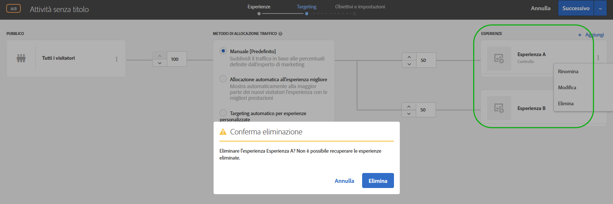 </p> <p>Consulta: </p> <p> 
     <ul id="ul_CB0C1146716F4C09BF924CF3DFA7DC1A"> 
      <li id="li_3767DD36F597481FB312CC577CD668F0"> <p>Attività A/B: <a href="../c-activities/t-test-ab/t-test-create-ab/ab-add-experience.md#task_454646F2895242D3B92DC395A0CE1A00" format="dita" scope="local"> Aggiungi esperienza </a> </p> </li> 
      <li id="li_E2990CA178C6446BA7206643A3164FEF"> <p>Attività Targeting esperienza: <a href="../c-activities/t-experience-target/t-xt-create/xt-add-experience.md#task_454646F2895242D3B92DC395A0CE1A00" format="dita" scope="local">Creare esperienze </a> </p> </li> 
     </ul> </p> <p>(TGT-30229) </p> </td> 
  </tr> 
  <tr> 
   <td colname="col1"> <p>Tipi di pubblico </p> </td> 
   <td colname="col2"> <p>Confronta un attributo di profilo con un altro attributo di profilo anziché con un numero statico. </p> <p>Consulta <a href="../c-target/c-audiences/creating-a-profile-attribute-comparison-audience.md#concept_4C2124B79A5B4556A6C1D10C0F5E40A0" format="dita" scope="local"> Creazione di un pubblico di confronto di attributo di profilo </a>. </p> <p> (TGT-28406) </p> </td> 
  </tr> 
  <tr> 
   <td colname="col1"> <p>Codice personalizzato </p> </td> 
   <td colname="col2"> <p>Il “codice personalizzato” è ora disponibile nel pannello “Aggiungi modifiche” anziché nella scheda. Puoi anche aggiungere ulteriori codici personalizzati e assegnare facoltativamente un nome a ciascuno di essi. (TGT-28504) </p> <p>Consulta <a href="../c-experiences/c-visual-experience-composer/c-vec-code-editor/vec-code-editor.md#concept_B3A6E9EE3A60406DB640E205EA1745B5" format="dita" scope="local"> Modifiche </a>. </p> </td> 
  </tr> 
  <tr> 
   <td colname="col1" class="premium"> <p>Consigli </p> </td> 
   <td colname="col2"> <p> 
     <ul id="ul_371C18DFC6D24E94B3D4FFFD83FC8D3A"> 
      <li id="li_9D11939014E7479AB7FD8910852A5386"> <p>Visualizza un elenco di attività che fanno riferimento a criteri selezionati sulla relativa scheda Criteri. La scheda elenca le attività attive e inattive. (TGT-27672) </p> </li> 
      <li id="li_B97BF9305EB04F6D8B1F6178B2E0CB34"> <p>Dal diagramma attività, le schede Criteri ora mostrano quando i risultati sono pronti per essere visualizzati. (TGT-27673) </p> <p>Consulta <a href="../c-recommendations/c-algorithms/algorithms.md#concept_4BD01DC437F543C0A13621C93A302750" format="dita" scope="local">Criteri </a>. </p> </li> 
     </ul> </p> </td> 
  </tr> 
  <tr> 
   <td colname="col1"> <p>Modelli di esperienza </p> </td> 
   <td colname="col2"> <p>I modelli Adobe Target Experience sono esempi di offerte precodificate con ingressi configurabili utilizzabili in Target per eseguire alcuni casi comuni di utilizzo del percorso di classe. Questi modelli di esperienza sono disponibili gratuitamente per gli sviluppatori e i rivenditori come punto di partenza per eseguire alcuni casi comuni di utilizzo esterno in Adobe Target (tramite il Compositore esperienza visivo o il Compositore esperienza basato su modulo). La personalizzazione potrebbe essere necessaria per l'integrazione con l'architettura della pagina web o della piattaforma. </p> <p>Consulta <a href="../c-experiences/c-visual-experience-composer/c-vec-code-editor/experience-templates.md#concept_109BBD7EABC04DD39E6B7B1687786652" format="dita" scope="local"> Modelli di esperienza </a>. </p> </td> 
  </tr> 
  <tr> 
   <td colname="col1"> <p>Serie di webinar sui fondamenti di Target </p> </td> 
   <td colname="col2"> <p>Partecipa alla nuova <a href="../cmp-resources-and-contact-information.md#concept_11902FAC95C64479AABE020557A7EEE4" format="dita" scope="local"> serie di webinar sui fondamenti di Target </a>, una serie Customer Success offerta dalla community. </p> </td> 
  </tr> 
 </tbody> 
</table>

**Miglioramenti, correzioni e modifiche**

Questa versione di [!DNL Target] include i seguenti miglioramenti, correzioni e modifiche:

* Per migliorare l&#39;utilizzo, sono state aumentate le dimensioni di Editor RTF. (TGT-24775)
* I diagrammi nel passaggio di Target (passaggio 2 del workflow guidato in tre fasi) per le attività di personalizzazione automatica (AP) e test multivariato (MVT) sono stati riprogettati secondo i progetti utilizzati per le attività A/B, Targeting esperienza (XT) e Consigli. (TGT-30712)
* Il valore della metrica per il rapporto di generazione del percorso di test multivariato (MVT) è ora più uniforme ai valori di altre metriche, che vengono arrotondati a due posizioni decimali. (TGT-30921)

### Version 1.5.0 di at.js (22 giugno 2018) {#section_53C622F4978F4BC9ACD932D4B7194C12}

<table id="table_B332A93D4A6E4568BA3F7FA8EC0787F4"> 
 <thead> 
  <tr> 
   <th colname="col1" class="entry"> Funzionalità/Miglioramento </th> 
   <th colname="col2" class="entry"> Descrizione </th> 
  </tr> 
 </thead>
 <tbody> 
  <tr> 
   <td colname="col1"> <p>at.js </p> </td> 
   <td colname="col2"> <p>È ora disponibile la versione 1.5.0 di at.js. </p> <p> <p>Nota: i codici tra parentesi sono per uso interno di Adobe. </p> </p> <p> 
     <ul id="ul_41FE0EED2D8B4ADE84FC4CA0FA0CE8A0"> 
      <li id="li_2DC17381CB7949AFA35B054B9CA723FA"> <p>I dettagli dell'evento <span class="codeph">a richiesta riuscita</span> contengono il flag di reindirizzamento. Questo flag può essere utilizzato per determinare se la pagina verrà reindirizzata a un URL diverso. Se desideri conoscere l'URL, abbonati a <span class="codeph">at-content-rendering-redirect</span>. (TNT-29834) </p> </li> 
      <li id="li_2852878862724BB2BD475C8FC7BF20DA"> <p>È stato risolto un problema che ha causato il mancato funzionamento di <span class="codeph">window.targetGlobalSettings.enabled</span> con un'eccezione di esecuzione se è stato impostato su falso. (TNT-29829) </p> </li> 
      <li id="li_96E5E409B36444F1B0E3E2606DC03996"> <p>È stato risolto un problema che ha causato un errore durante il caricamento nel Compositore esperienza visivo se si utilizza il codice personalizzato per una richiesta mbox globale di abilitazione e si nasconde il corpo. (TNT-29795) </p> </li> 
      <li id="li_818AA4EDDAC04D8B9BB4BA708D6BEF99"> <p>È stato aggiunto il supporto per <span class="codeph">screenOrientation</span>, <span class="codeph">devicePixelRatio</span> e <span class="codeph">webGLRenderer</span>. Questi nuovi parametri di richiesta di Target vengono utilizzati per iPhone X e altri sistemi di rilevamento dispositivi moderni. Per ulteriori informazioni, consulta <a href="../c-target/c-audiences/c-target-rules/mobile.md#concept_2A794199DC1A4D349FFFBC7DCF1FEB89" format="dita" scope="local">Mobile</a>. (TNT-29781) </p> </li> 
      <li id="li_87E3FB8B423C472AB1EE0DF2D7C64885"> <p>È stato risolto un problema per cui il suggerimento di posizione di Adobe Audience Manager (AAM) non veniva sempre inviato. (TNT-29695) </p> </li> 
      <li id="li_E9E5A5035AC24F54ADEF5447E3F15D3B"> <p>Per i browser che lo supportano, at.js 1.5.0 passa a MutationObserver per la votazione del selettore. Le versioni precedenti a at.js 1.0.0 utilizzavano un polyfill MutationObserver, che si è dimostrato problematico. Per evitare problemi di polyfill, la versione 1.5.0 utilizza il seguente pseudo codice per decidere quale meccanismo di programmazione utilizzare: </p> <p> 
        <code>
          if MutationObserver is supported scheduler = MutationObserver else if document is visible scheduler = requestAnimationFrame else scheduler = setTimeout 
        </code> </p> </li> 
     </ul> </p> </td> 
  </tr> 
 </tbody> 
</table>

### Target Standard/Premium 18.6.1 (20 giugno 2018) {#section_B63C660815B245DA9922BE33E03734A1}

Questa versione include i miglioramenti e le funzioni seguenti:

>[!NOTE]
>
>I codici tra parentesi sono per uso interno di Adobe.

<table id="table_5A60FFE5E86148F4BDC6A7031D03D6BA"> 
 <thead> 
  <tr> 
   <th colname="col1" class="entry"> Funzionalità/Miglioramento </th> 
   <th colname="col2" class="entry"> Descrizione </th> 
  </tr> 
 </thead>
 <tbody> 
  <tr> 
   <td colname="col1"> <p>Compositore esperienza visivo </p> </td> 
   <td colname="col2"> <p>Quando fai clic su un azione nel Pannello delle modifiche, il Compositore esperienza visivo automaticamente scorre la pagina web ed evidenzia l'elemento corrispondente. Non è più necessario scorrere manualmente la pagina per trovare l'elemento HTML interessato dalla modifica. </p> <p> 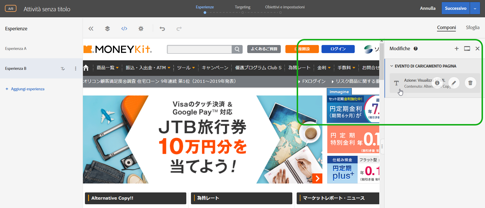 </p> <p>(TGT-30441) </p> </td> 
  </tr> 
  <tr> 
   <td colname="col1"> <p>Browser supportati </p> </td> 
   <td colname="col2"> <p>È stato aggiunto Microsoft Edge come browser supportato per l'interfaccia utente di Target e per la distribuzione dei contenuti. </p> <p>Per ulteriori informazioni, vedi. <a href="../c-implementing-target/c-considerations-before-you-implement-target/supported-browsers.md#reference_01B4BF99E7D545A7998773202A2F6100" format="dita" scope="local"> Browser supportati </a> (TGT-14102) </p> </td> 
  </tr> 
  <tr> 
   <td colname="col1" class="premium"> <p>Consigli </p> </td> 
   <td colname="col2"> <p>Il criterio Articoli visualizzati di recente ora restituisce risultati specifici per un dato <a href="../administrating-target/hosts.md#concept_516BB01EBFBD4449AB03940D31AEB66E" format="dita" scope="local">ambiente </a>. Se due siti appartengono ad ambienti diversi e un visitatore passa da un sito all’altro, ciascun sito mostra solo gli articoli visualizzati di recente per il sito appropriato. Se due siti si trovano nello stesso ambiente e un visitatore passa tra di essi, il visitatore vedrà gli stessi elementi visualizzati di recente per entrambi i siti. </p> <p>Per ulteriori informazioni, consulta <a href="../c-recommendations/c-algorithms/create-new-algorithm.md#task_2B0ED54AFBF64C56916B6E1F4DC0DC3B" format="dita" scope="local">Basare il consiglio su una Chiave consiglio</a>. (RECS-5865) </p> </td> 
  </tr> 
 </tbody> 
</table>

**Miglioramenti, correzioni e modifiche**

Questa versione di [!DNL Target] include i seguenti miglioramenti, correzioni e modifiche:

* La riga Backup di download CSV dei Consigli ora ha &quot;*&quot; davanti (doppie virgolette che racchiudono un asterisco) invece di * (un singolo asterisco).
* La riga dei Più venduti/Più visualizzati nel file CSV scaricabile dei Consigli non ha più una virgola davanti.

### Modifiche alla piattaforma di Target (19 giugno 2018) {#section_0638BD69F3C640479A2A258AD78C0884}

Questa versione include i seguenti miglioramenti:

>[!NOTE]
>
>I codici tra parentesi sono per uso interno di Adobe.

* La lista dei dispositivi è stata aggiornata per includere i più recenti modelli di cellulare. È stata aggiunta la capacità di distribuire contenuto con targeting a specifici modelli di iPhone usando il Device Marketing Name o Device Model.

   I clienti che usano SDK mobile non hanno necessità di utilizzare questa funzione. I clienti che utilizzano at.js devono fare l&#39;upgrade alla versione 1.5.0 di at.js.

   Per ulteriori informazioni, consulta [Mobile](../c-target/c-audiences/c-target-rules/mobile.md#concept_2A794199DC1A4D349FFFBC7DCF1FEB89). (TNT-26714, TNT-28288)

### API per il download di Target (5 giugno 2018) {#section_B8729DA10F18433C8D8E01B04F308ED2}

Puoi usare l&#39;API Download di Recommendations per scaricare le raccomandazioni in un file CSV che può essere visualizzato in un editor di fogli di calcolo o di testo. Per migliorare la sicurezza, a partire dal **5 giugno 2018**, Target bloccherà le richieste HTTP e autorizzerà solo quelle HTTPS.

### Target Standard/Premium 18.5.1 (22 maggio 2018) {#section_7C1427793C2A48DBAC39F8290717DC5B}

Questa versione include i miglioramenti e le funzioni seguenti:

>[!NOTE]
>
>I codici tra parentesi sono per uso interno di Adobe.

<table id="table_1C51F61184684072BC69AD15BA68BEBB"> 
 <thead> 
  <tr> 
   <th colname="col1" class="entry"> Funzione </th> 
   <th colname="col2" class="entry"> Descrizione </th> 
  </tr> 
 </thead>
 <tbody> 
  <tr> 
   <td colname="col1"> <p>Rapporti </p> </td> 
   <td colname="col2"> <p> 
     <ul id="ul_8D08FE4AC7D748EFB2BBFF87DBDC5CE5"> 
      <li id="li_B8929C19276D42168A28A3775CDEDFB3"> <p>Puoi salvare fino a dieci diversi predefiniti del rapporto di una singola attività dopo averla configurata come desiderato (metriche, pubblico, impostazioni avanzate e così via). Tutti gli utenti di Target possono visualizzare, modificare ed eliminare i vari predefiniti, a prescindere da chi li ha creati. (TGT-21268) </p> </li> 
      <li id="li_7ADA62F2ACA049C9B4A8986B09A9F4AA"> <p>Puoi configurare un rapporto di attività individuale come desideri e poi salvare tale configurazione come predefinita/impostazione preferita. Questa è la vista che compare quando vedi che il rapporto dell'attività sta avanzando. (TGT-10082) </p> </li> 
      <li id="li_DC63C04F3A884BDDA55B5515E4643B7B"> <p>Segnalazioni e messaggi all'interno dei rapporti ti premettono di sapere se uno o più tipi di pubblico, metriche, gruppi ospite o esperienze sono state cancellate dal rapporto precedentemente configurato. La segnalazione o il messaggio ti indica di scegliere un altro pubblico, metrica, gruppo ospite o esperienza da preimpostare nuovamente. (TGT-29424) </p> </li> 
     </ul> </p> <p>Per ulteriori informazioni, consulta la sezione Predefinito di Target in <a href="../c-reports/c-report-settings/report-settings.md#concept_3A80D5A394EC4B639DC715E06085BDB0" format="dita" scope="local"> Impostazioni dei rapporti </a>. </p> </td> 
  </tr> 
  <tr> 
   <td colname="col1"> <p>Script di profilo </p> </td> 
   <td colname="col2"> <p> 
     <ul id="ul_F382C8E7708846A08676E1534BC92878"> 
      <li id="li_70E89504525C4119B588C230DCE772E8"> <p>Puoi visualizzare schede a comparsa di script di profilo simili come schede informative. Queste schede informative sullo script di profilo ti permettono di visualizzare l’elenco delle attività che si riferiscono allo script di profilo selezionato, insieme ad altri metadati utili. (TGT-28253) </p> <p>Per ulteriori informazioni, consulta la sezione Visualizzazione delle schede di informazioni sugli script di profilo in <a href="../c-target/c-visitor-profile/profile-parameters.md#concept_8C07AEAB0A144FECA8B4FEB091AED4D2" format="dita" scope="local"> Attributi degli script di profilo </a>. </p> </li> 
     </ul> </p> </td> 
  </tr> 
  <tr> 
   <td colname="col1"> <p>Tipi di pubblico </p> </td> 
   <td colname="col2"> <p> 
     <ul id="ul_DFEB778393024E3EBBC482F31A5B39BC"> 
      <li id="li_4049E334A38F4F94842FF1E35F177FE9"> <p>La creazione di tipi di pubblico personalizzati ora permette di usare il parametro mbox direttamente senza dover per forza specificare il nome mbox. Il nome dell’elemento mbox è ora facoltativo. Questa modifica consente di utilizzare parametri da più elementi mbox o di fare riferimento a un parametro che non è ancora stato registrato nella rete Edge. In alternativa, puoi applicare un filtro o sul parametro mbox con il nome mbox. </p> <p>Questo miglioramento è stato esteso anche ai criteri dei consigli, promozioni dei consigli e regole del test di esempio. </p> </li> 
     </ul> </p> <p>Per ulteriori informazioni, consulta <a href="../c-target/c-audiences/c-target-rules/custom-parameters.md#concept_C4C6E00D7C5A4BE9B72D471DB2E3027B" format="dita" scope="local"> Parametri personalizzati </a>. </p> </td> 
  </tr> 
  <tr> 
   <td colname="col1" class="premium"> <p>Consigli </p> </td> 
   <td colname="col2"> <p> 
     <ul id="ul_7765B69E679D4C94B1E863E340DFDE15"> 
      <li id="li_F2AF7E1AFBD6461990EF1D83D1989582"> <p>Durante la selezione dei criteri di consigli nel compositore esperienza basato su moduli, è ora disponibile un collegamento diretto alla scheda dei criteri selezionati per poter modificare in modo semplice e veloce i criteri. (TGT-28483) </p> <p>Per ulteriori informazioni, consulta <a href="../c-experiences/form-experience-composer.md#task_FAC842A6535045B68B4C1AD3E657E56E" format="dita" scope="local">Compositore esperienza basato su moduli</a>. </p> </li> 
      <li id="li_517F0A174587416B8621D6F710C1AC48"> <p>Ora per creare i criteri e le promozioni della funzione Consigli e le regole per il test dei modelli è possibile utilizzare il parametro mbox direttamente senza che sia necessario specificare il nome mbox. Il nome dell’elemento mbox è ora facoltativo. Questa modifica consente di utilizzare parametri da più elementi mbox o di fare riferimento a un parametro che non è ancora stato registrato nella rete Edge. In alternativa, puoi applicare un filtro o sul parametro mbox con il nome mbox. </p> <p>Questo miglioramento è stato esteso anche alla creazione di tipi di pubblico personalizzati. </p> <p>Per ulteriori informazioni, consulta <a href="../c-recommendations/c-recommendations-faq/recommendations-faq.md#concept_EF272DE4AC6C47B19026BFBE816F5DB8" format="dita" scope="local"> Domande frequenti sui consigli </a>. </p> </li> 
      <li id="li_AAB242830D1E47B78E58A980B717C736"> <p>L'interfaccia usuario delle schede di progettazione dei consigli è stata aggiornata. </p> </li> 
      <li id="li_1BE3178663E54F4CA8714FE3ACDBB97B"> <p>La documentazione API dei consigli di Target può essere trovata sul <a href="https://www.adobe.io/apis/experiencecloud/target/docs/getting-started.html" format="html" scope="external">sito Adobe I/0 Adobe Target</a> (https://www.adobe.io/apis/experiencecloud/target/docs/getting-started.html). </p> </li> 
     </ul> </p> </td> 
  </tr> 
 </tbody> 
</table>

**Miglioramenti, correzioni e modifiche**

Questa versione di [!DNL Target] include i seguenti miglioramenti, correzioni e modifiche:

* L&#39;interfaccia usuario per il passaggio 2 del workflow guidato in tre fasi, usata per creare o modificare un test A/B Test, targeting esperienze (XT) o attività di consigli, è stato aggiornato. (TGT-18911)

### Target Standard/Premium 18.4.1 (25 aprile 2018) {#section_445DBC5402BA456BAF2D24AEA33A91C9}

Questa versione include i miglioramenti e le funzioni seguenti:

>[!NOTE]
>
>I codici tra parentesi sono per uso interno di Adobe.

<table id="table_6D99C48B72D24728BF623608053931D3"> 
 <thead> 
  <tr> 
   <th colname="col1" class="entry"> Funzione </th> 
   <th colname="col2" class="entry"> Descrizione </th> 
  </tr> 
 </thead>
 <tbody> 
  <tr> 
   <td colname="col1"> <p>Frammenti di esperienza di Adobe Experience Manager (AEM) </p> </td> 
   <td colname="col2"> <p>I frammenti di esperienza creati in AEM possono essere utilizzati nelle attività di Target per combinare la facilità d'uso e la potenza di AEM con le potenti capacità di intelligenza automatizzata (AI) ed apprendimento automatico (ML) di Target per testare e personalizzare le esperienze su grande scala.&amp;nbsp;&amp;nbsp; </p> <p>AEM riunisce tutti i contenuti e le risorse in una posizione centrale per alimentare la tua strategia di personalizzazione. AEM consente di creare facilmente contenuti per desktop, tablet e dispositivi mobili in un'unica posizione senza scrivere codice. Non è necessario creare pagine per ogni dispositivo: AEM regola automaticamente ogni esperienza utilizzando il contenuto. </p> <p> Target consente di fornire esperienze personalizzate in scala su una combinazione di approcci di apprendimento automatico basati sulle regole e guidati da intelligenze automatizzate che incorporano variabili comportamentali, contestuali e offline.Con Target puoi facilmente impostare ed eseguire attività di test A/B e multivariati per determinare le offerte, i contenuti e le esperienze migliori. </p> <p>La funzione Frammenti esperienza rappresenta un enorme passo avanti per la collaborazione tra i creatori e i manager di contenuti ed esperienze, e i professionisti di personalizzazione e ottimizzazione che usano Target per conseguire risultati di business. </p> <p>Per ulteriori informazioni, consulta <a href="../c-experiences/c-manage-content/aem-experience-fragments.md#topic_1E1E4EA01F074349B2CF8785387B5FE8" format="dita" scope="local">Frammenti esperienza AEM </a>. </p> </td> 
  </tr> 
  <tr> 
   <td colname="col1"> <p>Rapporti </p> </td> 
   <td colname="col2"> 
    <ul id="ul_EAB90C510EA04D6A8AEFF23A77DB2337"> 
     <li id="li_47DA6EB92CC84FFDBFDC9CC9386AF654"> <p>Puoi ora ricaricare un rapporto per aggiornarne la visualizzazione di tabelle e grafici senza ricaricare l’intera pagina, la configurazione o l’intervallo di date. (TGT-28125) </p> <p>Per ulteriori informazioni, consulta <a href="../c-reports/c-report-settings/report-settings.md#concept_3A80D5A394EC4B639DC715E06085BDB0" format="dita" scope="local">Impostazioni dei rapporti</a>. </p> </li> 
     <li id="li_AB2DE7A45D914FD7AEB0832187AF3844"> <p>Il calendario nei rapporti contiene ora degli intervalli di date predefiniti, come ad esempio Ultimi 7 giorni, Ultimi 15 giorni e così via. (TGT-29171) </p> <p>Per ulteriori informazioni, consulta <a href="../c-reports/c-report-settings/report-settings.md#concept_3A80D5A394EC4B639DC715E06085BDB0" format="dita" scope="local">Impostazioni dei rapporti</a>. </p> </li> 
     <li id="li_46DF9037E0ED4935B3BCDB35E8BED065"> <p>La larghezza della colonna della vista tabella è stata modificata per ridurre lo scorrimento orizzontale quando vengono applicate più metriche. (TGT-26575) </p> </li> 
    </ul> </td> 
  </tr> 
  <tr> 
   <td colname="col1"> <p>Localizzazione dell’interfaccia utente </p> </td> 
   <td colname="col2"> <p>L’interfaccia utente di Target è ora disponibile nelle seguenti lingue: </p> <p> 
     <ul id="ul_DB6C771FCFDF43F498F8754920A70BCD"> 
      <li id="li_A65D07DF66844AC8BEEC1D413F214191"> <p>Cinese semplificato </p> </li> 
      <li id="li_5986DD06AF5B4F76B3A02CFBF2DC3644"> <p>Cinese tradizionale </p> </li> 
      <li id="li_341FDC1CEC2B4C4BBD45CB2A0A54F2A3"> <p>Coreano </p> </li> 
      <li id="li_A4C31539B98E42348D5F1A18C63EAB6C"> <p>Italiano </p> </li> 
      <li id="li_97E3E0A916B64601BBF601AAED581174"> <p>Portoghese </p> </li> 
     </ul> </p></td> 
  </tr> 
  <tr> 
   <td colname="col1"> <p>Tipi di pubblico </p> </td> 
   <td colname="col2"> <p>Durante la creazione di un pubblico personalizzato basato su un parametro mbox, <span class="codeph">mboxParameter</span> non richiede più di specificare <span class="codeph">mboxName </span>. Il nome dell’elemento mbox è ora facoltativo. Questa modifica consente di utilizzare parametri da più elementi mbox o di fare riferimento a un parametro che non è ancora stato registrato nella rete Edge. (TGT-25807) </p> <p> <p>Nota: questa funzionalità è visibile nell’interfaccia utente di Target ma è attualmente disabilitata. Questa funzionalità verrà presto abilitata (data da comunicarsi). </p> </p> 
  </td> 
  </tr> 
 </tbody> 
</table>

**Miglioramenti, correzioni e modifiche**

Questa versione di [!DNL Target] include i seguenti miglioramenti, correzioni e modifiche:

* Transport Layer Security (TLS) è tra i protocolli di sicurezza distribuiti più ampiamente ed è oggi utilizzato per i browser web e per altre applicazioni dove i dati devono essere scambiati in modo sicuro all’interno di una rete. Adobe possiede degli standard di sicurezza e conformità che richiedono la chiusura dei protocolli più vecchi e l’utilizzo di TLS 1.2 per poter avere la versione in uso più aggiornata e più sicura. A partire dalla versione 18.4.1 di Target (25 aprile 2018), Adobe Target farà dei passi avanti per avvicinarsi alla crittografia TLS 1.2 ed eliminare completamente il supporto per la crittografia TLS 1.0 entro il 12 settembre 2018. È importante che esamini a fondo le specifiche e pianifichi le modifiche per una transizione senza problemi. Per ulteriori informazioni, consulta [Modifiche alla crittografia TLS](../c-implementing-target/c-considerations-before-you-implement-target/tls-transport-layer-security-encryption.md#concept_CC1001E9D3AE4BABAF90B8311B0A6451).
* L’interfaccia utente per le schede Criteri dei consigli è stata migliorata per un’ottima fruibilità. (TGT-27829)

### at.js (3 aprile 2018) {#section_932DF1004F4648668FE4984BFAF2EC49}

Questa versione include i miglioramenti e le funzioni seguenti:

<table id="table_76576D9D931B4DA99900F2C03175938E"> 
 <thead> 
  <tr> 
   <th colname="col1" class="entry"> Funzione </th> 
   <th colname="col2" class="entry"> Descrizione </th> 
  </tr> 
 </thead>
 <tbody> 
  <tr> 
   <td colname="col1"> <p>at.js </p> </td> 
   <td colname="col2"> <p>È ora disponibile la versione 1.3.0 di at.js. Per ulteriori informazioni, consulta <a href="../c-implementing-target/c-implementing-target-for-client-side-web/how-to-deployatjs/implementing-target-without-a-tag-manager.md#concept_1E1F958F9CCC4E35AD97581EFAF659E2" format="dita" scope="local">Scarica at.js</a> e <a href="../c-implementing-target/c-implementing-target-for-client-side-web/target-atjs-versions.md#reference_DBB5EDB79EC44E558F9E08D4774A0F7A" format="dita" scope="local">Dettagli della versione di at.js</a>. </p> <p> 
     <ul id="ul_349BEB37B6C94FF0801F121042037803"> 
      <li id="li_4C2F82F4DD394ED5A0BFF978B15FEDDF"> <p>I seguenti nuovi eventi sono disponibili per facilitare il tracciamento, il debug e la personalizzazione dell’interazione con at.js: </p> <p> 
        <ul id="ul_EFF7E2FCEA0D42298779DDE13B54503F"> 
         <li id="li_6A2B06A522004EDE96D9A552571A7C30"> <p>LIBRARY_LOADED </p> </li> 
         <li id="li_61AA203A21DF4B7EAE075374A09C8FF0"> <p>REQUEST_START </p> </li> 
         <li id="li_DAF9CC1E86834C62B93419429B43A2CB"> <p>CONTENT_RENDERING_START </p> </li> 
         <li id="li_A52DC337115248A1BE5AF5B358BE5A9A"> <p>CONTENT_RENDERING_NO_OFFERS </p> </li> 
         <li id="li_7D71E48016B1446995493EBBF7D32447"> <p>CONTENT_RENDERING_REDIRECT </p> </li> 
        </ul> </p> <p>Per ulteriori informazioni, consulta <a href="../c-implementing-target/c-implementing-target-for-client-side-web/cmp-atjs-functions.md#reference_A828E4BA535F4E7692A075F3D70CF6CD" format="dita" scope="local"> Eventi personalizzati at.js </a>. </p> </li> 
      <li id="li_E2704294F8BA47FFAABE7572F67FB5C0"> <p>È possibile integrare una richiesta at.js con parametri aggiuntivi provenienti da provider di dati. Aggiungi i provider di dati a <span class="codeph">window.targetGlobalSettings</span> nella <span class="codeph">chiave dataProviders </span>. </p> <p>Per ulteriori informazioni, consulta “Fornitori dati” in <a href="../c-implementing-target/c-implementing-target-for-client-side-web/cmp-atjs-functions.md#concept_8DACBC47ABDE4279BB102B42609FE506" format="dita" scope="local">targetGlobalSettings() </a>. </p> </li> 
      <li id="li_02EAFE6DA0D44CF88980184FD14226A5"> <p>Le richieste at.js ora utilizzano GET, ma passeranno a POST quando la dimensione dell’URL supererà i 2048 caratteri. La nuova proprietà <span class="codeph">urlSizeLimit</span> consente di aumentare questo limite, se necessario. Questa modifica consente di allineare Target at.js ad AppMeasurement, che utilizza la stessa tecnica. </p> </li> 
      <li id="li_43363A4F3A764394AA88D2595F93D8C0"> <p>Target ora impone che venga utilizzata la chiave <span class="codeph">mbox</span> nella funzione <span class="codeph">adobe.target.applyOffer(options)</span>. Questa chiave era già richiesta in passato, ma Target ora ne impone l’utilizzo per garantire la corretta convalida di Target e il corretto utilizzo di questa funzione da parte dei clienti. </p> <p>Per ulteriori informazioni, consulta <a href="../c-implementing-target/c-implementing-target-for-client-side-web/cmp-atjs-functions.md#reference_BBE83F513B5B4E03BBC3F50D90864245" format="dita" scope="local">adobe.target.applyOffer(options) </a>. </p> </li> 
      <li id="li_7336D8D48A894291A378E0BB212B7F9B"> <p>at.js offre una funzionalità migliorata per il tracciamento di eventi e clic. at.js utilizza <span class="codeph">navigator.sendBeacon()</span> per inviare i dati di tracciamento degli eventi; se <span class="codeph">navigator.sendBeacon()</span> non è supportato, si basa su richieste XHR sincrone. Questa alternativa riguarda principalmente Internet Explorer 10 e 11 e alcune versioni di Safari. Con iOS 11.3, in Safari verrà aggiunto il supporto di <span class="codeph">navigator.sendBeacon()</span>. </p> </li> 
      <li id="li_28D7324137B14C75BF6F1EA0B2487C9B"> <p>at.js ora può renderizzare le offerte anche quando una pagina viene aperta nelle schede in background. Alcuni utenti di Target hanno riscontrato problemi quando <span class="codeph">requestAnimationFrame()</span> è stato disattivato a causa del comportamento di limitazione del browser per le schede in background. </p> </li> 
      <li id="li_3278979E1C6C41DEA7E8025AEB337985"> <p>In questa versione sono stati aggiunti svariati miglioramenti a livello di prestazioni, tra cui call stack più brevi durante l’ispezione di un profilo CPU in Chrome. </p> </li> 
      <li id="li_AAA9C0DCC3354DFA8907968C8E6427F6"> <p>at.js 1.3.0 non supporta più la consegna di contenuti in Microsoft Internet Explorer 9. Per un elenco dei browser supportati, consulta <a href="../c-implementing-target/c-considerations-before-you-implement-target/supported-browsers.md#reference_01B4BF99E7D545A7998773202A2F6100" format="dita" scope="local"> Browser supportati </a>. Da adesso in poi, tutte le richieste vengono eseguite tramite <span class="codeph">XMLHttpRequest</span> con supporto CORS, senza richieste JSONP. Questa modifica migliora notevolmente la sicurezza. </p> </li> 
     </ul> </p> </td> 
  </tr> 
 </tbody> 
</table>

### Target Standard/Premium 18.3.1 (20 marzo 2018) {#section_880706BE15544A03A2C951F267F4AEC5}

Questa versione include i miglioramenti e le funzioni seguenti:

>[!NOTE]
>
>I codici tra parentesi sono per uso interno di Adobe.

<table id="table_AE38682151A948AEA21E35A353F18D76"> 
 <thead> 
  <tr> 
   <th colname="col1" class="entry"> Funzione </th> 
   <th colname="col2" class="entry"> Descrizione </th> 
  </tr> 
 </thead>
 <tbody> 
  <tr> 
   <td colname="col1" class="premium"> <p>Attributo di popolarità “Entità” </p> </td> 
   <td colname="col2"> <p><b>Novità: 22 marzo 2018</b> </p> <p>Ora puoi impostare la popolarità in base all’attributo Entità nel flusso esistente quando un attributo personalizzato è selezionato come chiave. </p> <p>Dopo aver selezionato la chiave desiderata (in questo caso, un attributo di profilo personalizzato), per “Logica consigli”, puoi scegliere due nuove opzioni: </p> <p> 
     <ul id="ul_7A6F2398ADE846EF8A7A3110C2736BF7"> 
      <li id="li_66BFF016564749B298B88F6B9638B64E"> <p>Articoli più visualizzati </p> </li> 
      <li id="li_937FE5C40ED8471391B282D1ACE8C133"> <p>Articoli più venduti </p> </li> 
     </ul> </p> <p>Per ulteriori informazioni, vedi la riga “Attributo personalizzato” in <a href="../c-recommendations/c-algorithms/create-new-algorithm.md#task_2B0ED54AFBF64C56916B6E1F4DC0DC3B" format="dita" scope="local">Basare il consiglio su una Chiave consiglio</a>. </p> </td> 
  </tr> 
  <tr> 
   <td colname="col1"> <p>Tipi di pubblico </p> </td> 
   <td colname="col2"> <p>Quando visualizzi la scheda a comparsa delle definizioni dei tipi di pubblico (ad esempio, dalla Libreria tipi di pubblico), puoi vedere altre attività che fanno riferimento allo stesso pubblico. In questo modo puoi evitare di intervenire accidentalmente sulle attività mentre modifichi i tipi di pubblico. </p> <p>In precedenza, quando tentavi di eliminare un pubblico a cui facevano riferimento alcune attività, un messaggio di avvertenza ti informava che non era possibile eliminare un pubblico a cui fanno riferimento un massimo di 10 attività. </p> <p>Per ulteriori informazioni, consulta <a href="../c-target/c-audiences/audiences.md#concept_65BE870D290E412D8BBF557EEA67C271" format="dita" scope="local"> I tipi di pubblico </a>. </p> </td> 
  </tr> 
  <tr> 
   <td colname="col1"> <p>Rapporti </p> </td> 
   <td colname="col2"> <p>Le informazioni su incremento e limiti nei rapporti sono più complete e utili, con una descrizione che specifica come avviene il calcolo dei limiti. (TGT-28729) </p> <p>Per ulteriori informazioni, consulta <a href="../c-reports/c-report-settings/average-lift-bounds-and-confidence-interval.md#topic_AFFDC672A8A34D028B100EF6BE5D8129" format="dita" scope="local">Incremento medio, limiti di incremento e intervallo di confidenza </a>. </p> </td> 
  </tr> 
  <tr> 
   <td colname="col1" class="premium"> <p>Attività di Personalizzazione automatizzata (AP) e Targeting automatico </p> </td> 
   <td colname="col2"> <p>Puoi trovare ulteriori indicazioni nell’interfaccia utente e nell’Aiuto per allocare in modo più efficace le percentuali di traffico nelle attività di Personalizzazione automatizzata (AP) e Targeting automatico. </p> <p>Per ulteriori informazioni, consulta <a href="../c-activities/auto-target-to-optimize.md#section_AB3656F71D2D4C67A55A24B38092958F" format="dita" scope="local">Determinazione dell’allocazione del traffico</a> e <a href="../c-activities/t-automated-personalization/create-ap-activity.md#task_8AAF837796D74CF893CA2F88BA1491C9" format="dita" scope="local">Creazione di un’attività di personalizzazione automatizzata </a>. </p> </td> 
  </tr> 
  <tr> 
   <td colname="col1" class="premium"> <p>Consigli: regole di inclusione, raccolte ed esclusioni per Criteri personalizzati </p> </td> 
   <td colname="col2"> <p>Adesso puoi aggiungere filtri in tempo reale all’output dei criteri personalizzati. Ad esempio, puoi limitare gli articoli consigliati a quelli della categoria o del marchio preferito dal visitatore. Così puoi combinare calcoli offline e filtri in tempo reale. </p> <p>Con l’aggiunta delle regole di inclusione ai Criteri personalizzati, i consigli non sono più statici ma diventano dinamici, in base agli interessi del visitatore. </p> <p> 
     <ul id="ul_BDD55AB34F4A43C691D2399C16AA3D6C"> 
      <li id="li_133C33E0D02E4861A4C855BD8A492E69"> <p>Adesso puoi configurare i Criteri personalizzati, come altri criteri nei consigli. </p> </li> 
      <li id="li_AC201F0917BF465C985E8947635F762E"> <p>Puoi utilizzare raccolte, esclusioni e inclusioni (incluse le regole speciali per Prezzo e Inventario) proprio come per tutti gli altri criteri. Le raccolte e le esclusioni erano già supportate. Con questa versione sono state aggiunte le inclusioni. </p> </li> 
     </ul> </p> <p>Per ulteriori informazioni, consulta <a href="../c-recommendations/c-algorithms/algorithms.md#concept_4BD01DC437F543C0A13621C93A302750" format="dita" scope="local"> Criteri </a>. </p> <p>(TGT-28488) </p> </td> 
  </tr> 
  <tr> 
   <td colname="col1" class="premium"> <p>Consigli: regole di inclusione, raccolte ed esclusioni per i criteri “Visualizzati di recente” </p> </td> 
   <td colname="col2"> <p>Puoi filtrare gli articoli visualizzati di recente in modo che vengano visualizzati solo gli articoli con uno specifico attributo. Ad esempio, nel caso di una multinazionale con più linee di business, un visitatore potrebbe visualizzare gli articoli in più siti della stessa società. In questo caso, puoi limitare gli articoli visualizzati di recente al solo sito su cui sono stati visualizzati. In tal modo gli articoli visualizzati di recente non saranno visualizzati sugli altri siti della stessa società. </p> <p> 
     <ul id="ul_A2D260F01CA047EEA72EF56BD0EE88FA"> 
      <li id="li_DB107DD357B741CCB2B7A4FDAD16F9D6"> <p>Adesso puoi configurare i criteri per la funzione Visualizzato di recente, come gli altri criteri nei consigli. </p> </li> 
      <li id="li_85452C03F0924D4C8D854509F1293021"> <p>Puoi utilizzare raccolte, esclusioni e inclusioni (incluse le regole speciali per Prezzo e Inventario) proprio come per tutti gli altri criteri. Le raccolte e le esclusioni erano già supportate. Con questa versione sono state aggiunte le inclusioni. </p> </li> 
     </ul> </p> <p>Per ulteriori informazioni, consulta <a href="../c-recommendations/c-algorithms/algorithms.md#concept_4BD01DC437F543C0A13621C93A302750" format="dita" scope="local"> Criteri </a>. </p> <p>(TGT-22843) </p> </td> 
  </tr> 
  <tr> 
   <td colname="col1"> <p>Estensione Target per Adobe Launch </p> </td> 
   <td colname="col2"> <p>Launch è la soluzione Adobe di nuova generazione per la gestione dei tag. Launch offre ai clienti un modo semplice di implementare e gestire tutti i tag di analisi, marketing e annunci pubblicitari necessari per fornire ai clienti esperienze personalizzate. </p> <p>Grazie all’estensione di Target puoi implementare rapidamente e facilmente Target nel tuo ambiente. </p> <p>Per ulteriori informazioni, consulta <a href="../c-implementing-target/c-implementing-target-for-client-side-web/how-to-deployatjs/cmp-implementing-target-using-adobe-launch.md#topic_5234DDAEB0834333BD6BA1B05892FC25" format="dita" scope="local"> Implementazione di Target con Adobe Launch </a>. </p> </td> 
  </tr> 
 </tbody> 
</table>

**Miglioramenti, correzioni e modifiche**

Questa versione di [!DNL Target] include i seguenti miglioramenti, correzioni e modifiche:

* Quando crei o modifichi attività A/B e Targeting esperienze (XT), Target conserva le informazioni sull’ultima esperienza, pagina o versione di esperienza aperta (tramite la funzionalità per più tipi di pubblico) e, alla successiva apertura dell’interfaccia utente di Target, seleziona la pagina appropriata. (TGT-28225)
* Sono state apportate delle correzioni di sicurezza per motivi di conformità.

### Target Standard/Premium 18.2.1 (15 febbraio 2018) {#section_837CBBB7A89D45D99855A8C5F5E7BFFB}

Questa versione include i miglioramenti e le funzioni seguenti:

<table id="table_1C7A462AE8D4492FA5555F060031F665"> 
 <thead> 
  <tr> 
   <th colname="col1" class="entry"> Funzione </th> 
   <th colname="col2" class="entry"> Descrizione </th> 
  </tr> 
 </thead>
 <tbody> 
  <tr> 
   <td colname="col1"> <p>Adobe Marketing Cloud è stato rinominato e si chiama ora Adobe Experience Cloud. </p> </td> 
   <td colname="col2"> <p>Experience Cloud è un insieme integrato di soluzioni e servizi di marketing digitali realizzati da Adobe. È anche un'interfaccia intuitiva che ti consente di accedere rapidamente a soluzioni e servizi di base cloud. </p> <p>Il cambio di nome e le modifiche all'interfaccia utente: Adobe Marketing Cloud è stato rinominato e ora si chiama Adobe Experience Cloud. In aggiunta, noterai delle modifiche dell’interfaccia utente di Target e nel modulo per cambiare soluzione. </p> <p>Per ulteriori informazioni su questa modifica, vedere <a href="https://docs.adobe.com/content/help/en/core-services/interface/about-core-services/solutions-core-services.html" format="html" scope="external">Informazioni sui nuovi nomi cloud in Experience Cloud </a>. </p> </td> 
  </tr> 
 </tbody> 
</table>

**Miglioramenti, correzioni e modifiche**

Questa versione di [!DNL Target] include alcuni miglioramenti, correzioni e modifiche di back-end.

### Piattaforma di Target (18 gennaio 2018) {#section_F6A0DC31636D403F92BDB9DCE7A3F6ED}

Questa versione include i miglioramenti e le funzioni seguenti:

<table id="table_0F5BF9370E214302BDFE0AC2D66EC773"> 
 <thead> 
  <tr> 
   <th colname="col1" class="entry"> Funzione </th> 
   <th colname="col2" class="entry"> Descrizione </th> 
  </tr> 
 </thead>
 <tbody> 
  <tr> 
   <td colname="col1"> <p>at.js </p> </td> 
   <td colname="col2"> <p>In at.js 1.2.3 è stato aggiunto il supporto per le offerte JSON. Le offerte JSON sono supportate solo nelle attività create utilizzando il Compositore esperienza basato su moduli. Attualmente le offerte JSON possono essere utilizzate solo tramite chiamate API dirette. Consulta <a href="../c-experiences/c-manage-content/create-json-offer.md#concept_63C7BEE1F0DB4A7596D997219B7C136D" format="dita" scope="local">Creare un’offerta JSON</a>. </p> </td> 
  </tr> 
  <tr> 
   <td colname="col1"> <p>Altre modifiche </p> </td> 
   <td colname="col2"> <p>Adesso le regole di esclusione, i cataloghi, le regole di inclusione degli algoritmi e i filtri in fase di esecuzione non sono sensibili alla distinzione maiuscole/minuscole. </p> </td> 
  </tr> 
 </tbody> 
</table>

### Target Standard/Premium 18.1.1 (23 gennaio 2018) {#section_3A2216543B064D6F82EC03E1F8AEC74D}

Questa versione include i miglioramenti e le funzioni seguenti:

>[!NOTE]
>
>I codici tra parentesi sono per uso interno di Adobe.

<table id="table_872FE2BE61CC4A5CA369D9A6C730686E"> 
 <thead> 
  <tr> 
   <th colname="col1" class="entry"> Funzione </th> 
   <th colname="col2" class="entry"> Descrizione </th> 
  </tr> 
 </thead>
 <tbody> 
  <tr> 
   <td colname="col1"> <p>Tipi di pubblico </p> </td> 
   <td colname="col2"> <p> 
     <ul id="ul_42D7C86043C94A7BBA5ED405B2902E3A"> 
      <li id="li_50F2A7D05AB244E18D263A476BD906B3"> <p>Ora puoi creare un pubblico con Intervallo di tempo senza date di inizio o di fine. In questo modo puoi utilizzare lo stesso pubblico in più attività (senza creare una copia del pubblico) controllando le date di inizio e di fine a livello di attività. Consulta <a href="../c-target/c-audiences/c-target-rules/time-frame.md#concept_0FE1E8DACD104F8B870B0BADE3197F0A" format="dita" scope="local">Intervallo di tempo</a>. (TGT-25975) </p> </li> 
      <li id="li_6F08D63BC4F040859D51C47C3521C5E1"> <p>La funzionalità Copia e modifica è disponibile per il pubblico solo attività: fai clic su Seleziona pubblico &gt; Solo attività, e passa il mouse su un pubblico. In precedenza, questa funzionalità esisteva solo per il pubblico di Librerie. Consulta <a href="../c-target/creating-activity-only-audience.md#concept_A6BADCF530ED4AE1852E677FEBE68483" format="dita" scope="local"> Creazione di un pubblico per sola attività</a>. (TGT-27410) </p> </li> 
      <li id="li_A8CF45E6DC37401AA273F7D6CF617524"> <p>Il pubblico solo attività può avere lo stesso nome in attività diverse. In precedenza, i nomi duplicati avrebbero comportato l’aggiunta di un timestamp: un pubblico duplicato denominato “Targeting per giorni feriali” verrebbe salvato come “Targeting per giorni feriali-1456732099201”. </p> <p>I tipi di pubblico della Libreria continua a richiedere nomi univoci. (TGT-17967) </p> </li> 
     </ul> </p> </td> 
  </tr> 
  <tr> 
   <td colname="col1"> <p>Rapporti </p> </td> 
   <td colname="col2"> <p> 
     <ul id="ul_C595EEF916494342AD99FF0FDF999927"> 
      <li id="li_8C74478D3480406591DC876F69C19329"> <p>Ora puoi visualizzare gli intervalli di affidabilità per le variabili continue. (TGT-22085) </p> </li> 
      <li id="li_21B31F91685C46CAA47688FDE5735312"> <p>Target ora visualizza i limiti di incremento quando statisticamente significativi nei rapporti.(TGT-27301, TGT-27794 e TGT-26387) </p> </li> 
     </ul> </p> <p>Consulta <a href="../c-reports/c-report-settings/report-settings.md#concept_4BB6A7FDAB6F4806A632F9CD989B8BFA" format="dita" scope="local"> Impostazioni rapporti </a>. </p> </td> 
  </tr> 
  <tr> 
   <td colname="col1"> <p>Offerte </p> </td> 
   <td colname="col2"> <p> 
     <ul id="ul_BD0C5B260E7E4F139FBC1FBA286C0B81"> 
      <li id="li_FCDBABE6C5034A3596F5BBF024245FB9"> <p>Target supporta ora la creazione di offerte JSON nella libreria offerte per l’utilizzo in Compositore di esperienza basata su modulo. Consulta <a href="../c-experiences/c-manage-content/create-json-offer.md#concept_63C7BEE1F0DB4A7596D997219B7C136D" format="dita" scope="local">Creare un’offerta JSON</a>. (TGT-27064) </p> </li> 
      <li id="li_5500AE7DCF4146E88E4619382CE8E836"> <p>Ora puoi visualizzare le attività che fanno riferimento a un'offerta di codice nella scheda pop-up della definizione di ogni offerta. Questa funzionalità non è applicabile alle offerte di immagine. Consulta <a href="../c-experiences/c-manage-content/manage-content.md#concept_17874A6FCBB743AA84C5988E8571CCF3" format="dita" scope="local"> Offerte </a>. (TGT-26277) </p> </li> 
     </ul> </p> </td> 
  </tr> 
  <tr> 
   <td colname="col1" class="premium"> <p>Consigli </p> </td> 
   <td colname="col2"> <p> 
     <ul id="ul_63613AD2D744442AA12CD23F4DAC75B4"> 
      <li id="li_4DD5CF06D93A4083BCB34A4FFA293C89"> <p>L'interfaccia utente visualizza lo stato di caricamento dei dati dell'algoritmo personalizzato per i consigli. Consulta <a href="../c-recommendations/c-algorithms/recommendations-csv.md#task_1BBA49883E794670A09F0ABE1B3F4288" format="dita" scope="local">Caricamento di criteri personalizzati </a>. (TGT-23891) </p> </li> 
      <li id="li_14FCFDD0A0E84B47AF1488DB4DDF197B">Gli operatori Valore presente e Valore mancante sono disponibili durante la creazione di regole di inclusione dell'algoritmo. Consulta <a href="../c-recommendations/c-algorithms/use-dynamic-and-static-inclusion-rules.md#concept_4CB5C0FA705D4E449BD0B37B3D987F9F" format="dita" scope="local"> Utilizzare regole di inclusione dinamiche e statiche </a>. (TGT-24110) </li> 
     </ul> </p> </td> 
  </tr> 
  <tr> 
   <td colname="col1"> <p>Newsletter di Adobe Target Insider </p> </td> 
   <td colname="col2"> <p>Adobe Target Insider è una newsletter mensile per i membri della community di Adobe Target. Scopri aggiornamenti del prodotto e progetti futuri, suggerimenti e trucchi per la personalizzazione e l’ottimizzazione, storie di successo dai nostri clienti, i prossimi eventi, white paper ricchi di informazioni, articoli di blog e altro ancora. Per saperne di più, leggi la <a href="https://theblog.adobe.com/stay-optimized-adobe-target-insider-newsletter/" format="https" scope="external">lettera di annuncio</a>. </p> <p> <a href="https://www.adobe.com/subscription/adobe_target_newsletter.html" format="html" scope="external"> Iscriviti alla newsletter</a>: ti aiuterà a fornire ai clienti le esperienze eccezionali che sono alla base del successo aziendale. </p> </td> 
  </tr> 
 </tbody> 
</table>

**Miglioramenti, correzioni e modifiche**

Questa versione di [!DNL Target] include i miglioramenti, le correzioni e le modifiche seguenti per i clienti:

* Ora puoi scorrere la pagina durante la riorganizzazione delle esperienze al Passaggio 2 del flusso di lavoro guidato in tre passaggi durante la creazione di attività. (TGT-27652)
* Puoi fare clic con il pulsante destro del mouse su un&#39;attività dall&#39;Elenco attività per aprirla in una nuova scheda. Ad esempio, in Firefox, fai clic con il pulsante destro del mouse sull&#39;attività desiderata e poi scegli Apri il link in una nuova scheda. (TGT-27409)
* Miglioramenti delle prestazioni apportate alla Pagina progettazione (Consigli > progettazioni). La velocità per visualizzare e cercare le progettazioni è stata migliorata. (TGT-21792)
* Adesso at.js è l&#39;opzione di implementazione predefinita per il download. (TGT-24676)
* La convalida degli URL consente l&#39;utilizzo di doppi trattini. In precedenza, un URL con trattini doppi non poteva essere caricato nel Compositore esperienza visivo. (TGT-28176)
* Correzioni multiple di localizzazione dell&#39;interfaccia utente per i linguaggi supportati.

## Versione 2017 {#reference_59C7622A111C4147804A8AAC6D27BB8D}

### Piattaforma Target (8 novembre 2017) {#section_536B3C0F32ED441C8D82704B94F6AF7E}

Questa versione include i miglioramenti e le funzioni seguenti:

<table id="table_793CDDF1BD9E48BDBABBF6CD979BE186"> 
 <thead> 
  <tr> 
   <th colname="col1" class="entry"> Funzione </th> 
   <th colname="col2" class="entry"> Descrizione </th> 
  </tr> 
 </thead>
 <tbody> 
  <tr> 
   <td colname="col1"> <p>at.js </p> </td> 
   <td colname="col2"> <p>È ora disponibile la versione 1.2.2 di at.js. Per ulteriori informazioni, consulta <a href="../c-implementing-target/c-implementing-target-for-client-side-web/how-to-deployatjs/implementing-target-without-a-tag-manager.md#concept_1E1F958F9CCC4E35AD97581EFAF659E2" format="dita" scope="local">Scarica at.js</a>. </p> <p> 
     <ul id="ul_3C4C9385A0F3489AA2137A2C88AE93CF"> 
      <li id="li_E658799D930547E6901ACFBF7C541F1F"> <p>È stato risolto un problema a causa del quale veniva restituito un errore di JavaScript se la libreria di Target era caricata in una pagina che utilizzava la modalità non standard. (TNT-28312) </p> </li> 
      <li id="li_050620115ED84CBDA736D94E9AAC6550"> <p>È stato risolto un problema a causa del quale il tracciamento dei clic di Target impediva il corretto funzionamento delle chiamate di raccolta dati di Analytics. (TNT-28261) </p> </li> 
      <li id="li_97BC1B7295364ACDAD3FB07005ED592F"> <p>È stato corretto un problema che impediva il corretto funzionamento di <span class="codeph">getOffer() params</span> se <span class="codeph">targetPageParams()</span> restituiva una stringa vuota. (TNT-28359) </p> </li> 
      <li id="li_B542D4A4E37141BA8BE79D416E1B58DB"> <p>È stato risolto un problema nella generazione dell’ID di sessione quando si utilizza solo x. (TNT-28361) </p> </li> 
     </ul> </p> <p>Il timeout predefinito per at.js è stato modificato da 15 secondi a 5 secondi. </p> <p>Se al momento il timeout è impostato a 15 secondi, verrà aggiornato al nuovo valore predefinito di 5 secondi. Se in precedenza era stato impostato un valore diverso, invece, la modifica non verrà applicata. </p> </td> 
  </tr>  
 </tbody> 
</table>

### Target Standard/Premium 17.11.1 (8 novembre 2017) {#section_324A9B1DA0B14F5999FEE41F15B13A44}

Questa versione include i miglioramenti e le funzioni seguenti (i codici tra parentesi sono per uso interno di Adobe):

<table id="table_6ADDF3552AD04666B76F2D3F457BB042"> 
 <thead> 
  <tr> 
   <th colname="col1" class="entry"> Funzione </th> 
   <th colname="col2" class="entry"> Descrizione </th> 
  </tr> 
 </thead>
 <tbody> 
  <tr> 
   <td colname="col1"> <p>Offerte </p> </td> 
   <td colname="col2"> <p> Un utente che dispone dell'autorizzazione “Editor” non può modificare un'offerta riferita a un'attività in tempo reale o pianificata. </p> <p> <p>Nota: se un cliente Target Premium utilizza le <a href="https://docs.adobe.com/content/help/en/target/using/administer/manage-users/enterprise/property-channel.html" format="html" scope="external">autorizzazioni utente Enterprise</a> e seleziona l’opzione Tutte le aree di lavoro, Target applica l’autorizzazione più elevata dell’utente in tutte le aree di lavoro. Se l'autorizzazione più elevata è “Editor”, Target limita la modifica come indicato sopra </p>. </p> <p>Queste restrizioni si applicano a tutte le offerte, non solo a quelle create in Target. (TGT-27276) </p> </td> 
  </tr> 
  <tr> 
   <td colname="col1"> <p>Token di risposta </p> </td> 
   <td colname="col2"> <p>Aggiunti i seguenti parametri incorporati: </p> <p> 
     <ul id="ul_17AD5B9788514E9DB14ED435A4224BFE"> 
      <li id="li_334F10A5B7934215B4D37278901BAF96"> <p>profile.tntId </p> </li> 
      <li id="li_AA9B4611035344549CC933FFC499289F"> <p>profile.marketingCloudVisitorId </p> </li> 
      <li id="li_DD751027371D4293BF9DB872278BD1B3"> <p>profile.thirdPartyId </p> </li> 
      <li id="li_B6D983A1B68D49AAA40CB401437676F1"> <p>profile.categoryAffinity </p> </li> 
      <li id="li_F5E86BFD14CA4C198F36F3F9987750F9"> <p>profile.categoryAffinities </p> </li> 
     </ul> </p> <p>Per ulteriori informazioni, consulta <a href="../administrating-target/response-tokens.md#concept_2B21B222F6A344D68CA5929817E836C4" format="dita" scope="local">Token di risposta</a>. </p> </td> 
  </tr> 
 </tbody> 
</table>

### Target Standard/Premium 17.10.1 (25 ottobre 2017) {#section_EF74751744024C209A02F45322642D37}

Questa versione include i miglioramenti e le funzioni seguenti (i codici tra parentesi sono per uso interno di Adobe):

<table id="table_307DF0CD143048BC9E419444C556B8FB"> 
 <thead> 
  <tr> 
   <th colname="col1" class="entry"> Funzione </th> 
   <th colname="col2" class="entry"> Descrizione </th> 
  </tr> 
 </thead>
 <tbody> 
  <tr> 
   <td colname="col1"> <p>Tipi di pubblico </p> </td> 
   <td colname="col2"> <p> 
     <ul id="ul_6E91AEC68A6E45D8B2907C77E752FEC6"> 
      <li id="li_A5778B528358433DB31D700D8F9BCB79"> <p>Durante la creazione di un'attività, è possibile creare un pubblico solo attività all'interno del flusso di lavoro guidato in tre passaggi. Questo tipo di pubblico può essere utilizzato in altre posizioni all'interno della stessa attività, ma non viene memorizzato nella Libreria di pubblico per essere usato in altre attività. (TGT-25474) </p> <p> 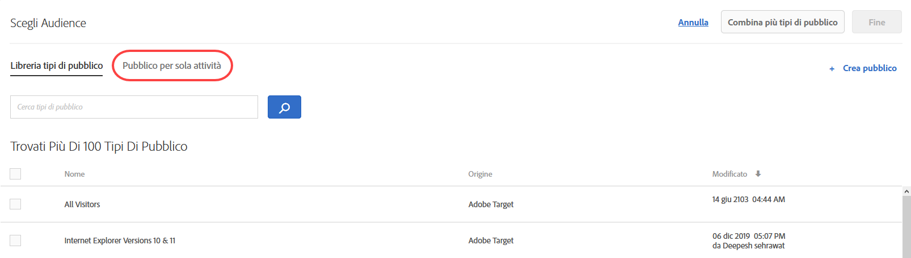 </p> <p>Per ulteriori informazioni, consulta <a href="../c-target/creating-activity-only-audience.md#concept_A6BADCF530ED4AE1852E677FEBE68483" format="dita" scope="local"> Creazione di un pubblico per sola attività</a>. </p> </li> 
      <li id="li_691812682A5B42C0941324F2BC7D5740"> <p>Per tutte le attività, puoi scegliere una metrica di successo che qualifica l’utente per un determinato tipo di pubblico. In passato, Target identificava gli utenti come idonei per un determinato tipo di pubblico al momento dell’accesso a un’attività. Ora invece puoi scegliere quando valutare il pubblico scegliendo una metrica di successo. (TGT-15805) </p> <p>  </p> </li> 
     </ul> </p> <p>Per ulteriori informazioni, consulta <a href="../c-target/apply-reporting-audience-success-metric.md#concept_5F11149ACCA84FE79C7B9F766B6B0595" format="dita" scope="local"> Applicare un pubblico di reportistica a una metrica di successo </a>. </p> </td> 
  </tr> 
  <tr> 
   <td colname="col1" class="premium"> <p>Targeting automatico </p> </td> 
   <td colname="col2"> <p> 
     <ul id="ul_6F89BD36373E47C4B3A6F8584D431D82"> 
      <li id="li_5F7B590AF8F24066ADD270E9F75CB12F"> <p>Le attività di Targeting automatico supportano ora la generazione rapporti a livello di segmento. (TGT-22777) </p> <p>Per ulteriori informazioni, consulta <a href="../c-activities/auto-target-to-optimize.md#concept_67779E5B7F67427A97D7EA2A6FB919B3" format="dita" scope="local">Targeting automatico per esperienze personalizzate</a>. </p> </li> 
      <li id="li_35042E7D6BB04265B42F08A23A774E92"> <p>Puoi modificare la percentuale di Controllo per le attività Targeting automatico. (TGT-26467) </p> <p> 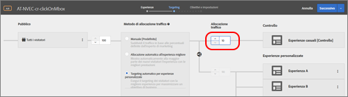 </p> <p>Per ulteriori informazioni, consulta <a href="../c-activities/auto-target-to-optimize.md#concept_67779E5B7F67427A97D7EA2A6FB919B3" format="dita" scope="local">Targeting automatico per esperienze personalizzate</a>. </p> </li> 
     </ul> </p> </td> 
  </tr> 
  <tr> 
   <td colname="col1"> <p>Offerte </p> </td> 
   <td colname="col2"> <p> 
     <ul id="ul_667DDEDDC5284C8393F8BCA5CD9EF12A"> 
      <li id="li_E00DB93297EC4100B46E42D867757DAA"> <p>Ora puoi visualizzare i dettagli di definizione di un'offerta, senza doverla aprire, tramite una scheda popup direttamente dalla Libreria offerte. (TGT-26377) </p> <p> 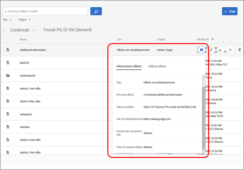 </p> <p>Per ulteriori informazioni, consulta <a href="../c-experiences/c-manage-content/manage-content.md#concept_17874A6FCBB743AA84C5988E8571CCF3" format="dita" scope="local"> Offerte </a>. </p> </li> 
      <li id="li_F71AC4FDAC0E4BEE81D39490E82686C0"> <p>Puoi copiare e modificare offerte e cartelle nel Selettore di offerta durante la creazione di un'attività. (TGT-26936) </p> <p>  </p> <p>Per ulteriori informazioni, consulta <a href="../c-experiences/c-manage-content/manage-content.md#concept_17874A6FCBB743AA84C5988E8571CCF3" format="dita" scope="local"> Offerte </a>. </p> </li> 
     </ul> </p> </td> 
  </tr> 
  <tr> 
   <td colname="col1"> <p>Compositore esperienza basato su moduli </p> </td> 
   <td colname="col2"> <p>Nel Compositore esperienza basato su moduli, i Perfezionamenti sono stati sostituiti da funzionalità di pubblico complete. I perfezionamenti per le attività esistenti sono stati trasferiti ai tipi di pubblico per sola attività. (TGT-13646) </p> <p>Per ulteriori informazioni, consulta <a href="../c-experiences/form-experience-composer.md#task_FAC842A6535045B68B4C1AD3E657E56E" format="dita" scope="local">Compositore esperienza basato su moduli</a>. </p> </td> 
  </tr> 
  <tr> 
   <td colname="col1"> <p>Token di risposta </p> </td> 
   <td colname="col2"> <p>È ora possibile creare token di risposta direttamente da Target senza attendere che vengano creati o importati. In precedenza, era possibile visualizzare solo i token creati tramite API all'interno dell'Interfaccia utente del token di risposta. Le modifiche apportate alla funzione consentono inoltre di evitare duplicati dei token di risposta. (TGT-26534) </p> <p>Per ulteriori informazioni, consulta <a href="../administrating-target/response-tokens.md#concept_2B21B222F6A344D68CA5929817E836C4" format="dita" scope="local">Token di risposta</a>. </p> </td> 
  </tr> 
 </tbody> 
</table>

**Miglioramenti, correzioni e modifiche**

Questa versione di [!DNL Target] include i miglioramenti, le correzioni e le modifiche seguenti per i clienti:

* È possibile eliminare i tipi di pubblico importati (da Target Classic, Experience Cloud ecc.) dalla Libreria di pubblico. Target avverte se si tenta di eliminare il pubblico di un&#39;attività attiva. (TGT-25171)
* I tipi di pubblico importati da Target Classic sono ora etichettati come Adobe Target Classic nella libreria Pubblico. In passato, nell’interfaccia utente non vi era distinzione tra Target Standard/Premium e Target Classic. (TGT-27093)
* Le Raccolte si applicano ora a tutti i criteri (inclusi gli elementi visualizzati di recente). (TGT-26646)
* Nella libreria Pubblico e nella Libreria delle offerte è possibile filtrare in base all’Area di lavoro (funzione disponibile per gli utenti Target Premium con autorizzazioni per gli utenti Enterprise). (TGT-26813)
* Sono stati apportati miglioramenti nell&#39;interfaccia utente dei Rapporti per ottimizzare lo scorrimento degli elenchi a discesa dei filtri all&#39;interno delle tabelle e dei posizionamenti. (TGT-23713 e TGT-26819)

### Modifiche alla piattaforma Target (13 ottobre 2017) {#section_6C298C5C3D01415CB4B658EB2166096C}

<table id="table_8457FAE3508F454F9DFDEF093FBD7E40"> 
 <thead> 
  <tr> 
   <th colname="col1" class="entry"> Modifica </th> 
   <th colname="col2" class="entry"> Dettagli </th> 
  </tr> 
 </thead>
 <tbody> 
  <tr> 
   <td colname="col1"> <p> <span class="filepath"> at.js </span> </p> </td> 
   <td colname="col2"> <p><b>13 ottobre 2017</b> </p> <p> È ora disponibile la versione 1.2.1 di <span class="filepath">at.js</span>. Per ulteriori informazioni, consulta <a href="../c-implementing-target/c-implementing-target-for-client-side-web/target-atjs-versions.md#reference_DBB5EDB79EC44E558F9E08D4774A0F7A" format="dita" scope="local">Dettagli della versione di at.js </a>. </p> <p> 
     <ul id="ul_14D6BB3B51974789BBFC036A45B7A56B"> 
      <li id="li_AE9826C8FC4A4DF4BE61BB72C2946C93"> <p>È stato risolto un problema che impediva a Target di aprire il collegamento in una nuova scheda durante il tracciamento dei clic su un collegamento con target="_blank". </p> </li> 
     </ul> </p> </td> 
  </tr> 
 </tbody> 
</table>

### Target Standard/Premium 17.9.1 (25 settembre 2017 e 12 ottobre 2017) {#section_ECC5DD8B6ED443788B46F53E25FC896E}

Questa versione include i miglioramenti e le funzioni seguenti (i codici tra parentesi sono per uso interno di Adobe):

<table id="table_0A8817F64F434875A485FD671C6988AB"> 
 <thead> 
  <tr> 
   <th colname="col1" class="entry"> Funzione </th> 
   <th colname="col2" class="entry"> Descrizione </th> 
  </tr> 
 </thead>
 <tbody> 
  <tr> 
   <td colname="col1"> <p> Anteprima dell'esperienza mobile </p> </td> 
   <td colname="col2"> <p><b>Aggiornamento: 12 ottobre 2017</b> </p> <p> È ora possibile selezionare più attività di app mobile dall'interfaccia utente e visualizzarle in anteprima sul dispositivo. Questa funzione ti permette di sperimentare diverse modalità di anteprima e controllo qualità senza doverti affidare a particolari generatori di test e simulatori. </p> <p>Per eseguirla, è necessario scaricare e installare la versione 4.14 (o successiva) appropriata di Adobe Mobile SDK. </p> <p>Per ulteriori informazioni, consulta <a href="../c-target-mobile-app/target-mobile-preview.md#concept_5FBF12C2FDFC42429FE4F5CFBD78E19D" format="dita" scope="local"> Anteprima mobile di Target </a>. </p> </td> 
  </tr> 
  <tr> 
   <td colname="col1"> <p>Consegna a dispositivi mobili con funzioni batch e preacquisizione </p> </td> 
   <td colname="col2"> <p><b>Aggiornamento: 12 ottobre 2017</b> </p> <p> Il contenuto di più mbox può essere pre-acquisito in una singola chiamata e memorizzato nella cache locale del dispositivo senza preoccuparsi di come, quando e se l'utente finale vedrà il contenuto. </p> <p>Per eseguirla, è necessario scaricare e installare la versione 4.14 (o successiva) appropriata di Adobe Mobile SDK. </p> <p>Per ulteriori informazioni, consulta <a href="../c-target-mobile-app/prefetch-offer-content.md#concept_A355D9D55E1C429AA31FA4055A1DDFAF" format="dita" scope="local"> Preacquisire il contenuto dell’offerta </a>. </p> </td> 
  </tr> 
  <tr> 
   <td colname="col1"> <p>Attività </p> </td> 
   <td colname="col2"> <p>Nel flusso di lavoro di creazione delle attività sono stati apportati i seguenti miglioramenti: </p> <p> 
     <ul id="ul_2D251AC11FC54E86AE84DEFFB6FDF43C"> 
      <li id="li_AB8F12B3CF654120BD16EAE570517741"> <p>Durante la modifica di un'attività, è possibile apportare le variazioni desiderate nel passaggio che stai visualizzando: fai clic sul menu a discesa dal pulsante di menu combinato, quindi seleziona <span class="wintitle">Avanti</span> per passare alla fase successiva; fai clic su <span class="wintitle">Salva e Chiudi</span> per salvare le modifiche e visualizzare la pagina <span class="wintitle">Panoramica</span> dell'attività oppure clicca su <span class="wintitle">Salva</span> per salvare le modifiche e rimanere in tale fase. </p> <p> 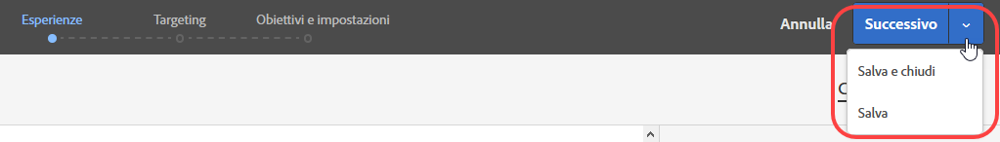 </p> <p>Per ulteriori informazioni, consulta <a href="../c-activities/edit-activity.md#concept_BB064C0D4A194BD1A1AE7CCA1E6BB8F0" format="dita" scope="local">Modifica un’attività o Salva come bozza </a>. </p> </li> 
      <li id="li_4C71E2570ECF4BBAB08443D89230CE82"> <p>Durante la modifica di un'attività, puoi aprire il passaggio desiderato del flusso di lavoro, apportare le modifiche (ad esempio le percentuali di esperienza, il pubblico e così via), quindi salvare o chiudere l'attività senza dover seguire i tre passaggi del flusso di lavoro guidato. </p> <p> 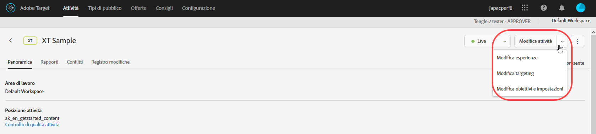 </p> <p>Per ulteriori informazioni, consulta <a href="../c-activities/edit-activity.md#concept_BB064C0D4A194BD1A1AE7CCA1E6BB8F0" format="dita" scope="local">Modifica un’attività o Salva come bozza </a>. </p> </li> 
      <li id="li_43C15B13E4F7475E9376A98222AA0253"> <p>Le opzioni <span class="wintitle">Salva bozza</span> vengono visualizzate nel pulsante di menu combinato quando crei una nuova attività che non è ancora stata salvata o modifichi un’attività già salvata come bozza. </p> <p> 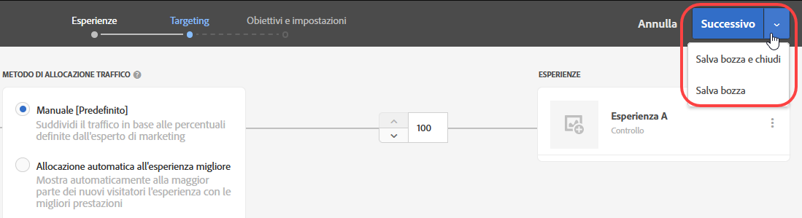 </p> <p>Per ulteriori informazioni, consulta <a href="../c-activities/edit-activity.md#concept_BB064C0D4A194BD1A1AE7CCA1E6BB8F0" format="dita" scope="local">Modifica un’attività o Salva come bozza </a>. </p> </li> 
      <li id="li_36EF9AD13B2D40ADB99343C9F758D5FD"> <p>Durante la scelta del destinatario nella fase 2 del flusso di lavoro guidato in tre passaggi, è ora possibile modificare o copiare un pubblico posizionando il cursore sul pubblico desiderato nella finestra di dialogo <span class="wintitle">Scegli pubblico</span>. </p> <p> 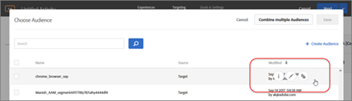 </p> </li> 
     </ul> </p> <p>Per ulteriori informazioni, consulta <a href="../c-activities/t-test-ab/t-test-create-ab/ab-audience.md#concept_A268236C1224451DB7844BF67F41A087" format="dita" scope="local">Selezionare pubblico </a>. </p> </td> 
  </tr> 
  <tr> 
   <td colname="col1"> <p>Generazione di rapporti </p> </td> 
   <td colname="col2"> <p>Per la generazione rapporti sono disponibili le nuove funzioni e i miglioramenti seguenti: </p> <p> 
     <ul id="ul_2D1AF91D1B4E478FBFFA0B83EE30075E"> 
      <li id="li_98E67A4DA8BF4CFF90C279FAC12F4C54"> <p>È possibile scegliere la metodologia di conteggio per i grafici del rapporto. Nota che questo non è supportato nelle attività Targeting automatico e Personalizzazione automatizzata (AP). </p> <p>Per ulteriori informazioni, consulta la riga “Metodologia di conteggio” in <a href="../c-reports/c-report-settings/report-settings.md#concept_4BB6A7FDAB6F4806A632F9CD989B8BFA" format="dita" scope="local">Impostazioni rapporti </a>. </p> </li> 
      <li id="li_5803CE90DB764C9E983702CB6C1AFEE3"> <p>Puoi visualizzare più metriche in un singolo rapporto per le attività A/B con Targeting automatico. (TGT-23464) </p> <p>Per ulteriori informazioni, consulta <a href="../c-reports/c-report-settings/view-multiple-metrics.md#concept_9E3C3F6F3EC1412FAF252975AC0720B7" format="dita" scope="local">Visualizzare più metriche in un rapporto </a>. </p> </li> 
     </ul> </p> </td> 
  </tr> 
  <tr> 
   <td colname="col1"> <p>Tipi di pubblico </p> </td> 
   <td colname="col2"> <p>È ora possibile visualizzare le definizioni dei tipi di pubblico importati da Target Classic o creati tramite API. (TGT-22630) </p> <p>  </p> <p>Per ulteriori informazioni, vedi “Visualizzazione delle definizioni del pubblico” in <a href="../c-target/c-audiences/audiences.md#concept_65BE870D290E412D8BBF557EEA67C271" format="dita" scope="local"> I tipi di pubblico </a>. </p> </td> 
  </tr> 
  <tr> 
   <td colname="col1"> <p>Editor di codice </p> </td> 
   <td colname="col2"> <p>Il Compositore esperienza basato su moduli e l'editor offerte HTML ora utilizzano lo stesso editor di codice utilizzato dal Compositore esperienza visivo nel codice personalizzato. (TGT-25808) </p> <p>Questo miglioramento aggiunge le seguenti nuove funzioni quando si utilizza l'editor di codice nel Compositore esperienza basato su moduli e quando si creano offerte HTML: </p> <p> 
     <ul id="ul_CBB17806FBF34774A8160A61204ED014"> 
      <li id="li_22665F583F1742E280D5BC7EC4203007"> <p>I numeri di riga sono ora visibili per una migliore fruibilità. </p> </li> 
      <li id="li_B0D863CDAD2E46A4B133BB86886EB527"> <p>L’evidenziazione della sintassi ti aiuta a evitare errori di sintassi per le offerte HTML. </p> </li> 
     </ul> </p> <p>Per ulteriori informazioni, consulta <a href="../c-experiences/c-visual-experience-composer/c-vec-code-editor/vec-code-editor.md#concept_B3A6E9EE3A60406DB640E205EA1745B5" format="dita" scope="local">Editor di codice </a>. </p> </td> 
  </tr> 
  <tr> 
   <td colname="col1"> <p>Geotargeting </p> </td> 
   <td colname="col2"> <p>È ora possibile utilizzare la latitudine e la longitudine nel geotargeting. (TGT-12129) </p> <p>Per ulteriori informazioni, consulta <a href="../c-target/c-audiences/c-target-rules/geo.md#concept_5B4D99DE685348FB877929EE0F942670" format="dita" scope="local">Geo</a>. </p> </td> 
  </tr> 
  <tr> 
   <td colname="col1"> <p>SDK di node.js </p> </td> 
   <td colname="col2"> <p>È possibile installare gli SDK di node.js da <a href="https://www.npmjs.com/package/@adobe/target-node-client" format="https" scope="external">npm @adobe/target-node-client</a> per implementare ed eseguire facilmente i test lato server sulle applicazioni node.js. Negli SDK di node, il servizio ID visitatore è abilitato per connettere tutti i dati Adobe ed è possibile utilizzare Adobe Analytics come origine per la generazione rapporti (A4T). </p> </td> 
  </tr> 
 </tbody> 
</table>

**Miglioramenti, correzioni e modifiche**

Questa versione di [!DNL Target] include i miglioramenti, le correzioni e le modifiche seguenti per i clienti (i codici tra parentesi sono per uso interno di Adobe):

* Gli utenti con autorizzazioni di Approvatore possono ora generare e attivare token di autenticazione API di profilo. (TGT-24074)

   Per ulteriori informazioni, consulta [Impostazioni API di profilo](../c-implementing-target/c-considerations-before-you-implement-target/c-methods-to-get-data-into-target/profile-api-settings.md#concept_5C4ABA5FA64E4D6CAE9C5902572F2794).

* Quando, durante la creazione di un’attività in Compositore esperienza visivo, l’utente ricarica la pagina, l’URL dell’attività e le proprietà associate vengono mantenuti nell’interfaccia utente. La necessità di ricaricare può verificarsi nel caso in cui l&#39;attività utilizzi un contenuto misto (contenuto protetto e non protetto) o nel caso siano presenti problemi di autorizzazione. (TGT-28230)
* È stata migliorata la messaggistica quando un&#39;attività utilizza contenuto misto (contenuto protetto e non protetto). Il messaggio fornisce informazioni per consentire agli utenti di eseguire i passaggi necessari per aprire un sito HTTP o un sito con chiamate miste (HTTPS e HTTP). (TGT-26271)

Per ulteriori informazioni, consulta [Abilitazione di contenuto misto nel browser](../c-experiences/c-visual-experience-composer/r-troubleshoot-composer/mixed-content.md#concept_46D022D50280468C9EF6D5DF6EFC911C).

* È stato migliorato il flusso di lavoro quando la sessione Target di un utente si interrompe durante la configurazione delle opzioni nelle pagine Amministrazione, Pubblico e Recommendations. Quando l&#39;utente fa clic su Salva viene visualizzato il messaggio di sessione scaduta; effettuando di nuovo il log in, una finestra di dialogo informa l&#39;utente che l&#39;accesso è andato a buon fine e l&#39;interfaccia utente rimane nella stessa pagina di Target senza perdita di dati. (TGT-25557)

### Modifiche alla piattaforma Target (27 settembre 2017) {#section_AC32516DFBA64AD2AC9A74171D452778}

<table id="table_701D8D53D1DF4F28ADAC6EC221B0208A"> 
 <thead> 
  <tr> 
   <th colname="col1" class="entry"> Modifica </th> 
   <th colname="col2" class="entry"> Dettagli </th> 
  </tr> 
 </thead>
 <tbody> 
  <tr> 
   <td colname="col1"> <p> <span class="filepath"> at.js </span> </p> </td> 
   <td colname="col2"> <p><b>27 settembre 2017</b> </p> <p> La versione 1.2.0 di <span class="filepath">at.js</span> è ora disponibile in una versione di manutenzione che contiene per lo più correzioni di bug. Per ulteriori informazioni, consulta <a href="../c-implementing-target/c-implementing-target-for-client-side-web/target-atjs-versions.md#reference_DBB5EDB79EC44E558F9E08D4774A0F7A" format="dita" scope="local">Dettagli della versione di at.js </a>. </p> <p> 
     <ul id="ul_D11024549C3643C7A756988087498D24"> 
      <li id="li_E1B3994125B64F6AB20B29FE8BCD8459"> <p>È stato risolto un problema che impediva azioni predefinite per i casi speciali di tracciamento dei clic. (TNT-28089) </p> </li> 
      <li id="li_53806C902AA04B31B59AA87A1E707348"> <p>È stato risolto un problema che impediva a Target di aprire il collegamento in una nuova scheda durante il tracciamento dei clic con un collegamento contenente <span class="codeph">target="_blank"</span>. (TNT-28072) </p> </li> 
      <li id="li_94F5794330D14C71BA07B3F17D0705FD"> <p> Gli indirizzi IP possono essere utilizzati come dominio dei cookie. (TNT-28002) </p> </li> 
      <li id="li_7D2A11B17672419583F9632CDA00D28F"> <p>È stato risolto un problema che causava la visualizzazione momentanea di altro contenuto nelle offerte di reindirizzamento aventi una mbox globale o altre mbox regionali. (TNT-27978) </p> </li> 
      <li id="li_BA27A749A7A242478080F3D8E04148FC"> <p> È stato risolto un problema che causava un errore nell’impostazione di attività Targeting esperienza nel Compositore esperienza visivo durante il passaggio da Sfoglia a Componi e viceversa. (TNT-27942) </p> </li> 
      <li id="li_FA11ABA5B9CD435080426805C5359A51"> <p> È stata risolta la gestione errata delle classi di stile che causava la visualizzazione momentanea di altro contenuto sugli elementi contrassegnati per il monitoraggio dei clic. (TNT-27896) </p> </li> 
      <li id="li_E2DFBAE52FCA4996BA083868CBFCCD10"> <p>È stato corretto un problema a causa del quale i parametri mbox globali si mescolavano con gli altri parametri mbox. (TNT-27846) </p> </li> 
      <li id="li_B3153BBD66AA4D51AE81EF6C903CF78D"> <p>Sono state apportate modifiche per garantire che Handlebar, Mustache e altre librerie di modelli lato client siano gestite correttamente da <span class="filepath">at.js</span>. (TNT-27831) </p> </li> 
      <li id="li_B859939C1B5A4DF78CF8ADF236B88306"> <p>Sono state apportate modifiche per garantire che <span class="codeph">sdidParamExpiry</span> sia inizializzato correttamente e passato all’API visitatore. Questa è una regressione che è stata aggiunta a <span class="codeph">at.js 1.1.0</span>. Non influisce sulle versioni precedenti di <span class="filepath">at.js</span>. Questa modifica riguarda soltanto i clienti che usano offerte di reindirizzamento e A4T. (TNT-27791) </p> </li> 
      <li id="li_24A748DFB7824AE6AC7331B7EA940BFF"> <p>Sono state apportate modifiche per garantire che <span class="codeph">SCRIPT</span> venga eseguito indipendentemente dal tipo di attributo utilizzato. (TNT-27865) </p> </li> 
     </ul> </p> </td> 
  </tr> 
  <tr> 
   <td colname="col1"> <p>Targeting esperienza (XT) </p> </td> 
   <td colname="col2"> <p><b>21 settembre 2017</b> </p> <p>Con la versione del 21 settembre, in Target cambierà il modo in cui gli utenti vengono inseriti nelle esperienze di attività di targeting delle esperienze (XT) (campagne Pagina di destinazione in Target Classic). Per tutte le attività nuove ed esistenti sia in Target Standard/Premium che in Target Classic, gli utenti devono soddisfare le regole del targeting delle esperienze su ogni impression per poter continuare a vedere il contenuto dell’esperienza ed essere conteggiati nei rapporti. In precedenza, se l’utente non era più qualificato per alcuna esperienza, avrebbe continuato a vedere il contenuto dell’ultima esperienza per la quale si era qualificato, e ad essere conteggiato nei rapporti per tale esperienza. </p> <p>Con questa versione tale modifica avverrà automaticamente per tutte le attività esistenti e per ogni nuova attività creata dopo il rilascio. Se desideri continuare con il metodo precedente (prima del 21 settembre), puoi creare il pubblico utilizzando script di profilo in modo che un utente debba soddisfare una condizione solo una volta per continuare a rientrare in tale pubblico in futuro. Quindi, utilizza questo pubblico per ogni esperienza nell’attività. </p> </td> 
  </tr> 
 </tbody> 
</table>

### Target Standard/Premium 17.8.1 (22 agosto 2017) {#section_71A554D072F04B18B359C1626529E5D8}

<table id="table_AAC16F89060D4CC09762A370B86C0885"> 
 <thead> 
  <tr> 
   <th colname="col1" class="entry"> Funzione </th> 
   <th colname="col2" class="entry"> Descrizione </th> 
  </tr> 
 </thead>
 <tbody> 
  <tr> 
   <td colname="col1" class="premium"> <p>Autorizzazioni utente Enterprise per Target Premium </p> </td> 
   <td colname="col2"> <p>Crea aree di lavoro separate in Target e quindi assegna agli utenti ruoli e autorizzazioni diversi per le singole proprietà digitali. </p> <p>Per ulteriori informazioni, consulta <a href="../administrating-target/c-user-management/property-channel/property-channel.md#concept_E396B16FA2024ADBA27BC056138F9838" format="dita" scope="local"> Autorizzazioni per gli utenti Enterprise </a>. </p> <p>Consulta <a href="../r-release-notes/known-issues-resolved-issues.md#concept_625C3A16B7F24D4B82EFF130F0945541" format="dita" scope="local"> Problemi noti e problemi risolti </a> per ulteriori informazioni sull’implementazione. </p> </td> 
  </tr> 
  <tr> 
   <td colname="col1"> <p>Modalità controllo qualità </p> </td> 
   <td colname="col2"> <p>Verifica in modo facile e completo la qualità delle attività tramite collegamenti di anteprima che restano invariati, l’eventuale definizione di un pubblico di destinazione e rapporti di controllo qualità mantenuti separati dai dati delle attività live. </p> <p>Per ulteriori informazioni, consulta <a href="../c-activities/c-activity-qa/activity-qa.md#concept_9329EF33DE7D41CA9815C8115DBC4E40" format="dita" scope="local">Controllo qualità delle attività </a>. </p> </td> 
  </tr> 
 </tbody> 
</table>

**Miglioramenti, correzioni e modifiche**

Questa versione di [!DNL Target] include i miglioramenti, le correzioni e le modifiche seguenti per i clienti (i codici tra parentesi sono per uso interno di Adobe):

* Ora è possibile visualizzare i dettagli della definizione del pubblico in una scheda a comparsa in diverse aree nell’interfaccia utente di Target, senza aprire il pubblico. Questa funzionalità si applica solo ai tipi di pubblico creati in [!DNL Target Standard/Premium. (TGT-25772)].
* È ora possibile visualizzare le definizioni dei tipi di pubblico adhoc all&#39;interno della sezione creazione/panoramica dell&#39;attività. (TGT-25570)
* Le seguenti variabili sono ora disponibili come array [Velocity](../c-recommendations/c-design-overview/customizing-a-template.md#concept_94F1554C3F2E4CDB9A2C3D78F10EDA59): `entiites` e `entityN.categoriesList`.

### Modifiche alla piattaforma Target (3 agosto 2017) {#section_FA5BF6808EA74F3A9E8E941530879208}

<table id="table_1B43199F1AE64E69AE65313B23741444"> 
 <thead> 
  <tr> 
   <th colname="col1" class="entry"> Modifica </th> 
   <th colname="col2" class="entry"> Dettagli </th> 
  </tr> 
 </thead>
 <tbody> 
  <tr> 
   <td colname="col1"> <p> <span class="filepath"> at.js </span> </p> </td> 
   <td colname="col2"> <p><b>3 agosto 2017</b> </p> <p> È ora disponibile la versione 1.1 di <span class="filepath">at.js</span>. Per ulteriori informazioni, consulta <a href="../c-implementing-target/c-implementing-target-for-client-side-web/how-to-deployatjs/implementing-target-without-a-tag-manager.md#concept_1E1F958F9CCC4E35AD97581EFAF659E2" format="dita" scope="local">Scarica at.js</a>. </p> <p>I miglioramenti e le correzioni seguenti sono inclusi nella versione 1.1 di <span class="filepath">at.js</span>: </p> <p> 
     <ul id="ul_B7408267413347888938E2E7D48ABDBD"> 
      <li id="li_4DDF6DCFE6014C6795B6A9C9DFB54C21"> <p>È stata aggiunta la gestione dei token di risposta. Per ulteriori informazioni, consulta <a href="../administrating-target/response-tokens.md#concept_2B21B222F6A344D68CA5929817E836C4" format="dita" scope="local">Token di risposta</a>. </p> </li> 
      <li id="li_741CD22B7D074FBA90180B2E36FACE0D"> <p>È stato risolto un problema in modo che <span class="codeph">document.currentScript polyfill</span> non interferisca con Angular 1.X. </p> </li> 
      <li id="li_EF1B3D3DCC7F4D2490D2BFE660EC661C"> <p>Sono state apportate modifiche per garantire che il tracciamento dei clic non interferisca con la proprietà di visibilità. Gli elementi di tracciamento dei clic sono contrassegnati con la classe CSS <span class="codeph">at-element-click-tracking</span> anziché <span class="codeph">at-element-marker </span>. </p> </li> 
     </ul> </p> </td> 
  </tr> 
 </tbody> 
</table>

### Target Standard/Premium 17.7.3 (3 agosto 2017) {#section_D90CB766679442C7A0642E5D79657674}

<table id="table_C81EA97B251547169BC9681E5DDB4B8F"> 
 <thead> 
  <tr> 
   <th colname="col1" class="entry"> Funzione </th> 
   <th colname="col2" class="entry"> Descrizione </th> 
  </tr> 
 </thead>
 <tbody> 
  <tr> 
   <td colname="col1"> <p>Token di risposta </p> </td> 
   <td colname="col2"> <p>I token di risposta consentono di generare automaticamente le variabili ammissibili (ad esempio, gli attributi del profilo) nelle risposte di Target che assegnano attività (ad esempio, visualizza mbox). I token di risposta possono essere utilizzati a scopo di debug o per l'integrazione con provider di terze parti (ad esempio Clicktale). </p> <p>I token di risposta sono simili ai plug-in del server di <span class="keyword">Adobe Target Classic</span> e forniscono equivalenza di funzione tra le due soluzioni. </p> <p> <p>Nota: i token di risposta sono disponibili con <span class="filepath">at.js</span> 1.1 e versioni successive.</span>. </p> </p> <p>Per ulteriori informazioni, consulta <a href="../administrating-target/response-tokens.md#concept_2B21B222F6A344D68CA5929817E836C4" format="dita" scope="local">Token di risposta</a>. </p> </td> 
  </tr> 
 </tbody> 
</table>

### Target Standard/Premium 17.7.2 (27 luglio 2017) {#section_6980EC04D3CF4A00919953B9B10BC472}

<table id="table_DB51BD66756F4EBD875ED008B2C7C5D0"> 
 <thead> 
  <tr> 
   <th colname="col1" class="entry"> Funzione </th> 
   <th colname="col2" class="entry"> Descrizione </th> 
  </tr> 
 </thead>
 <tbody> 
  <tr> 
   <td colname="col1" class="premium"> <p>Targeting automatico </p> </td> 
   <td colname="col2"> <p>La funzionalità Targeting automatico è ora disponibile per tutti i clienti Target Premium. </p> <p>La funzione Targeting automatico utilizza l’apprendimento automatico avanzato per individuare più esperienze ad alte prestazioni definite dall’addetto al marketing. Inoltre, indica l’esperienza più adatta per ogni visitatore in base al suo profilo cliente individuale e al comportamento dei visitatori precedenti con profili simili, al fine di personalizzare contenuti e favorire le conversioni. </p> <p>Durante la creazione di un'attività A/B tramite il flusso di lavoro guidato in tre passaggi, è possibile scegliere di allocare il traffico utilizzando l'opzione <span class="wintitle">Targeting automatico per Esperienze personalizzate</span>: </p> <p> 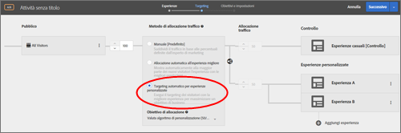 </p> <p>Per ulteriori informazioni, consulta <a href="../c-activities/auto-target-to-optimize.md#concept_67779E5B7F67427A97D7EA2A6FB919B3" format="dita" scope="local">Targeting automatico per esperienze personalizzate</a>. </p> </td> 
  </tr> 
 </tbody> 
</table>

### Target Standard/Premium 17.7.1 (20 luglio 2017) {#section_BB75DE30174F4ADD963451909FB81D74}

<table id="table_BCE36E0D56804E7B8861858DCF2F380E"> 
 <thead> 
  <tr> 
   <th colname="col1" class="entry"> Funzione </th> 
   <th colname="col2" class="entry"> Descrizione </th> 
  </tr> 
 </thead>
 <tbody> 
  <tr> 
   <td colname="col1"> <p>Tipi di pubblico </p> </td> 
   <td colname="col2"> <p>Ora puoi visualizzare i dettagli della definizione di pubblico in vari luoghi dell'interfaccia utente di Target grazie a una scheda popup, senza dover aprire la sezione Pubblico. Questa funzionalità si applica solo ai tipi di pubblico creati in <span class="keyword">Target Standard/Premium</span>. </p> <p>  </p> </td> 
  </tr> 
  <tr> 
   <td colname="col1"> <p>Metriche di successo </p> </td> 
   <td colname="col2"> <p>Precedentemente, Target consentiva la dipendenza da una singola metrica e quella metrica doveva essere raggiunta prima che il suo conteggio incrementasse. È ora possibile fornire dipendenza da più metriche, insieme alla flessibilità necessaria per decidere se la metrica deve essere raggiunta o non raggiunta per incrementare il conteggio. </p> <p>La funzionalità di dipendenza a metriche multiple non è supportata nei seguenti casi: </p> <p> 
     <ul id="ul_EC856F910B704D648065EA7DA13EE5B0"> 
      <li id="li_1A82414FE50B414CAA1A0A88E80BCC1B"> <p>Attività di consigli. Questa funzionalità è supportata da tutti gli altri tipi di attività. </p> </li> 
      <li id="li_2D6CF42264D445FCB6C400ED321DE952"> <p>Se si utilizza Analytics come fonte di Reporting (A4T). </p> </li> 
      <li id="li_E3A983A70BB04AE8B25A7CEC1F5FE1D9"> <p>Con il tipo di metrica “Visualizzazione di una pagina”. </p> </li> 
      <li id="li_9AAF6BB275F7489BA691676E308172D5"> <p>Con il tipo di metrica “Clic su un elemento” per le attività del Compositore esperienza visivo. </p> </li> 
     </ul> </p> <p>Per maggiori informazioni, vedi i seguenti argomenti: </p> <p> 
     <ul id="ul_4B0EFFDD257C42579E19569DCBE15BE3"> 
      <li id="li_2402575F27F547968BD536C460BF81B5"> <p>A/B: <a href="../c-activities/t-test-ab/t-test-create-ab/ab-goals-and-settings.md#reference_B25389FD6F3A4989801E740364B089CC" format="dita" scope="local">Obiettivi e impostazioni </a> </p> </li> 
      <li id="li_FB5E7CBC0154406C989F5A5C6CAA0C8F"> <p>Personalizzazione automatizzata (AP): <a href="../c-activities/t-automated-personalization/create-ap-activity.md#task_8AAF837796D74CF893CA2F88BA1491C9" format="dita" scope="local">Creazione di un’attività di personalizzazione automatica </a> </p> </li> 
      <li id="li_57C36A7945A24A52BCBD62CA0F15B668"> <p>Experience Targeting (XT): <a href="../c-activities/t-experience-target/t-xt-create/xt-goals-and-settings.md#reference_B25389FD6F3A4989801E740364B089CC" format="dita" scope="local">Obiettivi e impostazioni </a> </p> </li> 
      <li id="li_06674A3152A547268A1AE5EE818EF1A5"> <p>Multivariate (MVT): <a href="../c-activities/c-multivariate-testing/t-create-multivariate-test/goals-and-settings.md#reference_B25389FD6F3A4989801E740364B089CC" format="dita" scope="local">Obiettivi e impostazioni </a> </p> </li> 
     </ul> </p> </td> 
  </tr> 
  <tr> 
   <td colname="col1"> <p>Generazione rapporti (allocazione automatica di test A/B) </p> </td> 
   <td colname="col2"> <p>È ora disponibile la possibilità di visualizzare più metriche per l'allocazione automatica di attività A/B. </p> <p>Per ulteriori informazioni, consulta <a href="../c-reports/c-report-settings/view-multiple-metrics.md#concept_9E3C3F6F3EC1412FAF252975AC0720B7" format="dita" scope="local">Visualizzare più metriche in un rapporto </a>. </p> </td> 
  </tr> 
  <tr> 
   <td colname="col1"> <p>Tipi di pubblico </p> </td> 
   <td colname="col2"> <p>I tipi di pagina del sito e gli operatori di confronto del pubblico ora corrispondono ai tipi e agli operatori di confronto di Target Classic. </p> <p>Puoi creare un pubblico delle pagine del sito utilizzando “parametro di query definito dall'utente” o “intestazione definita dall'utente”. </p> <p>Per ulteriori informazioni, consulta <a href="../c-target/c-audiences/c-target-rules/site-pages.md#concept_6425D5304568490899E8340CC94798A9" format="dita" scope="local"> Pagine del sito </a>. </p> </td> 
  </tr> 
  <tr> 
   <td colname="col1"> <p>Attività </p> </td> 
   <td colname="col2"> <p>L'elenco Attività consente ora di filtrare i tipi di attività di Allocazione automatizzata e di Targeting automatico. </p> <p>Per ulteriori informazioni, consulta <a href="../c-activities/activities.md#concept_D317A95A1AB54674BA7AB65C7985BA03" format="dita" scope="local"> Attività </a>. </p> </td> 
  </tr> 
  <tr> 
   <td colname="col1" class="premium"> <p>Criteri e promozioni dei consigli </p> </td> 
   <td colname="col2"> <p>È ora possibile gestire i valori vuoti durante l'applicazione di filtri per Corrispondenza attributo entità, Corrispondenza attributo profilo e Corrispondenza parametri. </p> <p>Per ulteriori informazioni, consulta <a href="../c-recommendations/c-algorithms/use-dynamic-and-static-inclusion-rules.md#concept_4CB5C0FA705D4E449BD0B37B3D987F9F" format="dita" scope="local">Utilizzare regole di inclusione dinamiche e statiche </a>. </p> </td> 
  </tr> 
 </tbody> 
</table>

Questa versione di [!DNL Target] include i seguenti miglioramenti e correzioni di problemi rivolti al cliente: (i codici tra parentesi sono per uso interno di Adobe):

* È stato migliorato il flusso di lavoro nel caso in cui, durante la creazione o la modifica di un&#39;attività o di un&#39;offerta da parte dell&#39;utente, la sessione di [!DNL Target] risulti scaduta. Quando l&#39;utente fa clic su [!UICONTROL Salva] viene visualizzato il messaggio di sessione scaduta; effettuando di nuovo il log in, una finestra di dialogo informa l&#39;utente che l&#39;accesso è andato a buon fine e l&#39;interfaccia utente rimane nella stessa pagina di [!DNL Target] senza perdita di dati.

   Se durante l&#39;esecuzione di un&#39;azione intermittente in una pagina di [!DNL Target] si verifica un&#39;arresto di sessione, l&#39;utente è invitato a eseguire nuovamente l&#39;accesso e viene quindi indirizzato all&#39;ultima pagina da lui modificata nell&#39;interfaccia utente di [!DNL Target].

* È stato risolto un problema che causava la perdita delle modifiche del codice personalizzato se, durante la navigazione, l&#39;utente (in caso di modifica delle esperienze, passaggio a un&#39;altra pagina, cambio di pubblico, clic su Avanti ecc.) si fosse dimenticato di salvare le modifiche. All&#39;utente viene ora richiesto di salvare le modifiche. (TGT-23766)
* Quando un&#39;attività viene archiviata, viene visualizzato il messaggio “archiviazione dell&#39;attività” anziché “aggiornamento dell&#39;attività”. (KB-1517)
* Il selettore a discesa nelle seguenti posizioni all&#39;interno dell&#39;interfaccia utente di Target è stato sostituito con funzionalità di completamento automatico per migliorarne la velocità e le prestazioni: (TGT-22939)

   * Pagina attività > *attività* > Passaggio 3 > Selettore suite di rapporti
   * Tipi di pubblico > Crea pubblico > Profilo visitatore
   * Consigli > Creazione feed > se tipo di origine > Analytics > Selettore suite di rapporti

* È stata migliorata la messaggistica di errore quando un sito dispone di “opzioni X-frame” impostate su SAMEORIGIN e il sito non può essere caricato nel Compositore esperienza visivo. Il messaggio richiede all&#39;utente di passare a Enhanced Experience Composer (Compositore esperienza avanzato) in Amministrazione > Visual Experience Composer (Compositore esperienza visivo). (TGT-17356)
* In Target Standard/Premium, i rapporti vengono ora visualizzati nel fuso orario del tuo account anziché nel fuso orario del server di Target (US EST). (TGT-24868)
* Se le attività create in [!DNL Target] vengono aggiornate all&#39;esterno di [!DNL Target] (ad esempio, tramite Adobe I/O), i seguenti attributi di attività vengono importati di nuovo in [!DNL Target]:

   `thirdpartyId`

   `startDate`

   `endDate`

   `status`

   `priority`

   `marketingCloudMetadata(remoteModifiedBy)`

   Questo processo di importazione verrà eseguito quando verrà aperta la pagina attività, con un ritardo massimo di dieci minuti. (KB-1526)

### Target Standard/Premium 17.6.2 (22 giugno 2017) {#section_F0372B07B56E454CB048CE79FF56E9CD}

<table id="table_8C4DB1B83B874E4C85CE9FF352E7B857"> 
 <thead> 
  <tr> 
   <th colname="col1" class="entry"> Funzione </th> 
   <th colname="col2" class="entry"> Descrizione </th> 
  </tr> 
 </thead>
 <tbody> 
  <tr> 
   <td colname="col1" class="premium"> <p>Attività di Personalizzazione automatizzata (AP) </p> </td> 
   <td colname="col2"> <p> 
     <ul id="ul_F5BB1074DD4140C798CB55D68DEEF824"> 
      <li id="li_9596AABA14C64DEEB2E70E8ADED8AA74">È possibile creare attività di personalizzazione automatizzata utilizzando il Compositore basato su moduli. </li> 
      <li id="li_315F5FF590404670A677FEA6E4E0DF5D">Nuovi valori di affidabilità per la Personalizzazione automatizzata </li> 
     </ul> </p> </td> 
  </tr> 
  <tr> 
   <td colname="col1" class="premium"> <p>Consigli: criteri e promozioni </p> </td> 
   <td colname="col2"> <p> È ora possibile creare criteri dinamici e promozioni in base alla corrispondenza degli attributi del profilo e alla corrispondenza di parametri. </p> <p> 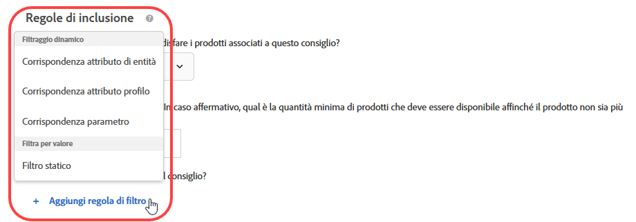 </p> <p> <p>Nota: se hai dimestichezza con la configurazione delle regole di inclusione prima della versione di Target 17.6.1 (giugno 2017), noterai che alcune delle opzioni e degli operatori sono cambiati. Vengono visualizzati solo gli operatori applicabili all’opzione selezionata; alcuni altri operatori sono stati rinominati (“corrisponde a” è ora “è uguale a”), per maggiore coerenza e intuitività. Tutte le regole di esclusione esistenti create prima di questa versione sono state automaticamente convertite nella nuova struttura. Non è necessaria alcuna modifica da parte dell’utente. </p> </p> </td> 
  </tr> 
  <tr> 
   <td colname="col1"> <p>Miglioramenti dell'Editor di codice del Compositore esperienza visivo </p> </td> 
   <td colname="col2"> <p> Se il formato della pagina cambia e alcune azioni non possono essere eseguite, ora viene visualizzato un avviso di errore accanto a ogni azione che non può essere elaborata. In precedenza, un errore generale notificava all'utente che la struttura della pagina era cambiata. Ora, invece, l'editor di codice evidenzia ogni azione non riuscita. </p> </td> 
  </tr> 
 </tbody> 
</table>

Questa versione di [!DNL Target] include i miglioramenti e le correzioni seguenti per il cliente:

* Prestazioni ottimizzate sui gruppi host e sulle pagine di ricerca di entità consigli.
* In tutte le sezioni di Target, i messaggi di errore sono più descrittivi, specialmente se correlati agli errori di sincronizzazione.
* È stato corretto un problema che a volte causava un errore di conteggio sul diagramma di attività nell&#39;interfaccia utente, quando veniva applicata l&#39;eliminazione automatica dei duplicati dopo la creazione di gruppi di esclusione.
* È stato risolto un problema a causa del quale le inclusioni manuali potevano non venire riportate correttamente nell&#39;interfaccia utente quando veniva modificata un&#39;attività esistente tramite il Gruppo di esclusione.

### Target Standard/Premium 17.6.1 (8 giugno 2017) {#section_1D05FE23CE3744DDB5D28E933341F575}

<table id="table_47117524922A472AA977C652B581B356"> 
 <thead> 
  <tr> 
   <th colname="col1" class="entry"> Funzione </th> 
   <th colname="col2" class="entry"> Descrizione </th> 
  </tr> 
 </thead>
 <tbody> 
  <tr> 
   <td colname="col1"> <p>Attività di Targeting di esperienza (XT) </p> </td> 
   <td colname="col2"> <p>La funzionalità drag-and-drop consente di organizzare il pubblico e le esperienze nell'ordine desiderato durante la creazione o la modifica di attività di Targeting di esperienza (XT). I visitatori saranno valutati per le esperienze, nell'ordine dall'alto verso il basso. </p> <p> 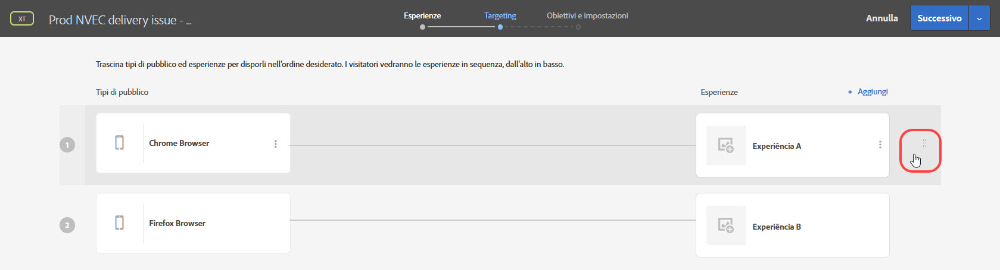 </p> <p>Per ulteriori informazioni, consulta <a href="../c-activities/t-experience-target/t-xt-create/xt-add-experience.md#task_454646F2895242D3B92DC395A0CE1A00" format="dita" scope="local"> Creare esperienze </a>. </p> </td> 
  </tr> 
  <tr> 
   <td colname="col1"> <p>Generazione rapporti: A/B, Targeting di esperienza e Consigli </p> </td> 
   <td colname="col2"> <p>Rapporti per le attività A/B, Targeting di esperienza e Consigli includono rappresentazioni visive che consentono di visualizzare visivamente l'intervallo di affidabilità e di incrementarlo in modo da poter determinare più accuratamente un vincitore. Passando il mouse sopra le rappresentazioni, puoi vedere i numeri reali. Questa funzionalità non è disponibile per le attività che utilizzano Analytics come origine per la generazione di rapporti (A4T). </p> <p> 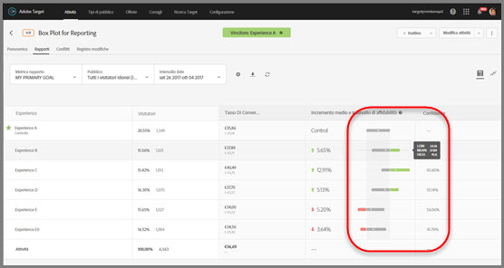 </p> <p>Per ulteriori informazioni, consulta <a href="../c-reports/c-report-settings/report-settings.md#concept_4BB6A7FDAB6F4806A632F9CD989B8BFA" format="dita" scope="local">Impostazioni dei rapporti</a>. </p> </td> 
  </tr> 
  <tr> 
   <td colname="col1" class="premium"> <p>Attività di Personalizzazione automatizzata (AP) </p> </td> 
   <td colname="col2"> <p>È possibile creare Gruppi di esclusione nelle attività AP per escludere automaticamente le esperienze con le offerte designate. </p> </td> 
  </tr> 
  <tr> 
   <td colname="col1" class="premium"> <p>Consigli: criteri e promozioni </p> </td> 
   <td colname="col2"> <p><b>(Programmata per essere rilasciata il 22 giugno 2017)</b> È ora possibile creare criteri dinamici e promozioni in base alla corrispondenza degli attributi del profilo e alla corrispondenza dei parametri. </p> <p>  </p> <p>Per ulteriori informazioni, consulta <a href="../c-recommendations/c-algorithms/use-dynamic-and-static-inclusion-rules.md#concept_4CB5C0FA705D4E449BD0B37B3D987F9F" format="dita" scope="local">Utilizzare regole di inclusione dinamiche e statiche </a>. </p> <p> <p>Nota: se hai dimestichezza con la configurazione delle regole di inclusione prima della versione di Target 17.6.1 (giugno 2017), noterai che alcune delle opzioni e degli operatori sono cambiati. Vengono visualizzati solo gli operatori applicabili all’opzione selezionata; alcuni altri operatori sono stati rinominati (“corrisponde a” è ora “è uguale a”), per maggiore coerenza e intuitività. Tutte le regole di esclusione esistenti create prima di questa versione sono state automaticamente convertite nella nuova struttura. Non è necessaria alcuna modifica da parte dell’utente. </p> </p> </td> 
  </tr> 
  <tr> 
   <td colname="col1"> <p>Denominazione delle attività </p> </td> 
   <td colname="col2"> <p>Prima del salvataggio, viene ora richiesto di assegnare un nome all'attività. Non è possibile salvare un'attività senza un nome. </p> </td> 
  </tr> 
  <tr> 
   <td colname="col1"> <p>Nuova posizione del Forum di Target </p> </td> 
   <td colname="col2"> <p> Il Forum di Target è stato spostato nella nuova <a href="https://forums.adobe.com/community/experience-cloud/marketing-cloud/target" format="https" scope="external">Piattaforma di Adobe Community </a>. </p> </td> 
  </tr> 
 </tbody> 
</table>

### Target Standard/Premium 17.4.1 (27 aprile 2017) {#section_24E6889AF1E0405497F6F77A407A9A46}

Questa versione include i miglioramenti e le funzioni seguenti:

<table id="table_9554D0094421417C88548BDC97B710F5"> 
 <thead> 
  <tr> 
   <th colname="col1" class="entry"> Funzione </th> 
   <th colname="col2" class="entry"> Dettagli </th> 
  </tr> 
 </thead>
 <tbody> 
  <tr> 
   <td colname="col1"> Generazione di rapporti </td> 
   <td colname="col2"> <p><b>Visualizzazione di più obiettivi/metriche:</b> è ora possibile visualizzare più metriche attività A/B e Targeting esperienza (XT), a eccezione delle attività A/B di <a href="../c-activities/automated-traffic-allocation/automated-traffic-allocation.md#concept_A1407678796B4C569E94CBA8A9F7F5D4" format="dita" scope="local"> allocazione automatica </a> e <a href="../c-activities/auto-target-to-optimize.md#concept_67779E5B7F67427A97D7EA2A6FB919B3" format="dita" scope="local"> targeting automatico </a>. </p> <p>Per ulteriori informazioni, consulta <a href="../c-reports/c-report-settings/view-multiple-metrics.md#concept_9E3C3F6F3EC1412FAF252975AC0720B7" format="dita" scope="local">Visualizzare più metriche in un rapporto </a>. </p> </td> 
  </tr> 
 </tbody> 
</table>

Questa versione di [!DNL Target] si concentra su correzioni back end e include i seguenti miglioramenti e correzioni di problemi rivolti al cliente: (i codici tra parentesi sono per uso interno di Adobe):

* È stato corretto un problema che causaca il malfunzionamento dell&#39;impostazione “Incrementa il conteggio, rilascia l&#39;utente e consenti il reinserimento”, nelle impostazioni avanzate delle attività. (TNT-26556)
* È stato risolto un problema che impediva la rimozione da Target dei dati degli Attributi dei clienti dopo che questi erano stati aggiornati con NULL nell&#39;interfaccia utente di Experience Cloud. (TNT-26462)

### Modifiche alla Piattaforma Target (13 aprile 2017) {#section_B59C26405EB7482AA80820D6D39B9C44}

<table id="table_6167ECB7B44F40DCADF299F46F1F795C"> 
 <thead> 
  <tr> 
   <th colname="col1" class="entry"> Modifica </th> 
   <th colname="col2" class="entry"> Dettagli </th> 
  </tr> 
 </thead>
 <tbody> 
  <tr> 
   <td colname="col1"> <p> <span class="filepath"> at.js </span> </p> </td> 
   <td colname="col2"> <p> È ora disponibile la versione 0.9.6 di <span class="filepath">at.js</span>. Per ulteriori informazioni, consulta <a href="../c-implementing-target/c-implementing-target-for-client-side-web/how-to-deployatjs/implementing-target-without-a-tag-manager.md#concept_1E1F958F9CCC4E35AD97581EFAF659E2" format="dita" scope="local">Scarica at.js</a>. </p> <p>I miglioramenti e le correzioni seguenti sono inclusi nella versione 0.9.6 di <span class="filepath">at.js</span>: </p> <p> 
     <ul id="ul_108DF85393614C69988E299485D338FD"> 
      <li id="li_4117C900982240B5AFFCFE1B2716A443"> <p>Supporto per le offerte di reindirizzamento per A4T. Dopo aver scaricato e installato la versione 0.9.6 di <span class="filepath">at.js</span>, è possibile utilizzare le offerte di reindirizzamento in attività che utilizzano <span class="keyword">Adobe Analytics</span> come origine per la generazione di rapporti per <span class="keyword">Target</span> (A4T). Oltre alla versione 0.9.6 di <span class="filepath">at.js</span>, l’implementazione deve soddisfare altri requisiti minimi al fine di usare le offerte di reindirizzamento e A4T. Per ulteriori informazioni e importanti informazioni aggiuntive che dovresti conoscere, consulta <a href="../c-integrating-target-with-mac/a4t/r-a4t-faq/a4t-faq-redirect-offers.md#concept_21BF213F10E1414A9DCD4A98AF207905" format="dita" scope="local">Offerte di reindirizzamento: domande frequenti su A4T </a>. </p> </li> 
      <li id="li_DA5321D72E81496DB7C49D589E1A59C4"> <p>Prima della versione 0.9.6 di <span class="filepath">at.js</span>, se l’API visitatore era presente nella pagina e l’impostazione <span class="codeph">visitorApiTimeout</span> era troppo aggressiva, poteva capitare che i dati MCID non venissero inviati nella richiesta di <span class="keyword">Target</span>. Questo poteva portare a problemi come la presenza di dati parziali in <span class="keyword">Analytics</span> durante l’utilizzo di A4T. </p> <p>Questo comportamento è stato modificato nella versione 0.9.6 di <span class="filepath">at.js</span>: anche se l’impostazione <span class="codeph">visitorApiTimeout</span> è impostata su 1 ms, ad esempio, Target tenterà di raccogliere SDID, server di tracciamento e dati degli ID cliente, per inviarli nella richiesta di Target. </p> </li> 
      <li id="li_B11CE11D9A594CB1ABB85BD0D93C4A15"> <p>È stata aggiunta l’impostazione <span class="codeph">selectorsPollingTimeout</span>. Per ulteriori informazioni, consulta <a href="../c-implementing-target/c-implementing-target-for-client-side-web/cmp-atjs-functions.md#concept_8DACBC47ABDE4279BB102B42609FE506" format="dita" scope="local">targetGlobalSettings()</a>. </p> </li> 
      <li id="li_D6F862099A374FE394F4DA3520A1BBF0"> <p>Il formato della risposta da <span class="codeph">getOffer()</span> è stato modificato. Per ulteriori informazioni, consulta <a href="../c-implementing-target/c-implementing-target-for-client-side-web/cmp-atjs-functions.md#reference_C81525D1598A4A1199740DCAB81A7FDF" format="dita" scope="local">adobe.target.getOffer(options) </a>. </p> </li> 
      <li id="li_80166567ED8945ECB37FEEE2C5F06ACE"> <p>La funzione di log della console è stata aggiunta per le dichiarazioni <span class="codeph">&lt;!DOCTYPE&gt;</span> non supportate. </p> </li> 
      <li id="li_02904EBAE8D3400092B762F0B28B0C86"> <p>È stato risolto un problema a causa del quale i plug-in di <span class="keyword">Target Classic</span> non venivano applicati correttamente quando venivano distribuite offerte multiple predefinite a un singolo mbox. (TGT-22664)</p> </li> 
      <li id="li_7016022D9DDE4529B77984F195825AB7"> <p>È stata migliorata la configurazione dei cookie per i domini di primo livello a due lettere (TLD) per garantire che il cookie mbox venga configurato correttamente per questi domini (ad esempio, <span class="filepath">test.no</span>, <span class="filepath">autodrives.ca</span> e così via). </p> </li> 
      <li id="li_3B1F618DEC744056B5BB172C4DBB359A"> <p>L’algoritmo per l’estrazione del dominio di primo livello che deve essere utilizzato quando si salvano i cookie è stato modificato nella versione 0.9.6. di <span class="codeph">at.js</span>. A causa di questa modifica, i cookie non possono essere salvati in indirizzi IP. Il più delle volte, gli indirizzi IP vengono utilizzati per scopi di test, ma come soluzioni alternative è possibile utilizzare le voci DNS, regolare il file host in una casella locale. </p> </li> 
      <li id="li_A52181499E63402DB4E16E33E36A9400"> <p>Risolta la gestione delle azioni Sposta e Ridisponi nel caso in cui le proprietà siano valori stringa anziché numeri interi. </p> </li> 
     </ul> </p> <p>Per informazioni su questa versione e sulle versioni precedenti di <span class="filepath">at.js</span>, consulta <a href="../c-implementing-target/c-implementing-target-for-client-side-web/target-atjs-versions.md#reference_DBB5EDB79EC44E558F9E08D4774A0F7A" format="dita" scope="local">Dettagli della versione di at.js </a>. </p> </td> 
  </tr> 
 </tbody> 
</table>

### Target Standard/Premium 17.3.1 (30 marzo 2017 - aggiornato il 13 aprile 2017) {#section_5C13660A8AA34F35A9CBEFEEC88738D0}

Questa versione include i miglioramenti e le funzioni seguenti:

<table id="table_4BA8DA701BC64427957355E144570EFE"> 
 <thead> 
  <tr> 
   <th colname="col1" class="entry"> Funzione </th> 
   <th colname="col2" class="entry"> Descrizione </th> 
  </tr> 
 </thead>
 <tbody> 
  <tr> 
   <td colname="col1"> <p>Analytics for Target (A4T) </p> <p>Offerte di reindirizzamento </p> </td> 
   <td colname="col2"> <p><b>Aggiornato il 13 aprile 2017.</b> </p> <p>È ora possibile utilizzare le offerte di reindirizzamento nelle attività che utilizzano <span class="keyword">Analytics</span> come origine per la generazione rapporti. </p> <p>Queste librerie devono essere incluse sia nella pagina con l'offerta di reindirizzamento sia nella pagina a cui il visitatore viene reindirizzato. Come parte di questa modifica, i nuovi parametri URL verranno aggiunti automaticamente agli URL di reindirizzamento se il servizio ID visitatore è implementato nel sito, indipendentemente dal fatto che si stia utilizzando Analytics come origine per la generazione rapporti per quell'attività. </p> <p>Per ulteriori informazioni, consulta <a href="../c-integrating-target-with-mac/a4t/r-a4t-faq/a4t-faq-redirect-offers.md#concept_21BF213F10E1414A9DCD4A98AF207905" format="dita" scope="local"> Offerte di reindirizzamento - Domande frequenti su A4T </a>. </p> </td> 
  </tr> 
  <tr> 
   <td colname="col1"> <p>Tipi di pubblico </p> </td> 
   <td colname="col2"> <p>I seguenti miglioramenti sono stati apportati al targeting di pubblico: </p> <p> 
     <ul id="ul_C920198404654C97A33190A29ACA6990"> 
      <li id="li_DB52EF909C9640649981940460CDF2B5"> <p><b>Ripartizione tra settimana e giorno:</b> è possibile impostare le opzioni di <span class="wintitle">ripartizione settimana/giorno</span> per creare modelli ricorrenti per il targeting di pubblico. </p> <p>Per ulteriori informazioni, consulta <a href="../c-target/c-audiences/c-target-rules/time-frame.md#concept_0FE1E8DACD104F8B870B0BADE3197F0A" format="dita" scope="local">Intervallo di tempo </a>. </p> </li> 
      <li id="li_2541A6EF2D604CE098012A16909C237E"> <p><b> Esclusioni nel pubblico combinato:</b> è ora possibile aggiungere regole di esclusione per escludere il pubblico quando si combinano più tipi di pubblico. </p> <p>Per ulteriori informazioni, consulta <a href="../c-target/combining-multiple-audiences.md#concept_A7386F1EA4394BD2AB72399C225981E5" format="dita" scope="local">Combinazione di più tipi di pubblico </a>. </p> </li> 
     </ul> </p> </td> 
  </tr> 
  <tr> 
   <td colname="col1" class="premium"> <p>Consigli </p> </td> 
   <td colname="col2"> <p><b>Promozioni dinamiche:</b> ora i consigli di Target supportano le corrispondenze dinamiche per le promozioni. </p> <p>Per ulteriori informazioni, consulta <a href="../c-recommendations/c-algorithms/use-dynamic-and-static-inclusion-rules.md#concept_4CB5C0FA705D4E449BD0B37B3D987F9F" format="dita" scope="local">Utilizzare regole di inclusione dinamiche e statiche </a>. </p> </td> 
  </tr> 
 </tbody> 
</table>

>[!NOTE]
>
>La possibilità di visualizzare più metriche in un rapporto, inclusa nella versione 17.3.1 di Target (30 marzo 2017), è stata rimossa a causa di un comportamento imprevisto. Questa funzione sarà nuovamente disponibile in una versione successiva.

Questa versione di [!DNL Target] include i seguenti miglioramenti e correzioni rivolti al cliente:

* L&#39;interfaccia utente di [!DNL Target] è stata aggiornata per supportare le offerte di reindirizzamento in attività che utilizzano [!UICONTROL Analytics for Target] (A4T) come origine per la generazione rapporti. Questa funzionalità richiederà la versione 0.9.6 di [!DNL at.js], che sarà disponibile a breve.
* L&#39;interfaccia utente di [!DNL Target] è stata aggiornata in alcuni punti:

   * Nei rapporti e nelle attività, alcune opzioni ([!UICONTROL Modifica], [!UICONTROL Condividi per feed], [!UICONTROL Visualizza URL di esperienza] ecc.) sono ora accessibili facendo clic sull&#39;icona [!UICONTROL altre opzioni] (

      ).
   * Nella Libreria [!UICONTROL offerte], le offerte ora sono visualizzate come un elenco piuttosto che come schede. Altre modifiche minori dell&#39;interfaccia utente sono state effettuate in tutta l&#39;interfaccia utente della Libreria [!UICONTROL offerte].

* Le prestazioni sulle attività degli elenchi di [!UICONTROL Attività] e [!UICONTROL Pubblico] sono significativamente migliorate. Inoltre, i tempi di caricamento dei risultati di ricerca saranno di nuovo molto più veloci.
* Nel [!UICONTROL Rapporto del livello di offerta] per i rapporti di [!UICONTROL Personalizzazione automatizzata], ora “Visualizzazioni” è diventato “Visite”.
* [!DNL Target] ora supporta il passaggio da un ambiente a un altro (gruppi host) per le attività di [!UICONTROL Personalizzazione automatizzata].
* Le attività di [!UICONTROL Personalizzazione automatizzata] supportano ora i gruppi host.

### Target Standard/Premium 17.2.1 (21 febbraio 2017) {#section_FC6412353DE64E848FFD5E8EFF72C7C7}

>[!NOTE]
>
>[!DNL Adobe Experience Manager] 6.2 con FP-11577 (o versioni successive) supporta ora le implementazioni di [!DNL at.js] con l’integrazione di [!UICONTROL Adobe Target Cloud Services]. Per ulteriori informazioni, consulta [Pacchetti di funzionalità](https://docs.adobe.com/docs/en/aem/6-2/release-notes/feature-packs.html) e [Integrazione con Adobe Target](https://docs.adobe.com/docs/en/aem/6-2/administer/integration/marketing-cloud/target.html) nella documentazione di *Adobe Experience Manager 6.2*.

Questa versione di [!DNL Target] è incentrata sulla fruibilità e sui miglioramenti delle prestazioni, e include i seguenti miglioramenti e correzioni (i codici tra parentesi sono per uso interno di Adobe):

* Sono stati aggiunti ulteriori elementi al menu della guida, a cui è possibile accedere dall&#39;angolo superiore destro dell&#39;interfaccia utente di [!DNL Target]. Le nuove opzioni includono: “Blog” e “Video”. L&#39;opzione “Adobe Experience Cloud Status” è ora “Adobe Target Standard/Premium Status”. (TGT-22629)
* Quando si elimina un pubblico,[!DNL Target] visualizza un elenco di attività che fanno riferimento a quel pubblico. Ora gli utenti possono fare clic su ogni attività nell&#39;elenco per visualizzare la pagina di [!UICONTROL Riepilogo]. (TGT-17997)
* È stata migliorata la funzione `user.activeCampaigns`, che restituisce l&#39;ID della campagna per tutte le campagne/attività a cui l&#39;utente è iscritto, anche se non ha interagito con la campagna/attività nella sessione corrente. (TNT-26237)
* Il pulsante [!UICONTROL Crea attività] nella pagina [!UICONTROL Attività] viene ora attivato prima che tutti i nomi delle attività vengano caricati nell&#39;elenco. Questo miglioramento consente agli utenti di creare nuove attività più velocemente, soprattutto quando l&#39;account ha molte attività configurate. (TGT-21470)
* È stato implementato il Compositore esperienza avanzato per migliorare il tempo di caricamento dei siti Web che eseguono HTTPS con accesso tramite proxy. Target non recupera più risorse statiche tramite proxy. (TGT-21793)
* Sono state migliorate le prestazioni sulla pagina [!UICONTROL Obiettivi e impostazioni], in particolare per il tempo di caricamento nel caso in cui vengano definite metriche multiple per un&#39;attività. (TGT-21654)
* Added a tool tip on the [!UICONTROL Goals &amp; Settings] page of all activities using [!UICONTROL Analytics for Target] (A4T) reporting informing users that a tracking server is not required if the activity&#39;s pages have at.js (version 0.9.1 or later) loaded. (TGT-22607)
* I nomi delle metriche vengono ora visualizzati nella pagina [!UICONTROL Obiettivi e impostazioni] senza che gli utenti debbano espandere ogni singola metrica per visualizzarne il nome per intero. Questo miglioramento consente agli utenti di modificare le metriche più rapidamente e in modo più efficiente. (TGT-21276)
* È ora possibile applicare le regole di inclusione di [!DNL Recommendations] ai criteri personalizzati (aggiornamento tramite CSV), come per qualsiasi altro criterio. (TGT-21896)
* È stata migliorata l&#39;interfaccia utente e la fruibilità della pagina [!UICONTROL Offerte], specialmente quando si creano o gestiscono cartelle e si creano offerte. (TGT-22509 e TGT-22187)
* È stata migliorata l&#39;esperienza dell&#39;utente nel [!UICONTROL Compositore esperienza visivo], quando si selezionano gli elementi da nascondere. 
(TGT-22224)
* È stata migliorata l&#39;esperienza dell&#39;utente durante la creazione di attività utilizzando il [!UICONTROL Compositore esperienza basato su moduli]. Quando si sceglie una posizione mbox, il bordo di convalida rimane evidenziato dopo aver fatto clic su [!UICONTROL Avanti]. (TGT-22221)
* Sono stati ottimizzati i rapporti scaricati per distinguere tra le offerte attive ed eliminate. (TGT-22449)
* È stato risolto un problema che impediva la visualizzazione di risorse obsolete nell&#39;elenco a scorrimento infinito all&#39;interno dell&#39;interfaccia utente del servizio principale delle Risorse di Experience Cloud. (TGT-19733)
* È stato risolto un problema a causa del quale nei rapporti CSV scaricati non veniva rispettata l&#39;impostazione dell&#39;ordine estremo. (TGT-21871)
* È stato risolto un problema a causa del quale gli ordini estremi non venivano contrassegnati correttamente nel rapporto CSV scaricato per i [!UICONTROL Dettagli dell&#39;ordine]. (TGT-22500)
* È stato corretto un problema che causava l&#39;errata visualizzazione dell&#39;ora ordine nel rapporto CSV scaricato di [!UICONTROL Campagna audit], anche se il rapporto mostrava la data di ordine esatta. (TNT-26469)
* È stato risolto un problema che impediva all&#39;opzione [!UICONTROL Disabilita JavaScript] di funzionare correttamente nelle attività multipagina. (TGT-15130)
* Se utilizzi il Compositore esperienza basato su moduli con una mbox diversa da quella globale creata automaticamente (`target-global-mbox`) e selezioni una metrica di coinvolgimento come metrica di successo, potrai visualizzare gli incrementi di metrica solo sulle pagine che hanno la mbox utilizzata nell&#39;attività. Ad esempio, se la mbox è `homepage_mbox`, la metrica [!UICONTROL Pagine per visita] corrisponde al numero di hit per `homepage_mbox` durante quella visita.

   È comunque possibile aggiungere un’altra posizione all’attività e assegnare la mbox globale a tale posizione, con il contenuto predefinito. Così facendo l’oggetto mbox globale viene collegato all’attività e Target può contare la metrica per la generazione di rapporti.

### Modifiche alla piattaforma Target (18 gennaio 2017) {#section_EA41802B2B24426FBA88D25E17DBE360}

<table id="table_3A2CD47252894F119B0E60BF6A9285B0"> 
 <thead> 
  <tr> 
   <th colname="col1" class="entry"> Modifica </th> 
   <th colname="col2" class="entry"> Dettagli </th> 
  </tr> 
 </thead>
 <tbody> 
  <tr> 
   <td colname="col1"> <p> <span class="codeph"> at.js</span> versione 0.9.4 </p> </td> 
   <td colname="col2"> <p>18 gennaio 2017 </p> <p> La versione 0.9.4 di <span class="codeph">at.js</span> contiene le seguenti modifiche: </p> <p> 
     <ul id="ul_8F149C28E2D946B9888B4D2F45167C3C"> 
      <li id="li_93E866BBFE374E93BCDB65BCFAC33B62"> <p> I nomi delle mbox ora possono contenere caratteri speciali, inclusi i e commerciale ( &amp; ). (TNT-26144) </p> <p>Per ulteriori informazioni, consulta <a href="../c-implementing-target/c-implementing-target-for-client-side-web/how-to-deployatjs/implementing-target-without-a-tag-manager.md#concept_2FA0456607D04F82B0539C5BF5309812" format="dita" scope="local">Configurazioni at.js</a>. </p> </li> 
      <li id="li_99309046030B4D93B59113C01A8789DA"> <p>È stata aggiunta l’impostazione <span class="codeph">secureOnly</span> che indica se <span class="codeph">at.js</span> deve utilizzare solo HTTPS o può passare da HTTP a HTTPS in base al protocollo della pagina. Si tratta di un’impostazione avanzata con impostazione predefinita False e può essere bypassata tramite <span class="codeph">targetGlobalSettings </span>. (TNT-26183) </p> <p>Per ulteriori informazioni, consulta <a href="../c-implementing-target/c-implementing-target-for-client-side-web/cmp-atjs-functions.md#concept_8DACBC47ABDE4279BB102B42609FE506" format="dita" scope="local">targetGlobalSettings()</a>. </p> </li> 
      <li id="li_D84D578C43A24D4896795999F841CEB8"> <p>L'opzione <span class="wintitle">Supporto di browser legacy</span> è disponibile nelle versioni 0.9.3 e precedenti di <span class="codeph">at.js</span>. Questa opzione è stata rimossa nella versione 0.9.4 di <span class="codeph">at.js</span>. </p> <p>Per ulteriori informazioni, consulta <a href="../c-implementing-target/c-implementing-target-for-client-side-web/how-to-deployatjs/implementing-target-without-a-tag-manager.md#concept_2FA0456607D04F82B0539C5BF5309812" format="dita" scope="local">Configurazioni at.js</a>. </p> </li> 
     </ul> </p> <p>Per informazioni dettagliate sulle modifiche apportate a ogni versione di <span class="codeph">at.js</span>, vedi <a href="https://docs.adobe.com/content/help/en/target/using/implement-target/client-side/target-atjs-versions.html" format="html" scope="external">Dettagli sulla versione di at.js </a>. </p> </td> 
  </tr> 
 </tbody> 
</table>

### Target Standard/Premium 17.1.1 (19 gennaio 2017) {#section_88AFA2F54CF24DF7822CFEBB07DFABE2}

Questa versione include i miglioramenti e le funzioni seguenti:

<table id="table_4F7D4A71F5DF4E8782C7DBEEEF24AD04"> 
 <thead> 
  <tr> 
   <th colname="col1" class="entry"> Funzione </th> 
   <th colname="col2" class="entry"> Descrizione </th> 
  </tr> 
 </thead>
 <tbody> 
  <tr> 
   <td colname="col1"> <p>Contenuto/offerte </p> </td> 
   <td colname="col2"> <p>Per le offerte, sono ora disponibili i seguenti miglioramenti: </p> <p> 
     <ul id="ul_7D8E81443E0F48B6A0C1D1DF6F27D292"> 
      <li id="li_EA529EF4EBC2416E9D3B9E7251E7AAAB"> <p>La pagina Contenuti è stata rinominata Offerte. Inoltre, ci sono ora due schede lungo il lato destro per separare le offerte di codice dalle offerte di immagine. </p> <p>Se prima di questa versione usavi codici e immagini nella stessa cartella, Target li divide in due cartelle duplicate. </p> </li> 
      <li id="li_9574FA6BDCFB4BAB938273BF7F4B21C8"> <p>Le offerte create tramite Target Classic, Adobe Experience Manager (AEM), Adobe Mobile Services (AMS) e API sono ora visibili nell'interfaccia utente di Target Standard/Premium. Le offerte create in Target Classic sono modificabili in Target Standard/Premium. (TGT-15738) </p> <p> Le offerte che sono state aggiornate negli ultimi due anni utilizzando questi metodi saranno visibili in Target Standard/Premium (da gennaio 2015 e oltre). </p> </li> 
      <li id="li_CAD67C9EBB564525ABD2269D918275F8"> <p>È ora possibile filtrare le offerte per origine e tipo. </p> </li> 
     </ul> </p> <p>Per ulteriori informazioni, consulta <a href="../c-experiences/c-manage-content/manage-content.md#concept_17874A6FCBB743AA84C5988E8571CCF3" format="dita" scope="local"> Offerte </a>. </p> <p>È stato apportato il seguente miglioramento al targeting di geolocalizzazione: </p> <p> 
     <ul id="ul_DD8B50F980B8447A8C37EA96530D8949"> 
      <li id="li_348E04AB29B14E6F83E3A7E7BF7D75B8"> <p>È ora possibile utilizzare i valori <span class="codeph">profile.geolocation</span> direttamente come token in offerte, plug-in e così via. (TNT-25967) </p> </li> 
     </ul> </p> <p>Per ulteriori informazioni, consulta <a href="../c-target/c-audiences/c-target-rules/geo.md#concept_5B4D99DE685348FB877929EE0F942670" format="dita" scope="local">Geo</a>. </p> </td> 
  </tr> 
  <tr> 
   <td colname="col1"> <p>Generazione di rapporti </p> <p> <p>Nota: questi miglioramenti non si applicano ai rapporti di Analytics for Target (A4T). </p> </p> </td> 
   <td colname="col2"> <p>I seguenti miglioramenti di generazione rapporti sono ora disponibili per i rapporti di Target. </p> <p> 
     <ul id="ul_ACFCA821B120419EA252EF5031309D52"> 
      <li id="li_0B634602BB044AEDB26DAF78189AB833"> <p>L'interfaccia utente per i rapporti è stata riprogettata. </p> </li> 
      <li id="li_309435D10AE84E8795C4CCC1F36747F7"> <p>I rapporti di Target ora hanno un'opzione che permette di reimpostare i dati di generazione rapporti per rimuovere i dati obsoleti. (TGT-5933) </p> </li> 
      <li id="li_9D30BFCC4CD6461B9DDCD5797A5E2B3A"> <p>Le opzioni di metodologia di conteggio per la generazione rapporti includono Visitatori (impostazione predefinita), Visite e Impression di attività. (TGT-10002) </p> </li> 
     </ul> </p> <p>Per ulteriori informazioni, consulta <a href="../c-reports/c-report-settings/report-settings.md#concept_4BB6A7FDAB6F4806A632F9CD989B8BFA" format="dita" scope="local"> Impostazioni dei rapporti </a> e <a href="../c-reports/conversion-rate.md#concept_EC19BC897D66411BABAF2FA27BCE89AA" format="dita" scope="local"> Metodologia di conteggio </a>. </p> <p>I seguenti miglioramenti di generazione rapporti sono ora disponibili per i rapporti CSV scaricabili: </p> <p> 
     <ul id="ul_18B0636A41B94F9F903ABFE3E13285DA"> 
      <li id="li_2422075AA0A34F868809C5D580FC5D4B"> <p>Il rapporto CSV a livello di offerta dispone ora di ulteriori dettagli riguardanti ogni offerta. (TGT-18995) </p> </li> 
      <li id="li_659D126E846348D4BE4544962F41539F"> <p>Ora i file CSV scaricati a livello di offerta includono sempre i dati dei segmenti di controllo e di destinazione per i rapporti di <span class="wintitle">Personalizzazione automatizzata</span>. (TGT-22000) </p> </li> 
     </ul> </p> <p>Sono ora disponibili i seguenti miglioramenti riguardanti la generazione rapporti per la sezione Personalizzazione automatizzata (AP). </p> <p> 
     <ul id="ul_5743684487CD4905BA998C298FD423D7"> 
      <li id="li_EB48BA21E00C4878B4408D24DD23BA9C"> <p>È stato migliorato il tempo di caricamento della generazione rapporti per le attività di Personalizzazione automatizzata. </p> </li> 
      <li id="li_B8ECCE250A674B83A66705AD5C45B9C3"> <p>L'intervallo di affidabilità per le variabili continue (metrica di Ricavi e di Coinvolgimento) viene ora visualizzato nei rapporti di riepilogo di Personalizzazione automatizzata (AP). </p> </li> 
     </ul> </p> </td> 
  </tr> 
  <tr> 
   <td colname="col1"> <p>Attività </p> </td> 
   <td colname="col2"> <p>I miglioramenti seguenti sono ora disponibili per le attività di Target: </p> <p> 
     <ul id="ul_436556860E6C4AEEB35411A02E78A199"> 
      <li id="li_5CC3B995D0AF4B658B3D6C3F6895AA41"> <p>Le attività create in <span class="keyword">Adobe Mobile Services</span> vengono ora visualizzate all'interno dell'interfaccia utente di <span class="keyword">Target Standard/Premium</span>. (TGT-10806) </p> <p>Per ulteriori informazioni, consulta <a href="../c-activities/activities.md#concept_D317A95A1AB54674BA7AB65C7985BA03" format="dita" scope="local"> Attività </a>. </p> </li> 
      <li id="li_684F9FC5CF414F4A892E6495352B5939"> <p>Quando si creano test multivariati, è ora possibile escludere più del 10% di esperienze dal test; in questo caso, per effettuare l’analisi è necessario utilizzare la generazione rapporti non in linea. (TGT-21719) </p> <p>Per ulteriori informazioni, consulta <a href="../c-activities/c-multivariate-testing/t-create-multivariate-test/preview-experiences.md#task_21A700587E88453A9FC2210C0DE53A28" format="dita" scope="local">Esperienze di anteprima per un test multivariato </a>. </p> </li> 
      <li id="li_B2FC7414C76848B39AD6EA20EE483F06"> <p>L'ID della campagna è ora visibile nella pagina Panoramica di ogni attività. Questa funzione è utile per le operazioni API e di risoluzione dei problemi. (TGT-20928) </p> </li> 
      <li id="li_5A9880AFE5FB46168D92255AA088B854"> <p>La progettazione delle pagine Conflitti e Registro modifiche è stata migliorata. </p> </li> 
      <li id="li_1489EA6C30C94B2AB394189E5FAFF6F6"> <p>La lunghezza massima consentita per i nomi di offerta anonimi nelle attività di Personalizzazione automatizzata (AP) è stata aumentata da 30 a 250 caratteri. </p> </li> 
     </ul> </p> </td> 
  </tr> 
  <tr> 
   <td colname="col1"> <p>Tipi di pubblico </p> </td> 
   <td colname="col2"> <p>I seguenti miglioramenti sono ora disponibili per il pubblico: </p> <p> 
     <ul id="ul_F1D1F97266134D4ABE627CF2DCE2C6D4"> 
      <li id="li_99A611FCC1254D229D79B8FD075B952A"> <p> Durante la creazione di destinatari di dispositivi mobili, ora è disponibile l'opzione <span class="wintitle">Nome dispositivo di marketing</span> dall’elenco a discesa. </p> <p>Questa modifica consente di scegliere facilmente un nome di modello di dispositivo anziché cercare il numero del modello di dispositivo appropriato. Ad esempio, il nome di marketing del dispositivo Galaxy S7 è “Samsung Galaxy S7 Edge”, mentre il modello del dispositivo è “SM-G9350”. (TGT-18393) </p> <p>Per ulteriori informazioni, consulta <a href="../c-target/c-audiences/c-target-rules/mobile.md#concept_2A794199DC1A4D349FFFBC7DCF1FEB89" format="dita" scope="local">Mobile</a>. </p> </li> 
     </ul> </p> </td> 
  </tr> 
  <tr> 
   <td colname="col1" class="premium"> <p>Consigli </p> </td> 
   <td colname="col2"> <p>I seguenti miglioramenti sono stati apportati ai consigli: </p> <p> 
     <ul id="ul_9D3644890C0C472D8B485DE9A52898B3"> 
      <li id="li_1E5662348F6E4ABDB2B74FE3326F2FD3"> <p>La linea di risultati dell'Algoritmo di backup è ora inclusa nei file CSV scaricabili Più visualizzati e Più acquistati. Il consiglio di backup inizia con “*,” </p> </li> 
      <li id="li_91DFD809378D4C20918F8F875747CE07"> <p>Gli stati aggiuntivi ti permettono di conoscere il progresso del feed dei consigli. </p> <p>Per ulteriori informazioni, consulta <a href="../c-recommendations/c-products/feeds.md#concept_1228B31E3D0B483B9DD42C5E2AE436E3" format="dita" scope="local">Feed </a>. </p> </li> 
     </ul> </p> </td> 
  </tr> 
  <tr> 
   <td colname="col1"> <p>Compositore esperienza visivo avanzato </p> </td> 
   <td colname="col2"> <p>Aggiornamento degli indirizzi IP per il Compositore esperienza visivo avanzato. </p> <p>Se  inserire nell'elenco Consentiti gli indirizzi IP utilizzati per il VEC, aggiungete i nuovi indirizzi IP. </p> <p>Per ulteriori informazioni, consulta <a href="../c-experiences/c-visual-experience-composer/r-troubleshoot-composer/troubleshoot-composer.md#reference_77743144F10143A3A89D56E116D296E4" format="dita" scope="local">Risoluzione dei problemi relativi a Compositore esperienza visivo </a>. </p> </td> 
  </tr> 
 </tbody> 
</table>

## Versione 2016 {#reference_607661929B504CCFAB3791B13C0DCDBE}

### Target Standard/Premium 16.10.2 (8 novembre 2016) {#section_2FDEFB3D56CC4BD7BC04DBEECFF6E942}

**Problemi risolti**

Questa versione include le seguenti correzioni:

* Risolto un problema in [!DNL Recommendations] che rendeva impossibile la creazione di feed per ambienti non predefiniti (gruppi di host).
* Sono state apportate diverse migliorie per ridurre gli errori di sincronizzazione delle attività.
* Non è più possibile creare offerte di reindirizzamento per attività che utilizzano [!DNL Analytics for Target] (A4T).

### Target Standard/Premium 16.10.1 (25 ottobre 2016) {#section_F76F7329FCAC452FB88F8BE0BA727044}

Questa versione include i miglioramenti e le funzioni seguenti:

<table id="table_F8C01B2A9F07443490DB3025AC3AAC2A"> 
 <thead> 
  <tr> 
   <th colname="col1" class="entry"> Funzione </th> 
   <th colname="col2" class="entry"> Descrizione </th> 
  </tr> 
 </thead>
 <tbody> 
  <tr> 
   <td colname="col1"> Allocazione automatica: contrassegno per l'esperienza migliore </td> 
   <td colname="col2"> <p>Ora è più facile individuare l'esperienza migliore in un'attività di allocazione automatica A/B. </p> <p>Molti addetti al marketing commettono l’errore di dichiarare un’esperienza vincente prima che i risultati indichino chiaramente quale sia l’esperienza migliore. </p> <p>Quando si utilizza la funzionalità <span class="wintitle">Allocazione automatica del traffico</span>, nella parte superiore della pagina di <span class="keyword">Target</span> dedicata alle attività appare un contrassegno che indica “Ancora nessun vincitore” finché l'attività non raggiunge il numero minimo di conversioni con sufficiente sicurezza. Quando viene dichiarata l'esperienza migliore, in <span class="keyword">Target</span> appare la scritta “Vincitore: esperienza X”. </p> <p>Per ulteriori informazioni, consulta <a href="../c-activities/automated-traffic-allocation/automated-traffic-allocation.md#concept_A1407678796B4C569E94CBA8A9F7F5D4" format="dita" scope="local">Allocazione traffico automatica</a> e <a href="../c-activities/automated-traffic-allocation/determine-winner.md#concept_5741A89ED7224E1285A3BC34B2CCD0F9" format="dita" scope="local">Determinare un vincitore</a>. </p> <p> <p>Nota: da oggi, le attività di allocazione automatica A/B non sono più supportate in Analytics for Target (A4T). A partire da questa versione, tutte le attività di allocazione automatica A/B con A4T abilitato saranno commutate in modalità <span class="wintitle">Manuale</span> (allocazione del traffico in parti uguali). </p> </p> </td> 
  </tr> 
  <tr> 
   <td colname="col1"> Individuare dispositivi mobili tramite gestore di telefonia </td> 
   <td colname="col2"> <p>Crea un pubblico per i dispositivi mobili sulla base del gestore di telefonia (Verizon, Sprint, AT&amp;T, T-Mobile ecc.). L'opzione <span class="wintitle">Gestore</span> è tra le impostazioni <span class="wintitle">Geo</span>. </p> <p>Per ulteriori informazioni, consulta <a href="../c-target/c-audiences/c-target-rules/geo.md#concept_5B4D99DE685348FB877929EE0F942670" format="dita" scope="local">Geo</a>. </p> </td> 
  </tr> 
  <tr> 
   <td colname="col1"> Generare token di autenticazione mboxTrace dall'interfaccia utente di Target </td> 
   <td colname="col2"> <p>Abilita gli strumenti avanzati di debug di <span class="keyword">Target</span> creando un token di autenticazione temporaneo. </p> <p>Click <span class="uicontrol"> Generate Authentication Token </span> on the <span class="wintitle"> Implementation Details </span> page ( <span class="uicontrol"> Administration </span> &gt; <span class="uicontrol"> Implementation </span>). Potrai aggiungere il parametro risultante agli URL della pagina web per scopi di risoluzione dei problemi. </p> <p>Per ulteriori informazioni, vedi “Recuperare il token di autorizzazione per gli strumenti di debug” in <a href="../c-activities/c-troubleshooting-activities/content-trouble.md#concept_D2548B486C984B1E97ED7A72075B8EEA" format="dita" scope="local"> Risoluzione dei problemi relativi alla distribuzione dei contenuti </a>. </p> </td> 
  </tr> 
  <tr> 
   <td colname="col1" class="premium"> Consigli: sequenziazione di un insieme di criteri </td> 
   <td colname="col2"> <p>Utilizza set composti da un numero massimo di cinque criteri creati in precedenza in una singola esperienza per un maggiore controllo sui consigli presentati ai visitatori. </p> <p>Per ulteriori informazioni, consulta <a href="../c-recommendations/c-algorithms/create-criteria-sequence.md#task_8A9CB465F28D44899F69F38AD27352FE" format="dita" scope="local">Creazione di sequenze di criteri </a>. </p> </td> 
  </tr> 
  <tr> 
   <td colname="col1" class="premium"> Consigli: inserimento di promozioni esterne </td> 
   <td colname="col2"> <p>Aggiungi articoli in promozione e controllane il posizionamento nelle progettazioni dei consigli. </p> <p>Per ulteriori informazioni, consulta <a href="../c-recommendations/t-create-recs-activity/adding-promotions.md#task_CC5BD28C364742218C1ACAF0D45E0E14" format="dita" scope="local"> Aggiunta di promozioni </a>. </p> </td> 
  </tr> 
  <tr> 
   <td colname="col1" class="firstlook"> <p><b>First Look</b> </p> Targeting automatico nelle attività A/B </td> 
   <td colname="col2"> <p> <p>Nota: l'offerta “First Look” è abilitata soltanto per alcuni clienti di questa versione per effettuare test e fornire riscontri. </p> </p> <p>Indirizza automaticamente le esperienze negli A/B test per fornire ad ogni visitatore l'esperienza più adatta. </p> <p>Per ulteriori informazioni, consulta <a href="../c-activities/auto-target-to-optimize.md#concept_67779E5B7F67427A97D7EA2A6FB919B3" format="dita" scope="local">Targeting automatico per esperienze personalizzate</a>. </p> </td> 
  </tr> 
 </tbody> 
</table>

### Modifiche alla piattaforma Target (10 ottobre 2016) {#section_0761AED70C3E44EA9D8546107B162CC1}

<table id="table_E3E52A4362724D05A8472DB5F51A2429"> 
 <thead> 
  <tr> 
   <th colname="col1" class="entry"> Modifica </th> 
   <th colname="col2" class="entry"> Dettagli </th> 
  </tr> 
 </thead>
 <tbody> 
  <tr> 
   <td colname="col1"> <p> <span class="codeph"> at.js</span> versione 0.9.3 </p> </td> 
   <td colname="col2"> <p>10 ottobre 2016 </p> <p> È ora disponibile la versione 0.9.3 di <span class="codeph">at.js</span>. </p> <p> 
     <ul id="ul_E4D300700390433E9EF8D5C9D3AA7669"> 
      <li id="li_E916EB3A77ED4CFF90CF6B4D30F188B1"> <p>Le chiamate mbox si attivano in Microsoft Internet Explorer 11 quando i browser legacy sono disabilitati nelle impostazioni <span class="codeph">at.js</span>. </p> </li> 
      <li id="li_1130509832CE429DB6DE636404CC54E1"> <p>Il contenuto predefinito viene renderizzato in caso di mancata riuscita di un’offerta remota dinamica (ad esempio, se l’URL non è corretto e genera un errore 404). </p> </li> 
      <li id="li_21B5225D894B43CB863A775C937F66F4"> <p>Garantisce che gli elementi vengano rivelati rapidamente quando è impossibile trovare i selettori di tracciamento clic del Compositore esperienza visivo nel DOM. </p> </li> 
     </ul> </p> <p>Per ulteriori informazioni, consulta <a href="../c-implementing-target/c-implementing-target-for-client-side-web/target-atjs-versions.md#reference_DBB5EDB79EC44E558F9E08D4774A0F7A" format="dita" scope="local">Dettagli della versione di at.js </a>. </p> </td> 
  </tr> 
 </tbody> 
</table>

### Target Standard/Premium 16.9.1 (22 settembre 2016) {#section_3CD20678B6254DE1A9BD41FDD2255DDD}

Questa versione include i miglioramenti e le funzioni seguenti:

<table id="table_FED049F97C054CA895E0AEA3F2B180BF"> 
 <thead> 
  <tr> 
   <th colname="col1" class="entry"> Funzione </th> 
   <th colname="col2" class="entry"> Descrizione </th> 
  </tr> 
 </thead>
 <tbody> 
  <tr> 
   <td colname="col1"> Combinare più tipi di pubblico </td> 
   <td colname="col2"> <p>Combina al volo più tipi di pubblico (tra cui quelli di <span class="keyword">Adobe Experience Cloud</span> e di <span class="keyword">Target</span>) durante il flusso di lavoro per la creazione di attività. </p> <p>Ad esempio, puoi indirizzare tutti i clienti fidelizzati includendo un segmento di <span class="keyword">Audience Manager</span> specifico per lo status di fidelizzazione e combinarlo con un segmento di <span class="keyword">Target</span> composto da persone iscritte al tuo programma fedeltà nella sessione corrente, invece di creare un terzo pubblico permanente. </p> <p>Per ulteriori informazioni, consulta <a href="../c-target/combining-multiple-audiences.md#concept_A7386F1EA4394BD2AB72399C225981E5" format="dita" scope="local">Combinazione di più tipi di pubblico </a>. </p> </td> 
  </tr> 
  <tr> 
   <td colname="col1"> Targeting dei visitatori durante un periodo di tempo specifico </td> 
   <td colname="col2"> <p>Aggiungi la data di inizio e fine del periodo per indirizzare un pubblico. </p> <p>Per esempio, utilizzando i nuovi tipi di pubblico combinati ad hoc di cui sopra, è possibile indirizzare gli utenti che spendono meno su contenuti specifici nei tre giorni prima del Black Friday e su altri contenuti dopo il Black Friday. </p> <p>Per ulteriori informazioni, consulta <a href="../c-target/c-audiences/c-target-rules/time-frame.md#concept_0FE1E8DACD104F8B870B0BADE3197F0A" format="dita" scope="local">Intervallo di tempo </a>. </p> </td> 
  </tr> 
  <tr> 
   <td colname="col1"> Salvare raccolte avanzate </td> 
   <td colname="col2"> <p>La funzionalità di ricerca nella pagina <span class="wintitle">Contenuto</span> comprende ora cartelle salvate, denominate raccolte avanzate, per risparmiare tempo quando si eseguono ricerche simili. </p> <p>Per ulteriori informazioni, consulta <a href="../c-experiences/c-manage-content/filter-and-search-content.md#concept_3B59B8F025BF4CEA82ECC5199D365276" format="dita" scope="local">Ricerca contenuti e crea raccolte avanzate </a>. </p> </td> 
  </tr> 
  <tr> 
   <td colname="col1"> Compositore esperienza basato su moduli </td> 
   <td colname="col2"> <p>Aggiungi un collegamento a un'immagine. Il collegamento può essere di tipo click-through, di destinazione o di arrivo. </p> <p>Per ulteriori informazioni, consulta <a href="../c-experiences/form-experience-composer.md#task_FAC842A6535045B68B4C1AD3E657E56E" format="dita" scope="local">Compositore esperienza basato su moduli</a>. </p> </td> 
  </tr> 
 </tbody> 
</table>

**Miglioramenti**

Questa versione include i seguenti miglioramenti:

| Miglioramento | Descrizione |
|---|---|
| Compositore esperienza visivo | È stata migliorata la messaggistica di errore. |

**Problemi noti**

* L’opzione [!UICONTROL Rendering con JavaScript] non è attualmente supportata se viene utilizzata con codice personalizzato nel Compositore esperienza visivo.

### Modifiche alla piattaforma Target (settembre 2016) {#section_1955146045A247D393DB824669A2A916}

<table id="table_8FDAEED5D84C4C718AB863BD6C383F20"> 
 <thead> 
  <tr> 
   <th colname="col1" class="entry"> Modifica </th> 
   <th colname="col2" class="entry"> Dettagli </th> 
  </tr> 
 </thead>
 <tbody> 
  <tr> 
   <td colname="col1"> <p> <span class="codeph"> at.js</span> versione 0.9.2 </p> </td> 
   <td colname="col2"> <p>21 settembre 2016 </p> <p> È ora disponibile la versione 0.9.2 di <span class="codeph">at.js</span>. </p> <p> 
     <ul id="ul_0778A9049C9D48A7B6CB4B79A95F0F4C"> 
      <li id="li_689FF306179F4EC3B391DEE3C53F4B1D"> <p>È stata aggiunta un’impostazione <span class="codeph">optoutEnabled</span> per abilitare o disabilitare la rinuncia a Device Graph. Se questa impostazione è impostata su <span class="codeph">Vero</span> e il visitatore ha scelto di non aderire al tracciamento, il browser del visitatore non farà nessuna chiamata mbox. Device Graph è attualmente in versione beta. Questa impostazione è inizialmente impostata su <span class="codeph">Falso</span>, ma deve essere impostata su <span class="codeph">Vero</span> se si utilizza Device Graph.</p> </li> 
      <li id="li_663462C0680049F89CA8FE1853F31807"> <p>È stato aggiunto il supporto di <span class="codeph">CustomEvent</span> per il meccanismo di notifica. In precedenza, il meccanismo di notifica degli eventi <span class="codeph">at.js</span> non poteva essere utilizzato tramite API DOM standard, come ad esempio <span class="codeph">document.addEventListener()</span>. Ora è possibile utilizzare <span class="codeph">document.addEventListener()</span> per sottoscrivere a eventi <span class="codeph">at.js</span>, come ad esempio eventi di richiesta e di rendering del contenuto. </p> </li> 
      <li id="li_3FB2914F8D2F4AFFAA9B4622E8CA1EFF"> <p>È stato risolto un problema relativo alle offerte create nel Compositore esperienza visivo. Prima di questa versione, Target nascondeva i selettori e li mostrava solo in caso di corrispondenza di tutti i selettori. In <span class="codeph">at.js</span> 0.9.2 Target mostra i selettori non appena corrispondono. </p> </li> 
     </ul> </p> <p>Per ulteriori informazioni, consulta <a href="../c-implementing-target/c-implementing-target-for-client-side-web/target-atjs-versions.md#reference_DBB5EDB79EC44E558F9E08D4774A0F7A" format="dita" scope="local">Dettagli della versione di at.js </a>. </p> </td> 
  </tr> 
 </tbody> 
</table>

### Target Standard/Premium 16.9.1 (22 settembre 2016) {#section_60ADF842E4A0424E8D2A81FB8B813A7A}

Questa versione include i miglioramenti e le funzioni seguenti:

<table id="table_896218AECE4C4EC691B76E79CC7DC356"> 
 <thead> 
  <tr> 
   <th colname="col1" class="entry"> Funzione </th> 
   <th colname="col2" class="entry"> Descrizione </th> 
  </tr> 
 </thead>
 <tbody> 
  <tr> 
   <td colname="col1"> Combinare più tipi di pubblico </td> 
   <td colname="col2"> <p>Combina al volo più tipi di pubblico (tra cui quelli di <span class="keyword">Adobe Experience Cloud</span> e di <span class="keyword">Target</span>) durante il flusso di lavoro per la creazione di attività. </p> <p>Ad esempio, puoi indirizzare tutti i clienti fidelizzati includendo un segmento di <span class="keyword">Audience Manager</span> specifico per lo status di fidelizzazione e combinarlo con un segmento di <span class="keyword">Target</span> composto da persone iscritte al tuo programma fedeltà nella sessione corrente, invece di creare un terzo pubblico permanente. </p> <p>Per ulteriori informazioni, consulta <a href="../c-target/combining-multiple-audiences.md#concept_A7386F1EA4394BD2AB72399C225981E5" format="dita" scope="local">Combinazione di più tipi di pubblico </a>. </p> </td> 
  </tr> 
  <tr> 
   <td colname="col1"> Targeting dei visitatori durante un periodo di tempo specifico </td> 
   <td colname="col2"> <p>Aggiungi la data di inizio e fine del periodo per indirizzare un pubblico. </p> <p>Per esempio, utilizzando i nuovi tipi di pubblico combinati ad hoc di cui sopra, è possibile indirizzare gli utenti che spendono meno su contenuti specifici nei tre giorni prima del Black Friday e su altri contenuti dopo il Black Friday. </p> <p>Per ulteriori informazioni, consulta <a href="../c-target/c-audiences/c-target-rules/time-frame.md#concept_0FE1E8DACD104F8B870B0BADE3197F0A" format="dita" scope="local">Intervallo di tempo </a>. </p> </td> 
  </tr> 
  <tr> 
   <td colname="col1"> Salvare raccolte avanzate </td> 
   <td colname="col2"> <p>La funzionalità di ricerca nella pagina <span class="wintitle">Contenuto</span> comprende ora cartelle salvate, denominate raccolte avanzate, per risparmiare tempo quando si eseguono ricerche simili. </p> <p>Per ulteriori informazioni, consulta <a href="../c-experiences/c-manage-content/filter-and-search-content.md#concept_3B59B8F025BF4CEA82ECC5199D365276" format="dita" scope="local">Ricerca contenuti e crea raccolte avanzate </a>. </p> </td> 
  </tr> 
  <tr> 
   <td colname="col1"> Compositore esperienza basato su moduli </td> 
   <td colname="col2"> <p>Aggiungi un collegamento a un'immagine. Il collegamento può essere di tipo click-through, di destinazione o di arrivo. </p> <p>Per ulteriori informazioni, consulta <a href="../c-experiences/form-experience-composer.md#task_FAC842A6535045B68B4C1AD3E657E56E" format="dita" scope="local">Compositore esperienza basato su moduli</a>. </p> </td> 
  </tr> 
 </tbody> 
</table>

**Miglioramenti**

Questa versione include i seguenti miglioramenti:

| Miglioramento | Descrizione |
|---|---|
| Compositore esperienza visivo | È stata migliorata la messaggistica di errore. |

**Problemi noti**

* L’opzione [!UICONTROL Rendering con JavaScript] non è attualmente supportata se viene utilizzata con codice personalizzato nel Compositore esperienza visivo.

### Adobe Target Standard/Premium 16.8.1 (23 agosto 2016) {#section_A8854D4EDF014AEBB81F49EB104D4A20}

La versione 16.8.1 di Adobe Target Standard/Premium (23 agosto 2016) prevede le seguenti funzionalità e migliorie:

<table id="table_AE048CB9EA1C4C7BBC2E9D90D26F7395"> 
 <thead> 
  <tr> 
   <th colname="col1" class="entry"> Funzione </th> 
   <th colname="col2" class="entry"> Descrizione </th> 
  </tr> 
 </thead>
 <tbody> 
  <tr> 
   <td colname="col1"> <p>Gestione di host e ambiente (gruppo host) </p> </td> 
   <td colname="col2"> <p>Organizza siti e ambienti di preproduzione per gestirli facilmente e per generare rapporti separati. </p> <p>Per facilitare la gestione, gli host sono raccolti in ambienti. Gli ambienti preimpostati includono Produzione, Staging e Sviluppo. È inoltre possibile aggiungere nuovi ambienti. </p> <p>Questa funzionalità è pari a quella di <span class="keyword">Target Classic </span>. </p> <p>Per ulteriori informazioni, consulta <a href="../administrating-target/hosts.md#concept_516BB01EBFBD4449AB03940D31AEB66E" format="dita" scope="local"> Host </a>. </p> </td> 
  </tr> 
  <tr> 
   <td colname="col1"> <p>Affinità tra categorie </p> </td> 
   <td colname="col2"> <p>La funzione di affinità tra categorie acquisisce automaticamente le categorie visitate da un utente e calcola l'affinità dell'utente con la categoria in modo che possa essere indirizzata e segmentata. Questo è utile per assicurare che il targeting del contenuto sia rivolto ai visitatori per i quali la probabilità di azione su tali informazioni è più elevata. </p> <p>Questa funzionalità è pari a quella di <span class="keyword">Target Classic </span>. </p> <p>Per ulteriori informazioni, consulta <a href="../c-target/c-visitor-profile/category-affinity.md#concept_75EC1E1123014448B8B92AD16B2D72CC" format="dita" scope="local"> Affinità tra categorie </a>. </p> </td> 
  </tr> 
  <tr> 
   <td colname="col1"> <p>Attivare/disattivare il Compositore esperienza avanzato a livello di attività </p> </td> 
   <td colname="col2"> <p>Attiva/disattiva il <span class="wintitle">Compositore esperienza avanzato</span> a livello di account (si applica a tutte le attività create nell'account) o a livello di singola attività. </p> <p>Prima, era possibile abilitare/disabilitare il Compositore esperienza avanzato solo a livello di account. </p> <p>Per ulteriori informazioni, consulta <a href="../c-experiences/experiences.md#concept_A2E10F6AFB3D4AEAB6951EE14688848D" format="dita" scope="local"> Esperienze </a>. </p> </td> 
  </tr> 
  <tr> 
   <td colname="col1"> <p class="premium">Personalizzazione automatica: rapporti delle prestazioni dell'offerta </p> </td> 
   <td colname="col2"> <p>Scarica un rapporti sulle prestazioni dell'offerta con tutte le metriche di successo dell'attività di Personalizzazione automatica. </p> </td> 
  </tr> 
 </tbody> 
</table>

**Miglioramenti**

Questa versione include i seguenti miglioramenti:

<table id="table_E2E4BE72BD79413A821C6A6D1A3AB0F8"> 
 <thead> 
  <tr> 
   <th colname="col1" class="entry"> Miglioramento </th> 
   <th colname="col2" class="entry"> Descrizione </th> 
  </tr> 
 </thead>
 <tbody> 
  <tr> 
   <td colname="col1"> <p>Rinnovamento dell'interfaccia utente dell'editor di codice </p> </td> 
   <td colname="col2"> <p>L'interfaccia utente dell'editor di codice è stata resa più intuitiva e più facile da utilizzare. </p> <p>Per ulteriori informazioni, consulta <a href="../c-experiences/c-visual-experience-composer/c-vec-code-editor/vec-code-editor.md#concept_B3A6E9EE3A60406DB640E205EA1745B5" format="dita" scope="local">Editor di codice </a>. </p> </td> 
  </tr> 
 </tbody> 
</table>

Sono stati segnalati i seguenti problemi:

* Parte del testo dell&#39;interfaccia utente per la funzione [!UICONTROL Affinità tra categorie] appare solo in inglese. Il testo in altre lingue sarà disponibile nella versione di [!DNL Target] di settembre.

### Modifiche alla piattaforma Target (luglio 2016) {#section_09C18773707B4059852A41C764F817E4}

<table id="table_33B60910EAE24BAFA778F280F72FB683"> 
 <thead> 
  <tr> 
   <th colname="col1" class="entry"> Modifica </th> 
   <th colname="col2" class="entry"> Dettagli </th> 
  </tr> 
 </thead>
 <tbody> 
  <tr> 
   <td colname="col1"> <p> <span class="filepath"> at.js</span> versione 0.9.1 </p> </td> 
   <td colname="col2"> <p>14 luglio 2016 </p> <p> È ora disponibile la versione 0.9.1 di <span class="filepath">at.js</span>. </p> <p>Per ulteriori informazioni, consulta <a href="../c-implementing-target/c-implementing-target-for-client-side-web/target-atjs-versions.md#reference_DBB5EDB79EC44E558F9E08D4774A0F7A" format="dita" scope="local">Dettagli della versione di at.js </a>. </p> </td> 
  </tr> 
 </tbody> 
</table>

### Adobe Target Standard/Premium 16.7.1 (21 luglio 2016) {#section_DB583EF9A30247A488EE319583911F22}

La versione 16.7.1 di Adobe Target Standard/Premium (21 luglio 2016) prevede le seguenti funzionalità e migliorie:

<table id="table_EBA34BD2F5C745DD9EC5231AD79F6C00"> 
 <thead> 
  <tr> 
   <th colname="col1" class="entry"> Funzione </th> 
   <th colname="col2" class="entry"> Descrizione </th> 
  </tr> 
 </thead>
 <tbody> 
  <tr> 
   <td colname="col1"> Impostazioni prioritarie per le attività </td> 
   <td colname="col2"> <p>È ora possibile impostare livelli di priorità da 0 a 999 per le attività. Questo permette un controllo più preciso sull'attività da visualizzare quando vengono assegnate più attività allo stesso percorso con lo stesso pubblico. </p> <p>This option must be enabled in <span class="wintitle"> Administration </span> &gt; <span class="wintitle"> Reporting </span> . </p> <p>L'opzione Priorità a grana fine si applica alle attività di Test A/B, Personalizzazione automatizzata, Targeting esperienza e Test multivariati. </p> <p>Per maggiori informazioni, vedi i seguenti argomenti: </p> <p> 
     <ul id="ul_FD92CD06CF25480887AC171274262E18"> 
      <li id="li_D321FAED82944D2685DA69EB310D80BE"><b>Test A/B: </b> <a href="../c-activities/t-test-ab/t-test-create-ab/ab-goals-and-settings.md#reference_B25389FD6F3A4989801E740364B089CC" format="dita" scope="local"> obiettivi e impostazioni </a> </li> 
      <li id="li_12ECDFD71DB94E22A85AB13B487E8503"><b>Personalizzazione automatizzata: </b> <a href="../c-activities/t-automated-personalization/automated-personalization.md#task_8AAF837796D74CF893CA2F88BA1491C9" format="dita" scope="local"> Personalizzazione automatizzata </a> </li> 
      <li id="li_84B893C214994246AB36E28E84C51460"><b>Targeting esperienza: </b> <a href="../c-activities/t-experience-target/t-xt-create/xt-goals-and-settings.md#reference_B25389FD6F3A4989801E740364B089CC" format="dita" scope="local"> Obiettivi e impostazioni </a> </li> 
      <li id="li_26533B659C0E49D6A6D3B3FEBE9CA930"><b>Test multivariato: </b> <a href="../c-activities/c-multivariate-testing/t-create-multivariate-test/goals-and-settings.md#reference_B25389FD6F3A4989801E740364B089CC" format="dita" scope="local"> Obiettivi e impostazioni </a> </li> 
      <li id="li_FBACF2B73B2E491BBB85618153AC4568"><b>Attività: </b> <a href="../c-activities/activity-settings.md#task_C6B2FF8374724933BE79A83549B9CD02" format="dita" scope="local"> Impostazioni attività </a> </li> 
     </ul> </p> </td> 
  </tr> 
  <tr> 
   <td colname="col1" class="premium"> Attributi per Consigli con più valori </td> 
   <td colname="col2"> <p>Da oggi, tutti gli attributi personalizzati della funzione <span class="keyword">Consigli</span> possono contenere più valori entità. </p> <p>Per ulteriori informazioni, consulta <a href="../c-recommendations/c-products/custom-entity-attributes.md#concept_E5CF39BCAC8140309A73828706288322" format="dita" scope="local">Attributi di entità personalizzati </a>. </p> </td> 
  </tr> 
  <tr> 
   <td colname="col1"> Supporto di offerte dinamiche/remote </td> 
   <td colname="col2"> <p>In <span class="keyword">Target Standard/Premium</span>, il contenuto dinamico può far parte di qualsiasi attività basata su moduli. Il contenuto dinamico viene archiviato all'esterno di <span class="keyword">Target </span>. </p> <p>Per ulteriori informazioni, consulta <a href="../c-experiences/c-manage-content/about-remote-offers.md#concept_657016A0E6174C22B89036E9C8A0170F" format="dita" scope="local"> Creare offerte remote </a>. </p> </td> 
  </tr> 
  <tr> 
   <td colname="col1"> Copiare tipi di pubblico e script di profilo </td> 
   <td colname="col2"> <p>Da oggi, si può copiare un pubblico esistente e modificarlo per crearne uno simile. </p> <p>Per ulteriori informazioni, consulta <a href="../c-target/c-audiences/create-audience.md#task_E18BD77A9A8F4ED0AC50569F94556558" format="dita" scope="local"> Creazione di un pubblico </a>. </p> <p>È inoltre possibile copiare gli script dei profili esistenti. </p> <p>Per ulteriori informazioni, consulta <a href="../c-target/c-visitor-profile/profile-parameters.md#concept_8C07AEAB0A144FECA8B4FEB091AED4D2" format="dita" scope="local">Attributi del profilo </a>. </p> </td> 
  </tr> 
  <tr> 
   <td colname="col1"> Utilizza le classi per determinare i selettori di elementi </td> 
   <td colname="col2"> <p>Da oggi, i selettori di elementi si possono basare su classi o ID nelle attività di Personalizzazione automatizzata e Test multivariato. Nelle versioni precedenti, questa opzione era disponibile solo per le attività di Prova A/B. </p> <p>Per ulteriori informazioni, consulta <a href="../c-experiences/c-visual-experience-composer/vec-selectors.md#concept_4EB7663E255F439B8D24079D23479337" format="dita" scope="local"> Selettori di elementi utilizzati nel Compositore esperienza visivo </a>. </p> </td> 
  </tr> 
  <tr> 
   <td colname="col1" class="premium"> Consigli: Somiglianza del contenuto </td> 
   <td colname="col2"> <p> Utilizza le regole di somiglianza del contenuto per formulare consigli basati su attributi di elemento o file multimediale. </p> </td> 
  </tr> 
 </tbody> 
</table>

<table id="table_699755B33F8F48ECABB6FC7E78289A79"> 
 <thead> 
  <tr> 
   <th colname="col1" class="entry"> Miglioramento </th> 
   <th colname="col2" class="entry"> Descrizione </th> 
  </tr> 
 </thead>
 <tbody> 
  <tr> 
   <td colname="col1"> <p>Miglioramenti della reportistica </p> </td> 
   <td colname="col2"> <p>Da oggi, sui rapporti della metrica di successo che vengono scaricati, compaiono i nomi dei segmenti e delle metriche anziché i loro ID. </p> </td> 
  </tr> 
  <tr> 
   <td colname="col1" class="premium"> Valutare la condizione di entrata mbox su ogni richiesta nelle attività di Personalizzazione automatizzata </td> 
   <td colname="col2"> <p>Nelle attività di Personalizzazione automatizzata, i criteri di immissione (targeting URL, regole di modello, targeting pubblico) vengono valutati per ogni richiesta per una distribuzione più accurata dell’offerta. </p> <p>Per ulteriori informazioni, consulta <a href="../c-activities/t-automated-personalization/automated-personalization.md#task_8AAF837796D74CF893CA2F88BA1491C9" format="dita" scope="local">Personalizzazione automatizzata </a>. </p> </td> 
  </tr> 
 </tbody> 
</table>

### Adobe Target Standard/Premium 16.6.1 (16 giugno 2016) {#section_C1E9F43111BF4160AF31482CD53E00BD}

Non sono previste versioni rivolte ai clienti per giugno.

**Problemi risolti**

Questa versione include le seguenti correzioni:

* È stato risolto un problema a causa del quale ad alcuni clienti appariva una schermata bianca quando tentavano di modificare la loro pagina all&#39;interno del Compositore esperienza visivo.

**Problemi noti**

Sono stati segnalati i seguenti problemi:

* Quando si seleziona “Disabilita JavaScript” per la pagina A in un&#39;attività multipagina, JavaScript viene disabilitato ovunque, anche se “Disabilita JavaScript” non viene selezionato in altre pagine.
* Problema con gli URL di anteprima delle esperienze con reindirizzamento. Come soluzione alternativa, fai clic su **[!UICONTROL Configura]** nel Compositore esperienza, scegli **[!UICONTROL Più tipi di pubblico]** e aggiungi **[!UICONTROL Tutti i visitatori]** come unico pubblico. Continua a salvare l&#39;attività. Questo non cambia la distribuzione dell&#39;attività, ma consente il funzionamento dell&#39;anteprima. Questo problema verrà risolto nella versione di luglio di Adobe Target.

* Nella documentazione viene illustrato il comportamento previsto per la casella di controllo Reindirizza URL. Tuttavia, a causa di un bug, la casella di controllo non appare selezionata come impostazione predefinita. Questo difetto verrà corretto al più presto.

   Per verificare questa opzione in un&#39;attività esistente con un&#39;offerta di reindirizzamento, adotta la seguente soluzione:

   1. Apri il popup per il reindirizzamento a un URL.
   1. Modifica l&#39;URL sostituendolo con uno fittizio e salva.
   1. Modifica nuovamente l&#39;URL fittizio sostituendolo con l&#39;URL di reindirizzamento previsto dalla tua campagna.
   1. Seleziona l&#39;opzione “Includi parametri di query correnti” e salva.

   Se si seleziona l&#39;opzione durante la creazione di una nuova offerta di reindirizzamento, i parametri di query verranno probabilmente inclusi nel reindirizzamento.

   Per le attività create in precedenza, se questa opzione è selezionata nel compositore esperienza dell&#39;attività, il reindirizzamento includerà i parametri della query. Se non è selezionata, i parametri di query correnti non verranno inclusi nel reindirizzamento.

### Adobe Target Standard/Premium 16.5.1 (19 maggio 2016) {#section_406CE09317994F55A26C2FDB77C77FEA}

La versione 16.5.1 di Adobe Target Standard/Premium (19 maggio 2016) prevede le seguenti funzionalità e migliorie:

<table id="table_DDC5356FD6B8443EAA6EB81C03ADF73A"> 
 <thead> 
  <tr> 
   <th colname="col1" class="entry"> Funzione </th> 
   <th colname="col2" class="entry"> Descrizione </th> 
  </tr> 
 </thead>
 <tbody> 
  <tr> 
   <td colname="col1"> Versioni di esperienza </td> 
   <td colname="col2"> <p>Le versioni destinate a diversi gruppi possono ora essere configurate all'interno di esperienze nelle attività A/B. </p> <p>Consulta <a href="../c-activities/t-test-ab/t-test-create-ab/target-experience-to-multiple-audiences.md#task_0138112E283A4A5B9F8AB9AAF2FBC2FF" format="dita" scope="local"> Eseguire il targeting di un’esperienza su più tipi di pubblico </a>. </p> </td> 
  </tr> 
  <tr> 
   <td colname="col1"> URL di QA/anteprima </td> 
   <td colname="col2"> <p>Da oggi, sono disponibili gli URL di anteprima per il Compositore esperienza basato su moduli. </p> <p>Consulta <a href="../c-activities/t-automated-personalization/experience-preview.md#task_586C6655A6FD4AF08F5678FC3F481EFC" format="dita" scope="local"> Visualizzare gli URL esperienza </a>. </p> </td> 
  </tr> 
  <tr> 
   <td colname="col1" class="premium"> Algoritmi personalizzati per i consigli </td> 
   <td colname="col2"> <p>Le mappature degli algoritmi personalizzati possono essere caricati in un file CSV. Non è più necessario utilizzare l'API basata su XML. </p> <p>Consulta <a href="../c-recommendations/c-algorithms/recommendations-csv.md#task_1BBA49883E794670A09F0ABE1B3F4288" format="dita" scope="local">Caricamento di criteri personalizzati </a>. </p> </td> 
  </tr> 
  <tr> 
   <td colname="col1"> Analytics for Target: server di tracciamento Analytics </td> 
   <td colname="col2"> <p>Per garantire un corretto monitoraggio della reportistica, è necessario specificare un server di tracciamento quando si creano o modificano attività che utilizzano Analytics for Target (A4T). L'esecuzione delle attività esistenti continuerà secondo le impostazioni attuali. </p> <p>Consulta <a href="../c-integrating-target-with-mac/a4t/analytics-tracking-server.md#task_72077BA7E93C4A65A715A18F32228823" format="dita" scope="local">Utilizzo di un server di tracciamento di Analytics </a>. </p> </td> 
  </tr> 
  <tr> 
   <td colname="col1"> Nuovi video didattici </td> 
   <td colname="col2"> <p>Per aiutarti, sono stati aggiunti i seguenti video didattici: </p> <p> 
     <ul id="ul_47BAE946E764404497B7D81EE4C5D076"> 
      <li id="li_E16E50F94D3748E2985FB78F75140626">Utilizzo di DTM per passare i parametri alla mbox globale </li> 
      <li id="li_A8CCDE3EFF25430580E6C372000CF964">Utilizzo di DTM per distribuire Target </li> 
      <li id="li_8897F7B5930B448D87274CEDFCC75AE4">Configurazione di un test multivariato </li> 
      <li id="li_2573DF52CE974ED0AF9EA433C97BC4C0">Creazione di un'attività A/B </li> 
      <li id="li_52F28040D54D43E787B763E6AA998614">Informazioni sui tipi di attività </li> 
      <li id="li_577C8DDEB4CE429CA3C14BE5655F6E11">Configurazione delle impostazioni di attività </li> 
      <li id="li_2F7FCA657FD04E02ADD6E6964A8EA1F0">Targeting di un'attività </li> 
      <li id="li_A08B8AFF48764D1B9EA706977F72AA66">Creazione di un pubblico </li> 
      <li id="li_493CDC3BEA5F4EA0821B971579177E03">Utilizzo del pubblico </li> 
      <li id="li_19045C86E1524649B56F82416934EF13">Utilizzo della Libreria di contenuti </li> 
      <li id="li_8E89F3691A6F4400A2DFDFE5186DFA83">Utilizzo degli script di profilo </li> 
      <li id="li_2EBB2B61BFA24F5FB858C0551AB20F70">Impostazione delle preferenze dell'account </li> 
      <li id="li_E1886818C7BF4F36B07EC293F1A45911">Informazioni sulle modalità del Compositore esperienza visivo </li>  
      <li id="li_A87B876298344B2987BDC5FFD5580EC0">Creazione e gestione degli utenti di Target </li> 
      <li id="li_F90E1083444E4DBAA8C406AC293C0FD6">Impostazione delle metriche di successo </li> 
     </ul> </p> </td> 
  </tr> 
  <tr> 
   <td colname="col1"> Miglioramenti dell'interfaccia utente </td> 
   <td colname="col2"> <p>È stata migliorata l’interfaccia utente per la ricerca nei consigli e il Compositore esperienza visivo. </p> </td> 
  </tr> 
  <tr> 
   <td colname="col1" class="premium"> File CSV scaricabile di Recommendations </td> 
   <td colname="col2"> <p>I file CSV scaricabili dispongono ora di una riga per tutti gli ambienti, inclusi quelli che non hanno consigli sulle entità (ad esempio: 
     <code>
       # environment: 1724 
     </code>). </p> </td> 
  </tr> 
 </tbody> 
</table>

**Miglioramenti**

Miglioramento al processo di provisioning di A4T.

**Problemi noti**

Sono stati segnalati i seguenti problemi:

* Quando si seleziona “Disabilita JavaScript” per la pagina A in un&#39;attività multipagina, JavaScript viene disabilitato ovunque, anche se “Disabilita JavaScript” non viene selezionato in altre pagine.
* Problema con gli URL di anteprima delle esperienze con reindirizzamento. Come soluzione alternativa, fai clic su **[!UICONTROL Configura]** nel Compositore esperienza, scegli **[!UICONTROL Più tipi di pubblico]** e aggiungi **[!UICONTROL Tutti i visitatori]** come unico pubblico. Continua a salvare l&#39;attività. Questo non cambia la distribuzione dell&#39;attività, ma consente il funzionamento dell&#39;anteprima. Questo problema verrà risolto nella versione di luglio di Adobe Target.

### Nuova libreria di implementazione di Target, at.js 0.8.0 (5 maggio 2016) {#section_6A44C277E82D409AB6DCD0901F43794A}

at.js è una nuova libreria di implementazione per Target, progettata sia per le tipiche implementazioni web sia per le applicazioni a pagina singola.

Ad esempio, at.js migliora i tempi di caricamento delle pagine per le implementazioni web, migliora la sicurezza e fornisce migliori opzioni di implementazione per le applicazioni a pagina singola.

La libreria at.js include anche i componenti inclusi in target.js, quindi cessano le chiamate a target.js.

Quando implementi at.js, tieni presente quanto segue:

* I reindirizzamenti del Compositore esperienza visivo non funzionano.
* Le versioni di Internet Explorer precedenti a 8 non sono supportate.
* L’implementazione asincrona potrebbe impedire il funzionamento delle integrazioni legacy come il plug-in Test&amp;Target a SiteCatalyst.
* Tutte le chiamate a Target vengono effettuate tramite XMLHTTPRequest e il contenuto viene restituito tramite JSON.

### Correzione ad Adobe Target Standard/Premium 16.4.1 (5 maggio 2016) {#section_70552F61E83140C7B4D2A245198B630E}

* Da oggi, è possibile scaricare la versione 0.8.0 di at.js dall&#39;interfaccia di Target.
* Le API di Target sono state modificate. `applyOffer` ora richiede `mbox param [0]`.

   ```
   adobe.target.applyOffer({ 
       "mbox": "target-global-mbox", 
    "params": {"test": "true"}, 
       "selector": ".banner-text", 
       "offer": offer 
   });
   ```

### Adobe Target Standard/Premium 16.4.1 (21 aprile 2016) {#section_C968860FAB81485BA12BD588F4ECA401}

Questa versione include i miglioramenti e le funzioni seguenti:

<table id="table_162CC5A0DB324B38A8A4252A18976686"> 
 <thead> 
  <tr> 
   <th colname="col1" class="entry"> Funzione </th> 
   <th colname="col2" class="entry"> Descrizione </th> 
  </tr> 
 </thead>
 <tbody> 
  <tr> 
   <td colname="col1"> Miglioramenti dell'interfaccia utente </td> 
   <td colname="col2"> <p>L'interfaccia utente è cambiata notevolmente in questa versione. Alcuni dei cambiamenti più evidenti: </p> <p> 
     <ul id="ul_28F382C60ADE43F5A3A4BD0CD5A5CE52"> 
      <li id="li_C47240826E5844D6843314F453F042FC">La navigazione, precedentemente a sinistra, è stata spostata in alto </li> 
      <li id="li_3BB03504E98C40CC85583DCD9A4CEA06">Finestre di dialogo migliorate </li> 
      <li id="li_AE71506DF1E748A788C40E1F09951732">Flusso di creazione delle attività migliorato </li> 
     </ul> </p> <p>Inoltre, è stata modificata la modalità di selezione delle soluzioni Adobe Experience Cloud, tra cui quella di Target. Per accedere alle soluzioni e ai servizi Experience Cloud, fai clic sull’icona del menu: </p> <p>  </p> <p>Per ulteriori informazioni sull’accesso a Target e sull’impostazione di Target come pagina predefinita dopo il login a Experience Cloud, vedi <a href="../c-intro/target-access-from-mac.md#task_5467C72DAFCB4BB583762CAAFC00A5CF" format="dita" scope="local"> Accedere a Target da Adobe Experience Cloud </a>. </p> <p>Per ulteriori informazioni sui miglioramenti dell'interfaccia utente, vedi <a href="https://docs.adobe.com/content/help/en/core-services/interface/release-notes/marketing-cloud-interface.html" format="https" scope="external">Novità di Adobe Experience Cloud, Primavera 2016 </a>. </p> </td> 
  </tr> 
  <tr> 
   <td colname="col1" class="premium"> Le regole di inclusione possono essere disabilitate per i suggerimenti di backup </td> 
   <td colname="col2"> <p>Quando i suggerimenti di backup sono abilitati, si può scegliere di non applicare le regole di inclusione ai suggerimenti di backup. </p>  </td> 
  </tr> 
  <tr> 
   <td colname="col1" class="premium"> Consigli: nuove funzionalità di debug nell’area di testo tramite <span class="codeph">mboxTrace </span> </td> 
   <td colname="col2"> <p>L'aggiunta di <span class="codeph">&amp;mboxTrace</span> a un URL sostituisce, in tale pagina, i consigli con i dettagli di debug, che comprendono informazioni sui consigli presentati, criteri, progettazione, esclusioni, inclusioni, consigli di backup presentati e altro ancora. </p> </td> 
  </tr> 
  <tr> 
   <td colname="col1" class="premium"> API per la funzione Consigli: caricare un CSV per i criteri personalizzati </td> 
   <td colname="col2"> <p>È possibile caricare un CSV per i criteri personalizzati tramite API. </p> <p>Questa funzionalità verrà inserita nell'interfaccia utente di Target Premium in una prossima versione. </p>  </td> 
  </tr> 
  <tr> 
   <td colname="col1" class="premium"> API per la funzione Consigli: nuove API di progettazione </td> 
   <td colname="col2"> <p>Le nuove API di progettazione permettono di gestire i progetti delle attività Consigli tramite API. </p>  </td> 
  </tr> 
  <tr> 
   <td colname="col1" class="premium"> Personalizzazione automatizzata: metriche di successo dipendenti </td> 
   <td colname="col2"> La funzionalità Personalizzazione automatica supporta ora la capacità di limitare una metrica di successo in modo da conteggiare solamente se una precedente metrica di successo è stata soddisfatta. <p>Per ulteriori informazioni, vedi <a href="../c-activities/r-success-metrics/success-metrics.md#reference_D011575C85DA48E989A244593D9B9924" format="dita" scope="local">Metriche di successo </a>. </p> </td> 
  </tr> 
  <tr> 
   <td colname="col1" class="premium"> Personalizzazione automatizzata: download della visualizzazione riepilogo dei rapporti </td> 
   <td colname="col2"> Da oggi, gli utenti possono scaricare la visualizzazione riepilogo (cioè il confronto tra Controllo e Traffico automatizzato) suddivisa in tutte le metriche di successo disponibili. </td> 
  </tr> 
  <tr> 
   <td colname="col1"> Gli attributi del cliente possono essere utilizzati come token nelle offerte </td> 
   <td colname="col2"> <p>In precedenza, si poteva fare riferimento agli attributi dei clienti negli script di profilo, formattati come <span class="codeph"> crs.get(’&lt; <span class="varname"> Nome origine dati </span>&gt;.&lt; <span class="varname"> Nome attributo </span>&gt;’) </span>. </p> <p>Da oggi, gli attributi sono disponibili come token negli script di profilo e direttamente nelle offerte senza prima richiedere uno script di profilo. Il token deve essere nel formato: <span class="codeph">$crs. <span class="varname"> datasourceName </span>. <span class="varname"> attributeName </span> </span>. </p> <p>Consulta <a href="../c-target/c-visitor-profile/variables-profiles-parameters-methods.md#section_62B4821EB6564FF4A14159A837AD4EDB" format="dita" scope="local"> Token CRS</a>. </p> </td> 
  </tr> 
  <tr> 
   <td colname="col1"> Miglioramento del codice personalizzato </td> 
   <td colname="col2"> Il codice personalizzato può ora eseguire il codice JavaScript nel tag <span class="codeph">&lt;head&gt;</span>. L'esecuzione del codice non attende più che il tag <span class="codeph">&lt;body&gt;</span> sia presente nel DOM. In precedenza, il selettore era soltanto il primo elemento del tag <span class="codeph">&lt;body&gt;</span>. </td> 
  </tr> 
  <tr> 
   <td colname="col1"> Nuovi video didattici </td> 
   <td colname="col2"> Per aiutarti, sono stati aggiunti alcuni video didattici. Al momento, puoi vedere i video su <a href="../c-experiences/experiences.md#concept_A2E10F6AFB3D4AEAB6951EE14688848D" format="dita" scope="local">Compositore esperienza visivo e Compositore esperienza basato su moduli</a>. Saranno aggiunti altri video nelle prossime settimane. </td> 
  </tr> 
 </tbody> 
</table>

**Problemi risolti**

Questa versione include le seguenti correzioni:

* Il problema sulla versione 48 di Chrome che causava un malfunzionamento del Compositore esperienza visivo è stato risolto. Per beneficiare di questa correzione, aggiorna Chrome alla versione 50.

**Problemi noti**

Sono stati segnalati i seguenti problemi:

* Quando si seleziona “Disabilita JavaScript” per la pagina A in un&#39;attività multipagina, JavaScript viene disabilitato ovunque, anche se “Disabilita JavaScript” non viene selezionato in altre pagine.

### Adobe Target Standard/Premium 16.3.1 (15 marzo 2016) {#section_A5A9B03A5CCD4213AD656BE722B5FF67}

Questa versione include i miglioramenti e le funzioni seguenti:

<table id="table_F2A89DF1EAB443B4B4C7E0BC6118384B"> 
 <thead> 
  <tr> 
   <th colname="col1" class="entry"> Funzione </th> 
   <th colname="col2" class="entry"> Descrizione </th> 
  </tr> 
 </thead>
 <tbody> 
  <tr> 
   <td colname="col1"> <p>First Look: </p> <p>Nuova libreria di implementazione di Target, at.js </p> </td> 
   <td colname="col2"> <p> <p>Nota: questa offerta “First Look” è disponibile tramite download API. Sarà disponibile tramite l'interfaccia di Target in una prossima versione. Nel frattempo, è possibile scaricare la libreria at.js, testarla nel proprio ambiente e distribuirla nell'implementazione della produzione di Target. </p> </p> <p> at.js è una nuova libreria di implementazione per Target, progettata sia per le tipiche implementazioni web sia per le applicazioni a pagina singola. </p></p> <p>Ad esempio, at.js migliora i tempi di caricamento delle pagine per le implementazioni web, migliora la sicurezza e fornisce migliori opzioni di implementazione per le applicazioni a pagina singola. </p> <p>La libreria at.js include anche i componenti inclusi in target.js, quindi cessano le chiamate a target.js. </p> <p>Quando implementi at.js, tieni presente quanto segue: </p> <p> 
     <ul id="ul_8C50C669AA7B4464A5FDECFCFD8662ED"> 
      <li id="li_6065B208480D46178055B40A2654E0C6">I reindirizzamenti del Compositore esperienza visivo non funzionano. </li> 
      <li id="li_A2FABD3C21994511A45DED84283E526E">Le versioni di Internet Explorer precedenti a 8 non sono supportate. </li> 
      <li id="li_04499B391F784B89B09A1D6329B1C790">L’implementazione asincrona potrebbe impedire il funzionamento delle integrazioni legacy come il plug-in Test&amp;Target a SiteCatalyst. </li>  
     </ul> </p> </td> 
  </tr> 
  <tr> 
   <td colname="col1"> Metriche di successo dipendenti </td> 
   <td colname="col2"> <p>Questa funzionalità offre la possibilità di considerare valido il raggiungimento di una metrica di successo da parte di un utente soltanto se questo ha già raggiunto l'idoneità in una metrica di successo diversa. </p> <p> Per esempio, un test potrebbe cambiare l'immagine protagonista nella homepage. L'addetto al marketing potrebbe voler contare soltanto le conversioni delle persone che hanno fatto clic sull'immagine protagonista. In questo modo, può fissare una metrica di successo per “clic su immagine protagonista nella homepage” e poi un'altra metrica per l'acquisto. Successivamente, l'addetto al marketing potrà aggiungere una regola sulla metrica “acquisto” per assicurarsi che i visitatori abbiano prima raggiunto la metrica di successo “clic su immagine protagonista su homepage”. </p> <p> <p>Nota: se il targeting di un pubblico è già impostato su una posizione in una metrica di successo, questa funzione non è supportata per tale metrica. </p> </p> <p> Le Metriche di successo dipendenti sono supportate soltanto nelle attività AB, XT e MVT. Per la Personalizzazione automatizzata e i Consigli, la funzione sarà disponibile in seguito. </p> <p>Per ulteriori informazioni, vedi <a href="../c-activities/r-success-metrics/success-metrics.md#reference_D011575C85DA48E989A244593D9B9924" format="dita" scope="local">Metriche di successo </a>. </p> </td> 
  </tr> 
  <tr> 
   <td colname="col1"> Miglioramenti alla fruibilità dell'allocazione automatica </td> 
   <td colname="col2"> <p>Quando il modello per un'attività di allocazione automatica è pronto, dall'interfaccia utente non sono consentite le seguenti operazioni: </p> <p> 
     <ul id="ul_52B790B2B0D746769A3471E09CE1A122"> 
      <li id="li_B9F0FFF019CE4CB697F5D0B60061DC27">Impostazione della modalità di Allocazione traffico su Manuale </li> 
      <li id="li_C271B0BE4C5C4B06BB21703239E7B061">Modifica dell'origine dei rapporti da “Adobe Target” a “Analytics” e viceversa </li> 
      <li id="li_E023DDA7ED9142B58D54F42904ADC994">Modifica del tipo di metrica obiettivo </li> 
      <li id="li_619F4765CEEC48E0A45E1821C282A082">Modifica delle opzioni nel pannello “Impostazioni avanzate” </li> 
     </ul> </p> <p>Per la documentazione sull’allocazione automatica, consulta <a href="../c-activities/automated-traffic-allocation/automated-traffic-allocation.md#concept_A1407678796B4C569E94CBA8A9F7F5D4" format="dita" scope="local">Allocazione automatica del traffico</a>. </p> </td> 
  </tr> 
 </tbody> 
</table>

**Problemi noti**

Sono stati segnalati i seguenti problemi:

* Quando si seleziona “Disabilita JavaScript” per la pagina A in un&#39;attività multipagina, JavaScript viene disabilitato ovunque, anche se “Disabilita JavaScript” non viene selezionato in altre pagine.
* Su Internet Explorer 10 potrebbero verificarsi alcuni problemi di interfaccia, tra cui visualizzazione momentanea di altri contenuti e possibile lentezza.
* L&#39;aggiornamento della versione 48 di Chrome ha generato un problema di malfunzionamento del Compositore esperienza visivo su Chrome. Google sta lavorando alla soluzione. Per informazioni, fai riferimento a [https://code.google.com/p/chromium/issues/detail?id=582603](https://code.google.com/p/chromium/issues/detail?id=582603). Per aggirare questo problema:

   * Utilizza Firefox o Internet Explorer.
   * Enable the Enhanced Experience Composer, which can be configured from within the **[!UICONTROL Administration]** > **[!UICONTROL Visual Experience Composer]** tab.

### Adobe Target Standard/Premium 16.2.1 (18 febbraio 2016) {#section_47E5CEE2EED24CB3B71D7457673F3200}

Questa versione include i miglioramenti e le funzioni seguenti:

| Funzione | Descrizione |
|---|---|
| Targeting dell&#39;inclusione nelle attività per percentuale. | Da oggi è possibile limitare le partecipazioni alle attività [A/B](../c-activities/t-test-ab/t-test-create-ab/test-create-ab.md#task_68C8079BF9FF4625A3BD6680D554BB72) e [multivariate](../c-activities/c-multivariate-testing/t-create-multivariate-test/create-multivariate-test.md#task_BF870FA60A8245AB8F0B775BE32EA710) a una percentuale di visitatori o membri del pubblico. Ad esempio, puoi limitare l’accesso al 50% di tutti i visitatori o 45% del pubblico “Californians”. |
| Supporto di Ricavi, Ordini e Coinvolgimento in Allocazione automatica | Da oggi è possibile scegliere metriche su Ricavi (RPV), Ordini e Coinvolgimento come obiettivi per le attività A/B con l&#39;allocazione automatica selezionata. In precedenza, erano supportate solo le metriche di conversione. Consulta [Allocazione automatizzata del traffico](../c-activities/automated-traffic-allocation/automated-traffic-allocation.md#concept_A1407678796B4C569E94CBA8A9F7F5D4). |
| Filtra in base all&#39;origine | Da oggi è possibile filtrare l&#39;elenco delle attività in base all&#39;origine in cui sono state create. Le opzioni sono Adobe Target e Adobe Experience Manager. Consulta [Attività](../c-activities/activities.md#concept_D317A95A1AB54674BA7AB65C7985BA03). |
| Miglioramenti delle prestazioni della Personalizzazione automatizzata | La personalizzazione automatizzata è stata riprogettata per funzionare meglio con un gran numero di combinazioni offerta/posizione. |

**Problemi noti**

Sono stati segnalati i seguenti problemi:

* Quando si seleziona “Disabilita JavaScript” per la pagina A in un&#39;attività multipagina, JavaScript viene disabilitato ovunque, anche se “Disabilita JavaScript” non viene selezionato in altre pagine.
* Su Internet Explorer 10 potrebbero verificarsi alcuni problemi di interfaccia, tra cui visualizzazione momentanea di altri contenuti e possibile lentezza.
* L&#39;aggiornamento della versione 48 di Chrome ha generato un problema di malfunzionamento del Compositore esperienza visivo su Chrome. Google sta lavorando alla soluzione. Per informazioni, fai riferimento a [https://code.google.com/p/chromium/issues/detail?id=582603](https://code.google.com/p/chromium/issues/detail?id=582603). Per aggirare questo problema:

   * Utilizza Firefox o Internet Explorer.
   * Enable the Enhanced Experience Composer, which can be configured from within the **[!UICONTROL Administration]** > **[!UICONTROL Visual Experience Composer]** tab.

### Adobe Target Standard/Premium 16.1.1 (28 gennaio 2016) {#section_8BF7705B452C449F961AEFC568A0778C}

Questa versione include i miglioramenti e le funzioni seguenti:

<table id="table_8525ECC9B6D0435ABEF8C27F747B7A0C"> 
 <thead> 
  <tr> 
   <th colname="col1" class="entry"> Funzione </th> 
   <th colname="col2" class="entry"> Descrizione </th> 
  </tr> 
 </thead>
 <tbody> 
  <tr> 
   <td colname="col1"> Miglioramenti dell'interfaccia utente. </td> 
   <td colname="col2"> <p>L'aspetto degli elenchi Attività e Tipi di pubblico è stato migliorato, così come la funzionalità di ricerca/ordinamento. Ulteriori modifiche dell'interfaccia utente verranno incluse nelle prossime versioni. </p> <p>Consulta <a href="../c-activities/activities.md#concept_D317A95A1AB54674BA7AB65C7985BA03" format="dita" scope="local"> Attività </a>. </p> </td> 
  </tr> 
  <tr> 
   <td colname="col1"> Tipi di pubblico “Super” </td> 
   <td colname="col2"> <p>Utilizza la logica nidificata AND/OR (E/O) nella configurazione dei tipi di pubblico. </p> <p>Consulta <a href="../c-target/c-audiences/create-audience.md#task_E18BD77A9A8F4ED0AC50569F94556558" format="dita" scope="local"> Creazione di un pubblico </a>. </p> </td> 
  </tr> 
  <tr> 
   <td colname="col1"> Seleziona gruppi host nei rapporti </td> 
   <td colname="col2"> <p>I gruppi host sono disponibili nei rapporti. </p> <p> <p>Nota: questa opzione non è disponibile per la Personalizzazione automatizzata. </p> </p> </td> 
  </tr> 
  <tr> 
   <td colname="col1"> Supporto di Internet Explorer 11 </td> 
   <td colname="col2"> <p>Da oggi, Internet Explorer 11 è supportato dall'interfaccia di Target. </p> <p>Consulta <a href="../c-implementing-target/c-considerations-before-you-implement-target/supported-browsers.md#reference_01B4BF99E7D545A7998773202A2F6100" format="dita" scope="local"> Browser supportati </a>. </p> </td> 
  </tr> 
  <tr> 
   <td colname="col1"> Visualizzare l'intervallo di affidabilità nei rapporti di Target per variabili continue </td> 
   <td colname="col2"> <p>Visualizza l'intervallo di affidabilità per le metriche di tipo ricavo (RPV, AOV, Vendite, Ordini) e per le metriche di coinvolgimento. </p> <p>Ad esempio, se RPV = 200,00 e l'intervallo di affidabilità = 50,00, per RPV si dovrebbe ottenere 200,00 +/- 50,00 </p> <p>Questa modifica è applicabile ai test A/B, Targeting esperienza e multivariati. </p> <p>Consulta <a href="../c-reports/conversion-rate.md#concept_0D0002A1EBDF420E9C50E2A46F36629B" format="dita" scope="local"> Livello di affidabilità e intervallo di affidabilità </a>. </p> </td> 
  </tr> 
  <tr> 
   <td colname="col1"> Miglioramento delle regole dell'URL del Compositore esperienza visivo </td> 
   <td colname="col2"> <p>In precedenza, le regole dell'URL del modello del Compositore esperienza visivo si ponevano in una condizione OR rispetto all'URL della pagina. Ora si può scegliere AND o OR (E/O) quando si specificano più URL. OR (O) è l'impostazione predefinita. </p> </td> 
  </tr> 
  <tr> 
   <td colname="col1"> <p class="premium">Consigli: </p> <p>Cambiamento nella codifica della distribuzione globale mbox </p> </td> 
   <td colname="col2"> <p>Da oggi, nella creazione di un progetto, il progetto HTML viene racchiuso in un elemento <span class="codeph">&lt;div&gt;</span> per impostazione predefinita. </p> <p>Per informazioni sulla creazione di una progettazione, consulta <a href="../c-recommendations/c-design-overview/create-design.md#task_CC5BD28C364742218C1ACAF0D45E0E14" format="dita" scope="local"> Creare una progettazione </a>. </p> </td> 
  </tr> 
  <tr> 
   <td colname="col1"> <p>Tecnica di rinforzo dell'apprendimento automatico del Valore ciclo vita (LTV) </p> </td> 
   <td colname="col2"> <p>Questo nuovo algoritmo si concentra sulla conversione a lungo termine nell'arco di molte sessioni invece che sul miglioramento della conversione nella singola sessione. Questa tecnica è adatta ai siti con molti visitatori di ritorno perché ottimizza il ricavo complessivo dell'intero scambio interattivo con il visitatore. </p> <p>Consulta <a href="../c-activities/t-automated-personalization/automated-personalization.md#task_8AAF837796D74CF893CA2F88BA1491C9" format="dita" scope="local">Personalizzazione automatizzata</a>. </p> </td> 
  </tr> 
  <tr> 
   <td colname="col1"> <p>Miglioramento: consentito il targeting sui frammenti hash (#) </p> </td> 
   <td colname="col2"> <p>Da oggi è possibile indirizzare la parte di un URL che segue un hash (#). </p> <p>Consulta <a href="../c-experiences/c-visual-experience-composer/temtest.md#task_2539D51A18044F82B0D9895636546781" format="dita" scope="local"> Includere la stessa esperienza su pagine simili</a> e altri argomenti correlati. </p> </td> 
  </tr> 
  <tr> 
   <td colname="col1"> <p> Scaricare i rapporti sulle metriche di successo </p> </td> 
   <td colname="col2"> <p> Scarica un singolo file CSV con tutte le metriche di successo elencate anziché un rapporto del solo obiettivo finale dell'attività. </p> <p>Consulta <a href="../c-reports/reports.md#concept_B5077F5503AA4C98901AA99EDCE6CDE6" format="dita" scope="local"> Rapporti </a>. </p> </td> 
  </tr> 
 </tbody> 
</table>

**Problemi risolti**

Questa versione include le seguenti correzioni:

* Risolto un problema per cui tutte le attività basate su AEM venivano considerate attività di Targeting esperienza (XT). Ora, AEM utilizza i tipi di attività corretti per le attività A/B e XT.
* Rimossa un&#39;opzione per l&#39;utilizzo di metriche non di conversione come obiettivo nelle nuove attività con allocazione automatica. Questa opzione sarà nuovamente disponibile in una versione successiva.
* Risolto un problema che impediva l&#39;eliminazione di uno script di profilo creato in Target Classic da Target Standard.
* Risolto un problema che racchiudeva un modello non HTML di Consigli in un elemento `<div>` quando utilizzato in un flusso di lavoro basato su moduli.
* Risolto un problema che causava il timeout dei calcoli di conflitti in presenza di numerose attività.
* Risolto un problema per cui il file CSV scaricabile mostrava il rapporto di riepilogo anziché quello delle metriche di successo.
* Rimosso il messaggio pop-up “ID univoco” che a volte compariva durante la modifica degli elementi.

**Problemi noti**

Sono stati segnalati i seguenti problemi:

* Quando “Disabilita JavaScript” è attivato per pageA in un’attività multipagina, JavaScript resta abilitato per tutte le pagine ma la funzionalità rimane disabilitata.
* Su Internet Explorer 10 potrebbero verificarsi alcuni problemi di interfaccia, tra cui visualizzazione momentanea di altri contenuti e possibile lentezza.
* L&#39;aggiornamento della versione 48 di Chrome ha generato un problema di malfunzionamento del Compositore esperienza visivo su Chrome. Google sta lavorando alla soluzione. Per informazioni, fai riferimento a [https://code.google.com/p/chromium/issues/detail?id=582603](https://code.google.com/p/chromium/issues/detail?id=582603). Per aggirare questo problema:

   * Utilizza Firefox o Internet Explorer.
   * Enable the Enhanced Experience Composer, which can be configured from within the **[!UICONTROL Administration]** > **[!UICONTROL Visual Experience Composer]** tab.

## Versione 2015 {#reference_8E940F500A374F9FBCD68CDE9E7E1A00}

### Adobe Target Standard/Premium 15.10.1 (2 novembre 2015) {#section_B5135D75FA0D42A1A3C2711CA3A1B812}

<!-- 

target/r_release-notes-2015.xml

 -->

Questa versione include i miglioramenti e le funzioni seguenti:

<table id="table_EE13D9B959DA4FB0AD6BC03FBF78AEF6"> 
 <thead> 
  <tr> 
   <th colname="col1" class="entry"> Funzione </th> 
   <th colname="col2" class="entry"> Descrizione </th> 
  </tr> 
 </thead>
 <tbody> 
  <tr> 
   <td colname="col1"> <p>Allocazione automatica nei test A/B </p> </td> 
   <td colname="col2"> <p> Ora puoi allocare automaticamente il traffico per aumentare l’incremento complessivo della campagna e scoprire più velocemente le esperienze vincenti. Questo algoritmo aumenta le prestazioni complessive della campagna mantenendo l’integrità di un test A/B. </p> <p>L’algoritmo si basa su prestazioni misurate (ad esempio il tasso di conversione) e intervalli di attendibilità per produrre una distribuzione del traffico che viene modificata fino a due volte all’ora. </p> <p>Vantaggi chiave </p> <p> 
     <ul id="ul_A41C74C0C7C844F3A923CD6EA5D5D952"> 
      <li id="li_86D3C6A4993F4DC0907BF42986E6CCD1">Mantiene l’integrità di un test A/B assicurando che i visitatori rimangano nella stessa esperienza, come avviene in un test manuale. </li> 
      <li id="li_B849EB2709F84831A1B7A4F312EAFA7E">Trova un vincitore statisticamente significativo più velocemente rispetto a un test A/B manuale. </li> 
      <li id="li_3F258C6DEB7245E2924115C5628BC3C6">Fornisce un maggiore incremento medio della campagna rispetto a un test A/B manuale. </li> 
      <li id="li_C9E82388B93E4A298000984B69CBAEDE">Consente di passare a un test manuale in qualsiasi momento. </li> 
     </ul> </p> <p>Consulta <a href="../c-activities/automated-traffic-allocation/automated-traffic-allocation.md#concept_A1407678796B4C569E94CBA8A9F7F5D4" format="dita" scope="local"> Allocazione automatizzata del traffico </a>. </p> </td> 
  </tr> 
  <tr> 
   <td colname="col1"> <p>Attributi del cliente </p> </td> 
   <td colname="col2"> <p> Carica i dati di prima parte, o Attributi del cliente, tramite il servizio di base Experience Cloud e scegli gli attributi da condividere con Target. Questa funzionalità è stata lanciata a marzo per Analytics e ora si integra direttamente con Target. </p> <p> Ad esempio, puoi utilizzare i dati del cliente quali lo stato di iscrizione (oro, argento ecc.), la cronologia degli acquisti, la destinazione preferita, il negozio di fiducia e così via nel tuo sistema CRM o POS/eCommerce. Ora puoi caricare tali dati su Experience Cloud. Dopo l’autenticazione dell’utente sul tuo sito, Target può abbinare quei dati alle sue abitudini in rete. </p> <p>Consulta <a href="https://docs.adobe.com/content/help/en/core-services/interface/customer-attributes/attributes.html" format="https" scope="external">Attributi del cliente </a>. </p> </td> 
  </tr> 
  <tr> 
   <td colname="col1"> <p>Selezionando Analytics come origine per la generazione di rapporti per Target, sono disponibili più società. </p> </td> 
   <td colname="col2"> <p>Quando si seleziona Analytics come origine per la generazione di rapporti per Target, si seleziona la suite di rapporti di Analytics che dovrà ricevere i dati relativi all’attività di Target. Scegli innanzitutto una delle società Analytics associate al tuo account, quindi, seleziona la suite di rapporti idonea all’attività. Puoi selezionare solo le suite di rapporti impostate per la connessione ad Adobe Target. Se non visualizzi la suite di rapporti desiderata, disconnettiti, accedi di nuovo ad Adobe Experience Cloud e riprova. Se la suite di rapporti continua a non essere elencata, contatta l’Assistenza clienti. </p> </td> 
  </tr> 
  <tr> 
   <td colname="col1"> <p>Nuove opzioni integrate per la creazione di tipi di pubblico </p> </td> 
   <td colname="col2"> <p>Sono state integrate alcune nuove opzioni per i tipi di pubblico: </p> <p> 
     <ul id="ul_16E7B53E324B4FB79E1B1E97A1CE65AC"> 
      <li id="li_60B55A81119E48FE83639B9740A2FD21">Puoi selezionare i visitatori a cui rivolgerti in base alla lingua che usano sul browser. Questo metodo è più preciso del targeting della lingua in base ai dati geografici. </li> 
      <li id="li_84CAAE7E02CA48FA9C7C00C0415046B6">Puoi selezionare i visitatori a cui rivolgerti in base alla versione del browser utilizzato, non solo al browser. </li> 
      <li id="li_AAF8170CAF4C45BB965D1A9A4E9204D5">Ora puoi specificare come target più browser e non più uno solo. </li> 
     </ul> </p> <p>Consulta <a href="../c-target/c-audiences/c-target-rules/browser.md#concept_221D8EEF53CC45AEACEB17CF336A3658" format="dita" scope="local"> Opzioni browser </a>. </p> </td> 
  </tr> 
  <tr> 
   <td colname="col1" class="premium"> <p class="Premium">Consigli </p> <p class="Premium">Esclusione degli acquisti passati </p> </td> 
   <td colname="col2"> <p>Target ora esclude automaticamente dagli articoli consigliati al visitatore quelli che ha già acquistato in precedenza. Questa opzione può essere disabilitata per qualsiasi criterio. </p> <p>Questa opzione è ora attiva per tutti i criteri predefiniti, compresi quelli utilizzati nelle attività in esecuzione prima di questa versione. Se non desideri escludere gli acquisti precedenti, modifica le attività in oggetto. </p> <p>Consulta <a href="../c-recommendations/c-algorithms/create-new-algorithm.md#task_28DB20F968B1451481D8E51BAF947079" format="dita" scope="local"> Regole di inclusione </a>. </p> </td> 
  </tr> 
  <tr> 
   <td colname="col1" class="premium"> <p class="Premium">Consigli </p> <p> Ponderazione degli attributi </p> </td> 
   <td colname="col2"> <p> Le regole di classificazione per i consigli sono cambiate per i criteri. Questa modifica interessa i consigli esistenti. </p> <p> Utilizza la ponderazione degli attributi per “indirizzare” l’algoritmo. L’addetto al marketing può influenzare l’algoritmo in base a descrizioni importanti o metadati relativi al catalogo dei contenuti. Attribuisci una ponderazione maggiore agli articoli in offerta affinché compaiano più spesso tra i prodotti consigliati. Gli articoli non in offerta non vengono esclusi del tutto, ma sono visualizzati con minore frequenza. È possibile applicare più coefficienti di ponderazione allo stesso algoritmo, e sottoporli a test con traffico suddiviso nel consiglio. </p> <p>Queste nuove ponderazioni sono automaticamente applicate a tutte le attività. </p></td> 
  </tr> 
  <tr> 
   <td colname="col1" class="premium"> <p class="Premium">Consigli </p> <p>Impostazione dell’ora per l’elaborazione dei feed </p> </td> 
   <td colname="col2"> <p>Specifica l’orario in cui desidera aggiornare un feed. </p> <p>Consulta <a href="../c-recommendations/c-products/feeds.md#task_C6CD9EA905744C2CA0BB8259BB74C867" format="dita" scope="local">Creazione di un feed </a>. </p> </td> 
  </tr> 
  <tr> 
   <td colname="col1" class="premium"> <p class="Premium">Consigli </p> <p>Impostare un feed in modo che non venga mai eseguito </p> </td> 
   <td colname="col2"> <p>Se non desideri aggiornare un feed, nell’elenco dei feed puoi impostarlo in modo che non venga mai eseguito. </p> <p>Consulta <a href="../c-recommendations/c-products/feeds.md#task_C6CD9EA905744C2CA0BB8259BB74C867" format="dita" scope="local">Creazione di un feed </a>. </p> </td> 
  </tr> 
  <tr> 
   <td colname="col1" class="premium"> <p class="Premium">Consigli </p> <p>Impostare un nuovo tipo di criterio in base a Somiglianza contenuti </p> </td> 
   <td colname="col2"> <p>Criterio basato sugli articoli che può essere utilizzato nelle seguenti modalità: </p> <p> 
     <ul id="ul_86BDF2DE0FCE4665A2985D0C56E50A53"> 
      <li id="li_D83669F9019B431891E072C973B317D7">Articoli attuali con attributi simili </li> 
      <li id="li_4E45848423F2450999C699C64E0EE9E2">Ultimo articolo acquistato con attributi simili </li> 
      <li id="li_901D4AAF7BE244FCB9277DC7EDD91E32">Attributi personalizzati che corrispondono a un determinato entity.id e utilizzano articoli con attributi simili </li> 
      <li id="li_49D52B0182F346E982C11A0C2DA50B4F">Ultimo articolo visualizzato con attributi simili </li> 
      <li id="li_2DBAF32476AC435EB57D08D96CB55683">Articolo con attributi simili più visualizzato </li> 
     </ul> </p> <p>Consulta <a href="../c-recommendations/c-algorithms/create-new-algorithm.md#task_28DB20F968B1451481D8E51BAF947079" format="dita" scope="local"> Regole di inclusione </a>. </p> </td> 
  </tr> 
  <tr> 
   <td colname="col1"> Nuovi filtri per l’elenco delle attività </td> 
   <td colname="col2"> <p>Sono stati aggiunti vari filtri per aiutarti a mettere in evidenza le attività che più ti interessa vedere nell’elenco delle attività. </p> <p>Consulta <a href="../c-activities/activities.md#concept_D317A95A1AB54674BA7AB65C7985BA03" format="dita" scope="local"> Attività </a>. </p> </td> 
  </tr> 
  <tr> 
   <td colname="col1" class="premium"> <p class="Premium">Consigli </p> <p>Miglioramento: configurazione di criteri per specifici settori </p> </td> 
   <td colname="col2"> <p>Le opzioni irrilevanti in fase di configurazione sono state eliminate. In passato alcune opzioni di configurazione per settori verticali, come ad esempio Media, non erano sempre rilevanti. </p> </td> 
  </tr> 
  <tr> 
   <td colname="col1" class="premium"> <p class="Premium">Consigli </p> <p>Nuovi criteri predefiniti </p> </td> 
   <td colname="col2"> <p> 
     <ul id="ul_47E67312A04E414EB797F9AE2A1F7599"> 
      <li id="li_5EDF9006145B4498B2EAD95D642057C5">Altri video come questo </li> 
      <li id="li_6A8DAACE7CD741D0BB766EBCB52BCD88">Altri articoli come questo </li> 
      <li id="li_1B44AB35B045416B8D8B72C428750822">Altri contenuti come questo </li> 
      <li id="li_FEC84CCF3DF3444DAB39F4764DE897B0">Altre presentazioni come questa </li> 
      <li id="li_5E874ACB5B004CACBDB4F8FF217BC593">Altri prodotti come questo </li> 
     </ul> </p> <p>Consulta <a href="../c-recommendations/c-algorithms/algorithms.md#concept_4BD01DC437F543C0A13621C93A302750" format="dita" scope="local">Criteri </a>. </p> </td> 
  </tr> 
  <tr> 
   <td colname="col1"> Miglioramento: maggiori dettagli visualizzati quando si usa Analytics come origine per la generazione di rapporti. </td> 
   <td colname="col2"> <p>Le informazioni visualizzate per impostazione predefinita in un rapporto Analytics utilizzando A4T corrispondono ora a quelle visualizzate nel rapporto Target. </p> </td> 
  </tr> 
 </tbody> 
</table>

**Problemi risolti**

Questa versione include le seguenti correzioni:

* È stato risolto un problema in Compositore esperienza globale che impediva di trascinare un angolo per ridimensionare un riquadro di visualizzazione personalizzato.

**Problemi noti**

Sono stati segnalati i seguenti problemi:

* Quando “Disabilita JavaScript” è attivato per pageA in un’attività multipagina, JavaScript resta abilitato per tutte le pagine ma la funzionalità rimane disabilitata.

### Adobe Target Standard/Premium 15.9.1 (30 settembre 2015) {#section_A54204291A99476688E8C0BD8255F93C}

Questa versione include i miglioramenti e le funzioni seguenti:

<table id="table_907A952F54084C2A9C61F10E2B7A7BFF"> 
 <thead> 
  <tr> 
   <th colname="col1" class="entry"> Funzione </th> 
   <th colname="col2" class="entry"> Descrizione </th> 
  </tr> 
 </thead>
 <tbody> 
  <tr> 
   <td colname="col1"> Compositore di esperienza web mobile </td> 
   <td colname="col2"> <p> Visualizza il tuo sito come si presenta su vari dispositivi mobili e schermi di diverse dimensioni. Imposta i punti di interruzione del sito reattivo e utilizzali nelle attività di ottimizzazione per assicurarti che vengano visualizzate al meglio su tutti i dispositivi usati dai visitatori. </p> <p>Consulta <a href="../c-experiences/c-visual-experience-composer/mobile-viewports.md#concept_8E45527C4ABC41D59AA3553BEDC76FA5" format="dita" scope="local"> Riquadri di visualizzazione mobili per esperienze reattive </a>. </p> </td> 
  </tr> 
  <tr> 
   <td colname="col1"> Targeting della posizione nella creazione di attività basate su moduli </td> 
   <td colname="col2"> <p> Applica il targeting alle posizioni mbox per limitare la visualizzazione dell’attività. </p> <p>Consulta <a href="../c-experiences/form-experience-composer.md#task_FAC842A6535045B68B4C1AD3E657E56E" format="dita" scope="local"> Compositore esperienza basato su moduli </a>. </p> </td> 
  </tr> 
  <tr> 
   <td colname="col1"> Selezione dei colori di sfondo in Compositore esperienza visivo per attività di Personalizzazione automatizzata e Test multivariati </td> 
   <td colname="col2"> <p>Un selettore di colori consente di impostare i colori di sfondo quando si modificano le attività di Personalizzazione automatizzata e Test multivariati. </p> <p>Questa funzione era disponibile in precedenza solo per le attività A/B e Targeting esperienza. </p> <p>Consulta <a href="../c-experiences/c-visual-experience-composer/viztarget-options.md#reference_3BD1BEEAFA584A749ED2D08F14732E81" format="dita" scope="local"> Opzioni del Compositore esperienza visivo </a>. </p> </td> 
  </tr> 
  <tr> 
   <td colname="col1"> Modifica del testo HTML e Rich Text in Compositore esperienza visivo per le attività di Personalizzazione automatizzata e Test multivariati </td> 
   <td colname="col2"> <p> Formattazione del testo e HTML in una finestra di tipo Word durante la modifica attività di Personalizzazione automatizzata e Test multivariati. </p> <p> Questa funzione era disponibile in precedenza solo per le attività A/B e Targeting esperienza. </p> <p>Queste azioni offrono funzionalità di modifica di testo Rich Text mediante tag HTML o stili. Le modifiche apportate nell’editor Rich Text su ogni tipo di azione possono essere viste in visualizzazione sorgente, premendo il pulsante HTML nell’editor Rich Text. Gli stili aggiunti dall’editor Rich Text possono interferire con quelli del sito web del cliente. In questo caso l’utente può accedere alla visualizzazione sorgente e cambiare le modifiche per allinearle agli stili del sito. </p> <p>Consulta <a href="../c-experiences/c-visual-experience-composer/viztarget-options.md#reference_3BD1BEEAFA584A749ED2D08F14732E81" format="dita" scope="local"> Opzioni del Compositore esperienza visivo </a>. </p> </td> 
  </tr> 
  <tr> 
   <td colname="col1" class="premium"> <p class="Premium">Consigli </p> <p class="Premium">Consigli basati su moduli </p> </td> 
   <td colname="col2"> <p> Puoi creare le attività di consigli per posizioni esterne al sito tra cui e-mail, console, chioschi ecc. </p> <p>Consulta <a href="../c-experiences/form-experience-composer.md#task_FAC842A6535045B68B4C1AD3E657E56E" format="dita" scope="local"> Compositore esperienza basato su moduli </a>. </p> </td> 
  </tr> 
  <tr> 
   <td colname="col1" class="premium"> <p class="Premium">Consigli </p> <p> Visualizza nel layout le informazioni sull’articolo chiave </p> </td> 
   <td colname="col2"> <p>Mostra l’articolo chiave nel layout di progettazione dei consigli. </p></td> 
  </tr> 
  <tr> 
   <td colname="col1" class="premium"> <p class="Premium">Personalizzazione automatizzata </p> <p>Rapporto basato sulla conversione </p> </td> 
   <td colname="col2"> <p> Se l’obiettivo di ottimizzazione è una metrica di conversione, il rapporto di Dettagli offerta mostra ora l’impatto delle maggiori variabili predittive negli incrementi e nelle conversioni incrementali. Questo rapporto era in precedenza basato soltanto sui ricavi; questa opzione assicura quindi che anche le attività prive di dati di ricavo possano produrre informazioni rilevanti e fruibili. </p> <p>Consulta <a href="../c-reports/reports-ap.md#concept_C02BAFC922114A44846998FD956E345A" format="dita" scope="local"> Rapporti per Personalizzazione automatizzata </a>. </p> </td> 
  </tr> 
  <tr> 
   <td colname="col1"> Integrazione e-mail di Adobe Campaign con Target Standard </td> 
   <td colname="col2"> <p> In precedenza era necessario usare Target Classic per impostare una campagna e-mail mirata tramite Adobe Campaign. Con le due nuove funzionalità disponibili in Target Standard (creazione di attività basate su moduli e offerte di reindirizzamento) è ora possibile impostare una campagna e-mail mirata tramite Adobe Campaign.</p></td> 
  </tr> 
  <tr> 
   <td colname="col1"> Offerte di reindirizzamento nella creazione di attività basate su moduli </td> 
   <td colname="col2"> <p> I flusso di creazione di attività basate su moduli di Target Standard supporta ora la funzionalità di offerte di reindirizzamento di Target Classic. </p> <p>Consulta <a href="../c-experiences/form-experience-composer.md#task_FAC842A6535045B68B4C1AD3E657E56E" format="dita" scope="local"> Compositore esperienza basato su moduli </a>. </p> </td> 
  </tr> 
  <tr> 
   <td colname="col1"> Miglioramento: gli URL delle esperienze nelle attività non utilizzano più i cookie nel sito </td> 
   <td colname="col2"> <p> Gli URL per l’anteprima delle esperienze disponibili a livello di attività sono ora più affidabili. Puoi copiare facilmente gli URL e condividerli con altri membri del gruppo, anche con chi non utilizza Adobe Target. </p> <p> <p>Nota: gli URL aggiornati delle esperienze funzionano solo per le attività create dopo il 30 luglio 2015. Le attività precedenti continuano a utilizzare la funzionalità di anteprima basata su cookie. </p> </p> </td> 
  </tr> 
  <tr> 
   <td colname="col1"> <p> È stato migliorato il supporto per Analytics come origine per la generazione di rapporti per Target </p> </td> 
   <td colname="col2"> <p> Fai clic per visualizzare il rapporto completo di Analytics direttamente dalla pagina del rapporto delle attività. </p></td> 
  </tr> 
  <tr> 
   <td colname="col1"> Miglioramento delle prestazioni dell’elenco attività </td> 
   <td colname="col2"> <p>Il caricamento delle attività nell’elenco è molto più rapido. Le funzioni di ricerca e filtraggio sono molto più veloci, in particolare quando l’elenco contiene numerose attività. </p> </td> 
  </tr> 
 </tbody> 
</table>

**Problemi risolti**

Questa versione include le seguenti correzioni:

* È stato risolto un problema che impediva la visualizzazione delle suite di rapporti di Target nel selettore, dopo essere stato abilitato per Analytics for Target.
* È stato risolto un problema che impediva la ricerca di attività per URL.

**Problemi noti**

Sono stati segnalati i seguenti problemi:

* Quando “Disabilita JavaScript” è attivato per pageA in un’attività multipagina, JavaScript resta abilitato per tutte le pagine ma la funzionalità rimane disabilitata.

### Adobe Target Standard/Premium 15.8.1 (20 agosto 2015) {#section_1C26CB72316A404DB655EBE655F5B8C1}

L’obiettivo di questa versione è quello di offrire pari funzionalità rispetto a Target Classic. Le funzionalità di Target Classic più comunemente usate sono ora disponibili in Target Standard.

Questa versione include i miglioramenti e le funzioni seguenti:

<table id="table_DF5B434D639345B4ACE2467B8966A908"> 
 <thead> 
  <tr> 
   <th colname="col1" class="entry"> Funzione </th> 
   <th colname="col2" class="entry"> Descrizione </th> 
  </tr> 
 </thead>
 <tbody> 
  <tr> 
   <td colname="col1"> Creazione e modifica degli script di profilo </td> 
   <td colname="col2"> <p>Gli script di profilo eseguono dei “catcher” per acquisire attributi di profilo per ogni richiesta di mbox. Quando viene ricevuta una richiesta di mbox, Target esegue gli script di profilo pertinenti, determina quale attività deve essere eseguita e visualizza il contenuto appropriato per l’attività e l’esperienza, quindi tiene traccia del successo dell’attività. Questo consente di tenere traccia di informazioni sulla visita: la posizione del visitatore, l’ora del giorno, quante volte ha visitato il sito, se ha effettuato acquisti in passato e così via. Queste informazioni vengono poi aggiunte al profilo del visitatore, in modo da poter monitorare meglio la sua attività sul sito. </p> <p>Consulta <a href="../c-target/c-visitor-profile/profile-parameters.md#concept_01A30B4762D64CD5946B3AA38DC8A201" format="dita" scope="local"> Attributi del profilo </a>. 
     <!--(Copy help from Classic)--> </p> </td> 
  </tr> 
  <tr> 
   <td colname="col1"> Intervallo di affidabilità per metriche binarie </td> 
   <td colname="col2"> <p>I rapporti aggiornati che utilizzano i dati basati su Target mostrano l’intervallo di affidabilità dell’incremento rispetto a quello di controllo. </p> <p>Consulta <a href="../c-reports/conversion-rate.md#concept_0D0002A1EBDF420E9C50E2A46F36629B" format="dita" scope="local"> Livello di affidabilità e intervallo di affidabilità </a>. </p> </td> 
  </tr> 
  <tr> 
   <td colname="col1"> Download dei dati dei rapporti dell’attività per l’esportazione </td> 
   <td colname="col2"> <p>Scarica i dati in formato .csv per importarli rapidamente in Excel o in altri programmi di analisi dei dati. Questa funzione è compatibile con le attività A/B, Targeting esperienza e Test multivariato. </p> <p>Consulta <a href="../c-reports/reports.md#section_3099BC87DCAE46A2B075E1FF5B6552A6" format="dita" scope="local"> Download dei rapporti </a>. </p> </td> 
  </tr> 
  <tr> 
   <td colname="col1"> Modifica di testo Rich Text e HTML in Compositore esperienza visivo </td> 
   <td colname="col2"> <p>Sono disponibili opzioni di formattazione per modificare il testo e contenuti HTML per le attività A/B e Targeting esperienza nel Compositore esperienza visivo. Puoi scegliere font e stile, l’allineamento del testo e altre opzioni standard per la formattazione del testo. Quando modifichi l’HTML, puoi passare dalla visualizzazione del codice alla visualizzazione per modifica Rich Text dell’HTML. </p> <p>Consulta <a href="../c-experiences/c-visual-experience-composer/viztarget-options.md#reference_3BD1BEEAFA584A749ED2D08F14732E81" format="dita" scope="local"> Opzioni del Compositore esperienza visivo </a>. </p> </td> 
  </tr> 
  <tr> 
   <td colname="col1"> Selezione del colore di sfondo nel Compositore esperienza visivo </td> 
   <td colname="col2"> <p>Un selettore di colori consente di impostare i colori di sfondo quando si modificano le attività A/B e Targeting esperienza nel Compositore esperienza visivo. Questa opzione non è disponibile se è impostata un’immagine di sfondo. </p> <p>Consulta <a href="../c-experiences/c-visual-experience-composer/viztarget-options.md#reference_3BD1BEEAFA584A749ED2D08F14732E81" format="dita" scope="local"> Opzioni del Compositore esperienza visivo </a>. </p> </td> 
  </tr> 
  <tr> 
   <td colname="col1"> Archiviazione delle attività </td> 
   <td colname="col2"> <p>Puoi inviare un’attività all’archivio. Per renderla nuovamente attiva, puoi approvare un’attività archiviata. Per impostazione predefinita le attività archiviate non vengono visualizzate nell’elenco delle attività. </p> <p>Consulta <a href="../c-activities/activities.md#concept_D317A95A1AB54674BA7AB65C7985BA03" format="dita" scope="local"> Attività </a>. </p> </td> 
  </tr> 
  <tr> 
   <td colname="col1" class="premium"> <p>Personalizzazione automatizzata </p> <p>Targeting a livello di offerta </p> </td> 
   <td colname="col2"> <p>Permette agli addetti al marketing di applicare regole di targeting alle offerte in Personalizzazione automatizzata. Consente di non mostrare offerte specifiche a un determinato gruppo di persone. </p> <p>Consulta <a href="../c-activities/t-automated-personalization/ap-target-offers.md#task_F207ED7A41B84FD39BB6FCBFABF4B23E" format="dita" scope="local"> Offerte di Personalizzazione automatizzata di Target </a>. </p> </td> 
  </tr> 
  <tr> 
   <td colname="col1" class="premium"> <p>Recommendations Premium </p> <p>Mostra il numero di attività che utilizzano una progettazione </p> </td> 
   <td colname="col2"> <p>Nella libreria delle progettazioni sono indicate quante attività attive e inattive utilizzano ciascuna progettazione. </p></td> 
  </tr> 
  <tr> 
   <td colname="col1" class="premium"> <p>Recommendations Premium </p> <p>Visualizzazione del titolo dinamico personalizzato nella progettazione </p> </td> 
   <td colname="col2"> <p>Scegli un titolo da mostrare con una determinata progettazione. Questo titolo non deve necessariamente corrispondere al titolo visualizzato dai visitatori della pagina. </p></td> 
  </tr> 
  <tr> 
   <td colname="col1" class="premium"> <p>Recommendations Premium </p> <p>Token API </p> </td> 
   <td colname="col2"> <p>Puoi impostare il token API client da Recommendations Premium. </p></td> 
  </tr> 
  <tr> 
   <td colname="col1"> Miglioramento: URL utilizzati di frequente </td> 
   <td colname="col2"> Quando si immette un URL per un’attività o una nuova pagina di un’attività, un menu mostra gli URL più recenti e più utilizzati. </td> 
  </tr> 
  <tr> 
   <td colname="col1"> Nuove opzioni di targeting per dispositivi mobili </td> 
   <td colname="col2"> <p>È ora possibile eseguire il targeting di più dispositivi mobili senza uno script di profilo. </p> <p>Consulta <a href="../c-target/c-audiences/c-target-rules/mobile.md#concept_2A794199DC1A4D349FFFBC7DCF1FEB89" format="dita" scope="local"> Mobile </a>. </p> </td> 
  </tr> 
 </tbody> 
</table>

### Adobe Target Standard/Premium 15.7.1 (30 luglio 2015) {#section_9C888BFD04A94DD58616D3F67D209CCC}

Questa versione include i miglioramenti e le funzioni seguenti:

<table id="table_46FF5AF77D824ADC941B1E472234F05C"> 
 <thead> 
  <tr> 
   <th colname="col1" class="entry"> Funzione </th> 
   <th colname="col2" class="entry"> Descrizione </th> 
  </tr> 
 </thead>
 <tbody> 
  <tr> 
   <td colname="col1"> Registro delle modifiche apportate alle attività </td> 
   <td colname="col2"> <p>Il registro elenca le modifiche apportate a un’attività. Per ogni modifica è riportata l’azione eseguita e l’utente che l’ha eseguita, con relativa marca temporale. </p> <p>Consulta <a href="../c-activities/change-log.md#task_D6F224E8CE8346699187D21CD9A2B4AB" format="dita" scope="local"> Registro delle modifiche apportate alle attività </a>. </p> </td> 
  </tr> 
  <tr> 
   <td colname="col1"> Attività multipagina </td> 
   <td colname="col2"> <p>Un’attività multipagina consente di creare una storia su più pagine, con una progettazione specifica per ogni pagina. </p> <p>Ad esempio, ti può essere utile per testare un’offerta di spedizione gratuita per acquisti superiori a un determinato importo. Vorresti che questa offerta venga visualizzata nella pagina di destinazione, in una pagina di categoria e in alcune pagine di prodotto, ma con dimensioni e posizione diverse in ciascun tipo di pagina. L’offerta dovrà essere prominente sulla home page, quindi proposta di nuovo ma più piccola su altre pagine correlate. </p> <p>Puoi anche utilizzare un’attività multipagina per definire layout diversi per i siti desktop e mobile non reattivi. </p> <p>Consulta <a href="../c-experiences/c-visual-experience-composer/multipage-activity.md#concept_277E096063E14813AC5D8EDFA1D2ED48" format="dita" scope="local"> Attività multipagina </a>. </p> </td> 
  </tr> 
  <tr> 
   <td colname="col1"> Creazione di attività basate su moduli </td> 
   <td colname="col2"> <p>Puoi creare un’attività senza usare il Compositore esperienza visivo. In alternativa, un modulo di permette di scegliere posizioni e offerte. In questo modo le attività di Target Standard possono essere distribuite per e-mail, applicazioni mobili, chioschi e altri luoghi non compatibili con il Compositore esperienza visivo. </p> <p>Consulta <a href="../c-experiences/form-experience-composer.md#task_FAC842A6535045B68B4C1AD3E657E56E" format="dita" scope="local"> Compositore esperienza basato su moduli </a>. </p> </td> 
  </tr> 
  <tr> 
   <td colname="col1"> Metriche di successo configurabili </td> 
   <td colname="col2"> <p> Opzioni specifiche consentono di determinare come calcolare le metriche di successo. Le opzioni includono il conteggio della metrica per impression o una volta per visitatore, e la possibilità di scegliere se mantenere o meno l’utente nell’attività. Questo equivale alle “opzioni avanzate” per le metriche di successo disponibili in Target Classic. </p> <p>Consulta <a href="../c-activities/r-success-metrics/success-metrics.md#reference_D011575C85DA48E989A244593D9B9924" format="dita" scope="local"> Metriche di successo </a>. </p> </td> 
  </tr> 
  <tr> 
   <td colname="col1"> Miglioramento: rimozione del limite di Targeting esperienza. </td> 
   <td colname="col2"> Il limite precedente di dieci esperienze in Targeting esperienza è stato rimosso. </td> 
  </tr>  
  <tr> 
   <td colname="col1"> Sincronizzazione dei profili in tempo reale per i dati 3rdPartyId </td> 
   <td colname="col2"> Quando un visitatore del sito accede a metà sessione e ottiene un 3rdpartyId, tutti gli attributi di profilo precedentemente caricati associati a tale 3rdpartyId sono immediatamente disponibili. Consulta <a href="../c-target/c-audiences/c-target-rules/visitor-profile.md#concept_E972690B9A4C4372A34229FA37EDA38E" format="dita" scope="local"> Profilo visitatore </a>. </td> 
  </tr> 
  <tr> 
   <td colname="col1" class="premium"> Recommendations Premium: ricerca per nome facet </td> 
   <td colname="col2"> È ora possibile eseguire una ricerca per nome facet. </td> 
  </tr> 
  <tr> 
   <td colname="col1" class="premium"> Personalizzazione automatizzata: rilevamento metriche post-obiettivo </td> 
   <td colname="col2"> <p> In precedenza Target riavviava un’esperienza una volta raggiunto l’obiettivo di modellazione. Ora gli utenti possono essere mantenuti nell’attività per scopi di tracciamento anche dopo aver raggiunto l’obiettivo di modellazione. </p> <p> Ad esempio, spesso per aumentare il numero di clic si ricorre a un’attività di Personalizzazione automatizzata che viene impostata come obiettivo di modellazione. Tuttavia è importante capire in che modo un maggior numero di clic porti alla conversione finale, perciò è essenziale effettuare il tracciamento fino alla conversione finale. </p> Consulta <a href="../c-activities/t-automated-personalization/automated-personalization.md#task_8AAF837796D74CF893CA2F88BA1491C9" format="dita" scope="local">Personalizzazione automatizzata</a>. </td> 
  </tr> 
 </tbody> 
</table>

**Problemi risolti**

Questa versione include le seguenti correzioni:

* Analytics come origine per la generazione di rapporti per Target è ora supportato per le attività XT.
* È stato risolto un problema a causa del quale l’esperienza di controllo visualizzata in Analytics veniva cambiata quando l’attività diventava attiva.
* È stato risolto un problema in cui i valori dopo # in un URL erano considerati parte del percorso durante la creazione del pubblico o segmento.

**Problemi noti**

Sono stati segnalati i seguenti problemi:

* Quando “Disabilita JavaScript” è attivato per pageA in un’attività multipagina, JavaScript resta abilitato per tutte le pagine ma la funzionalità rimane disabilitata.

### Adobe Target Standard/Premium 15.6.1 (25 giugno 2015) {#section_43FEA310830E4E8E853FAB56B12B1301}

Questa versione include i miglioramenti e le funzioni seguenti:

<table id="table_C0B37E1730014ADA8C36310093F5C43A"> 
 <thead> 
  <tr> 
   <th colname="col1" class="entry"> Funzione </th> 
   <th colname="col2" class="entry"> Descrizione </th> 
  </tr> 
 </thead>
 <tbody> 
  <tr> 
   <td colname="col1"> <p>Miglioramenti di compatibilità per Compositore esperienza visivo </p> </td> 
   <td colname="col2"> <p> Una nuova impostazione a livello di account facilita la generazione dei selettori CSS giusti da parte di Target. Ad esempio si può specificare se Target deve utilizzare le classi o gli ID. Ciò migliora la compatibilità con AEM. Questa impostazione può essere disabilitata a seconda per singole attività. </p> </td> 
  </tr> 
  <tr> 
   <td colname="col1"> <p>Targeting esperienza supporta Analytics come origine per la generazione di rapporti </p> </td> 
   <td colname="col2"> <p>Ora si può utilizzare Analytics come origine per la generazione di rapporti per le attività Targeting esperienza. </p></td> 
  </tr> 
  <tr> 
   <td colname="col1" class="premium"> <p>Personalizzazione automatizzata: indicazione visiva dello stato del modello </p> </td> 
   <td colname="col2"> <p> Quando un modello predittivo supera i criteri qualitativi richiesti ed è ritenuto valido, è considerato pronto e viene utilizzato per calcolare un punteggio personalizzato per le decisioni in merito alle offerte. Quando il modello è pronto, l’icona orologio è sostituita da un segno di spunta e Target può iniziare a consegnare contenuti personalizzati. Poiché l’incremento è previsto solo una volta che i modelli sono pronti, l’indicazione visiva consente di impostare la giusta aspettativa. Utilizza il Calcolatore di traffico di Compositore esperienza visivo per ottenere una stima di quando i modelli saranno pronti. </p></td> 
  </tr> 
  <tr> 
   <td colname="col1" class="premium"> <p>Premium Recommendations: navigazione in Compositore esperienza visivo </p> </td> 
   <td colname="col2"> <p> Consente di aprire Compositore esperienza visivo in una pagina, quindi di seguire i collegamenti e l’invio di moduli per raggiungere altre pagine del sito, ad esempio il carrello. Una volta raggiunta la pagina da testare, puoi tornare alla modalità “Composizione” di Compositore esperienza visivo per crea le esperienze. Ad esempio, puoi modificare un messaggio nella pagina Spedizione, quindi testarlo rispetto al messaggio predefinito. </p> </td> 
  </tr> 
  <tr> 
   <td colname="col1" class="premium"> <p>Premium Recommendations: ricerca catalogo per facet </p> </td> 
   <td colname="col2"> <p> Una modalità di ricerca più efficace nel catalogo. Inoltre, consente di limitare più facilmente i risultati della ricerca a set di prodotti molto specifici. </p> </td> 
  </tr> 
  <tr> 
   <td colname="col1"> <p> Mostra le campagne esterne nell’elenco delle attività di Target Standard </p> </td> 
   <td colname="col2"> <p> Puoi visualizzare le campagne di Target Classic nell’elenco delle attività di Target Standard. Se desideri filtrare le campagne di Target Classic e visualizzare solo Target Standard, utilizza il filtro di ricerca “Origine”. Ad esempio, per visualizzare solo le attività di Adobe Target Standard, seleziona il filtro Origine e digita “Adobe Target”. La possibilità di visualizzare le attività create in Recommendations Classic o Adobe Mobile Services verrà aggiunta in una versione futura. </p> <p>È possibile attivare e disattivare le attività create in altre soluzioni tramite l’interfaccia utente di Target. Per tutte le altre modifiche dovrai modificare le attività nella soluzione di origine. </p> <p> Per le attività create in altre soluzioni, le informazioni sui tipi di pubblico non sono visibili nella pagina Panoramica. Puoi vedere le informazioni sul pubblico nella soluzione in cui è stata creata l’attività. </p> <p>Consulta <a href="../c-activities/activities.md#concept_D317A95A1AB54674BA7AB65C7985BA03" format="dita" scope="local"> Attività </a>. </p> </td> 
  </tr> 
 </tbody> 
</table>

**Problemi risolti**

Questa versione include le seguenti correzioni:

* Aggiunta di un messaggio per indicare che un’attività non visualizzabile è visibile in Target Classic.
* È stato risolto un problema che causava un lento reindirizzamento degli URL.
* È stato risolto un problema che interrompeva le metriche di successo del tracciamento dei clic se nella stessa attività venivano cancellate altre metriche di successo.
* È stato risolto un problema in cui l’immagine caricata nella progettazione di layout di Consigli non veniva visualizzata correttamente in Compositore esperienza visivo.
* È stato risolto un problema relativo al calcolatore del traffico nelle attività di Personalizzazione automatizzata in cui veniva utilizzato il numero di combinazioni anziché la somma delle offerte per le varie posizioni.
* È stato risolto un problema in cui i parametri mbox non sempre venivano visualizzati nelle schermate di creazione del pubblico.
* È stato risolto un problema che bloccava gli aggiornamenti sull’anteprima delle progettazioni di layout di Consigli.

### Adobe Target Standard/Premium 15.5.1_Hotfix (28 maggio 2015) {#section_D751F55A3812417FAA72BD6872AE3C2A}

Questa versione hotfix include le seguenti correzioni:

* È stato risolto un problema che impediva la visualizzazione della casella Incremento stimato dei ricavi.
* È stato risolto un problema che impediva la corretta visualizzazione del pulsante Crea attività per alcuni utenti.
* È stato risolto un problema a causa del quale scompariva la casella di testo Nome attività nel Compositore esperienza visivo durante la modifica di attività A/B e Targeting esperienza.

### Adobe Target Standard/Premium 15.5.1 (21 maggio 2015) {#section_FF0F959908784AF0906EFB9E8324F207}

Questa versione include i miglioramenti e le funzioni seguenti:

<table id="table_3985F758176F4884A94AFDFB78B24209"> 
 <thead> 
  <tr> 
   <th colname="col1" class="entry"> Funzione </th> 
   <th colname="col2" class="entry"> Descrizione </th> 
  </tr> 
 </thead>
 <tbody> 
  <tr> 
   <td colname="col1"> <p>Inserimento e modifica di codice personalizzato in Compositore esperienza visivo </p> </td> 
   <td colname="col2"> <p>Consente di visualizzare, modificare e aggiungere nuove azioni tramite un editor di codice in Compositore esperienza visivo. </p> <p>Per ulteriori informazioni, consulta <a href="../c-experiences/c-visual-experience-composer/c-vec-code-editor/vec-code-editor.md#concept_B3A6E9EE3A60406DB640E205EA1745B5" format="dita" scope="local"> Editor di codice </a>. </p> </td> 
  </tr> 
  <tr> 
   <td colname="col1"> <p>Aggiunta di JavaScript e CSS a inizio pagina </p> </td> 
   <td colname="col2"> <p> Puoi aggiungere codice JavaScript alla pagina sotto il tag <span class="codeph">&lt;body&gt;</span> senza selezionare alcun elemento nella pagina. </p> <p>Per ulteriori informazioni, consulta <a href="../c-experiences/c-visual-experience-composer/c-vec-code-editor/vec-code-editor.md#concept_B3A6E9EE3A60406DB640E205EA1745B5" format="dita" scope="local"> Editor di codice </a>. </p> </td> 
  </tr> 
  <tr> 
   <td colname="col1"> <p>Nuove opzioni di creazione pubblico </p> </td> 
   <td colname="col2"> <p>Ora hai a disposizioni le seguenti opzioni di targeting (nella sezione Geo durante la creazione di un pubblico): </p> <p> 
     <ul id="ul_FE1E3605FB8042E9B5E80C0DB0C6C2AD"> 
      <li id="li_6D112A4DB2344B4E9F1B84E943A43DD8">ISP </li> 
      <li id="li_5C95F3F55D194D81905F8138FB546288">Dominio di rete </li> 
      <li id="li_63E3606516BC4FFC8C91E49297542464">Velocità di connessione (opzioni disponibili: banda larga, dial-up, mobile, T1, T3, satellite) </li> 
     </ul> </p> <p>Consulta <a href="../c-target/c-audiences/audiences.md#concept_65BE870D290E412D8BBF557EEA67C271" format="dita" scope="local"> Tipi di pubblico </a>. </p> </td> 
  </tr> 
  <tr> 
   <td colname="col1" class="premium"> <p>Nuove funzionalità di Recommendations Premium </p> </td> 
   <td colname="col2"> <p> 
     <ul id="ul_6DC206CB52E34498BC762FCCF77807AA"> 
      <li id="li_B26568D642974F17B4B2D6E42CFDC5B9"> <p>Nuova modalità di anteprima per visualizzare le progettazioni di layout con JavaScript </p></li> 
      <li id="li_B8D1ADE874D244F198CBD3387ED3E310"> <p>La ricerca nel catalogo ora supporta la ricerca libera per la lingua inglese </p> </li> 
      <li id="li_EB8D595EA8A84B37A3262F76543E1B05"> <p>Supporto a livello di account per l’immissione di un URL di base statico da anteporre a tutti i valori <span class="codeph">entity.thumbnailUrl</span> </p></td> 
  </tr> 
  <tr> 
   <td colname="col1" class="premium"> <p class="Premium"> Miglioramenti in Recommendations Premium </p> </td> 
   <td colname="col2"> <p> 
     <ul id="ul_1CF5F2D0CDE84DDC9C445B5CD878EEAA"> 
      <li id="li_EB225752776449C6B21C2B2514B508C5"> <p>Miglioramenti dell’anteprima progettazione in Compositore esperienza visivo </p> </li> 
      <li id="li_2CD8267EF166421DBB6EFBF704625848"> <p>Miglioramenti di layout nelle progettazioni predefinite </p> </li> 
      <li id="li_D737754C200844638B536A3BE02E9C5F"> Raccolta mostrata nel diagramma di targeting</li> 
     </ul> </p> </td> 
  </tr> 
  <tr> 
   <td colname="col1" class="premium"> <p class="Premium"> Funzionalità Recommendations Classic ora supportata in Recommendations Premium </p> </td> 
   <td colname="col2"> <p> 
     <ul id="ul_E0D6A9C12B514DE3B3EA753BB4D56662"> 
      <li id="li_2A728C8938834162A0C0C1C926AC5DD9"> Rendering di modelli parziale <p>Consulta <a href="../c-recommendations/c-algorithms/create-new-algorithm.md#concept_BC16005C7A1E4F1A87E33D16221F4A96" format="dita" scope="local"> Impostazioni di contenuto </a>. </p> </li> 
      <li id="li_B1DFC829D19B4570AB5A7F937C7EF2CC"> Specifica delle regole di backup per criterio </li> 
      <li id="li_F8C9690CEC974E37B72A85C2FACFAA6D"> Supporto FTPS per i feed di prodotto</li> 
      <li id="li_3C0FA493C87345E4BE994936DF0D0162"> Gli algoritmi personalizzati vengono ora visualizzati automaticamente come criteri</li> 
      <li id="li_5B074C9FB3CB46EBA6EB4D8B1098480E"> Reindicizzazione oraria automatica dei cataloghi di prodotti per clienti senza feed </li> 
     </ul> </p> </td> 
  </tr> 
  <tr> 
   <td colname="col1" class="premium"> <p>Personalizzazione automatizzata: aggiunta di collegamenti per controllo qualità </p> </td> 
   <td colname="col2"> <p> Ora puoi visualizzare in anteprima come si presenteranno le tue esperienze ai visitatori. Puoi visualizzare e condividere collegamenti per le esperienze di Personalizzazione automatizzata sul tuo sito per ottenerne una “anteprima fedele” al di fuori di Compositore esperienza visivo di Target. </p> <p>Consulta <a href="../c-activities/t-automated-personalization/automated-personalization.md#task_8AAF837796D74CF893CA2F88BA1491C9" format="dita" scope="local">Personalizzazione automatizzata</a>. </p> </td> 
  </tr> 
  <tr> 
   <td colname="col1"> <p>Test multivariati con Analytics: anteprima dell’esperienza dal rapporto Prestazioni </p> </td> 
   <td colname="col2"> <p>Utilizzando Analytics come origine per la generazione di rapporti per i test multivariati, puoi visualizzare in anteprima le attività di test multivariati dal rapporto Prestazioni. </p> </td> 
  </tr> 
  <tr> 
   <td colname="col1"> <p> Test A/B e Targeting esperienza: flusso di creazione attività in tre fasi </p> </td> 
   <td colname="col2"> <p> <a href="../c-activities/t-test-ab/t-test-create-ab/test-create-ab.md#task_68C8079BF9FF4625A3BD6680D554BB72" format="dita" scope="local"> Crea attività A/B </a>e <a href="../c-activities/t-experience-target/t-xt-create/xt-create.md#task_D6B3429AC31549E1A70EDF04B3DDC765" format="dita" scope="local"> di Targeting esperienza </a> in tre passaggi invece di quattro. Questa modifica rende il processo di creazione di queste attività più simile al flusso di lavoro di altre attività, come ad esempio Personalizzazione automatizzata e Test multivariati. </p> </td> 
  </tr> 
  <tr> 
   <td colname="col1"> <p>Analytics come origine per la generazione di rapporti è disponibile con la maggior parte dei tipi di attività. </p> </td> 
   <td colname="col2"> <p> L’attività A/B con Analytics non esiste più. L’opzione di utilizzo di Analytics come origine per la generazione di rapporti è ora disponibile nella pagina Obiettivo e impostazioni per tutti i tipi di attività eccetto Personalizzazione automatizzata e Targeting esperienza. Di conseguenza non esiste più un tipo separato di attività denominato Test A/B con dati Analytics. </p> </td> 
  </tr> 
  <tr> 
   <td colname="col1"> <p> Mostra le campagne esterne nell’elenco delle attività di Target Standard </p> </td> 
   <td colname="col2"> <p> Puoi visualizzare le campagne di Target Classic nell’elenco delle attività di Target Standard. Se desideri filtrare le campagne di Target Classic e visualizzare solo Target Standard, utilizza il filtro di ricerca “Origine”. Ad esempio, per visualizzare solo le attività di Adobe Target Standard, seleziona il filtro Origine e digita “Adobe Target”. La possibilità di visualizzare le attività create in Recommendations Classic o Adobe Mobile Services verrà aggiunta in una versione futura. </p> <p>Consulta <a href="../c-activities/activities.md#concept_D317A95A1AB54674BA7AB65C7985BA03" format="dita" scope="local"> Attività </a>. </p> </td> 
  </tr> 
  <tr> 
   <td colname="col1"> <p> Esportazione del rapporto sugli ordini </p> </td> 
   <td colname="col2"> <p> Possibilità di esportare e scaricare il rapporto sugli ordini aggiunto ai rapporti di Target. </p> </td> 
  </tr> 
  <tr> 
   <td colname="col1"> <p>Beta: incremento e affidabilità in A4T </p> </td> 
   <td colname="col2"> <p> Incremento e affidabilità sono ora disponibili per metriche standard ed eventi personalizzati di Analytics. </p> </td> 
  </tr> 
 </tbody> 
</table>

**Problemi risolti**

Questa versione include le seguenti correzioni:

* È stato risolto un problema nella creazione del pubblico in cui la modifica degli operatori provocava l’eliminazione di valori di attributi.
* Miglioramenti che consentono di selezionare in Compositore esperienza visivo le mbox regionali con codice personalizzato.
* È stato risolto un problema nella funzionalità Consigli in cui gli attributi con caratteri a doppio byte (per i casi multilingue) bypassavano le regole di inclusione.
* Tutti i tipi di attività ora supportano nomi di attività fino a 200 caratteri di lunghezza.

### Adobe Target Standard/Premium 15.3.1 (26 marzo 2015) {#section_591371851693496C820175753F588E73}

Questa versione include i miglioramenti e le funzioni seguenti:

<table id="table_5A2F2058ACFB455E9F69484CA0C8D3DE"> 
 <thead> 
  <tr> 
   <th colname="col1" class="entry"> Funzione </th> 
   <th colname="col2" class="entry"> Descrizione </th> 
  </tr> 
 </thead>
 <tbody> 
  <tr> 
   <td colname="col1"> <p>Miglioramenti a Compositore esperienza visivo </p> </td> 
   <td colname="col2"> <p>I contenuti visualizzati al passaggio del mouse, come i menu a comparsa e i mini-carrelli, possono essere selezionati e modificati in Compositore esperienza visivo. </p> <p>Consulta <a href="../c-experiences/experiences.md#concept_A2E10F6AFB3D4AEAB6951EE14688848D" format="dita" scope="local"> Esperienze </a>. </p> </td> 
  </tr> 
  <tr> 
   <td colname="col1"> <p class="premium">Personalizzazione automatizzata: Calcolatore del traffico </p> </td> 
   <td colname="col2"> <p>Il Calcolatore del traffico, precedentemente disponibile solo per il tipo di attività Test multivariato, è ora disponibile per le attività di Personalizzazione automatizzata. </p> <p>Consulta <a href="../c-activities/t-automated-personalization/ap-traffic-estimator.md#task_71AA6922AFD447EA8C5E610A78ABA714" format="dita" scope="local">Stima del traffico necessario per il successo </a>. </p> </td> 
  </tr> 
  <tr> 
   <td colname="col1"> <p class="premium">Personalizzazione automatizzata: anteprima visiva </p> </td> 
   <td colname="col2"> <p>Puoi visualizzare in anteprima ogni combinazione di contenuti in Compositore esperienza visivo. </p> <p>Consulta <a href="../c-activities/t-automated-personalization/ap-preview-experiences.md#task_21A700587E88453A9FC2210C0DE53A28" format="dita" scope="local">Visualizzare un'anteprima delle esperienze per un test di Automated Personalization (Personalizzazione automatizzata)</a>. </p> </td> 
  </tr> 
  <tr> 
   <td colname="col1"> <p class="premium">Consigli: miglioramento della visualizzazione del contenuto </p> </td> 
   <td colname="col2"> <p>Ora puoi visualizzare ogni elemento idoneo alla raccolta o all’esclusione durante la visualizzazione o la modifica della raccolta. </p></td> 
  </tr> 
  <tr> 
   <td colname="col1"> <p class="premium">Consigli: miglioramento dei risultati di ricerca </p> </td> 
   <td colname="col2"> <p>Viene visualizzato il numero totale di elementi corrispondenti a ogni stringa di ricerca. </p>  </td> 
  </tr> 
  <tr> 
   <td colname="col1"> <p>Caricamento degli attributi cliente in Adobe Analytics </p> </td> 
   <td colname="col2"> <p>Gli utenti di Analytics che acquisiscono dati di clienti Enterprise in un database CRM (Customer Relationship Management) possono caricarli in Experience Cloud. </p> <p>Una volta salvati i dati in Experience Cloud, puoi ad esempio creare in Analytics un segmento di pubblico la cui definizione includa gli attributi cliente, e condividere tale pubblico con Target. </p> <p> <p>Nota: Target non è ancora in grado di utilizzare direttamente gli attributi clienti non elaborati. </p> </p></td> 
  </tr> 
 </tbody> 
</table>

**Problemi risolti**

Questa versione include le seguenti correzioni:

* Per le attività basate su Analytics for Target, le colonne Incremento e Affidabilità sono ora nascoste per le metriche di Analytics per le quali non è possibile eseguire i calcoli.
* È stato risolto un problema per cui il formato breve del metatag `charset` non veniva riconosciuto in Compositore esperienza avanzato

**Problemi noti**

* Gli eventi di conversione basati su Target per i test multivariati in Target Standard/Premium non vengono inseriti nei rapporti quando Analytics è utilizzato come origine per la generazione di rapporti per Target. Questo problema verrà risolto al più presto.

### Adobe Target 15.2.1 (19 febbraio 2015) {#section_9AA19B060D814E08A673FB752E21D0C3}

Questa versione include i miglioramenti e le funzioni seguenti:

<table id="table_1558E5A5BAB64CC281C193F5A49E2ECE"> 
 <thead> 
  <tr> 
   <th colname="col1" class="entry"> Funzione </th> 
   <th colname="col2" class="entry"> Descrizione </th> 
  </tr> 
 </thead>
 <tbody> 
  <tr> 
   <td colname="col1"> <p class="premium">Nuovo tipo di attività: Consigli </p> </td> 
   <td colname="col2"> <p>Mediante le attività Consigli vengono visualizzati automaticamente prodotti o contenuti che potrebbero interessare ai clienti sulla base delle loro precedenti attività. I consigli aiutano a indirizzare i clienti verso elementi rilevanti di cui potrebbero non essere a conoscenza. </p> <p>La funzionalità Consigli è disponibile come parte della soluzione Target Premium. Non è disponibile in Target Standard senza una licenza Target Premium. </p> </td> 
  </tr> 
 </tbody> 
</table>

**Problemi risolti**

Questa versione include le seguenti correzioni:

* È stato risolto un errore che causava il mancato funzionamento di un’offerta di reindirizzamento quando si rivisitava una pagina.

### Adobe Target 15.1.1 (22 gennaio 2015) {#section_059F9B41804B4FA58D05C4485EDF926D}

Questa versione include i miglioramenti e le funzioni seguenti:

<table id="table_5D4C3C5695BA4A88BC65E2721CFB073A"> 
 <thead> 
  <tr> 
   <th colname="col1" class="entry"> Funzione </th> 
   <th colname="col2" class="entry"> Descrizione </th> 
  </tr> 
 </thead>
 <tbody> 
  <tr> 
   <td colname="col1"> Nuovo tipo di attività: Test multivariato </td> 
   <td colname="col2"> <p> Un testo multivariato fattoriale completo confronta tutte le possibili combinazioni di offerte nelle aree dei contenuti per determinare la combinazione di contenuti ottimale. Nei test multivariati vengono anche indicati quali contenuti in quali aree contribuiscono maggiormente al successo dell’attività. Un uso comune dei test multivariati consiste nell’ottimizzare un’intera pagina dopo aver determinato il layout ottimale tramite un test A/B. Grazie al test multivariato puoi ottimizzare le singole risorse sulla pagina (ad esempio l’immagine principale, i titoli o i contenuti promozionali). </p> <p>Per un video introduttivo, visita <a href="https://my.adobeconnect.com/p2k6u8iiu6l/" format="https" scope="external">https://my.adobeconnect.com/p2k6u8iiu6l/ </a>. </p> </td> 
  </tr> 
  <tr> 
   <td colname="col1"> Possibilità di sfogliare pagine ed elementi di pagina in Compositore esperienza visivo </td> 
   <td colname="col2"> <p> Consente di aprire Compositore esperienza visivo in una pagina, quindi di seguire i collegamenti e l’invio di moduli per raggiungere altre pagine del sito, ad esempio il carrello. Una volta raggiunta la pagina da testare, puoi tornare alla modalità “Composizione” di Compositore esperienza visivo per crea le esperienze. Ad esempio, puoi modificare un messaggio nella pagina Spedizione, quindi testarlo rispetto al messaggio predefinito. </p> <p> Mediante la modalità di navigazione è inoltre possibile interagire con una pagina per arrivare allo stato giusto, ad esempio spostarsi all’interno di una sequenza di immagini, aprire un mini-carrello o chiudere un elemento a comparsa. Una volta che la pagina è nello stato desiderato, torna alla modalità “Composizione” e crea il test. </p> <p> Attualmente compatibile con test A/B, Targeting esperienza e test A/B con Analytics. </p> <p>Consulta <a href="../c-experiences/experiences.md#concept_A2E10F6AFB3D4AEAB6951EE14688848D" format="dita" scope="local"> Esperienze</a> per ulteriori informazioni. </p> </td> 
  </tr> 
  <tr> 
   <td colname="col1"> Targeting di dispositivi mobili </td> 
   <td colname="col2"> Puoi selezionare le opzioni relative ai dispositivi mobili durante la creazione di un pubblico. <p>Consulta <a href="../c-target/c-audiences/audiences.md#concept_65BE870D290E412D8BBF557EEA67C271" format="dita" scope="local">Tipi di pubblico</a> per ulteriori informazioni </p> </td> 
  </tr> 
  <tr> 
   <td colname="col1"> Tracciamento dei clic (Personalizzazione automatizzata) </td> 
   <td colname="col2"> <p>Ora puoi tenere traccia dei clic in Personalizzazione automatizzata. </p> </td> 
  </tr> 
  <tr> 
   <td colname="col1"> Utility di debugging mboxTrace </td> 
   <td colname="col2"> <p> Consente di esaminare i dettagli dell’implementazione della pagina di Target e lo stato di distribuzione dell’attività o esperienza, per una migliore risoluzione dei problemi. </p> <p>Consulta <a href="../c-activities/c-troubleshooting-activities/content-trouble.md#concept_D2548B486C984B1E97ED7A72075B8EEA" format="dita" scope="local"> Risoluzione dei problemi relativi alla distribuzione dei contenuti</a> per maggiori informazioni. </p> </td> 
  </tr> 
 </tbody> 
</table>

**Problemi risolti**

Questa versione include le seguenti correzioni:

* È stato risolto un problema di scorrimento in IE10.

## Versione 2014 {#reference_A841709C803C4ECEB236F62E6513EB0F}

### Adobe Target 14.10.2 (6 novembre 2014) {#section_E7036B45DF974FB7B81E67261357A01B}

<!-- 

target/r_release-notes-2014.xml

 -->

Questa versione è incentrata maggiormente sulla stabilità del server. Non sono disponibili nuove funzionalità per questo aggiornamento.

### Adobe Target 14.10.1 (30 ottobre 2014) {#section_D557CB331A004155B91CFE5B197076F3}

Questa versione include i miglioramenti e le funzioni seguenti:

| Funzione | Descrizione |
|---|---|
| Offerte di reindirizzamento | Reindirizzano un&#39;esperienza a un URL diverso consentendoti di sottoporre a test una pagina rispetto a un&#39;altra. Consulta [Creare un&#39;offerta di reindirizzamento](../c-experiences/c-visual-experience-composer/redirect-offer.md#task_9578678D42784F5EB9638F8AC8C911FA). |
| Applicare il targeting alle metriche di successo | Scegli un pubblico già salvato da applicare a una metrica di successo. Con questa funzione puoi limitare ciò che viene conteggiato dalle azioni per un particolare evento di successo. Un esempio potrebbe essere la limitazione delle conversioni quando l&#39;ordine è superiore a $ 0, oppure il conteggio del successo solo quando un utente visualizza una data pagina nella stessa sessione di accesso all&#39;attività. |
| Personalizzazione automatizzata: seleziona e genera rapporti relativi alle metriche RPV/AOV | Ora puoi selezionare le metriche RPV e AOV nel flusso di creazione delle esperienze di Personalizzazione automatizzata. Per ulteriori informazioni sulla creazione di un’attività di Personalizzazione automatizzata, consulta [Personalizzazione automatizzata](../c-activities/t-automated-personalization/automated-personalization.md#task_8AAF837796D74CF893CA2F88BA1491C9). |
| Controlli delle autorizzazioni migliorati | Solo gli utenti con sufficienti autorizzazioni possono modificare i tipi di pubblico. |

Questa versione include i seguenti miglioramenti:

* La pagina della panoramica mostra l&#39;obiettivo dell&#39;attività.
* Viene visualizzato un avviso quando JavaScript è immesso nella casella di modifica HTML.

### Adobe Target 14.9.1 (19 settembre 2014) {#section_681F27FBFDFF46FE8A1A8E24A50A26F4}

Questa versione include i miglioramenti e le funzioni seguenti:

| Funzionalità/Miglioramento | Descrizione |
|---|---|
| Consentire l&#39;inserimento e la modifica di JavaScript | Aggiunta della possibilità di modificare e inserire JavaScript personalizzati nell&#39;editor esperienze quando si seleziona **[!UICONTROL Modifica HTML]** nel menu azioni. |
| Importazione automatica dei tipi di pubblico | Quando un utente apre l&#39;elenco dei tipi di pubblico e i tipi di pubblico hanno una durata superiore a 10 minuti, questi vengono automaticamente importati in background. |
| Incremento della dimensione delle offerte in HTML rispetto a quelle sincronizzabili con [!DNL Target Classic] | Limite precedente incrementato da 64 KB a 256 KB. |

Questa versione include le seguenti correzioni:

* Risoluzione del problema che causava l&#39;invio errato di offerte video in Firefox.
* Risoluzione del problema che impediva a un&#39;azione annullata in Modifica collegamento di essere visualizzata come annullata nel Compositore esperienza visivo.
* Risoluzione del problema nell&#39;editor esperienze di Personalizzazione automatizzata che impediva che un&#39;offerta video modificata venisse visualizzata come tale.
* Risoluzione dell&#39;errore che causava la visualizzazione come pagina bianca in Google Chrome della pagina Collisione di un&#39;attività.

### Adobe Target 14.8.1 (21 agosto 2014) {#section_02D0DFA7A8D145B2B3FEFF83591243E1}

Questa versione include le seguenti nuove funzionalità e miglioramenti:

| Funzionalità/Miglioramento | Descrizione |
|---|---|
| Migliore sincronizzazione delle offerte HTML in [!DNL Target Classic] grazie all’aumento del limite di caratteri | Limite di caratteri di un&#39;offerta HTML creata in Contenuto aumentato per allinearlo al limite di 256 KB delle offerte HTML, sincronizzato in [!DNL Target Classic]. |
| Migliorata l&#39;esperienza utente quando si genera un errore nell&#39;editor Esperienze. | L&#39;editor Esperienze mostra un messaggio quando le modifiche della struttura DOM nella pagina impediscono il funzionamento dei selettori. |

**Correzioni**

* Risoluzione di un problema che impediva la generazione del grafico di rapporto durante la navigazione tra attività.
* Risoluzione di un problema che impediva ai collegamenti selezionati di apparire come tali, quando gli utenti facevano clic su **[!UICONTROL Seleziona collegamento]** nella pagina [!UICONTROL Obiettivi e impostazioni].

* Risoluzione di un problema che impediva a una nuova attività di apparire in [!UICONTROL Elenco delle attività] dopo essere stata attivata nella pagina [!UICONTROL Panoramica].

* Risoluzione di un problema che impediva ai clienti di selezionare un collegamento per il tracciamento dei clic.
* Risoluzione di un problema che consentiva a offerte duplicate di apparire nel rapporto livello dell&#39;offerta.
* Risoluzione di un problema che impediva l’inserimento di elementi mbox.
* Risoluzione di un problema che impediva il funzionamento delle conversioni dei clic sul collegamento.
* Risolto un errore di conversione del tracciamento dei clic che negava `target="_blank" functions.`
* Risoluzione di un problema in cui il tracciamento dei clic causava la navigazione fuori dalla pagina.

### Adobe Target 14.6.1 (25 giugno 2014) {#section_A520F01EEE0A4C2CBB3F2A37E6DD6F83}

Questa versione include le seguenti nuove funzionalità:

>[!NOTE]
>
>Alcune funzionalità in questa versione sono disponibili solo come parte della soluzione [!DNL Target Premium].

<table id="table_A2A978B157D54E17BD7366ADC04C8FC9"> 
 <thead> 
  <tr> 
   <th colname="col1" class="entry"> Funzione </th> 
   <th colname="col2" class="entry"> Descrizione </th> 
  </tr> 
 </thead>
 <tbody> 
  <tr> 
   <td colname="col1"> <span class="keyword"> Personalizzazione automatizzata (Target Premium) </span> </td> 
   <td colname="col2"> <p> <span class="keyword"> Personalizzazione automatizzata</span> fornisce algoritmi di apprendimento automatico avanzati per distribuire esperienze personalizzate e migliorare i tassi di conversione per le esperienze digitali. </p> <p> <p>Nota:<span class="keyword"> Personalizzazione automatizzata</span> è disponibile come parte della soluzione <span class="keyword">Target Premium</span>. Non è disponibile in <span class="keyword">Target Standard</span> senza una licenza <span class="keyword">Target Premium</span>. Se disponi di una licenza <span class="keyword">Target Standard</span> o <span class="keyword">Target Premium</span>, utilizza la scheda <span class="keyword">Target</span> in Adobe Experience Cloud. </p> </p> <p>Puoi implementare un file sul sito per abilitare la capacità di selezionare qualsiasi contenuto e quindi di creare visivamente e di selezionare opzioni di contenuto aggiuntive per quell'area. Quindi, il sistema di modellazione determina automaticamente quale contenuto distribuire a ogni individuo sulla base di tutti i dati comportamentali del visitatore di cui il sistema dispone. In questo modo è possibile fornire a ogni visitatore un'esperienza personalizzata. L'addetto al marketing non ha bisogno di eseguire un test, di analizzare i risultati e infine di distribuire l'esperienza vincente, prima di ottenere l'incremento derivato dall'ottimizzazione. </p> <p> <span class="keyword"> Personalizzazione automatizzata</span> fornisce: </p> 
    <ul id="ul_9EF654B10FFA46169EE2E033683BA82E"> 
     <li id="li_8D201BF8F37B4B2489D039A0340E065E">Due algoritmi di apprendimento automatico: 
      <ul id="ul_E1DF69071C9047EEA692B5EF01176E4B"> 
       <li id="li_1F4ED87AB6D044C1BE04D0360F42D56F"> <span class="keyword"> Foresta casuale </span> </li> 
       <li id="li_BE6388BA88684501B741713CECF5AE91"> <span class="keyword"> Modello di varianza residua </span> </li> 
      </ul> </li> 
     <li id="li_36E18493A95B4C96BFA3133CDFD8826A">Implementazione mediante singola riga di codice con modifica del contenuto WYSIWYG </li> 
     <li id="li_79B1878FA64A40E88A973C57C39FC5FF">L'obiettivo principale per l'attività utilizza attualmente la Metrica di conversione. Entrate e coinvolgimento sono disponibili come metriche aggiuntive. </li> 
     <li id="li_FE94A79767EF4534BD02B2AFD7E27E1B">Connessione al <span class="keyword">Profilo di marketing principale</span> per una raccolta senza soluzione di continuità dei dati comportamentali anticipati dei visitatori </li> 
    </ul> <p>Consulta <a href="../c-activities/t-automated-personalization/automated-personalization.md#task_8AAF837796D74CF893CA2F88BA1491C9" format="dita" scope="local">Personalizzazione automatizzata</a>. </p> </td> 
  </tr> 
  <tr> 
   <td colname="col1"> Attività multiple su un'unica pagina </td> 
   <td colname="col2"> <p>Il contenuto da più attività di Target Standard può essere distribuito a una pagina da una chiamata al server di <span class="keyword">Target</span>. </p> <p> <p>Nota: questo non influisce sulla priorità di valutazione di Target Classic. </p> </p><p>Per informazioni sul modo in cui Target determina l’esperienza da visualizzare quando più attività sono impostate per il targeting della stessa posizione su una pagina, consulta <a href="../c-activities/priority.md#concept_1780C11FEA57440499F0047DD6900E0F" format="dita" scope="local"> Priorità </a>. </p> </td> 
  </tr> 
 </tbody> 
</table>

**Correzioni**

* Risoluzione di un problema per cui alcuni tipi di pubblico condivisi ed eliminati venivano comunque visualizzati nell&#39;elenco [!UICONTROL Pubblico].
* Risoluzione di un errore per cui una imprevista finestra di dialogo [!UICONTROL Salva] veniva visualizzata in Internet Explorer 10.
* Correzione di un errore di sincronizzazione durante il salvataggio di una campagna.
* Risoluzione di un problema per cui il p ubblico per un&#39;esperienza non veniva visualizzato nei rapporti.
* Risoluzione di un problema che impediva la corrispondenza tra elenchi delle metriche in [!DNL Target] e [!DNL Analytics].

* Risoluzione di un problema che consentiva agli utenti di specificare come mbox globale una mbox utilizzata da [!DNL Target Standard] per la distribuzione dei contenuti HTML. Questo utilizzo della mbox globale influisce negativamente sulla distribuzione dei contenuti e sulla capacità di [!DNL Target Classic] di distribuire più campagne a una singola pagina in una singola richiesta.

* Risoluzione di un problema per cui elementi rimossi continuavano a essere visualizzati.

### Adobe Target Standard 14.5 (28 maggio 2014) {#section_530EAB9376414D4989CA0740361DDCC2}

Questa versione include le seguenti correzioni di bug:

* Risoluzione di un problema per cui l&#39;anteprima di un&#39;esperienza non funzionava come previsto.

### Adobe Target Standard 1.7 (28 aprile 2014) {#section_2C2B9B6299ED4F48A3B983AB015F381A}

[Webinar su Target Standard versione 1.7](https://my.adobeconnect.com/p1oabaz3cxi/)

Questa versione include le seguenti nuove funzionalità:

<table id="table_11CD9EE0C9534FF19C9154784C4BFCF0"> 
 <thead> 
  <tr> 
   <th colname="col1" class="entry"> Funzione </th> 
   <th colname="col2" class="entry"> Descrizione </th> 
  </tr> 
 </thead>
 <tbody> 
  <tr> 
   <td colname="col1"> Rapportistica migliorata basata su Adobe Analytics per Adobe Target </td> 
   <td colname="col2"> I clienti di Adobe Analytics possono selezionare Analytics come origine per la generazione di rapporti predefinita  durante il <a href="../c-activities/t-test-ab/t-test-create-ab/create-a4t.md#task_FE48F7B077C44A5BA015B087428412EF" format="dita" scope="local"> processo di configurazione dei test </a>. Non è più necessario selezionare tutte le metriche di successo o i tipi di pubblico che desideri utilizzare per filtrare i risultati. Nella funzione di reporting, puoi selezionare qualsiasi metrica di successo o segmento di pubblico definito in Analytics e applicarlo retroattivamente, per un filtraggio esteso e un'analisi drill-down dei risultati di ottimizzazione. <p> <p>Nota: per richiedere l’accesso a questa funzione, visita <a href="https://www.adobe.com/go/audiences" format="http" scope="external">https://www.adobe.com/go/audiences</a>. </p> </p> </td> 
  </tr> 
  <tr> 
   <td colname="col1"> Tipi di pubblico in tempo reale con profilo marketing principale </td> 
   <td colname="col2"> Puoi sfruttare il profilo marketing principale che unifica gli ID visitatori e i dati in un unico profilo utilizzabile nelle diverse soluzioni. Una casella di controllo nel processo di creazione dei segmenti in Adobe Analytics consente di rendere disponibile il segmento nella libreria dei tipi di pubblico personalizzati di Adobe Target. Un segmento creato in Analytics o Audience Manager può essere utilizzato per il targeting dei visitatori in Target. <p> <p>Nota: per richiedere l’accesso a questa funzione, visita <a href="https://www.adobe.com/go/audiences" format="http" scope="external">https://www.adobe.com/go/audiences</a>. </p> </p> </td> 
  </tr> 
  <tr> 
   <td colname="col1"> Tipo di attività targeting delle esperienze </td> 
   <td colname="col2"> <a href="../c-activities/t-experience-target/experience-target.md#task_A53DF336CB9F4D7BB87EF2106099EFC4" format="dita" scope="local"> Eseguire il targeting di esperienze diverse per tipi di pubblico diversi in una sola attività </a>. <p> <p>Nota: questo fornisce funzionalità simili alla campagna Pagina di destinazione in Target Advanced. </p> </p> </td> 
  </tr> 
  <tr> 
   <td colname="col1"> Test multipagina </td> 
   <td colname="col2"> <p> <a href="../c-experiences/c-visual-experience-composer/temtest.md#task_2539D51A18044F82B0D9895636546781" format="dita" scope="local">Scegli di eseguire un test o un'attività con targeting in una serie di pagine web</a>. Ora puoi distribuire test a ogni pagina di prodotto, o modificare la navigazione globale in ogni pagina del sito. Utilizza un semplice generatore di regole per specificare il gruppo di pagine interessato. </p> </td> 
  </tr> 
 </tbody> 
</table>

**Correzioni di bug**

Questa versione include le seguenti correzioni di bug:

* Risoluzione di un problema che impediva la compressione di `target.js` da parte di Edge.
* Risoluzione di un problema nei rapporti che impediva la visualizzazione del conteggio di conversione nella riga Attività per le attività A/B.
* Risoluzione di un problema per cui un rapporto non più visualizzato dopo un&#39;esperienza con dati veniva eliminato.
* Creazione di una soluzione alternativa per ignorare in modo automatico un difetto della versione 34 di Chrome che impediva la visualizzazione di pagine con contenuti misti. È ora possibile utilizzare tutte le versioni di Chrome.

**Problemi noti**

Questa versione include i seguenti problemi noti. Questo problema verrà risolto in un prossimo aggiornamento.

* Il tracciamento dei clic non funziona sugli elementi che sono stati ridisposti con il Compositore esperienza visivo. Evita di configurare il tracciamento dei clic su elementi ridisposti fino alla correzione di questo bug.
* Se i tipi di pubblico Geo vengono creati in Target Standard quando la geolocalizzazione è disabilitata in Target Advanced, si verifica un errore di sincronizzazione.
* Non è possibile scambiare un&#39;immagine quando all&#39;immagine viene fatto riferimento in CSS.
* Se scambi un&#39;immagine, e quindi la ridimensioni, le esperienze nell&#39;Editor esperienze non vengono visualizzate correttamente.

### Adobe Target Standard 1.6 (17 marzo 2014) {#section_DB1319CDD8944F6FB749E525EB551017}

Questa versione include le seguenti nuove funzionalità:

| Funzione | Descrizione |
|---|---|
| Versioni localizzate disponibili | Target Standard è stato localizzato in francese, tedesco, giapponese e spagnolo |
| Implementazione semplificata | Target Standard è stato migliorato per facilitare l&#39;implementazione per gli utenti esistenti di Target Advanced. La nuova implementazione utilizza le mbox globali esistenti per eseguire le attività di Adobe Standard. |

**Correzioni di bug**

Questa versione include le seguenti correzioni di bug:

* Risoluzione di un problema che, in determinati casi, causava il mancato funzionamento di Rimuovi elemento e Modifica HTML.

**Problemi noti**

Questa versione include i seguenti problemi noti. Questo problema verrà risolto in un prossimo aggiornamento.

* Il vincitore funziona solo in base a un obiettivo e non si modifica in base alle metriche selezionate.
* Il tracciamento dei clic non funziona sugli elementi che sono stati ridisposti con il Compositore esperienza visivo. Evita di configurare il tracciamento dei clic su elementi ridisposti fino alla correzione di questo bug.
* Se i tipi di pubblico Geo vengono creati in Target Standard quando la geolocalizzazione è disabilitata in Target Advanced, si verifica un errore di sincronizzazione.
* Non è possibile scambiare un&#39;immagine quando all&#39;immagine viene fatto riferimento in CSS.
* Il nuovo tipo di mbox viztarget non funziona con l&#39;integrazione di Target Advanced/Adobe Analytics v4, la versione corrente.
* Nei rapporti, il formato numerico e la valuta indicati nel grafico non corrispondono alla tabella se nelle impostazioni internazionali è impostato un valore diverso dal dollaro.
* Nella casella di ricerca Tipi di pubblico non sono supportati caratteri non ASCII.
* Per gli utenti delle versioni spagnola e giapponese, il salvataggio di un&#39;attività dopo aver impostato le date di inizio e di fine determina un errore. È consigliabile salvare senza impostare date di inizio e di fine, e quindi di attivare e interrompere l&#39;attività dalla Panoramica Attività o dalla pagina Elenco attività quando necessario.

### Adobe Target Standard 1.5 (25 febbraio 2014) {#section_5E9E3DDBCB82494AA62A21AC9282063F}

Questa versione include le seguenti nuove funzionalità:

<table id="table_67115780726F48859DC8E46E34567DC3"> 
 <thead> 
  <tr> 
   <th colname="col1" class="entry"> Funzione </th> 
   <th colname="col2" class="entry"> Descrizione </th> 
  </tr> 
 </thead>
 <tbody> 
  <tr> 
   <td colname="col1"> Conflitti tra attività </td> 
   <td colname="col2"> <p> In Target Standard è ora incluso un elenco di collisioni tra attività. Un conflitto tra attività si verifica quando più attività sono configurate per distribuire contenuto alla stessa pagina. Se si verifica una collisione tra attività, è possibile che sulla pagina non venga visualizzato il contenuto atteso, in quanto è stata immessa una diversa attività. </p> <p> Sono indicate tutte le attività che fanno riferimento allo stesso URL, indipendentemente dall'eventuale targeting di un pubblico in ogni attività. </p> <p> Se l'attività include collisioni, la scheda <span class="wintitle">Collisioni</span> è disponibile nella pagina di panoramica dell'attività. Apri questa scheda per un elenco delle attività potenzialmente in collisione. Fai clic su un’attività nell’elenco per visualizzarne la pagina di panoramica. </p> <p>Consulta <a href="../c-experiences/c-visual-experience-composer/activity-collisions.md#concept_0BC6B929592744DFA7DA01FF4F91052E" format="dita" scope="local"> Conflitti tra attività </a>. </p> </td> 
  </tr> 
  <tr> 
   <td colname="col1"> Nuove opzioni di targeting: Profilo, Utente </td> 
   <td colname="col2"> Ora puoi eseguire il targeting dei parametri di profilo e utente. Consulta <a href="../c-target/c-audiences/audiences.md#concept_65BE870D290E412D8BBF557EEA67C271" format="dita" scope="local"> Tipi di pubblico </a>. </td> 
  </tr> 
  <tr> 
   <td colname="col1"> Inserimento di elementi </td> 
   <td colname="col2"> <p>Ora puoi aggiungere qualsiasi tipo di elemento alla pagina, oltre a modificare il contenuto esistente. Puoi aggiungere testo, codice, elenchi e così via per creare esperienze diverse da testare. </p> <p>Consulta <a href="../c-experiences/c-visual-experience-composer/viztarget-options.md#reference_3BD1BEEAFA584A749ED2D08F14732E81" format="dita" scope="local"> Opzioni del Compositore esperienza visivo </a>. </p> </td> 
  </tr> 
 </tbody> 
</table>

Questa versione include i seguenti problemi noti. Questo problema verrà risolto in un prossimo aggiornamento.

* Il vincitore funziona solo in base a un obiettivo e non si modifica in base alle metriche selezionate.
* Il tracciamento dei clic non funziona sugli elementi che sono stati ridisposti con il Compositore esperienza visivo. Evita di configurare il tracciamento dei clic su elementi ridisposti fino alla correzione di questo bug.
* Se i tipi di pubblico Geo vengono creati in Target Standard quando la geolocalizzazione è disabilitata in Target Advanced, si verifica un errore di sincronizzazione.
* Non è possibile scambiare un&#39;immagine quando all&#39;immagine viene fatto riferimento in CSS.

### Adobe Target Standard 1.4 (20 gennaio 2014) {#section_CD27AEE32B4F40BDAB422711B96739A5}

Questa versione include le seguenti nuove funzionalità e miglioramenti:

<table id="table_9E303FF0CD954795A29369A6D4166DB5"> 
 <thead> 
  <tr> 
   <th colname="col1" class="entry"> Funzione </th> 
   <th colname="col2" class="entry"> Descrizione </th> 
  </tr> 
 </thead>
 <tbody> 
  <tr> 
   <td colname="col1"> Incremento stimato delle entrate </td> 
   <td colname="col2"> <p>Con Target puoi stimare l’incremento dei ricavi potenziali se tutti gli utenti visualizzano l’esperienza vincente. </p> <p>Questa stima calcola il volume dell'incremento ottenuto dall'esperienza vincente e il numero totale di visitatori per tutta la durata del test, mostrando l'incremento potenzialmente realizzabile se ogni visitatore visualizza l'esperienza vincente, in caso di continuità delle tendenze come durante il test. </p> <p> La precisione della stima dipende da una serie di fattori, inclusi i dati previsionali basati sulla continuità delle tendenze correnti. Si tratta di stime basate sulle prestazioni passate e non devono essere utilizzate a scopo di orientamento finanziario. I risultati futuri possono variare. </p></td> 
  </tr> 
  <tr> 
   <td colname="col1"> Annulla/Ripristina </td> 
   <td colname="col2"> <p>Consente di annullare le modifiche apportate alle attività durante una sessione di modifica. Inoltre, puoi ripristinare le modifiche annullate. </p> <p>Consulta <a href="../c-experiences/c-visual-experience-composer/viztarget-options.md#reference_3BD1BEEAFA584A749ED2D08F14732E81" format="dita" scope="local"> Opzioni del Compositore esperienza visivo </a>. </p> </td> 
  </tr> 
  <tr> 
   <td colname="col1"> Sposta elemento </td> 
   <td colname="col2"> <p>Consente di spostare elementi nella pagina. A differenza di Ridisponi, l'opzione Sposta non muove gli altri elementi per fare spazio all'elemento spostato. Utilizza i tasti freccia per perfezionare lo spostamento. </p> <p>Consulta <a href="../c-experiences/c-visual-experience-composer/viztarget-options.md#reference_3BD1BEEAFA584A749ED2D08F14732E81" format="dita" scope="local"> Opzioni del Compositore esperienza visivo </a>. </p> </td> 
  </tr> 
  <tr> 
   <td colname="col1"> Ridimensiona elemento </td> 
   <td colname="col2"> <p>Consente di ridimensionare un elemento nella pagina. Quando selezioni Ridimensiona, una maniglia viene visualizzata in un angolo dell'elemento e consente di trascinare tale angolo per ridimensionare. </p> <p>Consulta <a href="../c-experiences/c-visual-experience-composer/viztarget-options.md#reference_3BD1BEEAFA584A749ED2D08F14732E81" format="dita" scope="local"> Opzioni del Compositore esperienza visivo </a>. </p> </td> 
  </tr> 
  <tr> 
   <td colname="col1"> Eseguire il targeting di una posizione durante la configurazione di un pubblico </td> 
   <td colname="col2"> <p>Durante la creazione di un pubblico, puoi selezionare una posizione (mbox) e specificarne i parametri. </p> <p>Consulta <a href="../c-target/c-audiences/create-audience.md#task_1D507519D3AD4390B507F188BD294DC1" format="dita" scope="local"> Creazione di un nuovo pubblico </a>. </p> </td> 
  </tr> 
  <tr> 
   <td colname="col1"> Collegamenti di anteprima (miglioramento) </td> 
   <td colname="col2"> <p>I collegamenti di anteprima funzionano come previsto. </p> </td> 
  </tr> 
 </tbody> 
</table>

Questa versione include le seguenti correzioni:

* Risoluzione dei problemi che impedivano la visualizzazione dei collegamenti di anteprima come previsto.

Questa versione include i seguenti problemi noti. Questi problemi verranno risolti in un prossimo aggiornamento.

* Se Incremento stimato è abilitato in Target Standard e Target Advanced è impostato su un fuso orario diverso rispetto al browser dell&#39;utente, è possibile che la visualizzazione del valore delle entrate previste nell&#39;elenco Attività o nella barra di stato Rapporti richieda fino a un giorno. Dato che in Visualizzazione rapporti viene utilizzata la data ma non l&#39;ora, i dati vengono visualizzati ma non per l&#39;incremento proiettato.
* Il tracciamento dei clic non funziona sugli elementi che sono stati ridisposti con il Compositore esperienza visivo. Evita di configurare il tracciamento dei clic su elementi ridisposti fino alla correzione di questo bug.
* Se i tipi di pubblico Geo vengono creati in Target Standard quando la geolocalizzazione è disabilitata in Target Advanced, si verifica un errore di sincronizzazione.
* Non è possibile scambiare un&#39;immagine quando all&#39;immagine viene fatto riferimento in CSS.

## Versione 2013

### Adobe Target Standard 1.3 (19 novembre 2013) {#section_D633ACA56FA941648219EB3748D814EC}

Questa versione include le seguenti nuove funzionalità e miglioramenti:

| Funzione | Descrizione |
|---|---|
| Geotargeting | Consente di eseguire il targeting per paese, stato, città, CAP o DMA. |
| Utilizza il Compositore esperienza visivo per ridisporre gli elementi. | Puoi ridisporre gli elementi figli all&#39;interno del relativo elemento padre utilizzando il Compositore esperienza visivo. |
| Visualizza l&#39;anteprima direttamente sul sito. | Dopo aver salvato un&#39;attività, puoi visualizzarla in anteprima direttamente sul sito, anche se l&#39;attività non è live. Questo consente di visualizzarne l&#39;aspetto senza distribuirla attraverso iFrame. Puoi copiare i collegamenti in ogni esperienza di test per visualizzare tali esperienze nel browser o per inviarle a membri del gruppo per la visualizzazione. Coloro che visualizzano queste pagine non saranno conteggiati nei rapporti. |

Questa versione include le seguenti correzioni:

* Risoluzione di un problema in cui la metrica di tracciamento dei clic non veniva eliminata da un&#39;attività se l&#39;URL esperienza era stato reimpostato.
* Risoluzione di un problema in Compositore esperienze che causava per un attimo la visualizzazione dell&#39;esperienza predefinita prima del nuovo contenuto alla navigazione tra le esperienze.

Questa versione include i seguenti problemi noti. Questi problemi verranno risolti in un prossimo aggiornamento.

* Se i tipi di pubblico Geo vengono creati in Target Standard quando la geolocalizzazione è disabilitata in Target Advanced, si verifica un errore di sincronizzazione.
* Non è possibile scambiare un&#39;immagine quando all&#39;immagine viene fatto riferimento in CSS.
* Il tracciamento dei clic non funziona sugli elementi che sono stati ridisposti con il Compositore esperienza visivo. Evita di configurare il tracciamento dei clic su elementi ridisposti fino alla correzione di questo bug.
* Gli utenti non possono selezionare l&#39;azione **[!UICONTROL Rimuovi]** per il contenuto incluso in una mbox.

### Adobe Target Standard 1.2 (31 ottobre 2013) {#section_420B5E910D7341AA8DB059C8E1071D53}

Questa versione presenta quattro problemi noti. Questi problemi verranno risolti in un prossimo aggiornamento.

* In alcuni cluster, la modifica di un&#39;offerta riutilizzabile potrebbe non riflettersi sul sito del cliente per le attività che la utilizzano al di fuori di una mbox.
* Le immagini scambiate nell&#39;area di una pagina non controllata da una mbox potrebbero causare un errore 404.
* Quando crei un nuovo pubblico, o ne modifichi e salvi uno esistente, esso non viene visualizzato nell&#39;elenco dei tipi di pubblico fino all&#39;aggiornamento della schermata o alla ricerca del pubblico.
* Un&#39;offerta HTML eliminata da Target Standard non viene eliminata da Target Advanced.

Questa versione include le seguenti correzioni e miglioramenti:

* Risoluzione dei molteplici problemi che causavano la mancata sincronizzazione di alcune attività ed esperienze con Target Advanced.
* Risoluzione di un problema per cui [!DNL target.js] sposta altri script fuori dalla sezione `<head>` di una pagina.

* Risoluzione di un problema che causava la copia di alcune risorse di riferimento alla copia di un&#39;attività.
* Risoluzione di un problema che causava il mancato aggiornamento del contenuto di un&#39;offerta immagine aggiornata in Scene7 e Target Advanced.
* Risoluzione di un problema in cui l&#39;applicazione di un filtro di ricerca eliminava i tipi di pubblico selezionati in &quot;Audiences for Reporting&quot; (Tipi di pubblico per generazione di rapporti).
* Grafici migliorati: impostazione predefinita su risultati orari quando un test è live da meno di due giorni.
* Risoluzione di un problema che causava la mancata copia di un&#39;attività non sincronizzata.
* Aggiunta funzionalità di input da tastiera ai menu a discesa per la posizione.
* Miglioramento del messaggio di errore visualizzato all&#39;eliminazione di un&#39;offerta utilizzata in un&#39;attività.

### Adobe Target Standard 1.1 (18 ottobre 2013) {#section_79FA6A61D2284D41A34F00014A342F07}

Questa versione include le seguenti correzioni e miglioramenti:

* Risoluzione di un problema che causava la mancata sincronizzazione dell&#39;attività al primo tentativo di sincronizzazione dopo l&#39;aggiunta di esperienze valide a un&#39;attività parziale.
* Risoluzione di un problema che provocava un errore 500 nel rapporto di riepilogo dopo l&#39;eliminazione e l&#39;aggiunta di un&#39;esperienza.
* Risoluzione di un problema che causava dati visitatore non precisi quando un visitatore visualizzava più esperienze.
* L&#39;ora di inizio e di fine dell&#39;attività ora viene sincronizzata correttamente tra Standard e Advanced.
* Miglioramento della visualizzazione dei contenuti misti.
* Risoluzione di un problema che causava il malfunzionamento del Compositore esperienza visivo se JavaScript nel codice HTML sostituisce la definizione del browser dell&#39;oggetto JSON.
* Risoluzione di un problema per cui il numero di attività visualizzato non era corretto in caso di ordinamento in base allo stato.
* Risoluzione di un problema per cui lo spazio vuoto nel campo Obiettivo non veniva convalidato correttamente.
* Risoluzione di un problema che causava la creazione di offerte multiple per un singolo in Advanced in caso di scambio dell&#39;immagine.
* Risoluzione di un problema che causava il mancato funzionamento della ricerca sulle immagini nel selettore contenuto.
* Correzione di un difetto che invertiva l&#39;ordinamento dell&#39;elenco delle attività in caso di ordinamento per Nome o Stato.
* Risoluzione di un problema per cui le offerte anonime non venivano eliminate quando non più utilizzate in un&#39;attività.
* Correzione di un difetto che causava la visualizzazione di un nome di esperienza non corretto in una scheda condivisa durante la modifica di un&#39;attività.
* Correzione di un difetto cui un&#39;offerta immagine aggiornata non aggiornava correttamente il contenuto in Scene7 e Target Advanced.
* Risoluzione di un problema in cui la copia di una risorsa immagine includeva risorse collegate a Scene7 che non avrebbero dovuto essere copiate.
