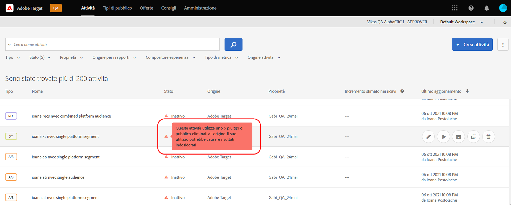
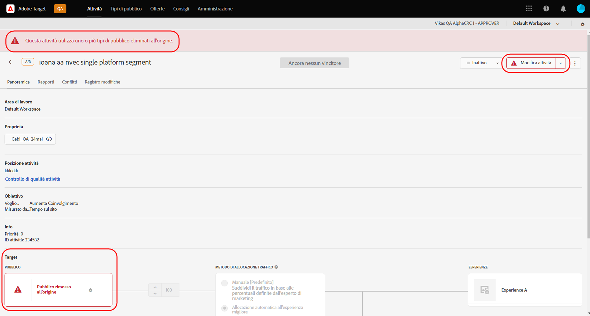

# Note sulla versione di Target (corrente)

Queste note sulla versione forniscono informazioni su funzioni, miglioramenti e correzioni per ciascuna versione di [!DNL Adobe Target Standard] e [!DNL Target Premium]. Sono inoltre incluse, ove applicabili, le note sulla versione per API di Target, SDK, [!DNL Adobe Experience Platform Web SDK], at.js e altre modifiche alla piattaforma.

>[!IMPORTANT]
>
>**Termine del ciclo di vita di mbox.js**: a partire dal 31 marzo 2021, [!DNL Adobe Target] non supporta più la libreria mbox.js. Dopo il 31 marzo 2021, tutte le chiamate effettuate da mbox.js avranno esito negativo e le pagine che hanno attività [!DNL Target] in esecuzione, si troveranno a utilizzare il contenuto predefinito.
>
>Per evitare potenziali problemi con i siti, passa alla versione più recente del nuovo [!DNL Adobe Experience Platform Web SDK] o della libreria JavaScript at.js. Per ulteriori informazioni, consulta [Panoramica: implementare Target per web lato client](/help/c-implementing-target/c-implementing-target-for-client-side-web/implement-target-for-client-side-web.md).

(I codici tra parentesi sono per uso interno di [!DNL Adobe].)

## at.js versione 2.8.0 (7 gennaio 2022)

La [!DNL Target] La libreria JavaScript at.js ora raccoglie dati di telemetria relativi all’utilizzo delle funzioni e alle prestazioni. I dati personali non vengono raccolti. La rinuncia a questa funzione è disponibile impostando `telemetryEnabled` false in `targetGlobalSettings`. Per ulteriori informazioni, consulta [telemetryEnabled in targetGlobalSettings](/help/c-implementing-target/c-implementing-target-for-client-side-web/targetgobalsettings.md#telemetry).

## [!DNL Target Standard/Premium] 21.10.5 (28 ottobre 2021)

Questa versione di manutenzione include i seguenti miglioramenti:

| Funzione | Dettagli |
| --- | --- |
| [!UICONTROL Compositore esperienza visivo] | È stato aggiunto il supporto per [Componenti web](https://developer.mozilla.org/en-US/docs/Web/Web_Components). È possibile creare e testare esperienze e offerte personalizzate su elementi personalizzati e su elementi al loro interno. Per ulteriori informazioni, consulta la sezione sulle [opzioni del Compositore esperienza visivo](/help/c-experiences/c-visual-experience-composer/viztarget-options.md#custom). |

## [!DNL Target Standard/Premium] 21.10.4 (21 ottobre 2021)

Questa versione di manutenzione include i seguenti miglioramenti:

| Funzione | Dettagli |
| --- | --- |
| Consigli in base al carrello | È stata aggiunta una nuova famiglia di algoritmi per distribuire consigli in base al contenuto del carrello del visitatore. Per ulteriori informazioni, consulta la sezione &quot;In base al carrello&quot; in [Creare criteri](/help/c-recommendations/c-algorithms/create-new-algorithm.md), le sezioni &quot;Aggiunte al carrello, visualizzazioni carrello e pagine dipagamento&quot; ed &quot;Escludi elementi già presenti nel carrello del visitatore&quot; in [Pianificare e implementare le attività Consigli](/help/c-recommendations/plan-implement.md) e la sezione &quot;In base al carrello&quot; in [Basare i consigli su una chiave di consigli](/help/c-recommendations/c-algorithms/base-the-recommendation-on-a-recommendation-key.md). |

## [!DNL Target Standard/Premium] 21.10.3 (19 ottobre 2021)

Questa versione di manutenzione include i seguenti miglioramenti, correzioni e modifiche:

* Sono stati risolti i problemi che impedivano ai clienti di aprire il pannello [!UICONTROL A4T] in [!DNL Analysis Workspace] facendo clic sul pulsante [!UICONTROL Visualizza in Analytics] nel reporting delle attività di [!DNL Target]. (TGT-42099, TGT-42100)
* È stato risolto un problema che impediva la visualizzazione del pulsante [!UICONTROL Modifica progettazione] durante la modifica delle attività [!UICONTROL Test A/B] e [!UICONTROL targeting dell’esperienza] (XT) utilizzando il [!UICONTROL Compositore esperienza basato su moduli]. (TGT-41980)
* È stato risolto un problema che impediva la visualizzazione di una casella di controllo [!UICONTROL Compatibile] nella selezione dei criteri durante la creazione di una nuova attività [!UICONTROL Recommendations]. (TGT-42053)
* È stato corretto un messaggio di errore errato visualizzato quando non era possibile selezionare [!DNL Analytics] come origine per la generazione di rapporti (A4T) per mancanza di autorizzazioni [!DNL Analytics]. (TGT-41954)
* Sono state implementate più correzioni di accessibilità per migliorare la navigazione da tastiera in tutte le aree dell’interfaccia utente di [!DNL Target].

## [!DNL Target Standard/Premium] 21.10.2 (13 ottobre 2021)

Sono stati aggiunti i seguenti miglioramenti quando si utilizzano [!DNL Target] [!UICONTROL Tipi di pubblico] con [!DNL Adobe Experience Platform Web SDK]:

* Sono state aggiunte icone di avviso, finestre a comparsa e messaggi in diverse aree dell’interfaccia utente [!DNL Target] per indicare che il pubblico è stato eliminato alla sorgente e non è più disponibile per l’utilizzo in attività [!DNL Target].

   Le illustrazioni seguenti mostrano alcuni punti in cui vengono visualizzate le icone, le finestre a comparsa e i messaggi:

   * Pagina elenco [!UICONTROL Attività]

      

   * Pagine di attività [!UICONTROL Panoramica]:

      

   * Passaggio [!UICONTROL Esperienze] del flusso di lavoro per la creazione di attività:

      ![Messaggio di pubblico eliminato alla sorgente nella pagina [!UICONTROL Esperienze] ](assets/deleted-at-source-experiences.png)

   * Passaggio [!UICONTROL Targeting] del flusso di lavoro per la creazione di attività:

      ![Messaggio di pubblico eliminato alla sorgente nella pagina [!UICONTROL Targeting] ](assets/deleted-at-source-targeting.png)

   * Passaggio [!UICONTROL Obiettivi e impostazioni] del flusso di lavoro per la creazione di attività:

      ![Messaggio di pubblico eliminato alla sorgente nella pagina [!UICONTROL Obiettivi e impostazioni] ](assets/deleted-at-source-goals-settings.png)

   * Ottimizzazioni del pubblico ([!UICONTROL Sostituisci pubblico] nel passaggio [!UICONTROL Targeting] del flusso di lavoro per la creazione di attività):

* Se tenti di utilizzare la funzione Combina pubblico e uno dei tipi di pubblico è stato eliminato alla sorgente, [!UICONTROL Salva] viene disabilitato.

## [!DNL Target Standard/Premium] 21.10.1 (6 ottobre 2021)

Questa versione include le seguenti nuove funzionalità:

| Funzione | Dettagli |
| --- | --- |
| Aggiornamento dell’interfaccia utente di [!UICONTROL Audiences] | Come parte degli sforzi continui del team di [!DNL Adobe Target] per migliorare l’esperienza utente per gli utenti [!DNL Target], questa versione aggiorna le pagine [!UICONTROL Tipi di pubblico] e [!UICONTROL Script di profilo] nell’interfaccia utente [!DNL Target]. Questo aggiornamento unisce e standardizza i disegni di progettazione precedentemente incoerenti, aggiungendo nuovi miglioramenti, ad esempio:<ul><li>Possibilità di selezionare ed eliminare più tipi di pubblico contemporaneamente</li><li>Una [progettazione di audience builder](/help/c-target/c-audiences/create-audience.md) rinnovata</li><li>Supporto della regola di esclusione nel generatore di regole della libreria [!UICONTROL Pubblico]</li><li>Un nuovo filtro “Origine pubblico” per consentire un rilevamento più rapido del pubblico</li><li>Opzioni di ricerca e filtro persistenti nella sessione</li></ul>Per ulteriori informazioni, consulta [Tipi di pubblico](/help/c-target/target.md). **NOTA**: la nuova interfaccia utente [!UICONTROL Tipi di pubblico] è disponibile solo per alcuni clienti. L’aggiornamento verrà gradualmente esteso a tutti i clienti a partire da gennaio 2022. |
| Aggiornamento dell’interfaccia [!UICONTROL Script di profilo] | Anche la libreria [!UICONTROL Script di profilo] è stata aggiornata e include un’interfaccia aggiornata insieme a diversi aggiornamenti di produttività:<ul><li>Possibilità di selezionare ed eliminare contemporaneamente più script di profilo</li><li>Un nuovo editor di codice per gli script di profilo</li><li>Evidenziazione della sintassi e controllo degli errori all’interno dell’editor di codice</li><li>Parametri dei token (mbox o profilo) che si completano automaticamente tramite scelte rapide da tastiera</li></ul>Per ulteriori informazioni, consulta [Profili dei visitatori](/help/c-target/c-visitor-profile/visitor-profile.md). **NOTA**: la nuova interfaccia utente [!UICONTROL Script di profilo] è disponibile solo per alcuni clienti. L’aggiornamento verrà gradualmente esteso a tutti i clienti a partire da gennaio 2022. |
|  Creare e modificare i criteri di Recommendations | Il flusso di lavoro per la creazione e modifica di [!UICONTROL Criteri di Recommendations] è stato razionalizzato per semplificare la scelta dell’algoritmo e delle impostazioni consigliate per raggiungere gli obiettivi. Per ulteriori informazioni, consulta [Creare i criteri](/help/c-recommendations/c-algorithms/create-new-algorithm.md). |
|  Miglioramenti della frequenza di aggiornamento dell’intervallo di lookback e dell’algoritmo di Recommendations | È ora possibile eseguire gli algoritmi “Più visualizzati” e “Più venduti” con un intervallo di lookback di sei ore per acquisire il contenuto con tendenze più recenti. Quando l’intervallo di lookback di sei ore è selezionato, i risultati delle raccomandazioni vengono aggiornati ogni 3-6 ore nel corso della giornata. Per ulteriori informazioni, consulta [Origine dati](/help/c-recommendations/c-algorithms/create-new-algorithm.md#data-source) in *Creare i criteri*. |

## Note aggiuntive sulla versione e dettagli sulla versione

| Risorsa | Dettagli |
|--- |--- |
| [Note sulla versione: Adobe Target Platform Experience Web SDK](https://experienceleague.adobe.com/docs/experience-platform/edge/release-notes.html?lang=it) | Dettagli sulle modifiche apportate a ogni versione di Platform Web SDK. |
| [Dettagli sulle versioni di at.js](/help/c-implementing-target/c-implementing-target-for-client-side-web/target-atjs-versions.md) | Dettagli sulle modifiche in ogni versione della libreria JavaScript at.js [!DNL Adobe Target]. |

## Modifiche alla documentazione, precedenti note sulla versione e note sulla versione di Experience Cloud

Per informazioni aggiuntive, oltre alle note di ciascuna versione, consulta le seguenti risorse:

| Risorsa | Dettagli |
|--- |--- |
| Modifiche alla documentazione | Consulta le informazioni dettagliate sugli aggiornamenti di questa guida che non sono inclusi nelle presenti note sulla versione. Per ulteriori informazioni, consulta [Modifiche alla documentazione](/help/r-release-notes/doc-change.md#reference_366123CF00994BACBBF9BBDF2C4D840C). |
| Note sulla versione per le versioni precedenti | Informazioni su nuove funzionalità e miglioramenti introdotti nelle versioni precedenti di Target Standard e Target Premium. Per ulteriori informazioni, consulta [Note sulla versione per le versioni precedenti](/help/r-release-notes/release-notes-for-previous-releases.md). |
| Note sulla versione di Adobe Experience Cloud | Ultime note sulla versione per le soluzioni Adobe Experience Cloud. Per ulteriori informazioni, consulta [Note sulla versione di Experience Cloud](https://experienceleague.adobe.com/docs/release-notes/experience-cloud/current.html?lang=it). |

## Informazioni in anteprima {#section_5D588F0415A2435B851A4D0113ACA3A0}

Le risorse seguenti contengono informazioni sulle funzionalità in arrivo con la prossima versione di Target.

| Risorsa | Dettagli |
|--- |--- |
| Adobe Priority Product Update | Per ricevere notifiche prioritarie sui prossimi miglioramenti per Target e altre soluzioni Adobe Experience Cloud, iscriviti ad Adobe Priority Product Update: [https://www.adobe.com/subscription/priority-product-update.html](https://www.adobe.com/subscription/priority-product-update.html) |
| Note sulle prossime versioni | Per informazioni sulle versioni di Target del mese corrente, incluse le informazioni prerelease, consulta la pagina [Note sulla versione di Target (prerelease)](/help/r-release-notes/target-release-notes.md). |
