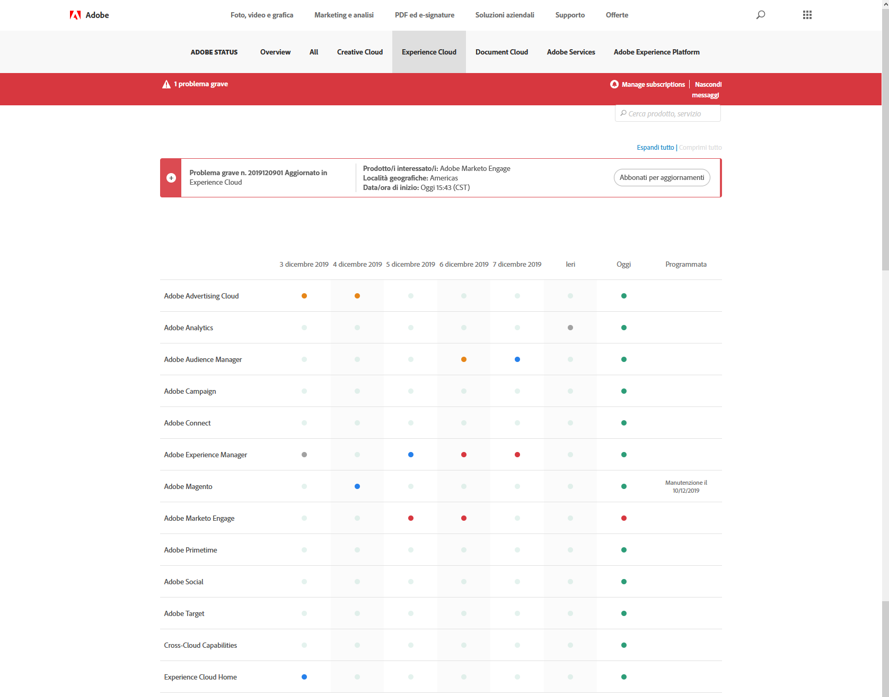

# Aggiornamenti dello stato del sistema e notifiche proattive

Utilizza la pagina [!UICONTROL Stato del sistema di Adobe] e le notifiche proattive per essere sempre al corrente dello stato dei prodotti [!DNL Adobe] e delle soluzioni [!DNL Adobe Experience Cloud]. Le notifiche proattive ti avvisano in caso di interruzioni o interventi di manutenzione.

## Aggiornamenti dello stato del sistema

Utilizza la pagina [!UICONTROL Stato del sistema di Adobe] per visualizzare lo stato attuale di [!DNL Target] e di altri prodotti [!DNL Adobe] e soluzioni [!DNL Adobe Experience Cloud]. Questa pagina è utile per determinare se eventuali problemi riscontrati sono dovuti a un aggiornamento del sistema o a un intervento di manutenzione ordinaria.

Per accedere alla pagina di [!UICONTROL stato del sistema], visita il seguente URL:

[https://status.adobe.com](https://status.adobe.com)

Per visualizzare lo stato delle soluzioni [!DNL Experience Cloud], tra cui [!DNL Target], fai clic sulla scheda [!UICONTROL Experience Cloud].

La parte superiore della pagina contiene informazioni sugli eventi di manutenzione in corso e include un collegamento per la sottoscrizione agli aggiornamenti per le singole soluzioni.

Nell’illustrazione precedente, [!DNL Adobe Analytics], [!DNL Adobe Target] e [!DNL Adobe Campaign] erano sottoposti ad aggiornamenti di manutenzione. Tutti gli altri prodotti e soluzioni funzionavano normalmente. È sempre buona prassi controllare questa pagina se si verificano problemi durante l&#39;utilizzo di [!DNL Target].

Una notifica interna al prodotto compare sempre durante il rilascio mensile di [!DNL Target], ma talvolta si verificano aggiornamenti minori e vengono elencati in questa pagina.

La parte inferiore della pagina contiene un calendario degli ultimi sette giorni con stati per ogni soluzione ogni giorno. Passa il mouse su un indicatore di stato per ulteriori informazioni:

## Notifiche proattive

Le notifiche proattive sono avvisi e-mail, inviati ai clienti registrati, relativi ai seguenti eventi aperti con i servizi inclusi nel profilo del cliente, tra cui [!DNL Target]:

* Avvisi a livello di soluzione (non isola servizi specifici all’interno della soluzione)
* CSO (interruzioni) di Gravità 1 e Gravità 2
* CMR (interventi di manutenzione)

>[!NOTE]
>
>Devi registrarti per ricevere gli avvisi. Contatta il tuo Customer Success Manager (CSM) [!DNL Adobe] o Account Executive (AE) [!DNL Adobe] per avviare il processo di registrazione.

Le seguenti illustrazioni sono esempi di notifiche proattive con avvisi via e-mail:

