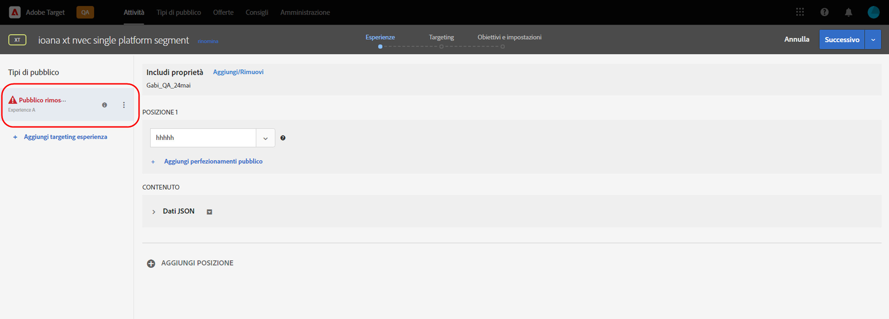
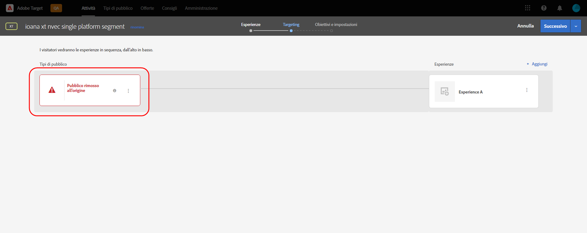

# Note sulla versione di Target (prerelease)

Questo articolo contiene informazioni di pre-release. Date di rilascio, funzioni e altre informazioni sono soggette a cambiamenti senza preavviso.

**Ultimo aggiornamento: 11 ottobre 2021**

Per visualizzare informazioni sulla versione corrente, consulta [Note sulla versione di Target](release-notes.md). Le informazioni su queste pagine potrebbero essere uguali, a seconda della tempistica delle versioni. I codici tra parentesi sono per uso interno di [!DNL Adobe].

>[!IMPORTANT]
>
>**Termine del ciclo di vita di mbox.js**: a partire dal 31 marzo 2021, [!DNL Adobe Target] non supporta più la libreria mbox.js. Dopo il 31 marzo 2021, tutte le chiamate effettuate da mbox.js avranno esito negativo e avranno un impatto sulle pagine che hanno attività [!DNL Target] in esecuzione, che presenteranno il contenuto predefinito.
>
>Per evitare potenziali problemi con i siti, effettua la migrazione alla versione più recente del nuovo [!DNL Adobe Experience Platform Web SDK] o della libreria JavaScript at.js. Per ulteriori informazioni, consulta [Panoramica: implementare Target per web lato client](/help/c-implementing-target/c-implementing-target-for-client-side-web/implement-target-for-client-side-web.md).

## [!DNL Target Standard/Premium] 21.10.2 (13 ottobre 2021)

Sono stati aggiunti i seguenti miglioramenti quando si utilizza [!DNL Target] [!UICONTROL Audiences] con [!DNL Adobe Experience Platform Web SDK]:

* Icone di avviso, popovers e messaggi aggiunti in varie posizioni nell’ interfaccia utente di [!DNL Target] per indicare che il pubblico è stato eliminato dalla sorgente e non è più disponibile per l’uso nelle attività di [!DNL Target] .

   Le illustrazioni seguenti mostrano alcuni luoghi in cui vengono visualizzate le icone, i popovers e i messaggi:

   *  Pagina elenco attività

      

   * Pagine [!UICONTROL Panoramica] dell&#39;attività:

      

   *  Passaggi delle esperienze del flusso di lavoro per la creazione di attività:

      

   *  Passaggio di targeting del flusso di lavoro per la creazione di attività:

      

   * [!UICONTROL Obiettivi e ] impostazioni del flusso di lavoro per la creazione di attività:

      ![Pubblico eliminato al messaggio sorgente nella pagina  [!UICONTROL Obiettivi e ] impostazioni](assets/deleted-at-source-goals-settings.png)

   * Miglioramenti del pubblico ([!UICONTROL Sostituisci pubblico] nel passaggio [!UICONTROL Targeting] del flusso di lavoro per la creazione di attività):

* Se tenti di utilizzare la funzione Combina pubblico e uno dei tipi di pubblico è stato eliminato all&#39;origine, [!UICONTROL Salva] viene disattivato.

## Informazioni in anteprima {#section_7B9D4AAFC6A74388B9D7DEF0658D8B63}

Per ricevere notifiche prioritarie sui prossimi miglioramenti per Target e altre soluzioni Adobe Experience Cloud, iscriviti ad Adobe Priority Product Update:

[https://www.adobe.com/subscription/priority-product-update.html](https://www.adobe.com/subscription/priority-product-update.html)
